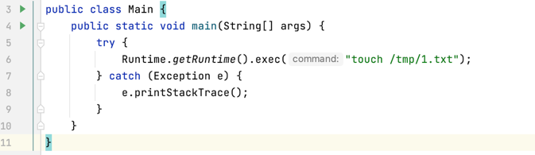
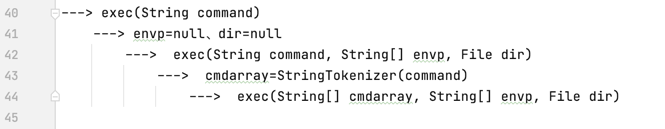
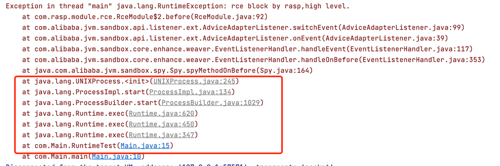
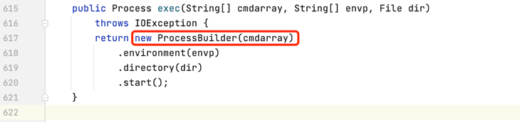
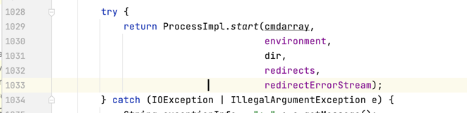
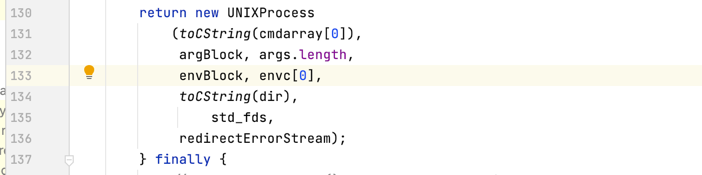

# 基本原理

Java命令执行漏洞在已经披露的漏洞中占比最大，本文分析命令执行的一般性原理以及hook点的选择。

## 1.命令执行API

java命令执行方式如下：

+ java.lang.Runtime#exec()
  
+ java.lang.ProcessBuilder#start()

+ java.lang.ProcessImpl#start()

+ JNI的方式调用动态链接库（该方式属于jni注入，这里暂不做分析）


在Java中执行命令用使用最多的API是`Runtime.exec`，用法如下：



实际上Runtime类的exec的重载方法有6个


重载方法最终会实际调用上图中的最后一个方法，因此这里仅介绍最后一个的参数。
+ command：指定的系统命令，字符串command会被解析成token流；
+ envp： 字符串数组，其中每个元素的环境变量设置格式为name=value，如果子进程的环境变量与当前进程一致，则为null；
+ dir：子进程的工作目录，如果子进程的工作目录与当前进程一致，则为null；

命令被解析为token流：


重新梳理一下上面重载方法的关系：




## 2.底层调用链路

常用的是 java.lang.Runtime#exec()和 java.lang.ProcessBuilder#start()，除此之外，还有更为底层的java.lang.ProcessImpl#start()，他们的调用关系如下图所示：




其中，ProcessImpl类是Process抽象类的具体实现，且该类的构造函数使用private修饰，所以无法在java.lang包的外部直接调用，只能通过反射调用ProcessImpl#start()方法执行命令。

这3种执行方法如下：

```java
import java.lang.reflect.Method;
import java.util.Map;

public class Main {
    public static void main(String[] args) throws Exception {

        // 定义命令方式
        String command = "touch /tmp/1.txt /tmp/2.txt /tmp/3.txt";
        String[] commandarray = {"touch", "/tmp/1.txt", "/tmp/2.txt", "/tmp/3.txt"};

        // 命令执行方式1
        Runtime.getRuntime().exec(command);

        // 命令执行方式2
        new ProcessBuilder(commandarray).start();

        // 命令执行方式3
        Class clazz = Class.forName("java.lang.ProcessImpl");
        Method method = clazz.getDeclaredMethod("start", new String[]{}.getClass(), Map.class, String.class, ProcessBuilder.Redirect[].class, boolean.class);
        method.setAccessible(true);
        method.invoke(null, commandarray, null, ".", null, true);
    }
}
```

1.exec方法最终执行了 `new ProcessBuilder(cmdarray).start()` 方法



2.ProcessBuilder.start 最终执行了 `ProcessImpl.start()`



3.ProcessImpl.start() 调用了 new UNIXProcess() 


至此 java 层面的方法分析完毕。

## 3.HOOK点选择
传统RASP一般会选择如下2个类,即：java.lang.ProcessImpl(jdk9以上)、java.lang.UNIXProcess(jdk8以下)

> 代码来源：com.baidu.openrasp.hook.system.ProcessBuilderHook
```java
@HookAnnotation
public class ProcessBuilderHook extends AbstractClassHook {

    @Override
    public String getType() {
        return "command";
    }

    @Override
    public boolean isClassMatched(String className) {
        if (ModuleLoader.isModularityJdk()) {
            return "java/lang/ProcessImpl".equals(className);
        } else {
            if (OSUtil.isLinux() || OSUtil.isMacOS()) {
                return "java/lang/UNIXProcess".equals(className);
            } else if (OSUtil.isWindows()) {
                return "java/lang/ProcessImpl".equals(className);
            }
            return false;
        }
    }
    
    @Override
    protected void hookMethod(CtClass ctClass) throws IOException, CannotCompileException, NotFoundException {
        if (ctClass.getName().contains("ProcessImpl")) {
            if (OSUtil.isWindows()) {
                String src = getInvokeStaticSrc(ProcessBuilderHook.class, "checkCommand",
                        "$1,$2", String[].class, String.class);
                insertBefore(ctClass, "<init>", null, src);
            } else if (ModuleLoader.isModularityJdk()) {
                String src = getInvokeStaticSrc(ProcessBuilderHook.class, "checkCommand",
                        "$1,$2,$4", byte[].class, byte[].class, byte[].class);
                insertBefore(ctClass, "<init>", null, src);
            }
        } else if (ctClass.getName().contains("UNIXProcess")) {
            String src = getInvokeStaticSrc(ProcessBuilderHook.class, "checkCommand",
                    "$1,$2,$4", byte[].class, byte[].class, byte[].class);
            insertBefore(ctClass, "<init>", null, src);
        }
    }

    public static void checkCommand(List<String> command, List<String> env) {
        if (command != null && !command.isEmpty()) {
            HashMap<String, Object> params = null;
            try {
                params = new HashMap<String, Object>();
                params.put("command", StringUtils.join(command, " "));
                params.put("env", env);
                List<String> stackInfo = StackTrace.getParamStackTraceArray();
                params.put("stack", stackInfo);
            } catch (Throwable t) {
                LogTool.traceHookWarn(t.getMessage(), t);
            }
            if (params != null) {
                HookHandler.doCheckWithoutRequest(CheckParameter.Type.COMMAND, params);
            }
        }
    }
    
    // ...　其他代码省略
}
```
上面的方法都是Java层面的, 最终的都会调用到native方法：`forkAndExec`。
+ 在jdk8以下，这个方法在`java.lang.UNIXProcess`类中；

+ 在jdk9以上，这个方法在`java.lang.ProcessImpl`类中。

如果任意代码执行时，反射执行native层面的方法，上面的hook点将被绕过。（绕过方式是unsafe+反射，这里不在细究）

因此，RASP 对于命令执行的hook点选择应该是`forkAndExec`

## 4.最佳实践

下面的代码为jrasp命令执行的hook模块
```java
/**
 * 命令执行方法hook模块
 * hook类是最底层的native方法,不可能绕过
 * 业内第一款能彻底防止绕过的rasp
 */
@MetaInfServices(Module.class)
@Information(id = "rce-hook", version = "1.0.4", author = "jrasp")
public class RceHook implements Module, LoadCompleted {

    @Resource
    private Log logger;

    @Resource
    private JSONObject jsonObject;

    @Resource
    private ModuleEventWatcher moduleEventWatcher;

    @Resource
    private ThreadLocal<HashMap<String, Object>> requestInfoThreadLocal;

    @Resource
    private AlgorithmManager algorithmManager;

    private static final String ATTACK_TYPE = "rce";

    // 检测开关
    private volatile Boolean enableCheck = true;
    
    // 算法参数更新
    @Command("/update")
    public void update(Map<String, String> parameterMap, final PrintWriter writer) {
        String enableCheckStr = parameterMap.get("enable_check");
        this.enableCheck = Boolean.valueOf(enableCheckStr);
        writer.println(jsonObject.toJSONString(RestResultUtils.success("ok", "success")));
        writer.flush();
    }
    
    @Override
    public void loadCompleted() {
        String clazzName;
        if (isGreaterThanJava8()) {
            clazzName = "java.lang.ProcessImpl";
        } else {
            clazzName = "java.lang.UNIXProcess";
        }
        nativeProcessRceHook(clazzName);
    }

    public void nativeProcessRceHook(final String clazz) {
        new EventWatchBuilder(moduleEventWatcher)
                .onClass(clazz)
                .includeBootstrap()
                .onBehavior("forkAndExec")
                .onWatch(new AdviceListener() {
                    @Override
                    protected void before(Advice advice) throws Throwable {
                        if (!enableCheck) {
                            return;
                        }
                        byte[] prog = (byte[]) advice.getParameterArray()[2];     // 命令
                        byte[] argBlock = (byte[]) advice.getParameterArray()[3]; // 参数
                        String cmdString = getCommandAndArgs(prog, argBlock);
                        HashMap<String, Object> requestInfo = new HashMap<String, Object>(requestInfoThreadLocal.get());
                        algorithmManager.doCheck(ATTACK_TYPE, requestInfo, cmdString);
                    }

                    @Override
                    protected void afterReturning(Advice advice) throws Throwable {
                        requestInfoThreadLocal.remove();
                    }
                });
    }

    public static String getCommandAndArgs(byte[] command, byte[] args) throws UnsupportedEncodingException {
        // 命令&参数解析
        List<String> commands = new LinkedList<String>();
        if (command != null && command.length > 0) {
            // cmd 字符串的范围: [0,command.length - 1), 因为command最后一位为 \u0000 字符，需要去掉
            commands.add(new String(command, 0, command.length - 1));
        }
        if (args != null && args.length > 0) {
            int position = 0;
            for (int i = 0; i < args.length; i++) {
                // 空格是字符或者参数的分割符号
                if (args[i] == 0) {
                    commands.add(new String(Arrays.copyOfRange(args, position, i)));
                    position = i + 1;
                }
            }
        }
        return StringUtils.join(commands, " ");
    }

}
```
## 5.本文总结

先介绍了java中命令执行常用API以及它们的调用关系，然后介绍了hook点的选择以及存在的问题，最后介绍了命令执行终极hook点和jrasp实践。
