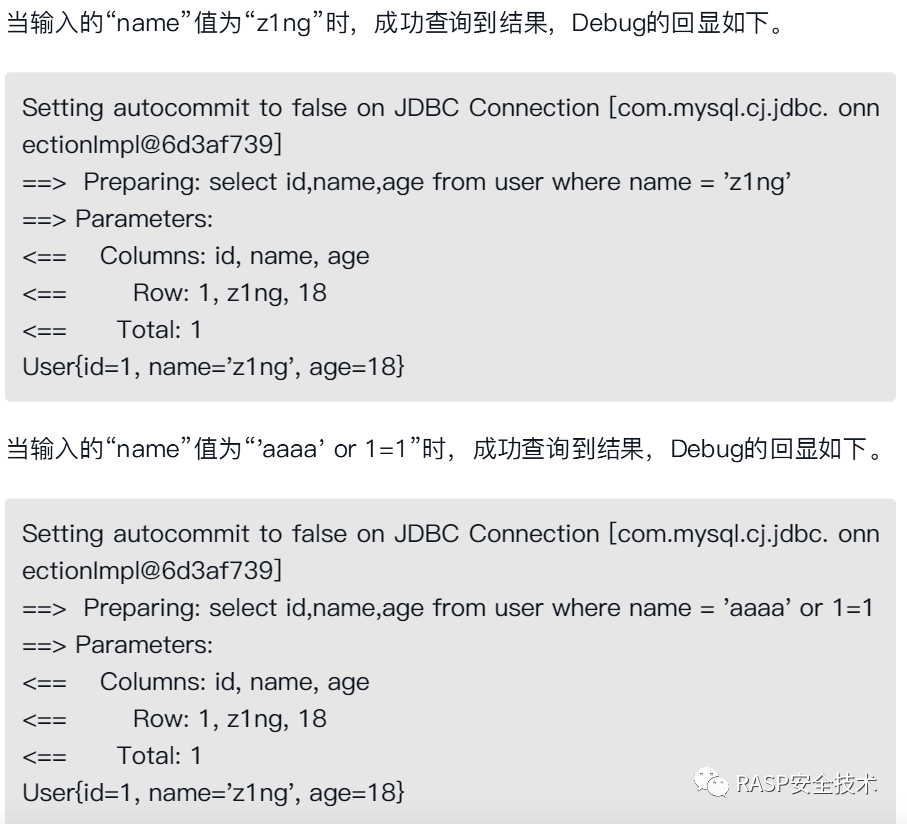

# SQL注入

一方面数据映射框架如mybatis、hiberate等在框架底层已经实现了对sql注入的防御，另一方面白盒/黑盒扫描器、代码审计等也能解决一部分sql注入问题，sql注入的出现风险被大大降低，在最新版本的OWASP2021中已经从top1下降到top3。

但是在研发人员未能恰当的使用框架或者sql语句拼接不当的的情况下，仍然可能导致sql注入的风险。本文分析sql注入的几种情况以及RASP在其中的作用。

## 1.原生JDBC参数拼接造成的SQL注入

JDBC有两种方法执行SQL语句，分别为PrepareStatement和Statement。下面介绍两种不同的方式的区别。

使用Statement构建SQL语句时可以拼接SQL参数，使用例子如下。
```java
Statement stmt = con.createStatement();
stmt.execute("UPDATE EMPLOYEES SET SALARY = " + 153833.00 + " WHERE ID = " + 110592 + "");
```
其中`con`表示一个可用SQL连接。

使用`PrepareStatement`构建的sql查语句时需要使用`?`对变量位进行占位，在预编译阶段填入相应的值构造出完整的SQL语句。下面的例子说明如何使用占位符号构建sql语句。

```java
PreparedStatement pstmt = con.prepareStatement("UPDATE EMPLOYEES SET SALARY = ? WHERE ID = ?");
pstmt.setBigDecimal(1, 153833.00);
pstmt.setInt(2, 110592)
```
Statement的方式使用简单、灵活和开发便捷，但是在每次执行时都需要编译，效率比PrepareStatement低。PrepareStatement使用占位符，可以防止输入参数改变SQL语意，从而预防SQL注入。

理论上PrepareStatement的效率和安全性会比Statement要好，但并不意味着使用PrepareStatement就绝对安全，不会产生SQL注入
PrepareStatement是Statement的子接口，对SQL语句进行预编译


但开发者有时为了便利，会直接采取拼接的方式构造SQL语句，此时进行预编译则无法阻止SQL注入的产生。如以下代码所示，PrepareStatement虽然进行了预编译，但在以拼接方式构造SQL语句的情况下仍然会产生SQL注入。代码示例如下（若使用“or 1=1”，仍可判断出这段代码存在SQL注入）


```java
String sql = "select * from user where id =" + req.getParameter("id");
out.println(sql);
try{
    PreparedStatement pstt = con.prepareStatement(sql);
    ResultSet re = pstt.executeQuery();
    while(rs.next()){
        out.println("<br>id:"+rs.getObject("id"));
        out.println("<br>name:"+re.getObject("name"));
    }
    catch(SQLException e){
        e.printStackTrace();
    }
}
```

正确地使用PrepareStatement可以有效避免SQL注入的产生，使用“?”作为占位符时，填入对应字段的值会进行严格的类型检查。将前面的“拼接构造SQL语句”改为如下“使用占位符构造SQL语句”的代码片段，即可有效避免SQL注入的产生。
```java
PrintWriter out = resp.getWriter();
String sql = "select * from user where id = ?"
out.println(sql);
try{
    PreparedStatement pstt = con.prepareStatement(sql);
    pstt.setInt(1,Integer.parseInt(req.getParameter("id")));
    ResultSet rs = pstt.executeQuery();
    // sql执行结果的代码省去....
}
```

## 2.框架使用不当造成SQL注入

如今的Java项目或多或少会使用对JDBC进行更抽象封装的持久化框架，如MyBatis和Hibernate。通常，框架底层已经实现了对SQL注入的防御，但在研发人员未能恰当使用框架的情况下，仍然可能存在SQL注入的风险。

### Mybatis框架

MyBatis框架的思想是将SQL语句编入配置文件中，避免SQL语句在Java程序中大量出现，方便后续对SQL语句的修改与配置。MyBatis中使用parameterType向SQL语句传参，在SQL引用传参可以使用#{Parameter}和${Parameter}两种方式

+ 使用#{Parameter}构造SQL的代码如下所示
```java
<select id="getUsername" resultType="com.example.bean.User">
    select id,name,age from user where name #{name}
<select>
```
从Debug回显的SQL语句执行过程可以看出，使用#{Parameter}方式会使用“?”占位进行预编译，因此不存在SQL注入的问题。用户可以尝试构造“name”值为“z1ng or 1=1”进行验证。回显如下，由于程序未查询到结果出现了空指针异常，因此此时不存在SQL注入。

使用${Parameter}构造SQL的代码如下所示：
```java
<select id = "getUsername" resultType = "com.example.bean.User">
    select id,name,age from user where name = ${name}
<select>
```


