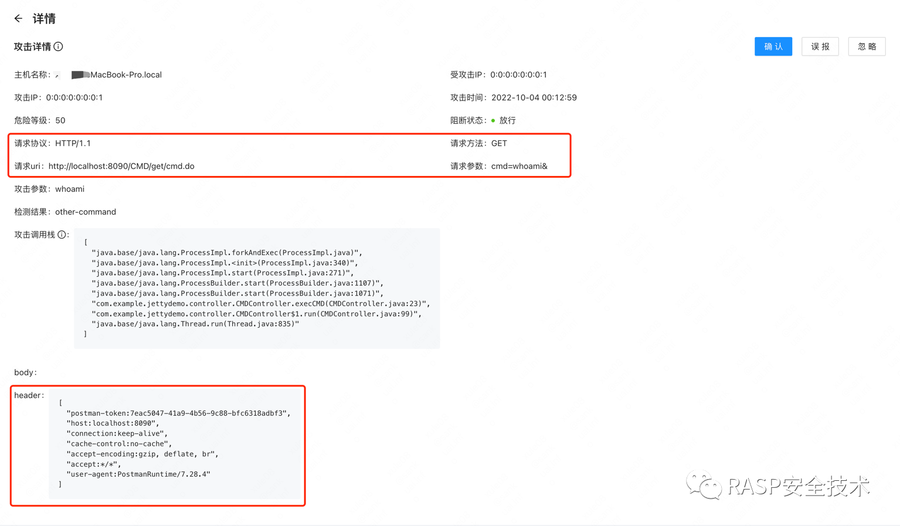
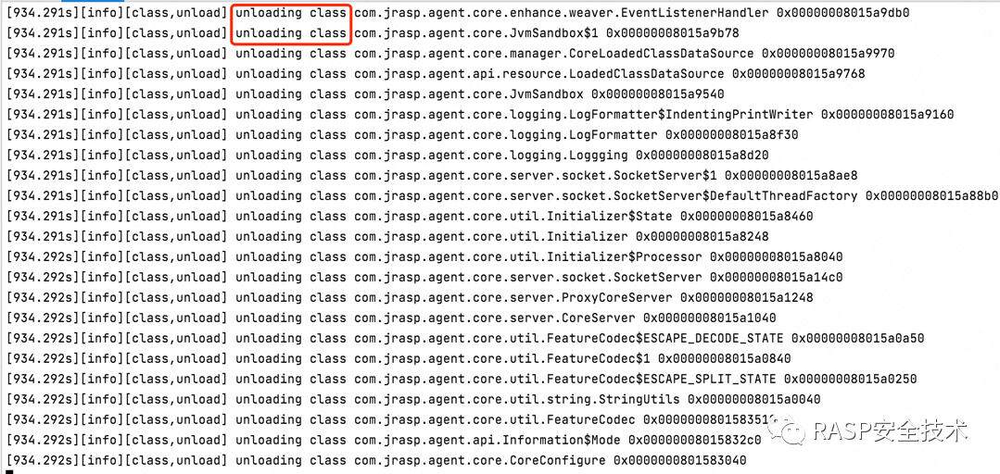

# 线程注入

任意代码执行漏洞中，攻击者通过开启一个新的线程来执行命令时，rasp丢失请求的上下文、执行堆栈等重要参数，导致检测算法（堆栈算法、请求参数特征等无法关联）失效，极大的影响RASP的防御功能与溯源能力。

## 案例
如下案例：http 请求线程执行到下面的代码时，会创建一个新的线程来执行任意命令，http特征参数会丢失。
```java
<%@ page language="java" contentType="text/html; charset=UTF-8"
    pageEncoding="UTF-8"%>
    <%@ page import="java.io.IOException" %>
DOCTYPE html>
<html>
<head>
<meta charset="UTF-8">
<title>Insert title heretitle>
head>
<body>
<%
    // 创建线程执行命令，而不是直接执行命令
    Thread t = new Thread(new Runnable() {
            @Override         
            public void run() {             
              try {
                Runtime.getRuntime().exec(new String[]{"touch","/tmp/test"});             
              } catch (IOException e) {
                 e.printStackTrace();
              }
            }
    });
    t.start();
    out.println(">==test==<");
%>
body>
html>
```

RASP最终截获的参数会丢失http参数和调用栈，导致无法溯源和分析漏洞。（实现原理上的缺陷）

## 参数丢失原因与优化措施

rasp中使用`ThreadLocal`在多个hook点处传递http等参数，并且仅限于线程执行内部，由于无法跨线程，参数必然丢失。
其实有更好的线程关联类来解决新建线程参数丢失问题，即：`java.lang.InheritableThreadLocal`类。

这个类的注释如下：
> Inheritable thread-local variables are used in preference to ordinary thread-local variables when the per-thread-attribute being maintained in the variable (e.g., User ID, Transaction ID) must be automatically transmitted to any child threads that are created.


实现原理：在父线程创建子线程时，向子线程传递变量。可以参考: [InheritableThreadLocal](https://www.jianshu.com/p/94ba4a918ff5)


## JRASP实现

+ 使用InheritableThreadLocal创建线程变量
```java
// 线程上下文                                                                                              
// 上下文增强：使用 InheritableThreadLocal 代替 ThreadLocal 防止线程注入                                              
public static InheritableThreadLocal<Context> requestContext = new InheritableThreadLocal<Context>() {
    @Override                                                                                         
    protected Context initialValue() {                                                                
        return new Context();                                                                         
    }                                                                                                 
};
```

+ 模块中使用线程上下文
```java
 @RaspResource
 private ThreadLocal<Context> context;
```

+ 卸载时线程变量的清除 
  
由于jrasp的基本特征是热卸载（加载），如果不能清除线程变量，将会导致已经加载的 jrasp-agent/module 无法正常卸载，造成比较严重的内存泄漏。
因此，jrasp-agent 在卸载时, 执行强制清除线程变量操作，彻底解决内存泄漏问题；

```java
// 除去 context 线程变量                                                                                                                            
 List<Thread> threadList = ThreadUtil.getThreadList();                                                                                         
 for (Thread thread : threadList) {                                                                                                            
     /**                                                                                                                                       
      * 在 rasp 退出时清理线程变量，这里使用 inheritableThreadLocals 应该清除 inheritableThreadLocals                                                             
      * @see Thread.inheritableThreadLocals                                                                                                    
      * @see Thread.threadLocals                                                                                                               
      */                                                                                                                                       
     Object threadLocalMap = RaspReflectUtils.unCaughtGetClassDeclaredJavaFieldValue(Thread.class, "inheritableThreadLocals", thread);      
     if (null != threadLocalMap) {                                                                                                             
         //  反射获取 ThreadLocalMap类的 remove 方法                                                                                                   
         Method method = RaspReflectUtils.unCaughtGetClassDeclaredJavaMethod(threadLocalMap.getClass(), "remove", ThreadLocal.class);       
         try {                                                                                                                                 
             RaspReflectUtils.unCaughtInvokeMethod(method, threadLocalMap, requestContext);                                                 
         } catch (Exception e) {                                                                                                               
             e.printStackTrace();                                                                                                              
         }                                                                                                                                     
     }                                                                                                                                         
 }               
```

## 优化后演示

在springboot项目中创建一个controller：
```java
    @GetMapping("/get/cmd.do")
    public void getProcessBuilder(String cmd) throws Exception {
        Thread thread = new Thread(new Runnable() {
            @Override
            public void run() {
                try {
                    // 执行命令
                    execCMD(cmd);
                } catch (Exception e) {
                    e.printStackTrace();
                }
            }
        });
        thread.start();
        return;
    }
```

发起请求，检测结果，http 参数未丢失。



卸载jrasp后，触发full gc，可以看到jvm的类卸载事件，完全卸载。

```java
./attach -p <pid> -s
```

