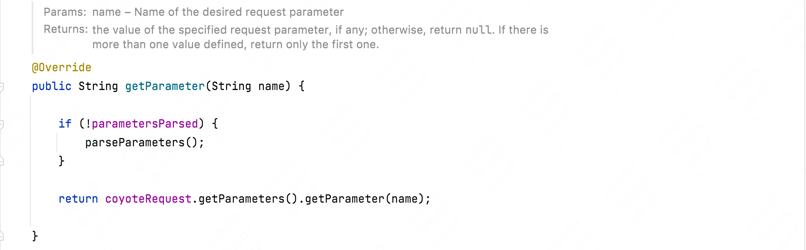
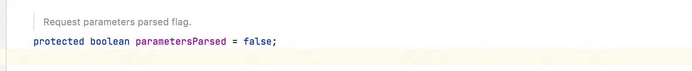
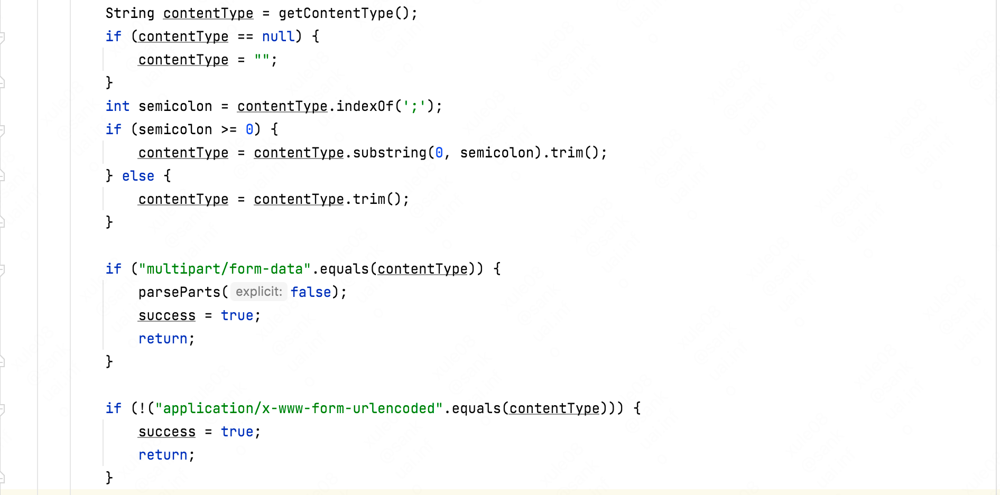
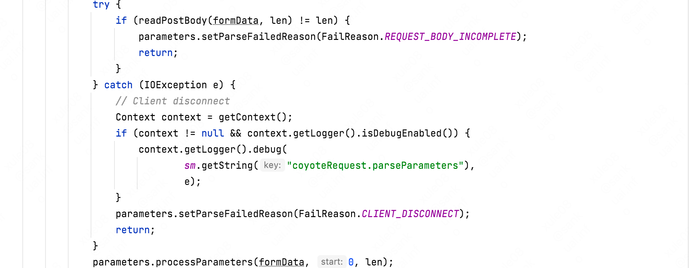
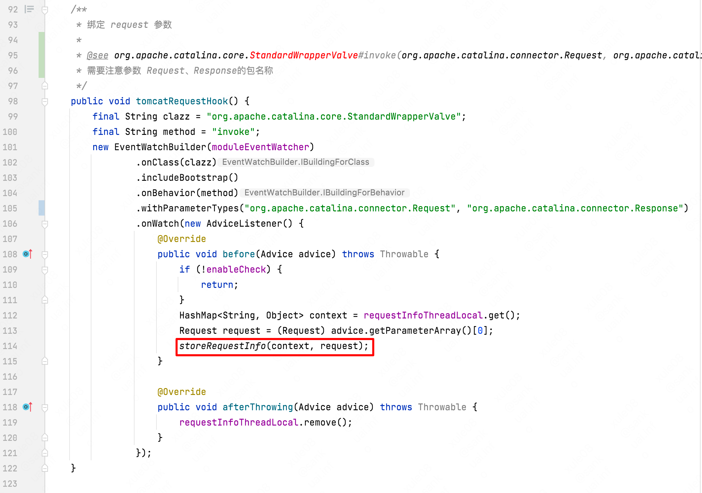
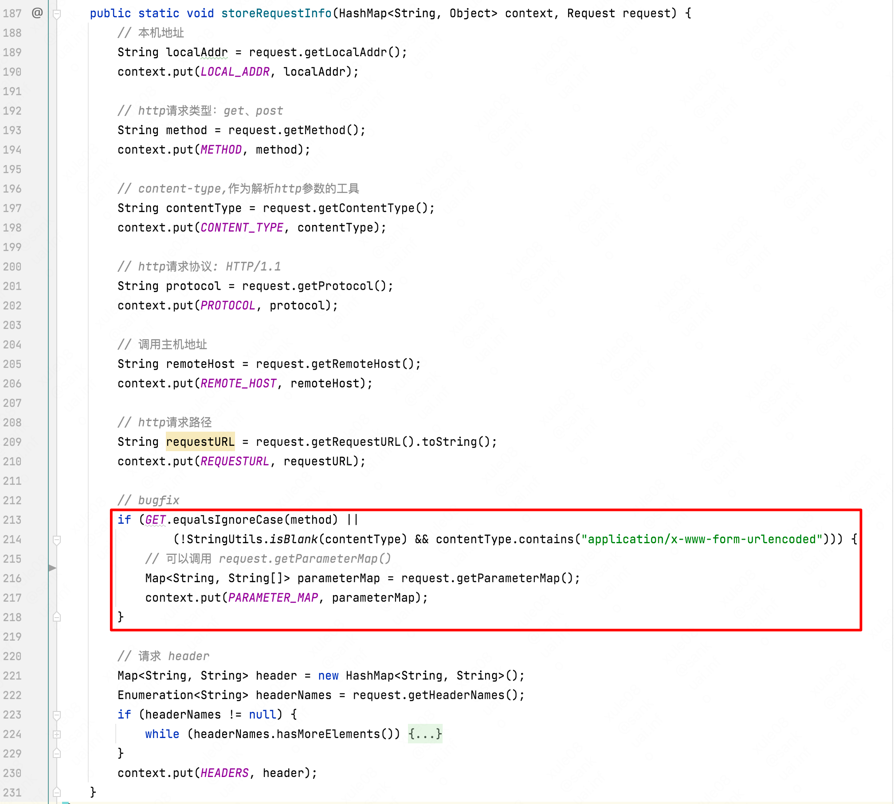
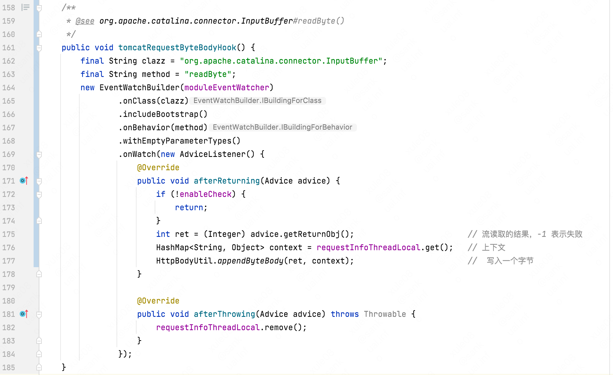
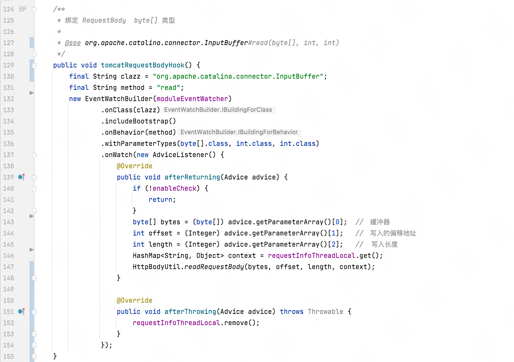
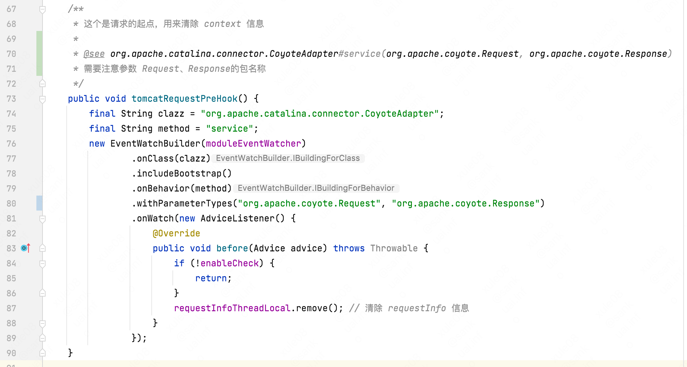

# http参数获取以及坑


## HTTP请求中的Content-Type

### 1、概念

Content-Type表示内容类型和字符编码。内容类型也叫做MIME类型。是Internet Media Type，互联网媒体类型。在互联网上传输的数据有不同的数据类型，HTTP在传输数据对象时会为他们打上称为MIME的数据格式标签，用于区分数据类型。
请求头中的content-type，就是 B端发给S端的数据类型描述 。即告诉服务器端，我给你传的数据是某种类型的，服务器端针对不同类型的数据，做法当时是不相同的。就像，我们平时面对，人，猪，狗等不同类型的动物做法不同。见到狗，你得“汪汪汪”，见到人，你得说”您好“。
响应头中的content-type，就是 S端发给B端的数据类型描述 。即告诉浏览器端，我给你发的是什么样格式的数据，那么浏览器端针对不同类型的数据，处理方法不同。

### 2、语法格式

不管是出现在请求头还是响应头里，都是键值对的方式。
content-type: 值，如：Content-Type: text/html; charset=utf-8。
解释：如果在响应头里，有Content-Type: text/html; charset=utf-8。表示，我服务器端给你客户端响应的内容是html格式的内容，字符集是utf-8。

### 3、常见的content-type

请求头中的content-type在chrome浏览器的**network**里能够看到。

1）application/x-www-form-urlencoded 

在使用表单提交时，请求方式是post时，form标签的属性`entry="application/x-www-form-urlencoded“`（这也是默认值），
请求头中的content-type的值就是`application/x-www-form-urlencoded`。
同时，浏览器会自动把处于form标签里的表单元素的内容组织成键值对的方式（key1=val1&key2=val2...）,
浏览器把form数据封装到http body中，然后发送到server。

当form表单请求为get时，数据被编码为key/value格式（name1=value1&name2=value2…），
然后把这个字串append到url后面，用?分割，加载这个新的url发送到服务器（表单默认的提交数据的格式）。
其中，键就是每个表单元素的name属性的值，值就是表单元素的value属性的值。键和值都进行了URL的转码。并放到请求实体里面。
（注意如果是中文或特殊字符如"/"、","、“:" 等会自动进行URL转码）。代码示例如下：

（form的enctype属性为编码方式，常用有两种：application/x-www-form-urlencoded和multipart/form-data，
默认为application/x-www-form-urlencoded。）


如果使用ajax发送post请求，需要用`setRequestHeader();`设置content-type。代码如下：
```js
 XMLHttpRequest.setRequestHeader("Content-type","application/x-www-form-urlencoded");
```

 2）multipart/form-data

 这个一般使用在文件上传时。表单提交方式，请求方式是post，form标签的属性`entry="multipart/form-data"`,请求头中的content-type的值是：`multipart/form-data; boundary=----WebKitFormBoundarybi5XUwMxC7yc9s5a`。
 既可以上传文件等二进制数据，也可以上传表单键值对，只是最后会转化为一条信息。需要在表单中进行文件上传时，就需要使用该格式。
 示例代码：
```js
<form action="/upload" enctype="multipart/form-data" method="post">
    <input type="file" name="fieldname"/>
    <input type="submit" value="上传"/>
</form>
```

 3）application/json

 这种格式（json格式）是目前在前后端分离开发场景中使用最多的的。前后端的数据交互使用json格式进行，可阅读性好，简介，方便。
 这种格式一般用在发送ajax请求时，要么明确设置了 content-type是application/json。
 要么，有的第三方库默认是application/json。如下示例代码：
```js
 XMLHttpRequest.setRequestHeader("Content-type","application/json");
```

4）text/xml
这种格式（XML格式）是比较早的格式。现在用的比较少了，因为XML格式的数据比json的数据大且复杂。所以，基本上被淘汰了。


## HTTP请求参数解析的坑

最近项目开发对接接口，那边发送http post请求。已知是xml格式数据，类似于下面的这种
```java
<?xml version="1.0" encoding="GBK"?>
<Advpay>
    <PubInfo>
        <ReturnCode>0000</ReturnCode>
    </PubInfo
</Advpay>
```

抓包显示，"Content-Type" 是 "application/x-www-form-urlencoded;charset=GBK"，

在body里用如下方式获取数据：（**该方式获取不到body数据**）
```java
public String parserRequest() {
        HttpServletRequest request = ServletActionContext.getRequest();
        StringBuffer sb = null;
        InputStream in = null;
        BufferedReader br = null;
        try {
            // 读取InputStream流
            in = request.getInputStream();
            br = new BufferedReader(new InputStreamReader(in, "utf-8"));
            sb = new StringBuffer();
            String s = "";
            while ((s = br.readLine()) != null) {
                sb.append(s);
            }
        } catch (Exception e) {
            e.printStackTrace();
            logger.error(e.getMessage(), e);
        } finally {
            try {
                if (br != null) {
                    br.close();
                }
                if (in != null) {
                    in.close();
                }
            } catch (Exception e) {
                e.printStackTrace();
            }
        }

        String xml = sb.toString();
        if (xml != null && !"".equals(xml)) {
            logger.info("报文response xml = " + xml);
        }
        return xml;
        
    }
```

这种方式可以：（觉得很怪。。。想着一般post请求，都body体读取流数据
"Content-Type" = "application/x-www-form-urlencoded 这种格式要特别注意）
```java
public String parserRequest() {
        HttpServletRequest request = ServletActionContext.getRequest();
        String reqXml = null;
        try {
            // 读取 getParameterMap
            Map<String, String[]> map = request.getParameterMap();
            StringBuffer xmlBuf = new StringBuffer();
            for (Map.Entry<String, String[]> m : map.entrySet()) {
                logger.info("返回的报文 key=" + m.getKey() + " Value[0]="
                        + m.getValue()[0]);
                xmlBuf.append(m.getKey());
                xmlBuf.append("=");
                xmlBuf.append(m.getValue()[0]);
            }
            reqXml = xmlBuf.toString();
        } catch (Exception e) {
            logger.error("Exception" + e.getMessage(), e);
        }
        if (reqXml != null && !"".equals(reqXml)) {
            logger.info("报文response reqXml = " + reqXml);
        }
        return reqXml;

}
```

原因如下：

在servlet规范3.1.1节里
1. The request is an HTTP or HTTPS request.
2. The HTTP method is POST.
3. The content type is application/x-www-form-urlencoded.
4. The servlet has made an initial call of any of the getParameter family of methods on the request object.

If the conditions are met, post form data will no longer be available for reading directly from the request object’s input stream.

在tomcat的Request.parseParameters方法里，对于application/x-www-form-urlencoded是有做判断的，对这种编码会去解析body里的数据，填充到parameters里，所以后续想再通过流的方式读取body是读不到的(除非你没有触发过getParameter相关的方法)。

## tomcat源码

以tomcat为例子，说明http hook模块。（需要说明的是，其他web容器也是相同的过程）

先来看下tomcat的请求参数获取源码

> org.apache.catalina.connector.Request#parseParameters()

完整源码如下（源码较长，可以跳过源码，直接看分析过程）：

```java
    /**
     * Parse request parameters.
     */
    protected void parseParameters() {

        parametersParsed = true;

        Parameters parameters = coyoteRequest.getParameters();
        boolean success = false;
        try {
            // Set this every time in case limit has been changed via JMX
            parameters.setLimit(getConnector().getMaxParameterCount());

            // getCharacterEncoding() may have been overridden to search for
            // hidden form field containing request encoding
            Charset charset = getCharset();

            boolean useBodyEncodingForURI = connector.getUseBodyEncodingForURI();
            parameters.setCharset(charset);
            if (useBodyEncodingForURI) {
                parameters.setQueryStringCharset(charset);
            }
            // Note: If !useBodyEncodingForURI, the query string encoding is
            //       that set towards the start of CoyoyeAdapter.service()

            parameters.handleQueryParameters();

            if (usingInputStream || usingReader) {
                success = true;
                return;
            }

            if( !getConnector().isParseBodyMethod(getMethod()) ) {
                success = true;
                return;
            }

            String contentType = getContentType();
            if (contentType == null) {
                contentType = "";
            }
            int semicolon = contentType.indexOf(';');
            if (semicolon >= 0) {
                contentType = contentType.substring(0, semicolon).trim();
            } else {
                contentType = contentType.trim();
            }

            if ("multipart/form-data".equals(contentType)) {
                parseParts(false);
                success = true;
                return;
            }

            if (!("application/x-www-form-urlencoded".equals(contentType))) {
                success = true;
                return;
            }

            int len = getContentLength();

            if (len > 0) {
                int maxPostSize = connector.getMaxPostSize();
                if ((maxPostSize >= 0) && (len > maxPostSize)) {
                    Context context = getContext();
                    if (context != null && context.getLogger().isDebugEnabled()) {
                        context.getLogger().debug(
                                sm.getString("coyoteRequest.postTooLarge"));
                    }
                    checkSwallowInput();
                    parameters.setParseFailedReason(FailReason.POST_TOO_LARGE);
                    return;
                }
                byte[] formData = null;
                if (len < CACHED_POST_LEN) {
                    if (postData == null) {
                        postData = new byte[CACHED_POST_LEN];
                    }
                    formData = postData;
                } else {
                    formData = new byte[len];
                }
                try {
                    if (readPostBody(formData, len) != len) {
                        parameters.setParseFailedReason(FailReason.REQUEST_BODY_INCOMPLETE);
                        return;
                    }
                } catch (IOException e) {
                    // Client disconnect
                    Context context = getContext();
                    if (context != null && context.getLogger().isDebugEnabled()) {
                        context.getLogger().debug(
                                sm.getString("coyoteRequest.parseParameters"),
                                e);
                    }
                    parameters.setParseFailedReason(FailReason.CLIENT_DISCONNECT);
                    return;
                }
                parameters.processParameters(formData, 0, len);
            } else if ("chunked".equalsIgnoreCase(
                    coyoteRequest.getHeader("transfer-encoding"))) {
                byte[] formData = null;
                try {
                    formData = readChunkedPostBody();
                } catch (IllegalStateException ise) {
                    // chunkedPostTooLarge error
                    parameters.setParseFailedReason(FailReason.POST_TOO_LARGE);
                    Context context = getContext();
                    if (context != null && context.getLogger().isDebugEnabled()) {
                        context.getLogger().debug(
                                sm.getString("coyoteRequest.parseParameters"),
                                ise);
                    }
                    return;
                } catch (IOException e) {
                    // Client disconnect
                    parameters.setParseFailedReason(FailReason.CLIENT_DISCONNECT);
                    Context context = getContext();
                    if (context != null && context.getLogger().isDebugEnabled()) {
                        context.getLogger().debug(
                                sm.getString("coyoteRequest.parseParameters"),
                                e);
                    }
                    return;
                }
                if (formData != null) {
                    parameters.processParameters(formData, 0, formData.length);
                }
            }
            success = true;
        } finally {
            if (!success) {
                parameters.setParseFailedReason(FailReason.UNKNOWN);
            }
        }

    }
```

当请求content-type为application/x-www-form-urlencoded时调用`request.getParameter()`可获取到参数值,但是当请求content-type为其他则获取不到参数值，还有当使用`request.getParameter()`获取参数之后`request.getInputStream()`获取内容为空，今天就通过源码来分析一下。

首先看下request.getParameter()的源码。
其具体实现为`org.apache.catalina.connector.Request`，此类implements `HttpServletRequest`




`parametersParsed`默认为false的一个全局变量，针对当前线程parseParameters()方法只会执行一次，下面看下parseParameters的关键代码




几个关键性的代码:


+ 当content-type有多种时，只会取第一种。比如content-type为application/json;application/x-www-form-urlencoded，最终是application/json

+ 当content-type不为application/x-www-form-urlencoded退出，不在执行该方法的后续逻辑;

+ 当content-type为multipart/form-data时，parseParts()方法里使用的解析文件的框架是apache自带的fileupload。

+ 当content-type为application/x-www-form-urlencoded 我们看下下面的关键代码



其中readPostBody方法其实就是request.getinputstream().read();这也是使用过request.getParameter()之后request.getinputstream()为空的原因，
因为request.getParameter()调用中已经把request中的inputStream读完了，由于**流不能重复读取**，所以request.getinputStream()获取就为空了。

接着看下面关键代码`parameters.processParameters(formData, 0, len);`
这个方法调用了`org.apache.tomcat.util.http.Parameters#processParameters`这个方法的工作就是做key和value的拆分，
然后将key和value存储到一个变量名为paramHashValues的map中，所以当调用多少次request.getParameter()获取参数都没有问题，因为它已经将请求流中的数据封装到了map中了。
> org.apache.tomcat.util.http.Parameters


总结

+ 当content-type为application/x-www-form-urlencoded时，request.getParameter()才能获取到参数。为其他content-type时，直接返回不执行parseParameters()后续逻辑，不会读request的输入流;

+ request.getParameter()可以多次重复使用的原因是此方法将request的输入流数据封装到map中去了，所以可以重复获取；

+ request.getParameter()和request.getInputstream两个方法之间是互斥的，原因是流是不能重复读取的。而不仅request.getInputstream会读取request的inputstream，request.getParameter()方法内部也会读取request的inputstream;

## RASP 如何读取请求参数

通过上面的分析,读取参数分为两种情况
+ 如果http请求的method为GET或者 content-type 为 application/x-www-form-urlencoded
可以直接调用`request.getParameter()`获取请求参数；

hook的类如下：
>  org.apache.catalina.core.StandardWrapperValve#invoke(org.apache.catalina.connector.Request, org.apache.catalina.connector.Response)





+ 其他情况读取需要hook `inputstream` 流

以tomcat为例子说明

> org.apache.catalina.connector.InputBuffer#readByte()



> org.apache.catalina.connector.InputBuffer#read(byte[], int, int)




## RASP 如何清除线程变量中的上下文信息

由于RASP使用了线程本地变量threadlocal来关联请求链路的上下文，而处理请求的线程池是可以复用的，因此理论上处理完成一次请求后应该清除线程变量，否则会有「脏数据」。

线程处理http请求的结束的位置是不确定的，而开始位置是确定的。因此可以"取巧"，只要在下次请求之前清除线程变量即可。通过debug，我们找到了清除线程变量的hook点。

> org.apache.catalina.connector.CoyoteAdapter#service(org.apache.coyote.Request, org.apache.coyote.Response)




## 小结

本文先介绍了http请求的三种常用的Content-Type类型，不同Content-Type获取参数方式不一样，其中application/x-www-form-urlencoded较为特殊，web容器会自动解析inputStream流。然后以tomcat为例子介绍了获取http参数的hook点的，最后介绍了如何清除线程上下文变量。
