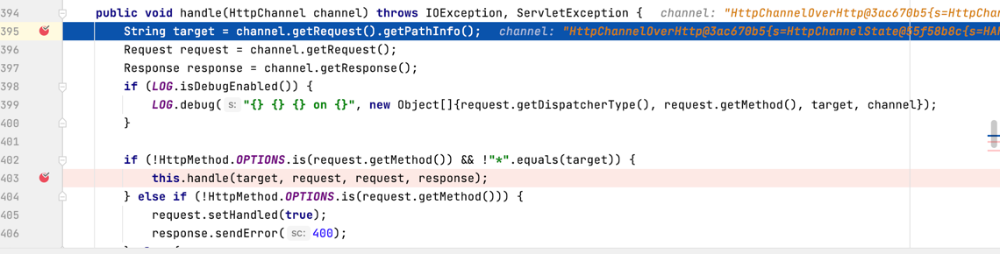
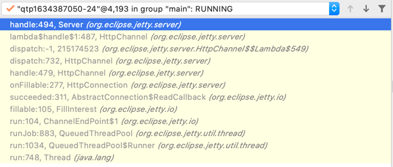
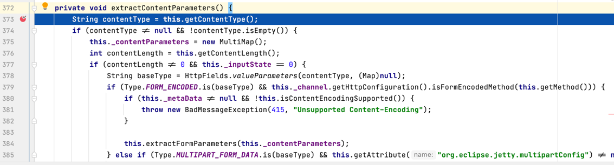
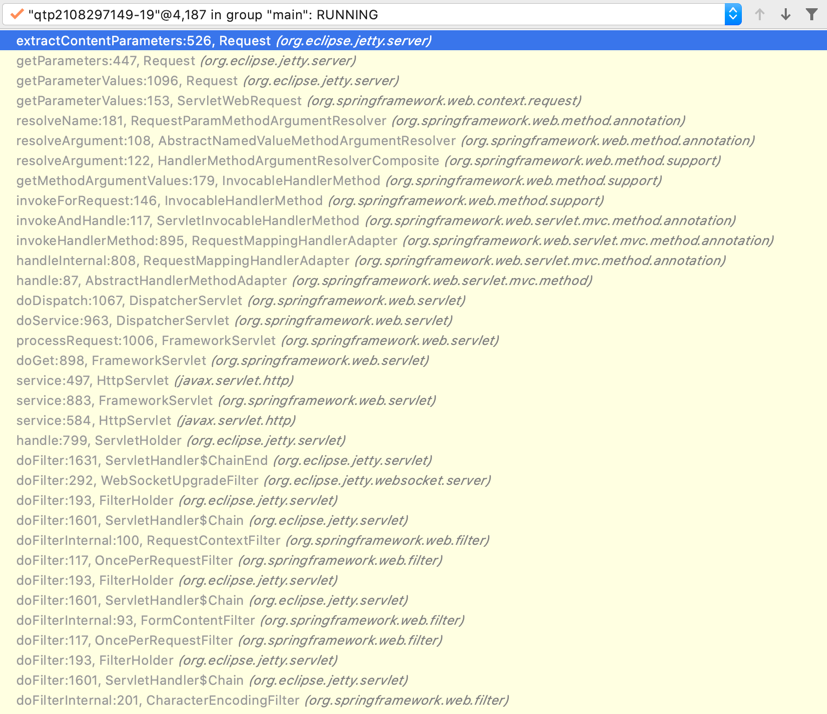
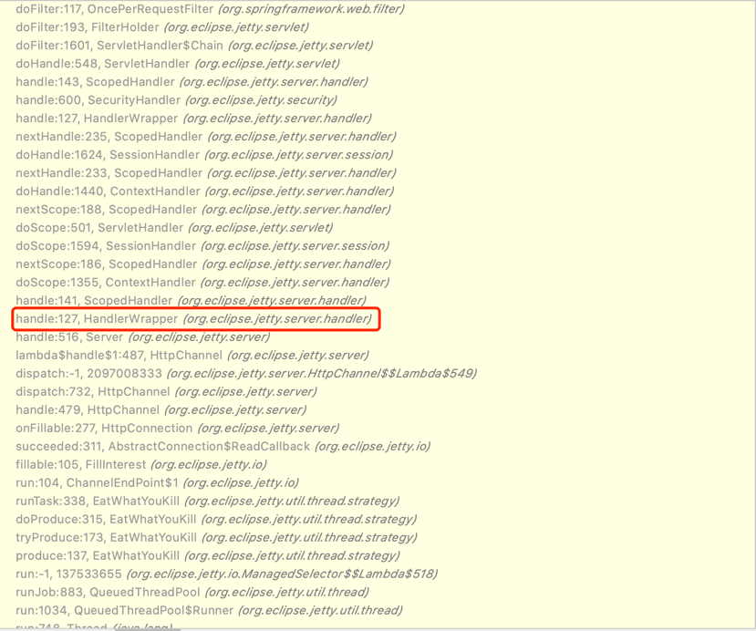
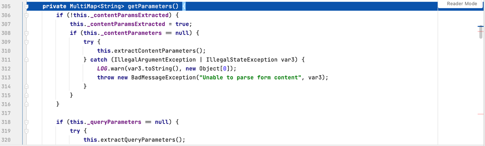
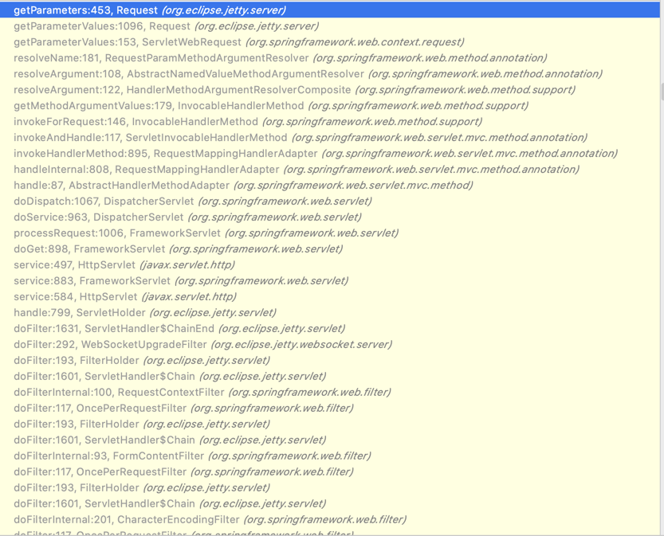
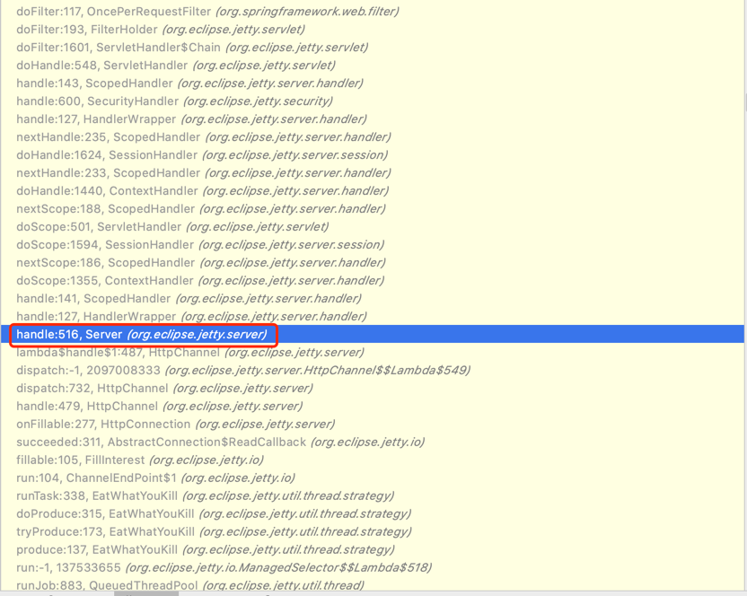
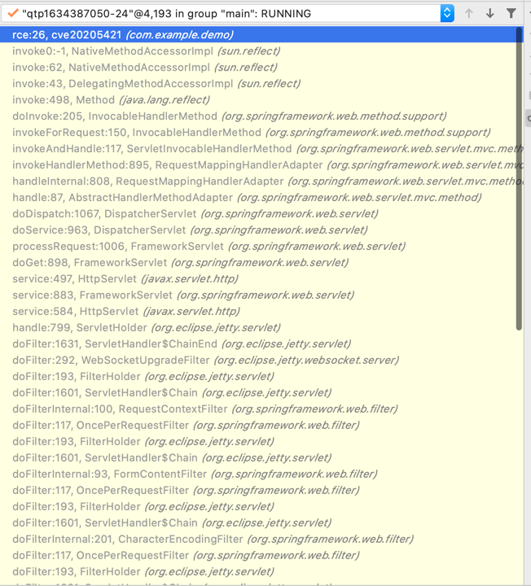

# jetty

## 请求执行流程分析

####1 处理request请求的前置操作

> org.eclipse.jetty.server.Server#handle(HttpChannel channel)



handle方法在当前线程栈的位置，可以看出距离线程开始的位置（即下图中的 run:748,Thread(_java.lang_)）比较近



####2 开始处理request请求

#####2.1 对http请求参数解析



org.eclipse.jetty.server.Request#extractContentParameters



##### 2.2 获取 http 参数







####3 进入到业务的 controller


controller中方法在当前栈中的位置离线程开始的位置远：



通过在用户代码中抛出异常，可以看到整个调用栈，如下所示
```java
(3)---> at com.example.demo.cve20205421.rce(cve20205421.java:28) ~[classes!/:0.0.1-SNAPSHOT]
        at sun.reflect.NativeMethodAccessorImpl.invoke0(Native Method) ~[na:1.8.0_261]
        at sun.reflect.NativeMethodAccessorImpl.invoke(NativeMethodAccessorImpl.java:62) ~[na:1.8.0_261]
        at sun.reflect.DelegatingMethodAccessorImpl.invoke(DelegatingMethodAccessorImpl.java:43) ~[na:1.8.0_261]
        at java.lang.reflect.Method.invoke(Method.java:498) ~[na:1.8.0_261]
        at org.springframework.web.method.support.InvocableHandlerMethod.doInvoke(InvocableHandlerMethod.java:205) ~[spring-web-5.3.20.jar!/:5.3.20]
        at org.springframework.web.method.support.InvocableHandlerMethod.invokeForRequest(InvocableHandlerMethod.java:150) ~[spring-web-5.3.20.jar!/:5.3.20]
        at org.springframework.web.servlet.mvc.method.annotation.ServletInvocableHandlerMethod.invokeAndHandle(ServletInvocableHandlerMethod.java:117) ~[spring-webmvc-5.3.20.jar!/:5.3.20]
        at org.springframework.web.servlet.mvc.method.annotation.RequestMappingHandlerAdapter.invokeHandlerMethod(RequestMappingHandlerAdapter.java:895) ~[spring-webmvc-5.3.20.jar!/:5.3.20]
        at org.springframework.web.servlet.mvc.method.annotation.RequestMappingHandlerAdapter.handleInternal(RequestMappingHandlerAdapter.java:808) ~[spring-webmvc-5.3.20.jar!/:5.3.20]
        at org.springframework.web.servlet.mvc.method.AbstractHandlerMethodAdapter.handle(AbstractHandlerMethodAdapter.java:87) ~[spring-webmvc-5.3.20.jar!/:5.3.20]
        at org.springframework.web.servlet.DispatcherServlet.doDispatch(DispatcherServlet.java:1067) ~[spring-webmvc-5.3.20.jar!/:5.3.20]
        at org.springframework.web.servlet.DispatcherServlet.doService(DispatcherServlet.java:963) ~[spring-webmvc-5.3.20.jar!/:5.3.20]
        at org.springframework.web.servlet.FrameworkServlet.processRequest(FrameworkServlet.java:1006) ~[spring-webmvc-5.3.20.jar!/:5.3.20]
        at org.springframework.web.servlet.FrameworkServlet.processRequest(FrameworkServlet.java:1014) ~[spring-webmvc-5.3.20.jar!/:5.3.20]
        at org.springframework.web.servlet.FrameworkServlet.doGet(FrameworkServlet.java:898) ~[spring-webmvc-5.3.20.jar!/:5.3.20]
        at javax.servlet.http.HttpServlet.service(HttpServlet.java:497) ~[jakarta.servlet-api-4.0.4.jar!/:4.0.4]
        at org.springframework.web.servlet.FrameworkServlet.service(FrameworkServlet.java:883) ~[spring-webmvc-5.3.20.jar!/:5.3.20]
        at javax.servlet.http.HttpServlet.service(HttpServlet.java:584) ~[jakarta.servlet-api-4.0.4.jar!/:4.0.4]
        at org.eclipse.jetty.servlet.ServletHolder.handle(ServletHolder.java:799) ~[jetty-servlet-9.4.46.v20220331.jar!/:9.4.46.v20220331]
        at org.eclipse.jetty.servlet.ServletHandler$ChainEnd.doFilter(ServletHandler.java:1631) ~[jetty-servlet-9.4.46.v20220331.jar!/:9.4.46.v20220331]
        at org.eclipse.jetty.websocket.server.WebSocketUpgradeFilter.doFilter(WebSocketUpgradeFilter.java:292) ~[websocket-server-9.4.46.v20220331.jar!/:9.4.46.v20220331]
        at org.eclipse.jetty.servlet.FilterHolder.doFilter(FilterHolder.java:193) ~[jetty-servlet-9.4.46.v20220331.jar!/:9.4.46.v20220331]
        at org.eclipse.jetty.servlet.ServletHandler$Chain.doFilter(ServletHandler.java:1601) ~[jetty-servlet-9.4.46.v20220331.jar!/:9.4.46.v20220331]
        at org.springframework.web.filter.RequestContextFilter.doFilterInternal(RequestContextFilter.java:100) ~[spring-web-5.3.20.jar!/:5.3.20]
        at org.springframework.web.filter.OncePerRequestFilter.doFilter(OncePerRequestFilter.java:117) ~[spring-web-5.3.20.jar!/:5.3.20]
        at org.eclipse.jetty.servlet.FilterHolder.doFilter(FilterHolder.java:193) ~[jetty-servlet-9.4.46.v20220331.jar!/:9.4.46.v20220331]
        at org.eclipse.jetty.servlet.ServletHandler$Chain.doFilter(ServletHandler.java:1601) ~[jetty-servlet-9.4.46.v20220331.jar!/:9.4.46.v20220331]
        at org.springframework.web.filter.FormContentFilter.doFilterInternal(FormContentFilter.java:93) ~[spring-web-5.3.20.jar!/:5.3.20]
        at org.springframework.web.filter.OncePerRequestFilter.doFilter(OncePerRequestFilter.java:117) ~[spring-web-5.3.20.jar!/:5.3.20]
        at org.eclipse.jetty.servlet.FilterHolder.doFilter(FilterHolder.java:193) ~[jetty-servlet-9.4.46.v20220331.jar!/:9.4.46.v20220331]
        at org.eclipse.jetty.servlet.ServletHandler$Chain.doFilter(ServletHandler.java:1601) ~[jetty-servlet-9.4.46.v20220331.jar!/:9.4.46.v20220331]
        at org.springframework.web.filter.CharacterEncodingFilter.doFilterInternal(CharacterEncodingFilter.java:201) ~[spring-web-5.3.20.jar!/:5.3.20]
        at org.springframework.web.filter.OncePerRequestFilter.doFilter(OncePerRequestFilter.java:117) ~[spring-web-5.3.20.jar!/:5.3.20]
        at org.eclipse.jetty.servlet.FilterHolder.doFilter(FilterHolder.java:193) ~[jetty-servlet-9.4.46.v20220331.jar!/:9.4.46.v20220331]
        at org.eclipse.jetty.servlet.ServletHandler$Chain.doFilter(ServletHandler.java:1601) ~[jetty-servlet-9.4.46.v20220331.jar!/:9.4.46.v20220331]
        at org.eclipse.jetty.servlet.ServletHandler.doHandle(ServletHandler.java:548) ~[jetty-servlet-9.4.46.v20220331.jar!/:9.4.46.v20220331]
        at org.eclipse.jetty.server.handler.ScopedHandler.handle(ScopedHandler.java:143) ~[jetty-server-9.4.46.v20220331.jar!/:9.4.46.v20220331]
        at org.eclipse.jetty.security.SecurityHandler.handle(SecurityHandler.java:600) ~[jetty-security-9.4.46.v20220331.jar!/:9.4.46.v20220331]
(2)---> at org.eclipse.jetty.server.handler.HandlerWrapper.handle(HandlerWrapper.java:127) ~[jetty-server-9.4.46.v20220331.jar!/:9.4.46.v20220331]
        at org.eclipse.jetty.server.handler.ScopedHandler.nextHandle(ScopedHandler.java:235) ~[jetty-server-9.4.46.v20220331.jar!/:9.4.46.v20220331]
        at org.eclipse.jetty.server.session.SessionHandler.doHandle(SessionHandler.java:1624) ~[jetty-server-9.4.46.v20220331.jar!/:9.4.46.v20220331]
        at org.eclipse.jetty.server.handler.ScopedHandler.nextHandle(ScopedHandler.java:233) ~[jetty-server-9.4.46.v20220331.jar!/:9.4.46.v20220331]
        at org.eclipse.jetty.server.handler.ContextHandler.doHandle(ContextHandler.java:1440) ~[jetty-server-9.4.46.v20220331.jar!/:9.4.46.v20220331]
        at org.eclipse.jetty.server.handler.ScopedHandler.nextScope(ScopedHandler.java:188) ~[jetty-server-9.4.46.v20220331.jar!/:9.4.46.v20220331]
        at org.eclipse.jetty.servlet.ServletHandler.doScope(ServletHandler.java:501) ~[jetty-servlet-9.4.46.v20220331.jar!/:9.4.46.v20220331]
        at org.eclipse.jetty.server.session.SessionHandler.doScope(SessionHandler.java:1594) ~[jetty-server-9.4.46.v20220331.jar!/:9.4.46.v20220331]
        at org.eclipse.jetty.server.handler.ScopedHandler.nextScope(ScopedHandler.java:186) ~[jetty-server-9.4.46.v20220331.jar!/:9.4.46.v20220331]
        at org.eclipse.jetty.server.handler.ContextHandler.doScope(ContextHandler.java:1355) ~[jetty-server-9.4.46.v20220331.jar!/:9.4.46.v20220331]
        at org.eclipse.jetty.server.handler.ScopedHandler.handle(ScopedHandler.java:141) ~[jetty-server-9.4.46.v20220331.jar!/:9.4.46.v20220331]
        at org.eclipse.jetty.server.handler.HandlerWrapper.handle(HandlerWrapper.java:127) ~[jetty-server-9.4.46.v20220331.jar!/:9.4.46.v20220331]
(1)---> at org.eclipse.jetty.server.Server.handle(Server.java:516) ~[jetty-server-9.4.46.v20220331.jar!/:9.4.46.v20220331]
        at org.eclipse.jetty.server.HttpChannel.lambda$handle$1(HttpChannel.java:487) ~[jetty-server-9.4.46.v20220331.jar!/:9.4.46.v20220331]
        at org.eclipse.jetty.server.HttpChannel.dispatch(HttpChannel.java:732) ~[jetty-server-9.4.46.v20220331.jar!/:9.4.46.v20220331]
        at org.eclipse.jetty.server.HttpChannel.handle(HttpChannel.java:479) ~[jetty-server-9.4.46.v20220331.jar!/:9.4.46.v20220331]
        at org.eclipse.jetty.server.HttpConnection.onFillable(HttpConnection.java:277) [jetty-server-9.4.46.v20220331.jar!/:9.4.46.v20220331]
        at org.eclipse.jetty.io.AbstractConnection$ReadCallback.succeeded(AbstractConnection.java:311) [jetty-io-9.4.46.v20220331.jar!/:9.4.46.v20220331]
        at org.eclipse.jetty.io.FillInterest.fillable(FillInterest.java:105) [jetty-io-9.4.46.v20220331.jar!/:9.4.46.v20220331]
        at org.eclipse.jetty.io.ChannelEndPoint$1.run(ChannelEndPoint.java:104) [jetty-io-9.4.46.v20220331.jar!/:9.4.46.v20220331]
        at org.eclipse.jetty.util.thread.QueuedThreadPool.runJob(QueuedThreadPool.java:883) [jetty-util-9.4.46.v20220331.jar!/:9.4.46.v20220331]
        at org.eclipse.jetty.util.thread.QueuedThreadPool$Runner.run(QueuedThreadPool.java:1034) [jetty-util-9.4.46.v20220331.jar!/:9.4.46.v20220331]
(0)---> at java.lang.Thread.run(Thread.java:748) [na:1.8.0_261]
```
上面调用栈(0)处，线程池开始处理连接；

上面调用栈(1)处，处理request请求的前置操作；

上面调用栈(2)处，开始处理request请求；

上面调用栈(3)处，进入到controller；


## hook点选择

### 1.请求起点的选择
> org.eclipse.jetty.server.Server#handle(HttpChannel channel)

由于RASP使用了线程本地变量threadlocal来关联请求链路的上下文，而处理请求的线程池是可以复用的，因此理论上处理完成一次请求后应该清除线程变量，否则会有「脏数据」。

请求结束的位置是不确定的，而开始位置是确定的。因此可以取巧，只要在下次请求之前清除线程变量即可。即在handle方法的before处清理线程变量。

### 2.http请求头的获取

http报文分为请求头、body等部分。从上面的debug可知，请求头和请求body解析的时机是不同的,http请求头先解析，参数后解析。

> org.eclipse.jetty.server.handler.HandlerWrapper#handle(String target, Request baseRequest, HttpServletRequest request, HttpServletResponse response)

从debug的分析结果来看，进入到`HandlerWrapper.handle`**之前**，http请求头已经解析好了。

> 在hook点中也能获取请求头信息，因此1、2可以合并为一个

### 3.http 请求参数的获取

> org.eclipse.jetty.server.Request#getParameters()

从debug的分析结果来看，执行`Request.getParameters`**之后**，http参数已经解析好了。
