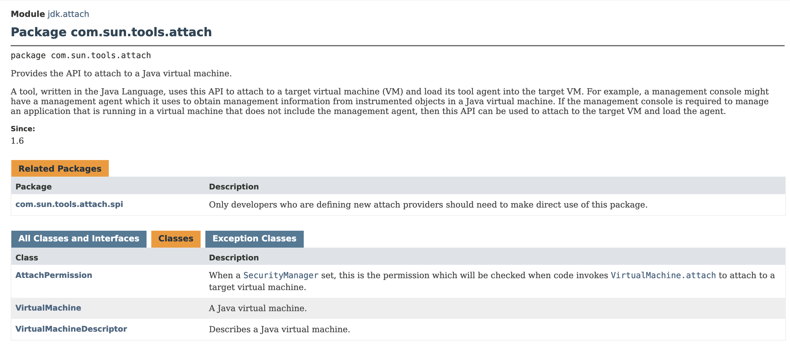

# attach API

> 2023-07-17 第一版

## attach api 的官方介绍
从jdk1.6开始可以使用attach api连接到目标JVM上并让目标JVM加载Java agent。
attach api的包名称为`com.sun.tools.attach`，主要包含三个类：
AttachPermission、VirtualMachine、VirtualMachineDescriptor。


图片来源：https://docs.oracle.com/en/java/javase/20/docs/api/jdk.attach/com/sun/tools/attach/package-summary.html

主要的功能实现在`VirtualMachine`中，其它两个类起到辅助作用，下面将重点介绍VirtualMachine类的使用。

```java
package com.jrasp.book.chapter2.attach;

import java.util.Properties;

import com.sun.tools.attach.VirtualMachine;

public class Main {

    public static void main(String[] args) throws Exception {
        // attach to target VM
        VirtualMachine vm = VirtualMachine.attach("72695");

        // read target vm system properties
        Properties properties = vm.getSystemProperties();
        for (Object key : properties.keySet()) {
            System.out.println(key + "=" + properties.getProperty(key.toString()));
        }

        // detach
        vm.detach();
    }
}
```

上面的代码输出结果如下：
```
java.runtime.name=Java(TM) SE Runtime Environment
java.protocol.handler.pkgs=org.springframework.boot.loader
java.vm.version=25.261-b12
gopherProxySet=false
java.vm.vendor=Oracle Corporation
// ... 其他参数省略
```

上面的例子中使用attach api连接到进程pid为72695的Java进程上，
然后读取目标 JVM 的系统参数并输出，最后调用detach与目标JVM断开连接。
从代码层面可以直观的理解，在执行完成attach之后，就获得了一个目标JVM的VirtualMachine对象，
调用VirtualMachine对象的方法就可以完成对目标JVM的操作。
从VirtualMachine的方法可以看出，主要功能可以分为两类，第一类是获取系统参数信息，第二类是加载一个Agent。

