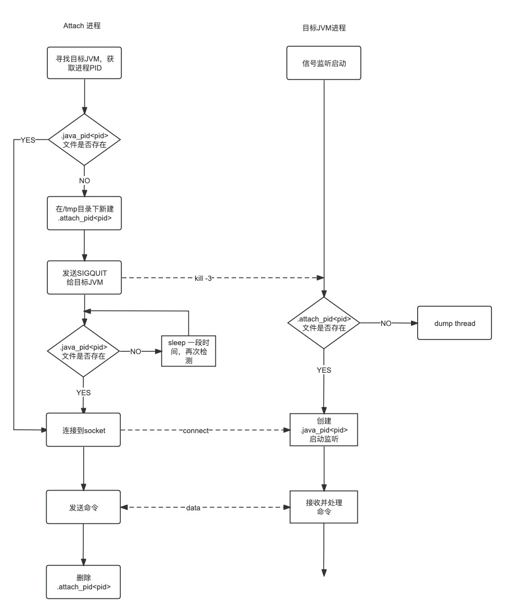

# 实现原理

> 2023-07-17 第1版

> 2023-07-27 第2版

> 2023-08-03 第3版

> 2023-09-11 第4版

> 2023-09-17 第5版

在上一节介绍了Attach API的基本使用，本节将结合JDK源代码详细介绍其中的原理。
Attach机制本质上是进程间的通信，外部进程通过JVM提供的socket连接到目标JVM上并发送指令，JVM接受并处理指令然后返回处理结果。
可能会比较奇怪，Attach时并没有发现JVM创建socket端口，其实JVM使用了Unix Domain Socket。

## Attach 客户端源码解析

有了前面一节的使用基础，我们将分析Attach API的实现原理并对相应的源码做解析，从而挖掘更多可用的功能。`com.sun.tools.attach.VirtualMachine`是抽象类，
不同厂商的虚拟机可以实现不同VirtualMachine子类，
HotSpotVirtualMachine是HotSpot官方提供的VirtualMachine实现，
它也是一个抽象类，在不同操作系统上都有各自实现，如 macosx系统上的实现为`src/jdk.attach/macosx/classes/sun/tools/attach/VirtualMachineImpl.java`。

先来看下`HotSpotVirtualMachine`抽象类的loadAgentLibrary方法
```java
private void loadAgentLibrary(String agentLibrary, boolean isAbsolute, String options)
    throws AgentLoadException, AgentInitializationException, IOException
{
    if (agentLibrary == null) {
        throw new NullPointerException("agentLibrary cannot be null");
    }
    // jdk8及以下返回0
    // jdk9及以上返回字符串"return code: 0"
    String msgPrefix = "return code: ";
    // 执行load指令，给目标 jvm 传输 agent jar路径和参数
    InputStream in = execute("load",
                             agentLibrary,
                             isAbsolute ? "true" : "false",
                             options);
    try (BufferedReader reader = new BufferedReader(new InputStreamReader(in))) {
        String result = reader.readLine();
        // 返回结果
        if (result == null) {
            throw new AgentLoadException("Target VM did not respond");
        } else if (result.startsWith(msgPrefix)) {
            int retCode = Integer.parseInt(result.substring(msgPrefix.length()));
            if (retCode != 0) {
                throw new AgentInitializationException("Agent_OnAttach failed", retCode);
            }
        } else {
            throw new AgentLoadException(result);
        }
    }
}
```

上面的代码是加载一个Java Agent，核心实现在 `execute` 方法中，来看下execute方法的源码：
```java
/*
 * Execute the given command in the target VM - specific platform
 * implementation must implement this.
 */
abstract InputStream execute(String cmd, Object ... args)
    throws AgentLoadException, IOException;
```
execute是一个抽象方法，需要在子类中实现，HotSpotVirtualMachine类中的其他方法大多数最终都会调用这个execute方法。

再来看下macosx系统上的子类`VirtualMachineImpl`代码。
``` java           
VirtualMachineImpl(AttachProvider provider, String vmid)
    throws AttachNotSupportedException, IOException
{
    super(provider, vmid);

    // This provider only understands pids
    int pid;
    try {
        pid = Integer.parseInt(vmid);
    } catch (NumberFormatException x) {
        throw new AttachNotSupportedException("Invalid process identifier");
    }
    // 在/tmp目录下寻找socket文件是否存在                    
    // Find the socket file. If not found then we attempt to start the
    // attach mechanism in the target VM by sending it a QUIT signal.
    // Then we attempt to find the socket file again.
    File socket_file = new File(tmpdir, ".java_pid" + pid);
    socket_path = socket_file.getPath();
    if (!socket_file.exists()) {
        // 创建 attach_pid 文件
        File f = createAttachFile(pid);
        try {
            // 向目标JVM 发送 kill -3 信号
            sendQuitTo(pid);

            // 等待目标 jvm 创建 socket 文件
            // give the target VM time to start the attach mechanism
            final int delay_step = 100;
            final long timeout = attachTimeout();
            long time_spend = 0;
            long delay = 0;
            do {
                // Increase timeout on each attempt to reduce polling
                delay += delay_step;
                try {
                    Thread.sleep(delay);
                } catch (InterruptedException x) { }

                time_spend += delay;
                if (time_spend > timeout/2 && !socket_file.exists()) {
                    // Send QUIT again to give target VM the last chance to react
                    sendQuitTo(pid); // 发送kill -3 信号
                }
            } while (time_spend <= timeout && !socket_file.exists());
            
            // 等待时间结束后，确认socket文件是否存在
            if (!socket_file.exists()) {
                throw new AttachNotSupportedException(
                    String.format("Unable to open socket file %s: " +
                                  "target process %d doesn't respond within %dms " +
                                  "or HotSpot VM not loaded", socket_path,
                                  pid, time_spend));
            }
        } finally {
            // 最后删除 attach_pid 文件
            f.delete();
        }
    }

    // Check that the file owner/permission to avoid attaching to
    // bogus process
    // 确认socket文件权限
    checkPermissions(socket_path);

    // Check that we can connect to the process
    // - this ensures we throw the permission denied error now rather than
    // later when we attempt to enqueue a command.
    // 尝试连接socket，确认可以连接到目标JVM
    int s = socket();
    try {
        connect(s, socket_path);
    } finally {
        close(s);
    }
}
```
再次梳理下attach通信的过程：

第一步： 发起attach的进程在/tmp目录下查找目标JVM是否已经创建了`.java_pid<pid>` ，如果已经创建，直接跳到第六步；

第二步： attach进程创建socket通信的握手文件`.attach_pid<pid>`；

第三步： attach进程给目标JVM发送SIGQUIT（kill -3）信号，提示目标JVM外部进程发起了attach请求；

第四步： attach进程等待.java_pid<pid>文件创建，.java_pid<pid>文件由目标JVM创建；

第五步： 删除`握手文件`attach_pid文件；

第六步： attach进程校验socket文件权限；

第七步： attach进程测试socket连接可用性；    

上面详细说明了socket连接的建立过程，下面将介绍发送命令的协议。
```java
InputStream execute(String cmd, Object ... args) throws AgentLoadException, IOException {
    // 参数、socket_path校验
        
    // create UNIX socket
    int s = socket();

    // connect to target VM
    try {
        connect(s, socket_path);
    } catch (IOException x) {
        // 错误处理
    }

    IOException ioe = null;

    // connected - write request
    // <ver> <cmd> <args...>
    try {
        // 发送协议
        writeString(s, PROTOCOL_VERSION);
        // 发送命令
        writeString(s, cmd);
        // 发送参数，最多三个参数
        for (int i=0; i<3; i++) {
            if (i < args.length && args[i] != null) {
                writeString(s, (String)args[i]);
            } else {
                // 没有参数，发送空字符串代替
                writeString(s, "");
            }
        }
    } catch (IOException x) {
        ioe = x;
    }

    // 读取执行结果
    // Create an input stream to read reply
    SocketInputStream sis = new SocketInputStream(s);

    // Read the command completion status
    int completionStatus;
    try {
        completionStatus = readInt(sis);
    } catch (IOException x) {
        // 错误处理
    }

    if (completionStatus != 0) {
        // 错误处理
    }
    
    return sis;
}
```
从上面的代码可以知道一次命令发送，先发送版本协议，然后是命令，最后是参数，并且参数的个数最多为3个。

为了更加清晰的看到通信协议的内容，在Linux上使用strace命令能够跟踪attach的系统调用过程。

```shell
strace -f java Main 2> main.out
```

在 main.out 文件中找到attach通信过程，可以看到先写入协议号、命令、参数，然后读取返回结果。
```text
[pid 31412] socket(AF_LOCAL, SOCK_STREAM, 0) = 6
[pid 31412] connect(6, {sa_family=AF_LOCAL, sun_path="/tmp/.java_pid27730"}, 110) = 0
[pid 31412] write(6, "1", 1)            = 1
[pid 31412] write(6, "\0", 1)           = 1
[pid 31412] write(6, "properties", 10)  = 10
[pid 31412] write(6, "\0", 1)           = 1
[pid 31412] write(6, "\0", 1 <unfinished ...>
[pid 31412] write(6, "\0", 1)           = 1
[pid 31412] write(6, "\0", 1)           = 1
[pid 31412] read(6, "0", 1)             = 1
[pid 31412] read(6, "\n", 1)            = 1
[pid 31412] read(6, "#Thu Jul 27 17:52:11 CST 2023\nja"..., 128) = 128
[pid 31412] read(6, "oot.loader\nsun.boot.library.path"..., 128) = 128
[pid 31412] read(6, "poration\njava.vendor.url=http\\:/"..., 128) = 128
[pid 31412] read(6, ".pkg=sun.io\nuser.country=CN\nsun."..., 128) = 128
[pid 31412] read(6, "e=Java Virtual Machine Specifica"..., 128) = 128
```

因此发送协议可以总结为下面的字符串序列：
```text
1 byte PROTOCOL_VERSION
1 byte '\0'
n byte command
1 byte '\0'
n byte arg1
1 byte '\0'
n byte arg2
1 byte '\0'
n byte arg3
1 byte '\0'
```
## Attach服务端源码解析

我们再来看下接收Attach的服务端代码是怎么样，
这部分代码是c/c++语言构建，但是也是不难理解的。
以Linux系统为例子，说明目标JVM如何处理Attach请求和命令。

先来看下目标JVM如何处理`kill -3`信号。JVM初始化过程中会创建2个线程，
线程名称分别为`Signal Dispatcher`和`Attach Listener`，
Signal Dispatcher线程用来处理信号量，Attach Listener线程用来响应Attach操作。
JVM线程的的初始化都在`Threads::create_vm`中，当然与Attach有关的线程也在这个方法中初始化。

```src/hotspot/share/runtime/thread.cpp
jint Threads::create_vm(JavaVMInitArgs* args, bool* canTryAgain) {

  //....其他代码省略

  // Signal Dispatcher needs to be started before VMInit event is posted
  // step1：初始化 Signal Dispatcher 线程支持信号量处理
  os::initialize_jdk_signal_support(CHECK_JNI_ERR);

  // Start Attach Listener if +StartAttachListener or it can't be started lazily
  // step2：初始化Attach Listener线程
  if (!DisableAttachMechanism) {
    // 在VM启动时删除已经存在的通信文件.java_pid<pid>
    AttachListener::vm_start();
    if (StartAttachListener || AttachListener::init_at_startup()) {
      // StartAttachListener 在JVM启动时初始化AttachListener线程
      AttachListener::init();
    }
  }
  
  //....
}  
```
上面的代码中分别初始化Signal Dispatcher、Attach Listener，并且Signal Dispatcher先于Attach Listener初始化。下面分别详细说下初始化流程。

### Signal Dispatcher

`initialize_jdk_signal_support`的实现代码如下

```src/hotspot/share/runtime/os.cpp
// 初始化jdk的信号支持系统
void os::initialize_jdk_signal_support(TRAPS) {
  if (!ReduceSignalUsage) {
    // Setup JavaThread for processing signals
    // 线程名称
    const char thread_name[] = "Signal Dispatcher";
    
    // ... 线程初始化过程

    // 设置线程入口
    JavaThread* signal_thread = new JavaThread(&signal_thread_entry);
    
    // ...
    
    // 注册的信号
    // Handle ^BREAK
    os::signal(SIGBREAK, os::user_handler());
  }
}
```
JVM创建了一个单独的线程来实现信号处理，这个线程名称为Signal Dispatcher。
线程的入口是signal_thread_entry函数。入口函数代码如下：

```src/hotspot/share/runtime/os.cpp
// SIGBREAK is sent by the keyboard to query the VM state
#ifndef SIGBREAK
// SIGBREAK就是SIGQUIT
#define SIGBREAK SIGQUIT  
#endif

static void signal_thread_entry(JavaThread* thread, TRAPS) {
  os::set_priority(thread, NearMaxPriority);
  // 处理信号
  while (true) {
    int sig;
    {
      sig = os::signal_wait();
    }
    if (sig == os::sigexitnum_pd()) {
       // Terminate the signal thread
       return;
    }
    
    switch (sig) {
      case SIGBREAK: {
        // 当接收到SIGBREAK信号，就执行接下来的代码
        // Check if the signal is a trigger to start the Attach Listener - in that
        // case don't print stack traces.
        // 检测是否禁用了attach机制，AttachListener是否已经初始化完成
        if (!DisableAttachMechanism && AttachListener::is_init_trigger()) {
          continue;
        }
        // Print stack traces
        // Any SIGBREAK operations added here should make sure to flush
        // the output stream (e.g. tty->flush()) after output.  See 4803766.
        // Each module also prints an extra carriage return after its output.
        
        // 如果attach机制被禁用或者attach_pid不存在，
        // 则会创建VM_PrintThreads、VM_PrintJNI、VM_FindDeadlocks，
        // 通过VMThread::execute()方法扔到VM Thread线程的VMOperationQueue队列。
        VM_PrintThreads op;
        VMThread::execute(&op);
        VM_PrintJNI jni_op;
        VMThread::execute(&jni_op);
        VM_FindDeadlocks op1(tty);
        VMThread::execute(&op1);
        Universe::print_heap_at_SIGBREAK();
        // 启用-XX:+PrintClassHistogram,执行一次fullgc
        if (PrintClassHistogram) {
          VM_GC_HeapInspection op1(tty, true /* force full GC before heap inspection */);
          VMThread::execute(&op1);
        }
        if (JvmtiExport::should_post_data_dump()) {
          JvmtiExport::post_data_dump();
        }
        break;
      }
      default: {
        // Dispatch the signal to java
        // ...其他信号处理
      }
    }
  }
}
```
代码行号2～5定义了宏SIGBREAK，可以看出，SIGBREAK信号就是SIGQUIT。 
DisableAttachMechanism禁止attach，默认为false。 
下面是DisableAttachMechanism的含义

```text
product(bool, DisableAttachMechanism, false,                              \
"Disable mechanism that allows tools to attach to this VM")
```

再来看下`AttachListener::is_init_trigger`的实现
```
// If the file .attach_pid<pid> exists in the working directory
// or /tmp then this is the trigger to start the attach mechanism
bool AttachListener::is_init_trigger() {
  // 记录AttachListener的初始状态
  // JVM 用一个全局变量_is_initialized记录 AttachListener 的状态
  if (init_at_startup() || is_initialized()) {
    return false;               // initialized at startup or already initialized
  }
  char fn[PATH_MAX + 1];
  int ret;
  struct stat64 st;
  // .attach_pid%d 文件
  sprintf(fn, ".attach_pid%d", os::current_process_id());
  RESTARTABLE(::stat64(fn, &st), ret);
  if (ret == -1) {
    log_trace(attach)("Failed to find attach file: %s, trying alternate", fn);
    snprintf(fn, sizeof(fn), "%s/.attach_pid%d",
             os::get_temp_directory(), os::current_process_id());
    RESTARTABLE(::stat64(fn, &st), ret);
    if (ret == -1) {
      log_debug(attach)("Failed to find attach file: %s", fn);
    }
  }
  // 当前进程的.attach_pid<pid>文件存在，创建AttachListener线程
  if (ret == 0) {
    // simple check to avoid starting the attach mechanism when
    // a bogus non-root user creates the file
    // attach文件权限校验（root权限或者权限相同）
    if (os::Posix::matches_effective_uid_or_root(st.st_uid)) {
      // 创建AttachListener线程
      // 执行AttachListener的init方法
      init();
      log_trace(attach)("Attach triggered by %s", fn);
      return true;
    } else {
      log_debug(attach)("File %s has wrong user id %d (vs %d). Attach is not triggered", fn, st.st_uid, geteuid());
    }
  }
  return false;
}
```

如果AttachListener没有初始化，则判断临时目录下.attach_pid<pid>文件是否存在，
如果存在则调用init初始化AttachListener线程，初始化成功后返回true。

### Attach Listener
Attach机制通过Attach Listener线程来进行相关命令的处理，下面来看一下Attach Listener线程是如何初始化的。
从上面的代码分析可以看出，AttachListener可以在JVM启动时初始化，也可以在首次收到SIGBREAK信号后，由Signal Dispatcher完成初始化。
在JVM启动时初始化之前执行`AttachListener::vm_start`，删除已经存在的通信文件.java_pid文件。

```c++
void AttachListener::vm_start() {
  char fn[UNIX_PATH_MAX];
  struct stat64 st;
  int ret;

  int n = snprintf(fn, UNIX_PATH_MAX, "%s/.java_pid%d",
           os::get_temp_directory(), os::current_process_id());
  assert(n < (int)UNIX_PATH_MAX, "java_pid file name buffer overflow");

  RESTARTABLE(::stat64(fn, &st), ret);
  if (ret == 0) {
    ret = ::unlink(fn);
    if (ret == -1) {
      log_debug(attach)("Failed to remove stale attach pid file at %s", fn);
    }
  }
}
```
这个删除文件的操作仅在JVM启动是执行一次，因为操作系统层面进程的PID是可以复用的，
防止已经退出的进程影响当前的进程初始化Attach Listener。

再来看下Attach Listener初始化过程。
```text
void AttachListener::init() {
  
  // 线程名称Attach Listener
  const char thread_name[] = "Attach Listener";
  
  // ... 线程初始化过程
  
  // 设置AttachListener线程的入口函数attach_listener_thread_entry
  JavaThread* listener_thread = new JavaThread(&attach_listener_thread_entry);
  
  // ... 设置线程状态
}
```

上面的代码初始化了一个线程，并设置线程的入口函数。重点分析下attach_listener_thread_entry函数。
```text
// Attach Listener线程从队列中获取操作命令，并执行命令对应的函数
static void attach_listener_thread_entry(JavaThread* thread, TRAPS) {
  // STEP1：AttachListener初始化
  if (AttachListener::pd_init() != 0) {
    return;
  }
  // STEP2：设置AttachListener的全局状态
  AttachListener::set_initialized();

  for (;;) {
    // STEP3：从队列中取AttachOperation
    AttachOperation* op = AttachListener::dequeue();
    // find the function to dispatch too
    AttachOperationFunctionInfo* info = NULL;
    for (int i=0; funcs[i].name != NULL; i++) {
      const char* name = funcs[i].name;
      if (strcmp(op->name(), name) == 0) {
        info = &(funcs[i]); break;
      }}
      // dispatch to the function that implements this operation
      // ... 执行具体的操作
      res = (info->func)(op, &st);
    //...
  }
}
```
第一步先执行AttachListener socket的初始化操作；第二步初始化完成后设置
AttachListener的状态为initialized；第三步从队列中取AttachOperation，并且调用对应的处理函数处理并返回结果。下面分别对这个三个过程详细分析。

#### AttachListener::pd_init
执行初始化操作在AttachListener::pd_init方法中。
```text
int AttachListener::pd_init() {
  
  // linux 系统下的初始化操作  
  int ret_code = LinuxAttachListener::init();
  
  // ...
  
  return ret_code;
}
```
实际执行的是LinuxAttachListener::init，不同操作系统执行初始化逻辑不同。在Linux系统中实际执行LinuxAttachListener::init。
```text
// 创建了一个socket并监听socket文件
int LinuxAttachListener::init() {
  char path[UNIX_PATH_MAX];          // socket file
  char initial_path[UNIX_PATH_MAX];  // socket file during setup
  int listener;                      // listener socket (file descriptor)

  // register function to cleanup
  ::atexit(listener_cleanup);

  int n = snprintf(path, UNIX_PATH_MAX, "%s/.java_pid%d",
                   os::get_temp_directory(), os::current_process_id());
  if (n < (int)UNIX_PATH_MAX) {
    n = snprintf(initial_path, UNIX_PATH_MAX, "%s.tmp", path);
  }
  if (n >= (int)UNIX_PATH_MAX) {
    return -1;
  }

  // create the listener socket
  listener = ::socket(PF_UNIX, SOCK_STREAM, 0);
  if (listener == -1) {
    return -1;
  }

  // 绑定socket
  struct sockaddr_un addr;
  memset((void *)&addr, 0, sizeof(addr));
  addr.sun_family = AF_UNIX;
  strcpy(addr.sun_path, initial_path);
  ::unlink(initial_path);
  int res = ::bind(listener, (struct sockaddr*)&addr, sizeof(addr));
  if (res == -1) {
    ::close(listener);
    return -1;
  }

  // 开启监听
  res = ::listen(listener, 5);
  if (res == 0) {
    RESTARTABLE(::chmod(initial_path, S_IREAD|S_IWRITE), res);
    if (res == 0) {
      // make sure the file is owned by the effective user and effective group
      // e.g. the group could be inherited from the directory in case the s bit is set
      RESTARTABLE(::chown(initial_path, geteuid(), getegid()), res);
      if (res == 0) {
        res = ::rename(initial_path, path);
      }
    }
  }
  if (res == -1) {
    ::close(listener);
    ::unlink(initial_path);
    return -1;
  }
  set_path(path);
  set_listener(listener);

  return 0;
}
```
AttachListener::pd_init()方法调用了LinuxAttachListener::init()方法，完成了套接字的创建和监听。

#### LinuxAttachListener::dequeue

for循环的执行逻辑，大概是这样的：
+ 从dequeue拉取一个需要执行的任务；
+ 查询匹配的命令处理函数；
+ 执行匹配到的命令执行函数；

AttachOperation的全部操作函数表如下：
```text
static AttachOperationFunctionInfo funcs[] = {
  { "agentProperties",  get_agent_properties },
  { "datadump",         data_dump },
  { "dumpheap",         dump_heap },
  { "load",             load_agent },
  { "properties",       get_system_properties },
  { "threaddump",       thread_dump },
  { "inspectheap",      heap_inspection },
  { "setflag",          set_flag },
  { "printflag",        print_flag },
  { "jcmd",             jcmd },
  { NULL,               NULL }
};
```
对于加载Agent来说，命令就是load命令，用来加载一个Java Agent。
现在，我们知道了Attach Listener大概的工作模式，但是还是不太清楚任务从哪来，
这个秘密就藏在AttachListener::dequeue这行代码里面，接下来我们来分析一下dequeue这个函数：
```text
LinuxAttachOperation* LinuxAttachListener::dequeue() {
  for (;;) {
    // 等待attach进程连接socket
    struct sockaddr addr;
    socklen_t len = sizeof(addr);
    RESTARTABLE(::accept(listener(), &addr, &len), s);
    // 校验attach进程的权限
    struct ucred cred_info;
    socklen_t optlen = sizeof(cred_info);
    if (::getsockopt(s, SOL_SOCKET, SO_PEERCRED, (void*)&cred_info, &optlen) == -1) {
      ::close(s);
      continue;
    }
    // 读取socket获取操作的对象
    LinuxAttachOperation* op = read_request(s);
    return op;
  }
}
```
dequeue方法是一个for循环，会循环使用accept方法，接受socket中传过来的数据，
并且在验证通信的另一端的uid与gid与自身的euid与egid相同后，
执行read_request方法，从socket读取内容，并且把内容包装成AttachOperation类的一个实例。

接下来看看read_request是如何解析socket数据流的。
```text
LinuxAttachOperation* LinuxAttachListener::read_request(int s) {
  // 协议版本
  char ver_str[8];
  sprintf(ver_str, "%d", ATTACH_PROTOCOL_VER);
  
  // The request is a sequence of strings so we first figure out the
  // expected count and the maximum possible length of the request.
  // The request is:
  //   <ver>0<cmd>0<arg>0<arg>0<arg>0
  // where <ver> is the protocol version (1), <cmd> is the command
  // name ("load", "datadump", ...), and <arg> is an argument
  int expected_str_count = 2 + AttachOperation::arg_count_max;
  // socekt buf 的最大长度
  // 参数最多为AttachOperation::arg_count_max
  const int max_len = (sizeof(ver_str) + 1) + (AttachOperation::name_length_max + 1) +
    AttachOperation::arg_count_max*(AttachOperation::arg_length_max + 1);
  
  char buf[max_len];
  int str_count = 0;

  // Read until all (expected) strings have been read, the buffer is
  // full, or EOF.

  int off = 0;
  int left = max_len;

  do {
    int n;
    RESTARTABLE(read(s, buf+off, left), n);
    assert(n <= left, "buffer was too small, impossible!");
    buf[max_len - 1] = '\0';
    if (n == -1) {
      return NULL;      // reset by peer or other error
    }
    if (n == 0) {
      break;
    }
    for (int i=0; i<n; i++) {
      if (buf[off+i] == 0) {
        // EOS found
        str_count++;
        
        // The first string is <ver> so check it now to
        // check for protocol mis-match
        // 第一个字符串是协议版本
        if (str_count == 1) {
          // 校验socket客户端、服务端的协议版本是否相同
          if ((strlen(buf) != strlen(ver_str)) ||
              (atoi(buf) != ATTACH_PROTOCOL_VER)) {
            // 协议版本不相同，往socket中写入错误信息  
            char msg[32];
            sprintf(msg, "%d\n", ATTACH_ERROR_BADVERSION);
            write_fully(s, msg, strlen(msg));
            return NULL;
          }
        }
      }
    }
    off += n;
    left -= n;
  } while (left > 0 && str_count < expected_str_count);

  if (str_count != expected_str_count) {
    return NULL;        // incomplete request
  }

  // parse request
  // 参数遍历
  ArgumentIterator args(buf, (max_len)-left);

  // version already checked
  char* v = args.next();
  // 第一个参数是命令名称  
  char* name = args.next();
  if (name == NULL || strlen(name) > AttachOperation::name_length_max) {
    return NULL;
  }
  // 创建AttachOperation对象
  LinuxAttachOperation* op = new LinuxAttachOperation(name);
  
  // 读取参数  
  for (int i=0; i<AttachOperation::arg_count_max; i++) {
    char* arg = args.next();
    if (arg == NULL) {
      op->set_arg(i, NULL);
    } else {
      if (strlen(arg) > AttachOperation::arg_length_max) {
        delete op;
        return NULL;
      }
      op->set_arg(i, arg);
    }
  }
  // 将socket引用设置到op对象中
  op->set_socket(s);
  return op;
}
```

这是Linux上的实现，不同的操作系统实现方式不一样。上面的代码Attach Listener在某个端口监听着，通过accept来接收一个连接，然后从这个连接里面将请求读取出来，然后将请求包装成一个AttachOperation类型的对象，之后就会从表里查询对应的处理函数，然后进行处理。

因此Attach机制在linux系统的流程可以描述为下图。


进程间详细的交互流程可以用下面的流程图描述：




## Attach机制涉及到的jvm参数

这里重新总结下attach机制涉及到参数


| 名称 | 含义                      | 默认值   |
|----|-------------------------|-------|
| ReduceSignalUsage | 减少信号使用                  | false |
| DisableAttachMechanism | 禁止attach到当前JVM          | false |
| StartAttachListener | JVM 启动时初始化AttachListener | false |
| EnableDynamicAgentLoading | 允许运行时加载Agent            | true  |

JVM 参数都在`src/hotspot/share/runtime/globals.hpp` 中定义


