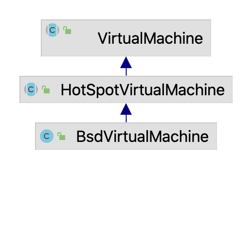

# 通信机制

attach api大家可能比较熟悉，下面将介绍其中的原理。 attach机制本质上是进程间的通信，外部进程通过JVM提供的socket连接到目标JVM上并发送指令，JVM接受并处理指令然后返回处理结果。
可能会比较奇怪，attach时并没有发现JVM创建socket端口，其实JVM使用了UDS。

## attach api 源码解析

有了上面的使用基础，我们将分析 attach api 的 实现原理并对相应的源码做分析，从而挖掘更多可用的功能。
VirtualMachine 是抽象类，它的实现类在不同操作系统分别为：HotSpotVirtualMachine和等

> 重构: 包含windows

下面分析macos上的VirtualMachine实现类`BsdVirtualMachine`。

https://blog.csdn.net/weixin_43511928/article/details/125542123

https://segmentfault.com/a/1190000038799705?utm_source=coffeephp.com

jmx 的使用参考：https://www.cnblogs.com/gossip/p/6141941.html

参考资料：https://docs.oracle.com/en/java/javase/20/docs/api/jdk.attach/com/sun/tools/attach/VirtualMachine.html

开源项目中 attach api 的使用：

https://vimsky.com/examples/detail/java-method-sun.tools.attach.HotSpotVirtualMachine.detach.html

## socket通信的建立过程

从 kill -3 信号说起，

