## 10.2 OGNL使用与源码解析


OGNL表达式，即Object-Graph Navigation Language，是一种在Java中使用的功能强大的表达式语言。
它被集成在Mybatis和Struts2等框架中，主要用于访问数据，具有类型转换、访问对象方法、操作集合对象等功能
。OGNL表达式的语法简单且一致，能通过简单的表达式访问对象的任意属性，调用对象的方法，以及遍历对象的结构图等。

首先来介绍下OGNL的三要素：

+ 表达式：

表达式（Expression）是整个OGNL的核心内容，所有的OGNL操作都是针对表达式解析后进行的。
通过表达式来告诉OGNL操作到底要干些什么。因此，表达式其实是一个带有语法含义的字符串，
整个字符串将规定操作的类型和内容。OGNL表达式支持大量的表达式，
如“链式访问对象”、表达式计算、甚至还支持Lambda表达式。

+ Root对象：

OGNL的Root对象可以理解为OGNL的操作对象。当我们指定了一个表达式的时候，
我们需要指定这个表达式针对的是哪个具体的对象。而这个具体的对象就是Root对象，
这就意味着，如果有一个OGNL表达式，那么我们需要针对Root对象来进行OGNL表达式的计算并且返回结果。

+ 上下文环境：

有个Root对象和表达式，我们就可以使用OGNL进行简单的操作了，
如对Root对象的赋值与取值操作。但是，实际上在OGNL的内部，
所有的操作都会在一个特定的数据环境中运行。
这个数据环境就是上下文环境（Context）。OGNL的上下文环境是一个Map结构，
称之为OgnlContext。Root对象也会被添加到上下文环境当中去。

### 10.2.1 基本使用

本节仅介绍其基本用法。

+ 对Root对象的访问

OGNL使用的是一种链式的风格进行对象的访问。具体代码如下：
```java

```

+ 对上下文对象的访问

使用OGNL的时候如果不设置上下文对象，系统会自动创建一个上下文对象，
如果传入的参数当中包含了上下文对象则会使用传入的上下文对象。
当访问上下文环境当中的参数时候，需要在表达式前面加上'#'，表示了与访问Root对象的区别。
具体代码如下：
```java

```
这段代码很好的区分了访问Root对象和访问上下文对象的区别。

+ 创建集合对象

OGNL支持直接使用表达式来创建集合对象。主要有三种情况：
构造List对象：使用{},中间使用','进行分割如{"aa", "bb", "cc"} ；
构造Map对象：使用#{}，中间使用','进行分割键值对，键值对使用':'区分，如#{"key1" : "value1", "key2" : "value2"}
构造任意对象：直接使用已知的对象的构造方法进行构造。
要创建对象列表，请将表达式列表放在大括号中。与方法参数一样，这些表达式不能使用逗号运算符，除非它被括在括号中。以下是一个例子：
```java
name in { null,"Untitled" }
```
这将测试名称属性是否为null或等于"Untitled"。
上述描述的语法将创建List接口的一个实例。具体的子类未定义

有时您希望创建Java本地数组，例如int[]或Integer[]。OGNL支持类似于通常调用构造函数的方式创建这些数组，但允许从现有列表或数组的给定大小初始化本地数组。
```java
// 创建一个由三个整数1、2和3组成的新int数组。
new int[] { 1, 2, 3 }
// 创建所有元素为null或0的数组
new int[5]
```

```java
// 创建map
#{ "foo" : "foo value", "bar" : "bar value" }
// 创建特定类型的map
#@java.util.LinkedHashMap@{ "foo" : "foo value", "bar" : "bar value" }
```

+ 投射

OGNL提供了一种简单的方式，用于调用集合中每个元素的相同方法或提取相同属性，并将结果存储在新的集合中。
我们将此称为`投射`，这源自数据库术语，用于从表中选择列的子集。例如，以下表达式：
```java
listeners.{delegate}
```
返回所有监听器委托的列表。有关OGNL如何将各种类型的对象视为集合的处理，请参阅强制转换部分。
在投射过程中，#this 变量引用当前迭代的元素。
```java
objects.{ #this instanceof String ? #this : #this.toString()}
```
以上代码将产生一个新的元素列表，其中包含来自对象列表的字符串值。

+ 调用构造函数创建对象

可以像在Java中一样使用`new`关键字创建新对象。除了java.lang包中的类之外，其它类必须指定类的完全限定名称。
```java
Ognl.getValue("new java.lang.Integer(100)", null);
// java.lang包下的类，可以省去包名称
Ognl.getValue("new Integer(100)", null);
```

+ 调用静态方法

使用语法`@class@method(args)`调用静态方法。除了java.lang包中的类之外，其它类必须指定类的完全限定名称。
```java
Ognl.getValue("@java.lang.Integer@valueOf('100')", null)
// java.lang包下的类，可以省去包名称
Ognl.getValue("@Integer@valueOf('100')", null)
```

+ 获取静态字段

与调用静态方法一样，可以使用语法`@class@field`引用静态字段。除了java.lang包中的类之外，其它类必须指定类的完全限定名称。
```java
Ognl.getValue("@java.lang.Integer@TYPE", null);
// java.lang包下的类，可以省去包名称
Ognl.getValue("@Integer@TYPE", null);
```

> 图10-15 Ognl官方文档

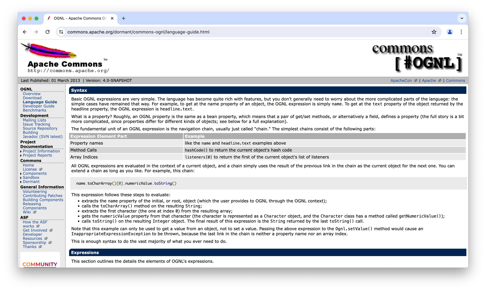

> Ognl官方文档：https://commons.apache.org/dormant/commons-ognl/language-guide.html


### 10.2.2 源码解析

在了解其API的使用之后，应该深入分析其实现原理，这是选取合适Hook类的关键，因此源码分析是十分必要的。
本节将对OGNL表达式语法解析、编译和执行过程做一个Debug（代码以图片的形式展现）。

### 10.2.2.1 表达式词法语法解析
下面的代码执行一个简单的表达式，调用Math类的静态方法random生成一个随机数并乘以100.0，然后获取表达式的值并输出。
> 图10-16 Debug的表达式代码

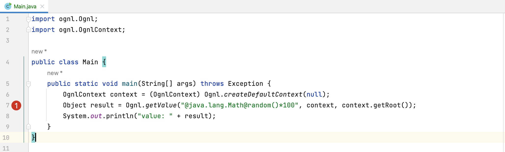

```java
// ognl@3.4.2
public class Main {
    public static void main(String[] args) throws Exception {
        OgnlContext context = (OgnlContext) Ognl.createDefaultContext(null);
        Object result = Ognl.getValue("@java.lang.Math@random()*100", context, context.getRoot());
        System.out.println("value: " + result);
    }
}
```
图10-16中的代码第 7行处实际调用Ognl类中的getValue方法（下图中代码460行处），调用Ognl类中的getValue的重载方法对表达式进行初步处理。
> 图10-17 Ognl.getValue对表达式进行初步处理

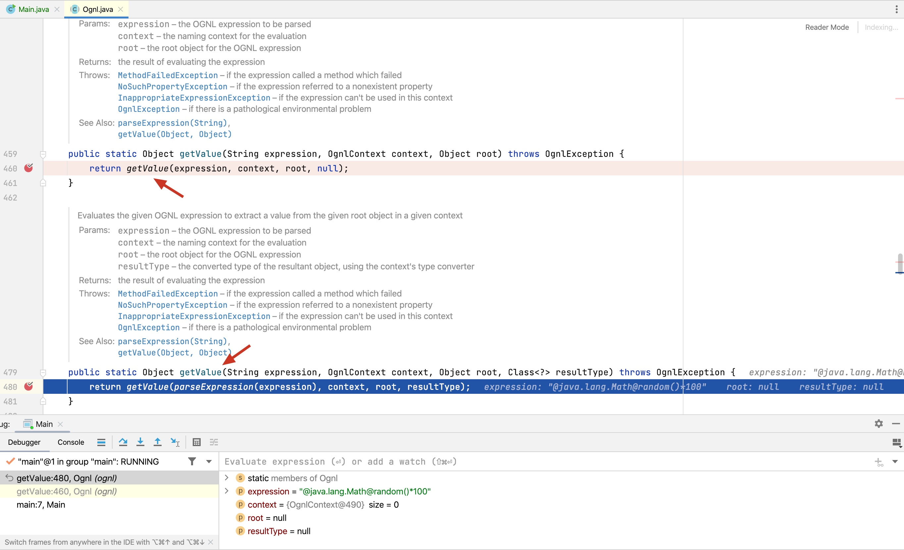

在图10-17中的代码480行处，实际调用了`parseExpression`对表达式的解析，并将解析的返回结果作为getValue方法的入参，
来看下parseExpression对表达式的解析。
> 图10-18 Ognl.parseExpression对表达式的处理

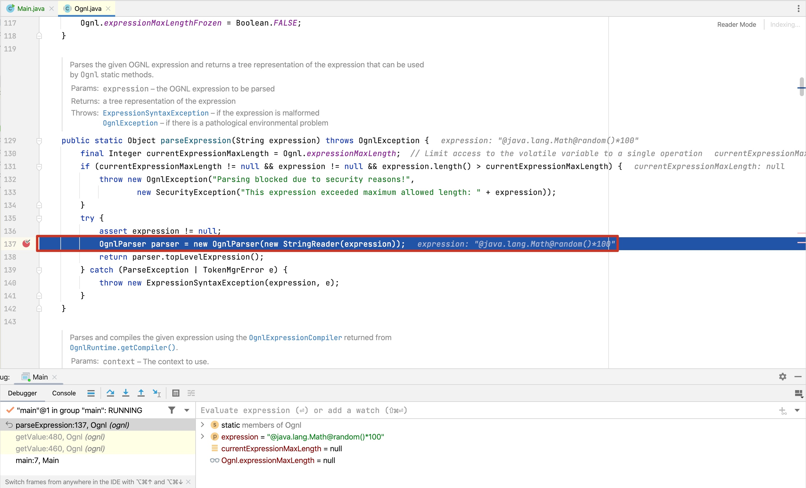

OgnlParser是一个JavaCC解析器类，它将OGNL表达式转换为抽象语法树（AST），然后可以被getValue和setValue方法获取和设置值。

代码137行处创建了一个OgnlParse对象来解析给定的表达式，并返回能被Ognl方法处理AST语法树，AST语法树的节点数据如下。

代码138行处parser.topLevelExpression方法返回AST语法树的顶层root节点。

> 图10-19 OgnlParser获取的AST语法树

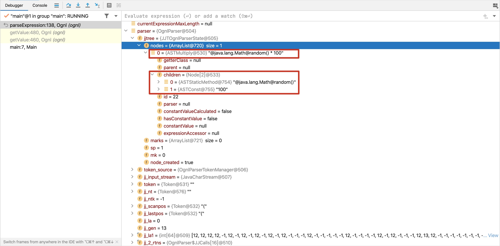

从图10-19的变量区域可以看出，AST语法树的root节点是一个ASTMultiply类型节点，
root节点下面有2个子节点分别ASTStaticMethod和ASTConst类型节点。

### 10.2.2.2 表达式节点值计算

在获取了表达式的AST语法树之后，开始计算表达式的节点的值。

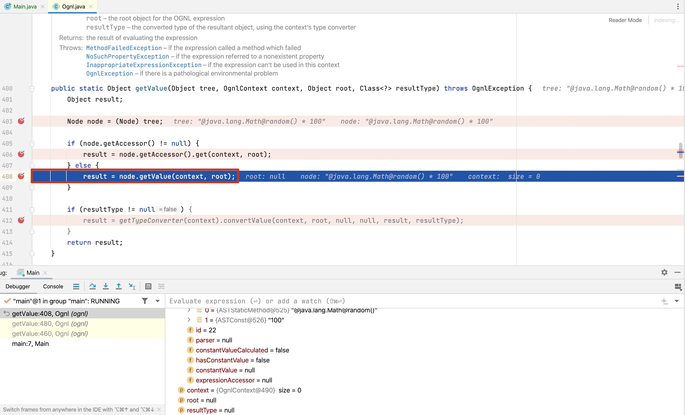

root节点的类型是ASTMultiply，来看下的值的计算方法：

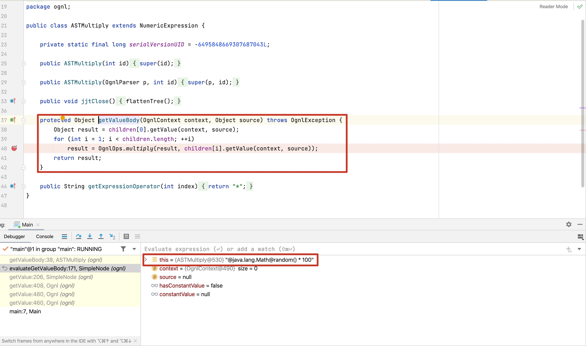

获取第一个节点的值，然后与下一个子节点的值相乘。

上面代码的第408行处，实际会调用子类的getValue方法计算具体的值。

获取节点的值先调用SimpleNode类的getValue方法。


实际调用evaluateGetValueBody，来看下这个方法。
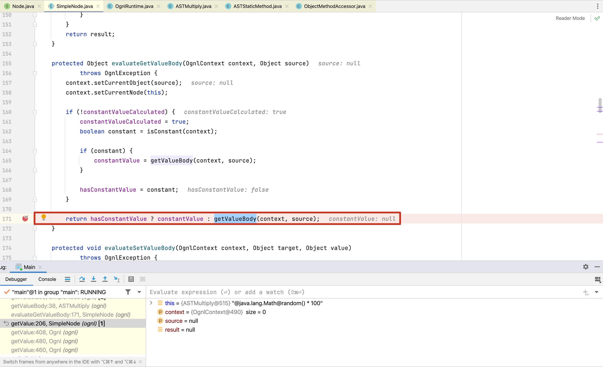

在代码第171行，evaluateGetValueBody在计算非常量情况的结果时会调用子类的getValueBody。

Ognl在处理节点时分为多种情况进行处理：ASTChain、ASTConst、ASTCtor、ASTInstanceof、ASTList、ASTMethod、ASTStaticField、ASTStaticMethod等。

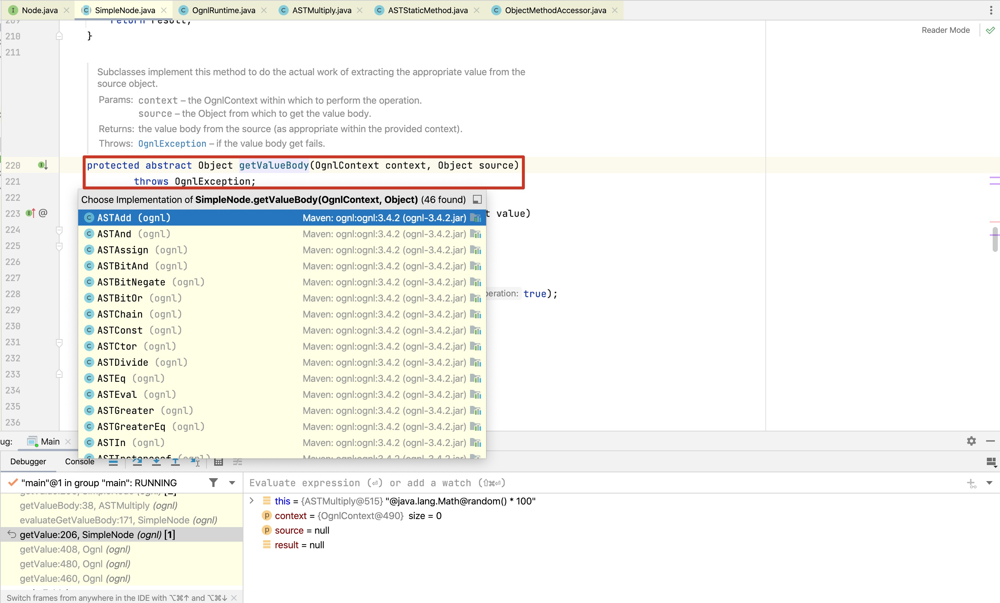

在本例子中，表达式的第一个子节点类型是ASTStaticMethod，来看下他的getValueBody方法的实现。
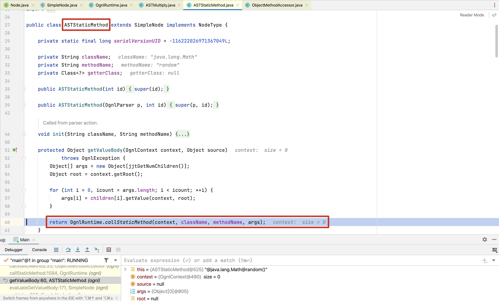

实际调用OgnlRuntime类的callStaticMethod方法。
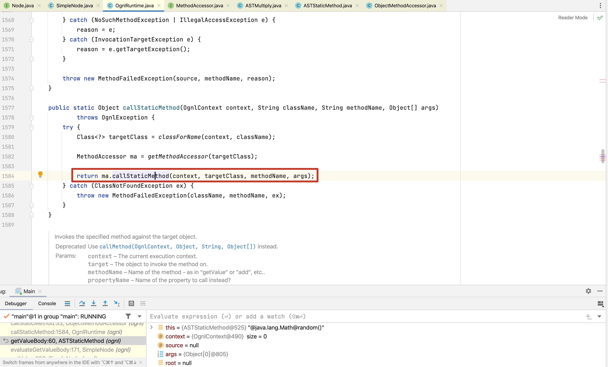

继续跟进这个方法的实现，调用了ObjectMethodAccessor的callMethod方法
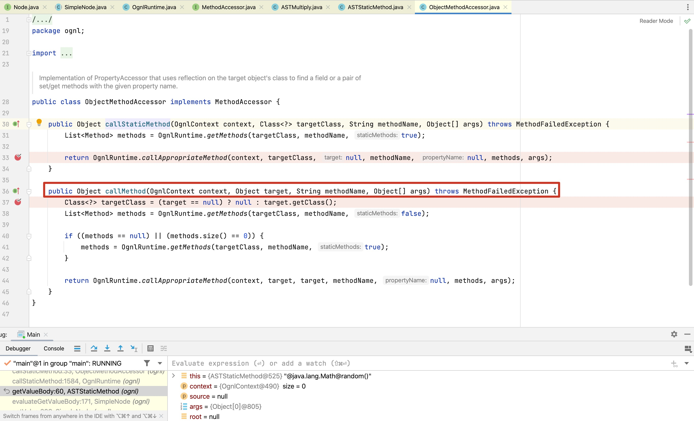

最终调用的方法是OgnlRuntime的静态方法invokeMethod。
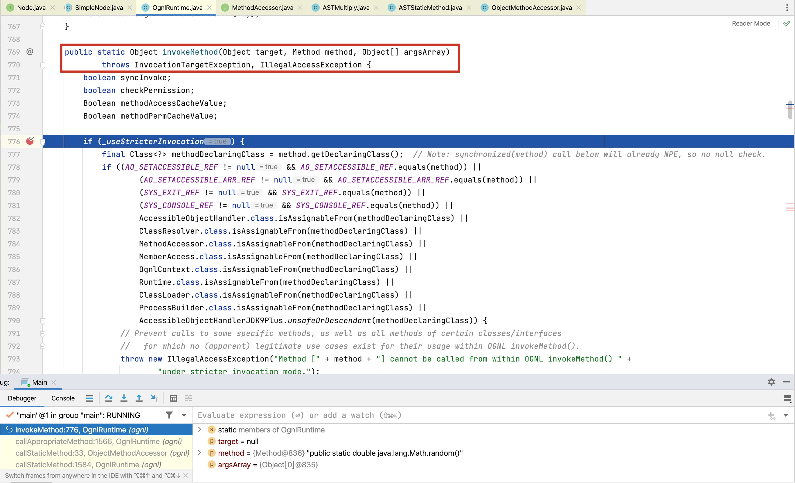

至此，表达式的子节点的值全部计算完成，root节点将全部子节点的值相乘得到表达式的值。