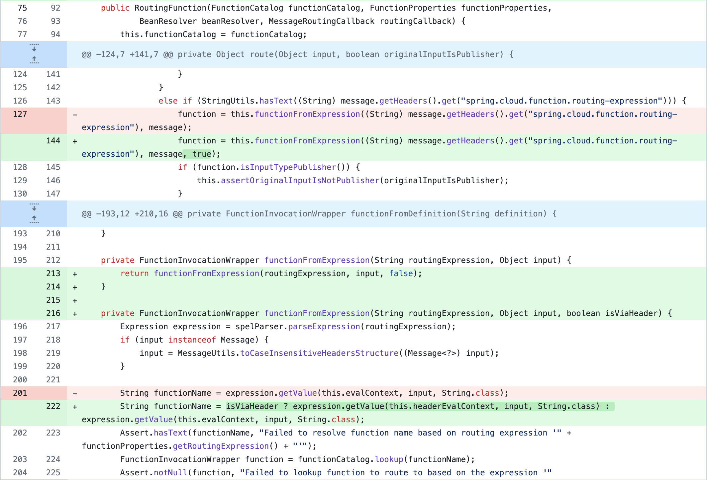
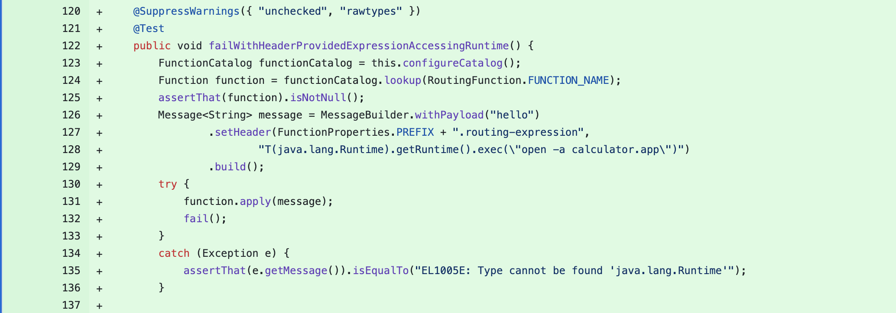
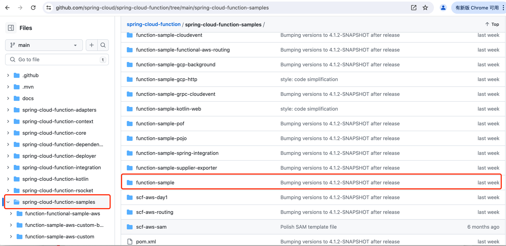
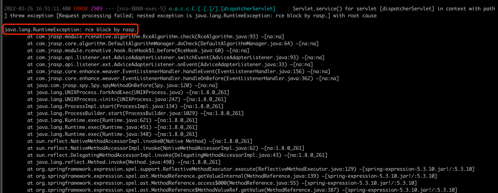

## 10.2 经典漏洞案例

### 10.2.1 Spring Cloud Function 表达式注入漏洞

+ 漏洞简介

SpringCloudFunction是一个SpringBoot开发的Servless中间件（FAAS），支持基于SpEL的函数式动态路由。在特定配置下，存在SpEL表达式执行导致的RCE。

+ 影响版本

`3 <= 版本 <= 3.2.2（commit dc5128b) 之前`

+ 漏洞原理

在main分支commit dc5128b（https://github.com/spring-cloud/spring-cloud-function/commit/dc5128b80c6c04232a081458f637c81a64fa9b52）中，
新增了SimpleEvaluationContext

> 图10-1 SpringCloudFunction漏洞修复代码Diff



同样的，官方测试用例已经清楚地写明了漏洞位置与Payload：
> 图10-2 漏洞位置与Payload



提取出测试类后在apply方法下断并跟入，省略一些中间流程，最终可以看到从HTTP header中spring.cloud.function.routing-expression 中取出SpEL表达式
并由StandardEvaluationContext解析。

+ 漏洞复现

使用官方提供的function-sample来复现漏洞（切换到tag v3.2.1）
> 图10-3 使用官方提供的function-sample来复现漏洞



编译完成之后，启动scfunc-0.0.1-SNAPSHOT.jar，并注入RASP，如下图10-4所示：
```java
java -jar scfunc-0.0.1-SNAPSHOT.jar
```
> 图10-4 启动漏洞服务并加载RASP


发起攻击请求，在请求的header中注入命令执行的表达式，如下：
```java
curl --location --request POST 'http://ip:8080/functionRouter' \
--header 'spring.cloud.function.routing-expression: T(java.lang.Runtime).getRuntime().exec("open /Applications/QQ.app")' \
--header 'Content-Type: text/plain' \
--data 'Hello'
```
RASP将攻击阻断，如下图10-5所示：
> 图10-5 RASP阻断SPEL表达式注入




### 10.2.2 Apache Unomi OGNL注入漏洞

+ 漏洞简介

Apache Unomi是一个Java开源客户数据平台，旨在管理客户和访问者的数据，并个性化客户体验。 
2020年11月17日，Apache Unomi被披露存在严重安全漏洞（CVE-2020-13942），其CVSS评分为10分。 由于Apache Unomi允许远程攻击者使用包含任意类的MVEL和OGNL表达式发送恶意请求，
最终可导致攻击者使用Unomi应用程序权限远程执行代码。CVE ID为CVE-2020-11975，目前虽然已经修复，但修复并不充分，可被轻易绕过。

+ 影响版本

Apache Unomi < 1.5.2


