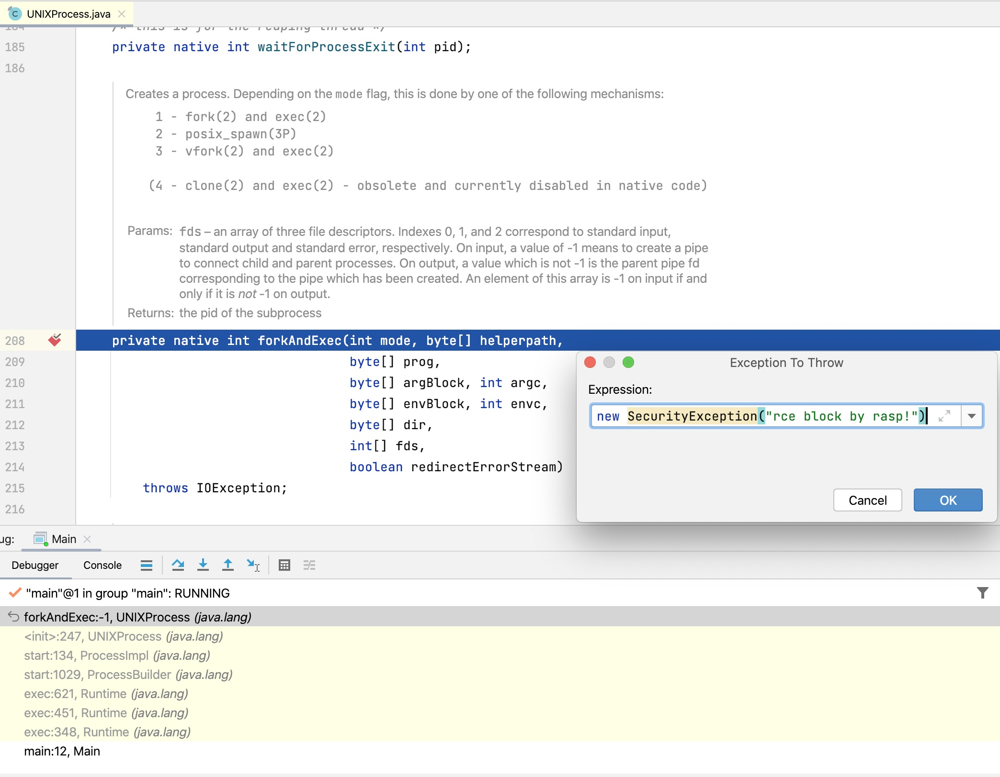
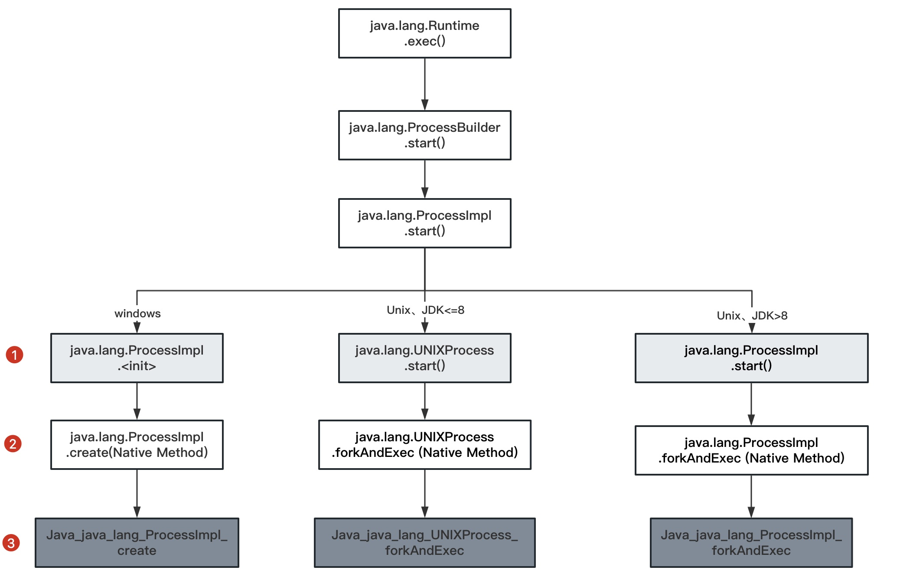

## 9.1 命令执行原理

### 9.1.1 命令执行API

java命令执行方式如下：

+ java.lang.Runtime.exec()
+ java.lang.ProcessBuilder.start()
+ java.lang.ProcessImpl.start()
+ JNI的方式调用动态链接库（该方式属于JNI注入，这里暂不做分析）

在Java中执行命令使用最多的API是`Runtime.getRuntime().exec()`，其用法如下：
```java
Runtime.getRuntime().exec("touch /tmp/1.txt");
```

实际上Runtime类的exec的重载方法有6个，如下所示：
```java
public Process exec(String command)
public Process exec(String command, String[] envp)
public Process exec(String command, String[] envp, File dir)
public Process exec(String cmdarray[])
public Process exec(String[] cmdarray, String[] envp)
public Process exec(String[] cmdarray, String[] envp, File dir)
```
前面5个方法最终都会调用最后一个方法，因此这里仅介绍其中的两个方法。
```java
public Process exec(String command, String[] envp, File dir)
    throws IOException {
    if (command.length() == 0)
    throw new IllegalArgumentException("Empty command");
    // 将字符串解析为token流
    StringTokenizer st = new StringTokenizer(command);
    String[] cmdarray = new String[st.countTokens()];
    for (int i = 0; st.hasMoreTokens(); i++)
    cmdarray[i] = st.nextToken();
    // 调用exec重载方法
    return exec(cmdarray, envp, dir);
}
```

+ command： 需要执行的命令的字符串，会解析为token流；

+ envp： 子进程的环境变量，是一个字符串数组，其中每个元素的环境变量设置格式为name=value，
如果子进程的环境变量与当前进程一致，则为null；

+ dir：子进程的工作目录，如果子进程的工作目录与当前进程一致，则该参数为null；

exec所有的方法都会调用下面的重载方法。
```java
public Process exec(String[] cmdarray, String[] envp, File dir)
    throws IOException {
    return new ProcessBuilder(cmdarray)
        .environment(envp)
        .directory(dir)
        .start();
}
```
exec方法执行命令实际通过创建ProcessBuilder对象，然后执行start方法。

### 9.1.2 底层调用链路

常用的命令执行API是java.lang.Runtime.exec()和java.lang.ProcessBuilder.start()，
除此之外，还有能力更为底层方法如java.lang.ProcessImpl.start()等。下面是Java命令执行的常用方式。
```java
import java.lang.reflect.Method;
import java.util.Map;

public class Main {
    public static void main(String[] args) throws Exception {

        // 定义命令方式
        String command = "touch /tmp/1.txt /tmp/2.txt /tmp/3-tools.txt";
        String[] commandarray = {"touch", "/tmp/1.txt", "/tmp/2.txt", "/tmp/3-tools.txt"};

        // 命令执行方式1
        Runtime.getRuntime().exec(command);

        // 命令执行方式2
        new ProcessBuilder(commandarray).start();

        // 命令执行方式3
        Class clazz = Class.forName("java.lang.ProcessImpl");
        Method method = clazz.getDeclaredMethod("start", new String[]{}.getClass(), Map.class, String.class, ProcessBuilder.Redirect[].class, boolean.class);
        method.setAccessible(true);
        method.invoke(null, commandarray, null, ".", null, true);
    }
}
```
追踪源码可以发现，所有的命令执行最终执行的方法是`java.lang.UNIXProcess.forkAndExec`，来看下它的代码：
>代码位置： jdk11/src/java.base/unix/classes/java/lang/ProcessImpl.java

```java
private native int forkAndExec(int mode, byte[] helperpath,
                               byte[] prog,
                               byte[] argBlock, int argc,
                               byte[] envBlock, int envc,
                               byte[] dir,
                               int[] fds,
                               boolean redirectErrorStream)
    throws IOException;
```
这是一个native方法，在IDEA中debug上面的命令执行代码并在forkAndExec方法里面抛出异常，操作如下图 9-1 所示。

> 图9-1 debug的命令执行代码



抛出异常的调用栈如下所示：
```java
Exception in thread "main" java.lang.SecurityException: rce block by rasp!
	at java.lang.UNIXProcess.forkAndExec(Native Method)
	at java.lang.UNIXProcess.<init>(UNIXProcess.java:247)
	at java.lang.ProcessImpl.start(ProcessImpl.java:134)
	at java.lang.ProcessBuilder.start(ProcessBuilder.java:1029)
	at java.lang.Runtime.exec(Runtime.java:621)
	at java.lang.Runtime.exec(Runtime.java:451)
	at java.lang.Runtime.exec(Runtime.java:348)
	at Main.main(Main.java:12)
```

上面的测试代码运行在Unix系统，命令执行的最终类为java.lang.UNIXProcess，如果在Windows系统上执行命令，调用栈稍有不同。
下图总结了不同操作系统的命令执行调用过程，如图9-2所示。

> 图9-2 Windows和Linux操作系统的命令执行方法调用过程




### 9.1.3 Hook点的选择

传统RASP一般会选择上图中第1个层次的类，即java.lang.ProcessImpl(JDK9以上)和java.lang.UNIXProcess(JDK8及以下)的`<init>`、`start`方法，
因为这些方法都是Java层面的，可以直接修改方法的字节码来增加检测逻辑。

而命令执行的最终方法是`forkAndExec`，因此仅Hook了start等方法是存在绕过的可能（可以了解命令执行相关的绕过case，这里不展开）。
因此在命令执行的Hook点选择上，在不考虑性能的情况下，理论上是越底层越好，而第三层次的方法是c/c++构建，在JavaAgent上无法实现Hook。只能退而求其次，选择第二层次的方法作为Hook点。

因此，RASP的命令执行的Hook点应该至少包含如下几个：
+ 在JDK的Unix版本上，如果JDK的版本在8及以下，Hook点是`java.lang.UNIXProcess.forkAndExec`; 
JDK版本高于8，Hook点是`java.lang.ProcessImpl.forkAndExec`；
+ 在JDK的Windows版本，Hook点是`java.lang.ProcessImpl.create`， windows系统上Hook点没有JDK差异；
