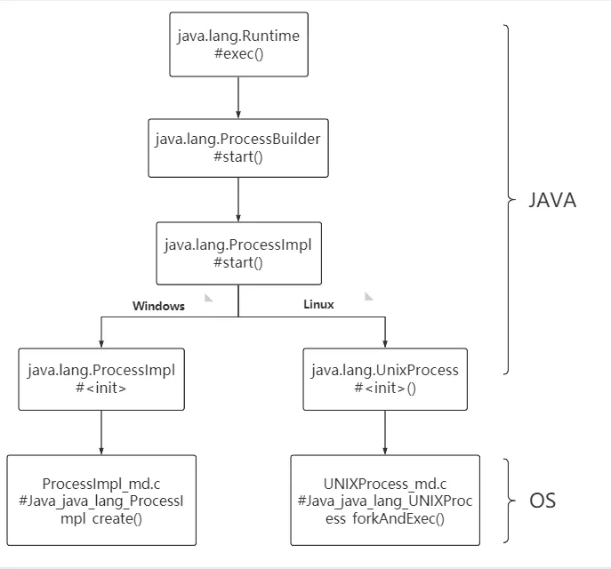

## 9.1 Java 命令执行

### 9.1.1 命令执行API

java命令执行方式如下：

+ java.lang.Runtime.exec()
+ java.lang.ProcessBuilder.start()
+ java.lang.ProcessImpl.start()
+ JNI的方式调用动态链接库（该方式属于JNI注入，这里暂不做分析）

在Java中执行命令用使用最多的API是`Runtime.exec`，用法如下：
```java
public class Main {
    public static void main(String[] args) throws Exception {
        Runtime.getRuntime().exec("touch /tmp/1.txt");
    }
}
```

实际上Runtime类的exec的重载方法有6个，如下所示：
```java
public Process exec(String command)
public Process exec(String command, String[] envp)
public Process exec(String command, String[] envp, File dir)
public Process exec(String cmdarray[])
public Process exec(String[] cmdarray, String[] envp)
public Process exec(String[] cmdarray, String[] envp, File dir)
```

重载方法最终会实际调用上面中的最后一个方法，因此这里仅介绍其中的两个方法。
```java
public Process exec(String command, String[] envp, File dir)
    throws IOException {
    if (command.length() == 0)
    throw new IllegalArgumentException("Empty command");
    // 将字符串解析为token流
    StringTokenizer st = new StringTokenizer(command);
    String[] cmdarray = new String[st.countTokens()];
    for (int i = 0; st.hasMoreTokens(); i++)
    cmdarray[i] = st.nextToken();
    return exec(cmdarray, envp, dir);
}
```
command一个字符串，会解析为token流；
envp是字符串数组，其中每个元素的环境变量设置格式为name=value，
如果子进程的环境变量与当前进程一致，则为null；
dir：子进程的工作目录，如果子进程的工作目录与当前进程一致，则为null；

所有命令执行的方法最终会调用下面的方法。
```java
public Process exec(String[] cmdarray, String[] envp, File dir)
    throws IOException {
    return new ProcessBuilder(cmdarray)
        .environment(envp)
        .directory(dir)
        .start();
}
```
命令执行调用 ProcessBuilder 完成命令执行。

### 9.1.2 底层调用链路

常用的命令执行API是java.lang.Runtime.exec()和java.lang.ProcessBuilder.start()，
除此之外，还有能力更为底层方法java.lang.ProcessImpl.start()等。下面是Java命令执行的常用方式。
```java
import java.lang.reflect.Method;
import java.util.Map;

public class Main {
    public static void main(String[] args) throws Exception {

        // 定义命令方式
        String command = "touch /tmp/1.txt /tmp/2.txt /tmp/3-tools.txt";
        String[] commandarray = {"touch", "/tmp/1.txt", "/tmp/2.txt", "/tmp/3-tools.txt"};

        // 命令执行方式1
        Runtime.getRuntime().exec(command);

        // 命令执行方式2
        new ProcessBuilder(commandarray).start();

        // 命令执行方式3
        Class clazz = Class.forName("java.lang.ProcessImpl");
        Method method = clazz.getDeclaredMethod("start", new String[]{}.getClass(), Map.class, String.class, ProcessBuilder.Redirect[].class, boolean.class);
        method.setAccessible(true);
        method.invoke(null, commandarray, null, ".", null, true);
    }
}
```
追踪源码可以发现，所有的命令执行最终执行的方法是`java.lang.UNIXProcess.forkAndExec`，来看下它的代码：
> jdk11/src/java.base/unix/classes/java/lang/ProcessImpl.java
```java
private native int forkAndExec(int mode, byte[] helperpath,
                               byte[] prog,
                               byte[] argBlock, int argc,
                               byte[] envBlock, int envc,
                               byte[] dir,
                               int[] fds,
                               boolean redirectErrorStream)
    throws IOException;
```
如果在forkAndExec方法里面层阻断命令执行的调用过程，会抛出如下栈。
```java
java.lang.UNIXProcess.forkAndExec(UNIXProcess.java)
java.lang.UNIXProcess.<init>(UNIXProcess.java:247)
java.lang.ProcessImpl.start(ProcessImpl.java:134)
java.lang.ProcessBuilder.start(ProcessBuilder.java:1029)
org.apache.jsp._004_002dcommand_002d2_jsp._jspService(_004_002dcommand_002d2_jsp.java:144)
org.apache.jasper.runtime.HttpJspBase.service(HttpJspBase.java:70)
javax.servlet.http.HttpServlet.service(HttpServlet.java:583)
org.apache.jasper.servlet.JspServletWrapper.service(JspServletWrapper.java:465)
org.apache.jasper.servlet.JspServlet.serviceJspFile(JspServlet.java:383)
org.apache.jasper.servlet.JspServlet.service(JspServlet.java:331)
javax.servlet.http.HttpServlet.service(HttpServlet.java:583)
org.apache.catalina.core.ApplicationFilterChain.internalDoFilter(ApplicationFilterChain.java:212)
org.apache.catalina.core.ApplicationFilterChain.doFilter(ApplicationFilterChain.java:156)
org.apache.tomcat.websocket.server.WsFilter.doFilter(WsFilter.java:51)        
```
上面的调用栈是Linux层面的，在Windows系统上稍有差别，下图总结了不同操作系统的命令执行调用过程，如图9-1所示。

> 图9-1 不同操作系统的命令执行调用过程




### 9.1.3 HOOK类选择
传统RASP一般会选择如下2个类，即java.lang.ProcessImpl(JDK9以上)、java.lang.UNIXProcess(JDK8以下)的start方法，因为这些都是Java层面的，可以直接修改方法增加检测逻辑。
因为命令执行最终方法是`forkAndExec`，因此存在绕过的可能。因此在命令执行的hook点上，应该包含如下几个：
+ 在Linux系统上，JDK8以下，这个方法是`java.lang.UNIXProcess.forkAndExec`类中; JDK9以上，这个方法是`java.lang.ProcessImpl.forkAndExec`
+ 在Windows系统上，native命令执行的方法是`java.lang.ProcessImpl.create`

