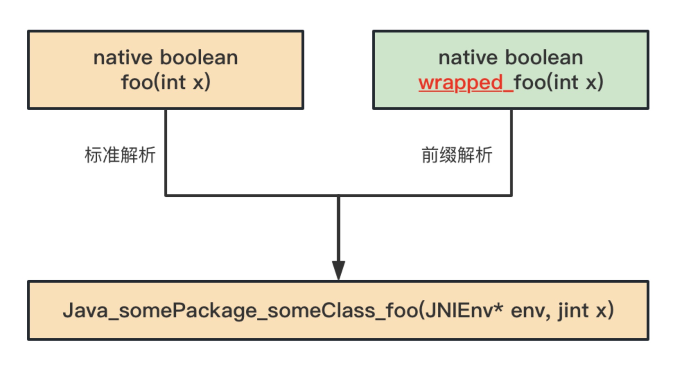

## 9.2 Java Native命令执行

在前面的章节中，读者了解到RASP实现的基本原理是修改目标方法的字节码，将检测逻辑插入到目标方法进入、返回和抛出异常等处。
而在Java方法中有一类比较特殊，它们`没有方法体`，如接口中的方法、抽象方法和native方法等，
其中native方法就是Java调用非Java代码的接口，一般为JVM核心关键的方法，如在上一节介绍的命令执行的native方法。
本节将介绍RASP修改native方法原理，并给出一个Demo。

### 9.2.1 基本原理

+ native方法与c++实现的解析规则

这里以命令执行的方法来说明，先来看下命令执行的native方法和它的本地实现。
> 源码位置：jdk11/src/java.base/unix/classes/java/lang/ProcessImpl.java
```java
private native int forkAndExec(int mode, byte[] helperpath,
                                   byte[] prog,
                                   byte[] argBlock, int argc,
                                   byte[] envBlock, int envc,
                                   byte[] dir,
                                   int[] fds,
                                   boolean redirectErrorStream)
        throws IOException;
```
对应的native方法实现(hotspot)如下：

> 源码位置：jdk11/src/java.base/unix/native/libjava/ProcessImpl_md.c
```c++
JNIEXPORT jint JNICALL
        Java_java_lang_ProcessImpl_forkAndExec(JNIEnv *env,
        jobject process,
        jint mode,
        jbyteArray helperpath,
        jbyteArray prog,
        jbyteArray argBlock, jint argc,
        jbyteArray envBlock, jint envc,
        jbyteArray dir,
        jintArray std_fds,
        jboolean redirectErrorStream){
    // 不是本文重点，代码省略...
}
```
可以看出，native方法的实现名称是由Java类的`包名称`和`方法名称`组成。这个规则这称之为`standard resolution`（标准解析）。

+ 设置native方法解析的Prefix

修改字节码主要依赖`java.lang.instrument.Instrumentation`API接口中的addTransformer和retransformClasses等方法，
如果深入Instrumentation API，我们还注意到存在如下方法：

> 源码位置：jdk11/src/java.instrument/share/classes/java/lang/instrument/Instrumentation.java

```java
void setNativeMethodPrefix(ClassFileTransformer transformer, String prefix);
```
从该方法的注释可以看出，当标准解析失败后，可以通过在Java名称增加前缀来重新查找对应的native方法实现。
该功能默认是关闭的，需要在JavaAgent包中的`MANIFEST.MF`配置文件中设置，即：
`Can-Set-Native-Method-Prefix: true`。 MANIFEST.MF的示例如下：
```java
Manifest-Version: 1.0
Premain-Class: com.jrasp.example.agent.Agent
Agent-Class: com.jrasp.example.agent.Agent
Can-Redefine-Classes: true
Can-Retransform-Classes: true 
Can-Set-Native-Method-Prefix: true

```
上面的MANIFEST.MF文件不仅配置了JavaAgent入口类，并且开启了`Can-Redefine-Classes`、`Can-Retransform-Classes`和`Set-Native-Method-Prefix`等三个开关。
可以使用Instrumentation API中的方法`isNativeMethodPrefixSupported`来检测JavaAgent是否开启了该功能。

+ native方法解析举例说明

假设我们有这样一个native方法，标准解析下对应的native方法实现。
```java
native boolean foo(int x);  ====> Java_somePackage_someClass_foo(JNIEnv* env, jint x);
```
给JVM增加一个ClassTransformer并设置Set-Native-Method-Prefix的值为`wrapped_`，当标准解析失败后，方法的解析规则如下：
```java
native boolean wrapped_foo(int x);  ====> Java_somePackage_someClass_foo(JNIEnv* env, jint x);
```

> 图9-3 native方法的解析规则



方法链接有两种方式发生，使用JNI函数RegisterNatives进行显式解析和正常的自动解析。
对于RegisterNatives，JVM将尝试这种关联：
```java
method(foo) -> nativeImplementation(foo)
```
当这失败时，将使用指定的前缀将方法名前置，从而得到正确的解析：
```java
method(wrapped_foo) -> nativeImplementation(foo)
```

对于自动解析，JVM将尝试：
```java
method(wrapped_foo) -> nativeImplementation(wrapped_foo)
```
失败时，将从实现名称中删除指定的前缀并重试解析，从而得到正确的解析：
```java
method(wrapped_foo) -> nativeImplementation(foo)
```
如果找到上面的其中一个对应关系，则执行。否则，因为没有任何一个合适的解析方式，于是宣告这个过程失败。


+ 多个transformer场景

虚拟机是按transformer被加入到的JVM顺序去解析的（即addTransformer）。 假设有三个transformer要被加入进来，他们的次序和相对应的prefix分别为：transformer1和"prefix1_"，transformer2 和"prefix2_"，transformer3和"prefix3_"。
虚拟机做的解析规则为
```java
native boolean prefix3_prefix2_prefix1_foo(int x);  ====> Java_somePackage_someClass_foo(JNIEnv* env, jint x);
```

###  9.2.2 使用ASM修改Native方法

由于native不能被直接插入指令（它们没有字节码），必须使用可以插入指令的非native进行包装。
例如，我们有下面的一个 native 方法:
```java
native boolean foo(int x);
```
我们能将字节码文件转换为下面的形式：
```java
boolean foo(int x) {
   //... record entry to foo ...
   return wrapped_foo(x);
}

native boolean wrapped_foo(int x);
```
并且native方法的解析规则设置为：
```java
method(wrapped_foo) -> nativeImplementation(foo)
```
因此，native方法Hook策略可以细分为如下三步：

+ 原始的native变为非native方法，并增加方法体；
+ 在方法体中调用wrapper后的native方法；
+ 增加wrapper的native方法；

下面的代码使用ASM修改命令执行方法的Demo，关键代码如下：

Agent启动类代码如下所示：
```java
public class Agent {

    public static void premain(String args, Instrumentation inst) {
        main(args, inst);
    }

    public static void agentmain(String args, Instrumentation inst) {
        main(args, inst);
    }

    public static void main(String args, Instrumentation inst) {
        System.out.println(String.format("%s  INFO [rasp] %s ",
                new SimpleDateFormat("yyyy-MM-dd HH:mm:ss.sss").format(new Date()), "enter agent"));
        // 注册ClassFileTransformer对象
        RaspClassFileTransformer raspClassFileTransformer = new RaspClassFileTransformer(inst);
        inst.addTransformer(raspClassFileTransformer);
    }
}
```
加载Agent之后，向JVM的Instrumentation注册一个类转换ClassFileTransformer对象。

来看下实现的ClassFileTransformer代码，如下所示：
```java
public class RaspClassFileTransformer implements ClassFileTransformer {

    private final Instrumentation inst;

    public RaspClassFileTransformer(Instrumentation inst) {
        this.inst = inst;
    }

    @Override
    public byte[] transform(ClassLoader loader, String className,
                            Class<?> classBeingRedefined,
                            ProtectionDomain protectionDomain,
                            byte[] classfileBuffer) throws IllegalClassFormatException {
        // 匹配指定的类
        if ("java/lang/UNIXProcess".equals(className) || "java/lang/ProcessImpl".equals(className)) {
            final ClassReader cr = new ClassReader(classfileBuffer);
            final ClassWriter cw = new ClassWriter(cr, COMPUTE_FRAMES | COMPUTE_MAXS);
            cr.accept(new RaspClassVisitor(ASM9, cw, cr.getClassName(), inst, this), EXPAND_FRAMES);
            return dumpClassIfNecessary(cr.getClassName(), cw.toByteArray());
        }

        return null;
    }

    // dump修改后的字节码到文件中
    private static byte[] dumpClassIfNecessary(String className, byte[] data) {
        final File dumpClassFile = new File("./rasp-class-dump/" + className + ".class");
        final File classPath = new File(dumpClassFile.getParent());
        if (!classPath.mkdirs() && !classPath.exists()) {
            return data;
        }
        try {
            FileUtils.writeByteArrayToFile(dumpClassFile, data);
        } catch (IOException e) {
            e.printStackTrace();
        }
        return data;
    }

}
```
在transform方法中如果匹配到命令执行的相关类，进入到方法的修改流程中，修改目标方法字节码的代码在RaspClassVisitor中，来看下它的实现。
```java
public class RaspClassVisitor extends ClassVisitor {
    private RaspMethod method = null;
    private final String targetClassInternalName;
    private final Instrumentation inst;
    private RaspClassFileTransformer raspClassFileTransformer;
    private final static String NATIVE_PREFIX = "$$JRASP$$_"; // native方法前缀

    public RaspClassVisitor(final int api, final ClassVisitor cv, String targetClassInternalName, Instrumentation inst,
                            RaspClassFileTransformer raspClassFileTransformer) {
        super(api, cv);
        this.targetClassInternalName = targetClassInternalName;
        this.inst = inst;
        this.raspClassFileTransformer = raspClassFileTransformer;
    }

    @Override
    public MethodVisitor visitMethod(final int access, final String name, final String desc, final String signature, final String[] exceptions) {
        if ("forkAndExec".equals(name)) { // 匹配指定方法
            // 设置native方法解析前缀
            if (inst.isNativeMethodPrefixSupported()) {
                inst.setNativeMethodPrefix(raspClassFileTransformer, NATIVE_PREFIX);
            } else {
                throw new UnsupportedOperationException("Native Method Prefix Unspported");
            }
            // 修改方法访问修饰符
            // 即 private native int forkAndExec 变成 private int forkAndExec
            int newAccess = access & ~Opcodes.ACC_NATIVE;
            method = new RaspMethod(access, NATIVE_PREFIX + name, desc);
            final MethodVisitor mv = super.visitMethod(newAccess, name, desc, signature, exceptions);
            return new AdviceAdapter(api, new JSRInlinerAdapter(mv, newAccess, name, desc, signature, exceptions), newAccess, name, desc) {
                @Override
                public void visitEnd() {
                    // 在的forkAndExec方法中调用native方法$$JRASP$$_forkAndExec
                    loadThis();
                    loadArgs();
                    mv.visitMethodInsn(Opcodes.INVOKESPECIAL, targetClassInternalName, method.getName(), method.getDescriptor(), false);
                    returnValue();
                    super.visitEnd();
                }
            };
        }
        return super.visitMethod(access, name, desc, signature, exceptions);
    }

    @Override
    public void visitEnd() {
        if (method != null) {
            // 新增一个包含前缀的native方法，即$$JRASP$$_forkAndExec
            int newAccess = (Opcodes.ACC_PRIVATE | Opcodes.ACC_NATIVE | Opcodes.ACC_FINAL);
            MethodVisitor mv = cv.visitMethod(newAccess, method.getName(), method.getDescriptor(), null, null);
            mv.visitEnd();
        }
        super.visitEnd();
    }
}
```

在visitMethod方法中，如果匹配到目标方法，首先设置native方法解析的前缀，然后修改方法的访问修饰符，
即将native方法的native关键子去掉，并在方法中调用增加了前缀的native方法。
在visitEnd方法中，新增了一个包含前缀的native方法。


再来看下agent工程的pom.xml的配置，与agent有关的关键配置如下：
```xml
<plugin>
    <groupId>org.apache.maven.plugins</groupId>
    <artifactId>maven-jar-plugin</artifactId>
    <version>3.2.2</version>
    <configuration>
        <archive>
            <manifest>
                <addClasspath>true</addClasspath>
            </manifest>
            <manifestEntries>
                <Premain-Class>com.jrasp.example.agent.Agent</Premain-Class>
                <Agent-Class>com.jrasp.example.agent.Agent</Agent-Class>
                <Can-Redefine-Classes>true</Can-Redefine-Classes>
                <Can-Retransform-Classes>true</Can-Retransform-Classes>
                <!--设置native方法的解析的前缀-->
                <Can-Set-Native-Method-Prefix>true</Can-Set-Native-Method-Prefix>
            </manifestEntries>
        </archive>
    </configuration>
</plugin>                                                                                                                                                      
```

### 9.2.3 修改后的native方法

编译之后以premain方式启动：
```java
java -javaagent:rce-agent-1.0-SNAPSHOT.jar -jar jetty-demo-0.0.1-SNAPSHOT.jar
```
因为命令执行的类在应用启动之后不会主动加载，因此需要触发命令执行类的加载，就可以将命令执行类的字节码修改。
rce-agent在修改字节码后会将字节码文件dump在应用目录下的rasp-class-dump文件中。
来看下`java.lang.UNIXProcess`的 `forkAndExec`修改前后的字节码。
原始字节码：
```java
private final native int forkAndExec(int var1, byte[] var2, byte[] var3, byte[] var4, int var5, byte[] var6, int var7, byte[] var8, int[] var9, boolean var10);
```

修改后的字节码：
```java
// 修改方法访问符，并在方法中调用native方法
private int forkAndExec(int var1, byte[] var2, byte[] var3, byte[] var4, int var5, byte[] var6, int var7, byte[] var8, int[] var9, boolean var10) throws IOException {
    // 一般在这里增加检测逻辑
    return this.$$JRASP$$_forkAndExec(var1, var2, var3, var4, var5, var6, var7, var8, var9, var10);
}

// 新增包含前缀的native方法
private final native int $$JRASP$$_forkAndExec(int var1, byte[] var2, byte[] var3, byte[] var4, int var5, byte[] var6, int var7, byte[] var8, int[] var9, boolean var10);
```
修改后的`forkAndExec`有方法体了，就可以在执行该方法时增加RASP检测逻辑了。


