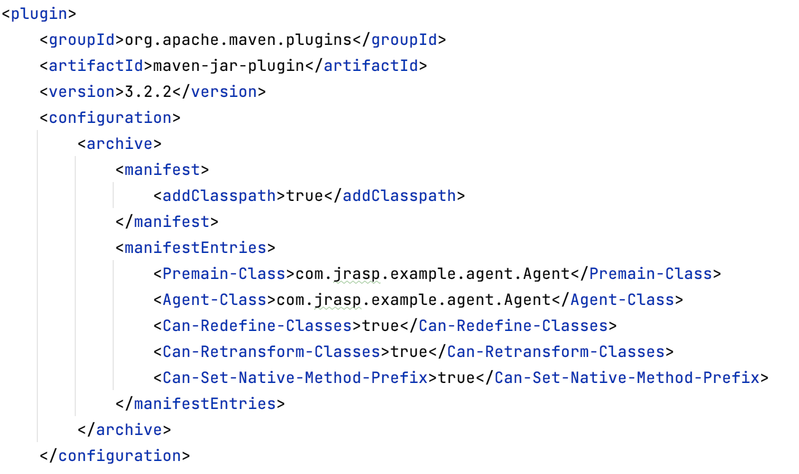

## 9.2 Java Native命令执行

在前面的一节我们对命令执行的hook类做了一个简单的介绍，本节将详细的介绍命令执行的native方法。

在前面一章中，我们了解到RASP实现的基本原理是修改目标方法体，将检测逻辑插入到目标方法中。
而在Java方法中有一类是`没有方法体`的，如接口中的方法、抽象方法和native方法，
其中native方法是Java层面向系统层面调用的入口，一般都是JVM核心关键的方法，如GC、IO和命令执行等。
本节将详细介绍JRASP修改native方法原理，并给出一个demo。

### 9.2.1 基本原理

+ 开启native方法Hook的开关

修改字节码主要依赖`java.lang.instrument.Instrumentation`API接口中的addTransformer和retransformClasses等方法，
如果深入Instrumentation API，我们还注意到存在如下方法：

> 源码位置：jdk11/src/java.instrument/share/classes/java/lang/instrument/Instrumentation.java

```java
void setNativeMethodPrefix(ClassFileTransformer transformer, String prefix);
```
这个方法的作用是给类转换器Transformer增加一个前缀，使得Java方法能够找到对应的native方法，从而支持native方法的hook。
native函数的prefix功能是默认关闭，需要在JavaAgent包之中的`MANIFEST.MF`文件中设置开启，如下所示。
`Can-Set-Native-Method-Prefix: true`
运行时使用Instrumentation API中的另一个方法`isNativeMethodPrefixSupported`来检测JavaAgent是否开启了改功能。

示例如下：
```java
Manifest-Version: 1.0
Premain-Class: com.jrasp.example.agent.Agent
Agent-Class: com.jrasp.example.agent.Agent
Can-Redefine-Classes: true
Can-Retransform-Classes: true 
Can-Set-Native-Method-Prefix: true

```
上面的MANIFEST.MF文件不仅配置了JavaAgent入口类，并且开启了Redefine、Retransform和Set-Native-Method-Prefix开关。

+ Java方法与native方法的链接关系

这里以命令执行的方法来说明，先来看下命令执行的native方法和他的实现。
> 源码位置：java.lang.UNIXProcess#forkAndExec
```java
private native int forkAndExec(int mode, byte[] helperpath,
                                   byte[] prog,
                                   byte[] argBlock, int argc,
                                   byte[] envBlock, int envc,
                                   byte[] dir,
                                   int[] fds,
                                   boolean redirectErrorStream)
        throws IOException;
```
对应的native方法(hotspot)如下：

> jdk/src/solaris/native/java/lang/UNIXProcess_md.c
```java
JNIEXPORT jint JNICALL
Java_java_lang_UNIXProcess_forkAndExec(JNIEnv *env,
                                       jobject process,
                                       jint mode,
                                       jbyteArray helperpath,
                                       jbyteArray prog,
                                       jbyteArray argBlock, jint argc,
                                       jbyteArray envBlock, jint envc,
                                       jbyteArray dir,
                                       jintArray std_fds,
                                       jboolean redirectErrorStream){
    //...（不是本文重点，省略）
}
```
可以看出，native方法的名称是由Java类的`包名称`和`方法名称`组成。这个规则这称之为`standard resolution`（标准解析）。

如果给JVM增加一个ClassTransformer并开启Native prefix选项，在标准解析失败后，JVM将使用查找是否包含指定前缀的native方法。

+ 假设我们有这样一个native方法，标准解析下对应的native方法实现
```java
native boolean foo(int x);  ====> Java_somePackage_someClass_foo(JNIEnv* env, jint x);
```

+ 给JVM增加一个ClassTransformer并设置native prefix 为`wrapped_`，方法的解析规则将变成,如下图9-2所示。
```java
native boolean wrapped_foo(int x);  ====> Java_somePackage_someClass_foo(JNIEnv* env, jint x);
```
(请注意 prefix 在native函数名中出现的位置！)

> 图9-2 native方法的解析规则


一旦可以找到对应的native实现，那么调用这个函数，整个解析过程就结束了；

如果没有找到，那么虚拟机将会做依次进行下面的解析工作：

1）method(foo) -> nativeImplementation(foo)

增加method的prefix，继续：

2）method(wrapped_foo) -> nativeImplementation(foo)

增加nativeImplementation的prefix，继续：

3）method(wrapped_foo) -> nativeImplementation(wrapped_foo)

去掉nativeImplementation的prefix，继续：

4）method(wrapped_foo) -> nativeImplementation(foo)

如果找到上面的其中一个对应关系，则执行。否则，因为没有任何一个合适的解析方式，于是宣告这个过程失败。

+ 有多个 transformer场景

虚拟机是按transformer被加入到的JVM顺序去解析的（即addTransformer）。

假设有三个transformer要被加入进来，他们的次序和相对应的prefix分别为：transformer1和"prefix1_"，transformer2 和"prefix2_"，transformer3和"prefix3_"。
虚拟机做的解析规则为
```java
native boolean prefix3_prefix2_prefix1_foo(int x);  ====> Java_somePackage_someClass_foo(JNIEnv* env, jint x);
```

###  9.2.2 使用ASM修改Native方法

由于native不能被直接插入指令（它们没有字节码）， 必须使用可以插入指令的非native进行包装。
例如，我们有下面的一个 native 方法:
```java
native boolean foo(int x);
```
我们能将字节码文件转换为下面的形式：
```java
boolean foo(int x) {
   //... record entry to foo ...
   return wrapped_foo(x);
}

native boolean wrapped_foo(int x);
```
并且设置方法的解析规则为：
```java
method(wrapped_foo) -> nativeImplementation(foo)
```

因此，native方法插桩策略可以细分为如下三步：

+ 原始的native变为非native方法，并增加AOP式方法体；
+ 在AOP中增加调用wrapper后的native方法；
+ 增加wrapper的native方；

下面的代码使用ASM修改命令执行hook的demo，关键代码如下：

Agent启动类代码：
```java
public class Agent {

    public static void premain(String args, Instrumentation inst) {
        main(args, inst);
    }

    public static void agentmain(String args, Instrumentation inst) {
        main(args, inst);
    }

    public static void main(String args, Instrumentation inst) {
        System.out.println(String.format("%s  INFO [rasp] %s ",
                new SimpleDateFormat("yyyy-MM-dd HH:mm:ss.sss").format(new Date()), "enter agent"));
        RaspClassFileTransformer raspClassFileTransformer = new RaspClassFileTransformer(inst);
        inst.addTransformer(raspClassFileTransformer);
    }
}

```
字节码修改的类：
```java
public class RaspClassVisitor extends ClassVisitor {

    // native 方法前缀
    private final static String NATIVE_PREFIX = "$$JRASP$$_";

    private RaspMethod method = null;

    private final String targetClassInternalName;

    private final Instrumentation inst;

    private RaspClassFileTransformer raspClassFileTransformer;

    public RaspClassVisitor(final int api, final ClassVisitor cv,
                            String targetClassInternalName, Instrumentation inst,
                            RaspClassFileTransformer raspClassFileTransformer) {
        super(api, cv);
        this.targetClassInternalName = targetClassInternalName;
        this.inst = inst;
        this.raspClassFileTransformer = raspClassFileTransformer;
    }
    
    @Override
    public MethodVisitor visitMethod(final int access, final String name, final String desc, final String signature, final String[] exceptions) {
        // 匹配forkAndExec方法
        if ("forkAndExec".equals(name)) {
            if (inst.isNativeMethodPrefixSupported()) {
                inst.setNativeMethodPrefix(raspClassFileTransformer, NATIVE_PREFIX);
            } else {
                throw new UnsupportedOperationException("Native Method Prefix Unspported");
            }
            // 修改方法名称和访问修饰符号
            int newAccess = access & ~Opcodes.ACC_NATIVE;
            method = new RaspMethod(access, NATIVE_PREFIX + name, desc);
            final MethodVisitor mv = super.visitMethod(newAccess, name, desc, signature, exceptions);
            return new AdviceAdapter(api, new JSRInlinerAdapter(mv, newAccess, name, desc, signature, exceptions), newAccess, name, desc) {
                @Override
                public void visitEnd() {
                    // 调用包装过的native方法
                    loadThis();
                    loadArgs();
                    mv.visitMethodInsn(Opcodes.INVOKESPECIAL, targetClassInternalName, method.getName(), method.getDescriptor(), false);
                    returnValue();
                    super.visitEnd();
                }
            };
        }
        return super.visitMethod(access, name, desc, signature, exceptions);
    }

    @Override
    public void visitEnd() {
        if (method != null) {
            // 新增一个包装过的native方法即：wrapped_foo()
            int newAccess = (Opcodes.ACC_PRIVATE | Opcodes.ACC_NATIVE | Opcodes.ACC_FINAL);
            MethodVisitor mv = cv.visitMethod(newAccess, method.getName(), method.getDescriptor(), null, null);
            mv.visitEnd();
        }
        super.visitEnd();
    }

}
```
ClassFileTransformer的代码：
```java
public class RaspClassFileTransformer implements ClassFileTransformer {

    private final Instrumentation inst;

    public RaspClassFileTransformer(Instrumentation inst) {
        this.inst = inst;
    }

    @Override
    public byte[] transform(ClassLoader loader, String className,
                            Class<?> classBeingRedefined,
                            ProtectionDomain protectionDomain,
                            byte[] classfileBuffer) throws IllegalClassFormatException {
        try {
            // 匹配命令执行方法所在的类
            if ("java/lang/UNIXProcess".equals(className) || "java.lang.ProcessImpl".equals(className)) {
                final ClassReader cr = new ClassReader(classfileBuffer);
                final ClassWriter cw = new ClassWriter(cr, COMPUTE_FRAMES | COMPUTE_MAXS);
                cr.accept(new RaspClassVisitor(ASM9, cw, cr.getClassName(), inst, this), EXPAND_FRAMES);
                return dumpClassIfNecessary(cr.getClassName(), cw.toByteArray());
            }
        } catch (Exception e) {
            e.printStackTrace();
        }

        return null;
    }

    // dump 字节码
    private static byte[] dumpClassIfNecessary(String className, byte[] data) {
        final File dumpClassFile = new File("./rasp-class-dump/" + className + ".class");
        final File classPath = new File(dumpClassFile.getParent());
        if (!classPath.mkdirs()
                && !classPath.exists()) {
            return data;
        }
        try {
            FileUtils.writeByteArrayToFile(dumpClassFile, data);
        } catch (IOException e) {
            e.printStackTrace();
        }
        return data;
    }

}
```

POM.xml关键配置如下图9-3所示：

> 图9-3 pom.xml关键配置




### 9.2.3 修改后的native方法

完整的代码可以从 https://github.com/xl1605368195/rce-agent.git 下载，编译之后以premain方式启动：
```java
java -javaagent:rce-agent-1.0-SNAPSHOT.jar -jar jetty-demo-0.0.1-SNAPSHOT.jar
```
因为命令执行的类在应用启动之后不会主动加载，因此需要发送一个能触发命令执行的请求，就可以将字节码修改。
rce-agent在修改字节码后会讲字节码文件dump在应用目录下的rasp-class-dump文件中。
来看下`java.lang.UNIXProcess`的 `forkAndExec`修改前后的字节码。
原始字节码：
```java
private final native int forkAndExec(int var1, byte[] var2, byte[] var3, byte[] var4, int var5, byte[] var6, int var7, byte[] var8, int[] var9, boolean var10);
```

修改后的字节码：
```java
// 修改方法修饰，并增加方法body
private int forkAndExec(int var1, byte[] var2, byte[] var3, byte[] var4, int var5, byte[] var6, int var7, byte[] var8, int[] var9, boolean var10) throws IOException {
    // 一般在这里增加检测逻辑
    return this.$$JRASP$$_forkAndExec(var1, var2, var3, var4, var5, var6, var7, var8, var9, var10);
}

// 新增的方法
private final native int $$JRASP$$_forkAndExec(int var1, byte[] var2, byte[] var3, byte[] var4, int var5, byte[] var6, int var7, byte[] var8, int[] var9, boolean var10);
```
修改后的`forkAndExec`有方法体了，就可以在执行该方法时增加RASP检测逻辑了。


