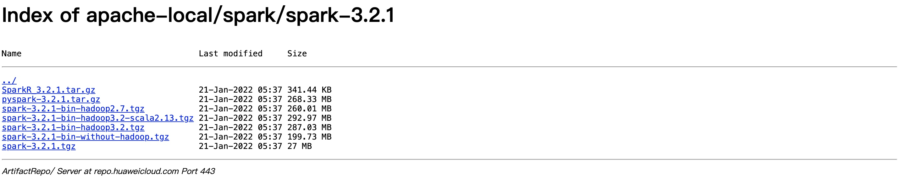
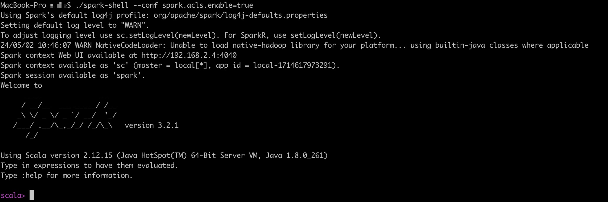
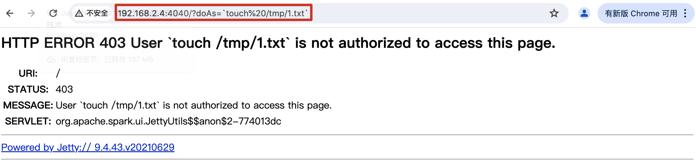
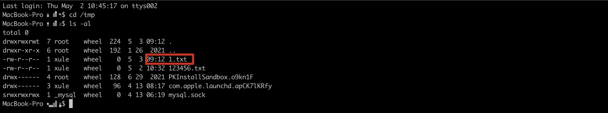
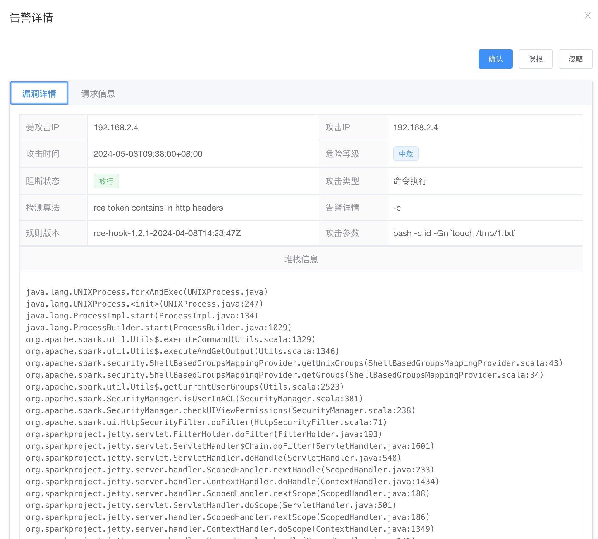
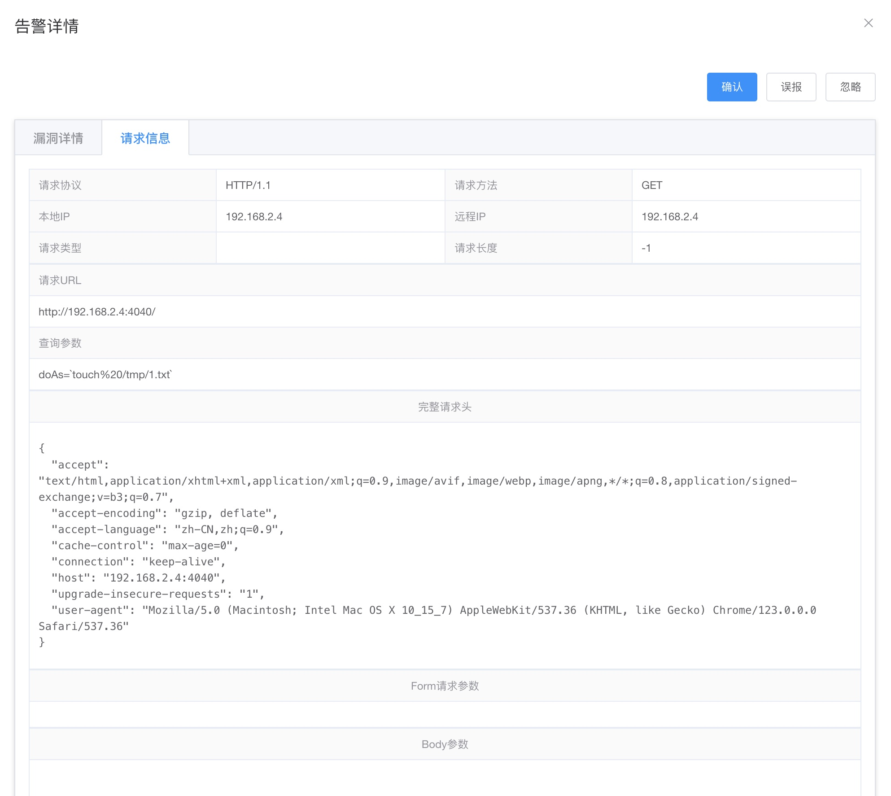

## 9.3 命令执行漏洞举例


## 9.3.1 Apache Spark命令注入漏洞（CVE-2022-33891）
+ 漏洞简介

Apache发布安全公告，修复了一个Apache Spark中存在的命令注入漏洞。 漏洞编号：CVE-2022-33891，漏洞威胁等级：高危。Apache Spark UI提供了通过配置选项Spark.acl.enable启用acl的可能性。 使用身份验证过滤器，这将检查用户是否具有查看或修改应用程序的访问权限。 如果启用了acl，HttpSecurityFilter中的代码路径可以允许某人通过提供任意用户名来执行模拟。 恶意用户可能能够访问权限检查功能，该功能最终将根据他们的输入构建一个 Unix shell 命令并执行它。 这将导致任意 shell 命令执行。

+ 影响版本

Apache Spark <= v3.0.3

3.1.1 <= Apache Spark <= 3.1.2

3.2.0<= Apache Spark <= 3.2.1

+ 环境搭建

下载spark-3.2.1-bin-hadoop2.7.tgz（https://repo.huaweicloud.com/apache/spark/spark-3.2.1/spark-3.2.1-bin-hadoop2.7.tgz）

> 图9-4 spark-3.2.1-bin-hadoop2.7.tgz下载地址



漏洞触发的关键在于是否启用ACL，使用身份验证过滤器。 启动spark脚本如下：
```java
./spark-shell --conf spark.acls.enable=true
```


从启动的日志可以看出，spark web服务端访问的地址为：http://192.168.2.4:4040

在启动地址后面拼接?doAs=`command`即可，这里执行`touch%20/tmp/1.txt`，即在/tmp目录下创建文件1.txt文件。

+ 攻击请求






RASP拦截到的攻击日志如下：


http请求日志



## 9.3.2 Spring远程命令执行漏洞（CVE-2022-22965）

+ 漏洞简介

Spring是目前全球最受欢迎的Java轻量级开源框架。网上爆出Spring核心框架存在RCE漏洞（编号CVE-2022-22965）。
在野曝光一段时间后，与近几年流行的高危漏洞命名方式类似（比如ProxyShell、log4jShell等），
这个漏洞被称为Spring4Shell。3月31日官方终于发布了漏洞信息，并在新版本v5.3.18和v5.2.20中修复了漏洞。
分析后发现漏洞结合了JDK9及以上版本一个新的属性，成功绕过历史漏洞CVE-2010-1622修复补丁，
同时结合Tomcat容器的一些操作属性，可以实现GetShell。当然Weblogic、Jetty等其他Java中间件或应用程序也可能构建出完整利用链
，但从目前研究进度来看，漏洞触发需要至少满足以下条件：

+ 影响版本

至少满足以下条件：

JDK9或以上版本系列

Spring框架或衍生的SpringBoot等框架，版本小于v5.3.18或v5.2.20

Spring JavaBean表单参数绑定需要满足一定条件

部署在Tomcat容器中，且日志记录功能开启（默认状态）

+ 漏洞环境

这里使用github上的开源项目vulhub来验证，项目路径vulhub/spring/CVE-2022-22965
