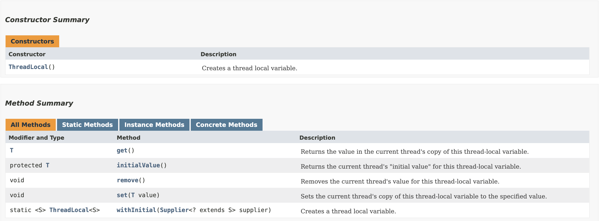

## 线程变量

JDK1.2版本起，Java就提供了java.lang.ThreadLocal，
ThreadLocal为每个使用线程都提供独立的变量副本，可以做到线程间的数据隔离，
每个线程都可以访问各自内部的副本变量，因此不存在线程安全问题。

ThreadLocal还是实现线程上下文传递的重要工具类。
本章将介绍ThreadLocal的API、实现原理、典型应用和内存泄漏问题等。

## 5.1 常用API以及使用

ThreadLocal的API文档如下图5-1所示，主要的方法有get、initialValue、remove、set和withInitial等5个方法。

> 图5-1 ThreadLocal的API


### 5.1.1 常用API

+ initialValue()

ThreadLocal提供了两种实例化的方式：
继承ThreadLocal类，并重写initialValue()方法来定义初始化逻辑；
创建ThreadLocal的匿名子类，并在其构造器中初始化。 以下是两种方式的示例代码：

```java
// 方式一：使用initialValue()方法初始化
public class MyThreadLocal extends ThreadLocal<String> {
    @Override
    protected String initialValue() {
        return "Initial Value";
    }
}

// 方式二：创建匿名子类并在构造器中初始化  
ThreadLocal<String> myThreadLocal = new ThreadLocal<String>() {
    @Override
    protected String initialValue() {
        return "Initial Value";
    }
};

// 或者直接在创建时初始化
ThreadLocal<String> myThreadLocal = ThreadLocal.withInitial(() -> "Initial Value");
```
withInitial()方法是Java8引入的一个简化的构造方法，允许使用Lambda表达式来赋值。

+ get()

要从ThreadLocal中获取值，可以调用get方法：
```java
MyThreadLocal myThreadLocal = new MyThreadLocal();
// 获取当前线程本地的值，初次调用会触发初始化
String value = myThreadLocal.get();
```
+ remove()

要从ThreadLocal中删除值，可以调用remove方法：
```java
myThreadLocal.remove();
```

+ set()

设置当前线程的线程局部变量的值
```java
myThreadLocal.set("New Value");
```

### 5.1.2 基本使用
下面的示例来说明ThreadLocal的基本使用。
```java
public class ThreadLocalExample {

    // 创建一个ThreadLocal变量来存储线程的ID
    private static final ThreadLocal<Integer> threadId = new ThreadLocal<>() {
        @Override
        protected Integer initialValue() {
            // 初始值设置为当前线程的ID 
            return Thread.currentThread().getId(); 
        }
    };

    public static void main(String[] args) throws InterruptedException {
        // 创建并启动几个线程
        for (int i = 0; i < 5; i++) {
            new Thread(() -> {
                // 获取并打印当前线程的 ID
                System.out.println("Thread ID: " + threadId.get());
            }).start();
        }
    }
}
```
在这个示例中，每个线程都会打印其自己的线程ID，而不是其他线程的ID。

ThreadLocal的应用场景主要分为两类：
+ 避免对象在方法之间层层传递，打破层次间约束

例如请求调用链的唯一traceId，在很多地方都需要用到，层层往下传递，比较麻烦。
这时候就可以把traceId放到ThreadLocal中，在需要的地方可以直接获取。

+ 拷贝对象副本，减少初始化操作，并保证线程安全

比如数据库连接、Spring事务管理和SimpleDataFormat格式化日期等场景，都是使用的ThreadLocal，
即避免每个方法都初始化一个对象，又保证了多线程下的线程安全。

使用ThreadLocal保证SimpleDataFormat格式化日期的线程安全，代码如下。
```java
public class ThreadLocalDemo {
    // 创建ThreadLocal
    static ThreadLocal<SimpleDateFormat> threadLocal =
            ThreadLocal.withInitial(() -> new SimpleDateFormat("yyyy-MM-dd HH:mm:ss"));


    public static void main(String[] args) {
        IntStream.range(0, 5).forEach(i -> {
            // 创建5个线程，分别从threadLocal取出SimpleDateFormat，然后格式化日期
            new Thread(() -> {
                try {
                    System.out.println(threadLocal.get().parse("2024-03-29 15:11:07"));
                } catch (ParseException e) {
                    throw new RuntimeException(e);
                }
            }).start();
        });
    }
}
```

## 5.2 源码解析
### 5.2.1 ThreadLocal类的UML图

使用Intellij Idea的UML插件绘制了ThreadLocal类图，如下所示。
> 图5-2 ThreadLocal类的UML图 


在图5-2中，ThreadLocalMap是ThreadLocal的静态内部类，
Entry是ThreadLocalMap的静态内部，并继承了弱引用类。
ThreadLocal有2个子类：SuppliedThreadLocal和InheritableThreadLocal。
线程Thread中持有一个ThreadLocalMap对象。
从上面的类图可以简单的得出一个结论：调用ThreadLocal的set()或者get()方法，都是操作当前线程持有的threadLocals。

### 5.2.2 ThreadLocal源码解析
+ 属性字段
```java
// 每个ThreadLocal实例都有一个对应的threadLocalHashCode
// 这个值将会用于在ThreadLocalMap中找到ThreadLocal对应的value值
private final int threadLocalHashCode = nextHashCode();

// ThreadLocal实例hash值计算的初始值
private static AtomicInteger nextHashCode = new AtomicInteger();

// ThreadLocal实例hash值计算的增量
private static final int HASH_INCREMENT = 0x61c88647;
```
每个ThreadLocal实例都有一个threadLocalHashCode值，这个值由nextHashCode和常量HASH_INCREMENT计算出来。

+ 内部类SuppliedThreadLocal
```java
static final class SuppliedThreadLocal<T> extends ThreadLocal<T> {

    private final Supplier<? extends T> supplier;

    SuppliedThreadLocal(Supplier<? extends T> supplier) {
        this.supplier = Objects.requireNonNull(supplier);
    }

    // 重写了initialValue()来设置初始值
    @Override
    protected T initialValue() {
        // Supplier不允许为null
        return supplier.get();
    }
}
```
SuppliedThreadLocal是JDK8新增的内部类，只是扩展了ThreadLocal的初始化值的方法而已，
允许使用JDK8新增的Lambda表达式赋值。需要注意的是，函数式接口中Supplier不允许为null，
使用方法可参考上面的使用示例。

+ 构造方法
```java
public ThreadLocal() {
}
```
可以看到其构造方法没有进行任何操作。

+ nextHashCode()
```java
private static int nextHashCode() {
    return nextHashCode.getAndAdd(HASH_INCREMENT);
}
```
创建ThreadLocal实例时生成其对应的hashcode，每次原子增加HASH_INCREMENT的大小。

+ initialValue()
```java
protected T initialValue() {
    return null;
}
```
返回当前线程的ThreadLocal初始设置值。这个方法在当前线程第一次调用ThreadLocal.get方法时进行调用，如果之前已经通过set方法设置过值，则不会调用。
这个方法需要自行实现，来完成定制操作，
也就是希望ThreadLocal在每个线程中初始化值不同时可以进行定制。

+ withInitial()
```java
public static <S> ThreadLocal<S> withInitial(Supplier<? extends S> supplier) {
    return new SuppliedThreadLocal<>(supplier);
}
```
Lambda表达式赋值，可参考上面示例。

+ get()
```java
public T get() {
    // 获取当前线程
    Thread t = Thread.currentThread();
    // 获取当前线程持有的的ThreadLocalMap
    ThreadLocalMap map = getMap(t);
    if (map != null) {
        // 获取ThreadLocalMap中对应当前ThreadLocal的Entry
        ThreadLocalMap.Entry e = map.getEntry(this);
        // 非空则获取对应的value
        if (e != null) {
            T result = (T)e.value;
            return result;
        }
    }
    // map还未初始化或当前ThreadLocal的Entry为空则调用
    return setInitialValue();
}
```
获取当前线程Thread对象的ThreadLocalMap对象，并获取当前ThreadLocal对应Entry。
如果ThreadLocalMap还未初始化或当前ThreadLocal的Entry为空，则调用setInitialValue()，
从此也能看出其使用的是懒加载，用到时才进行初始化。

+ setInitialValue()

```java
private T setInitialValue() {
    // 调用自定义初始化方法
    T value = initialValue();
    Thread t = Thread.currentThread();
    ThreadLocalMap map = getMap(t);
    if (map != null)
        // 已经初始化，则set操作
        map.set(this, value);
    else
        // 未初始化则初始化并赋值
        createMap(t, value);
    return value;
}
```
初始化操作，返回初始化的值

+ set(T value)

set操作与setInitialValue类似，只是value是外部传入的。
```java
public void set(T value) {
    Thread t = Thread.currentThread();
    ThreadLocalMap map = getMap(t);
    if (map != null)
        map.set(this, value);
    else
        createMap(t, value);
}
```
+ remove()

```java
public void remove() {
    ThreadLocalMap m = getMap(Thread.currentThread());
    if (m != null) {
        // 通过ThreadLocalMap的remove()删除
        m.remove(this);
    }
}                                                      
```
移除当前线程中的ThreadLocalMap对应的ThreadLocal的Entry，如果当前线程调用了remove之后又调用get，
则会重新调用initialValue，可参考上面的get方法。

+ getMap()

获取线程的threadLocals。
```java
ThreadLocalMap getMap(Thread t) {
    return t.threadLocals;
}
```

+ createMap()
创建（初始化）ThreadLocalMap，并通过firstValue设置初始值
```java
void createMap(Thread t, T firstValue) {
    t.threadLocals = new ThreadLocalMap(this, firstValue);
}
```

## 5.3 线程关联

### 5.3.1 线程上下文丢失
ThreadLocal能够很好的解决线程内部的上下文传递问题，但是对于使用多线程的异步场景，线程上下文会丢失。
下面的代码，在主线程中初始化线程变量，然后启动一个子线程，在子线程中获取线程变量的值。
```java
public class ThreadLocalDemo {

    public static ThreadLocal<Integer> context = new ThreadLocal<>();

    public static void main(String[] args) {
        // 设置线程变量的值 (main线程)
        context.set(1000);

        // 从线程变量中取出值
        Integer ctx = context.get();
        System.out.println("ctx= " + ctx);
        
        // thread线程是main线程创建的子线程
        Thread thread = new Thread(new Runnable() {
            @Override
            public void run() {
                Integer ctx = context.get();
                System.out.println("ctx= " + ctx);
            }
        });

        thread.start();
    }
}
```
输出结果如下，可以看到子线程无法获取主线程设置的线程变量。
```java
ctx= 1000
ctx= null
```

从线程变量的名称和作用来看，这个子线程获取为空是符合预期的，但是从线程上下文传递的功能角度来看，却是不满足需求的。
于是Java官方又提供了ThreadLocal的子类InheritableThreadLocal来解决创建新线程时的上下文传递丢失的问题。

### 5.3.2 InheritableThreadLocal

使用TheadLocal时，子线程访问不了父线程的本地变量，InheritableThreadLocal很好的解决了该问题。
InheritableThreadLocal源码如下。
```java
public class InheritableThreadLocal<T> extends ThreadLocal<T> {

    // 接收父线程本地变量的值
    // 这个方法在父线程创建子线程时调用
    protected T childValue(T parentValue) {
        // 这里是直接返回原值
        return parentValue;
    }
    
    // 使用inheritableThreadLocals保存线程变量
    ThreadLocalMap getMap(Thread t) {
       return t.inheritableThreadLocals;
    }

    // 初始化inheritableThreadLocals
    void createMap(Thread t, T firstValue) {
        t.inheritableThreadLocals = new ThreadLocalMap(this, firstValue);
    }
}
```
不同于ThreadLocal，在使用InheritableThreadLocal对象时，变量保存在inheritableThreadLocals中。
下面是Thread类中两个变量的定义。
```java
ThreadLocal.ThreadLocalMap threadLocals = null;
ThreadLocal.ThreadLocalMap inheritableThreadLocals = null;
```

再来看下在线程创建时如何实现线程变量的copy过程。
```java
private Thread(ThreadGroup g, Runnable target, String name,
                long stackSize, AccessControlContext acc,
                boolean inheritThreadLocals) {
     this.name = name;

     Thread parent = currentThread();
     // 安全、校验等代码省略...    
     
     // 线程常规的初始化动作
     this.group = g;
     this.daemon = parent.isDaemon();
     this.priority = parent.getPriority();
     this.target = target;
     setPriority(priority);
     
     // 线程变量的map拷贝
     if (inheritThreadLocals && parent.inheritableThreadLocals != null){
         this.inheritableThreadLocals =
             ThreadLocal.createInheritedMap(parent.inheritableThreadLocals);
     }
     
     this.stackSize = stackSize;

     this.tid = nextThreadID();
}
```

线程变量的map拷贝在ThreadLocal.createInheritedMap中，实际是创建一个新的map并将值复制一份。
```java
private ThreadLocalMap(ThreadLocalMap parentMap) {
    Entry[] parentTable = parentMap.table;
    int len = parentTable.length;
    setThreshold(len);
    table = new Entry[len];
    
    // 遍历父线程的table
    for (Entry e : parentTable) {
        if (e != null) {
            ThreadLocal<Object> key = (ThreadLocal<Object>) e.get();
            if (key != null) {
                // 赋值
                Object value = key.childValue(e.value);
                Entry c = new Entry(key, value);
                int h = key.threadLocalHashCode & (len - 1);
                while (table[h] != null)
                    h = nextIndex(h, len);
                table[h] = c;
                size++;
            }
        }
    }
}
```

### 5.3.3 transmittable-thread-local

JDK的InheritableThreadLocal类可以完成父线程到子线程的值传递。
对于线程池场景，线程由线程池创建好，并且线程是池化起来反复使用的，
这时父子线程关系的ThreadLocal值传递已经没有意义，应用需要的实际上是把任务提交给线程池时的ThreadLocal值传递到任务执行时。

TransmittableThreadLocal(TTL) 是阿里巴巴开源的项目，在使用线程池等会池化复用线程的执行组件情况下，
提供ThreadLocal值的传递功能，解决异步执行时上下文传递的问题。

TransmittableThreadLocal继承InheritableThreadLocal，使用方式也类似。
相比InheritableThreadLocal，添加了protected的transmitteeValue()方法，
用于定制任务提交给线程池时的ThreadLocal值传递到任务执行时的传递方式。

#### 5.3.3.1 简单使用

+ 父线程给子线程传递值
```java
TransmittableThreadLocal<String> context = new TransmittableThreadLocal<>();

// =====================================================

// 在父线程中设置
context.set("value-set-in-parent");

// =====================================================

// 在子线程中可以读取，值是"value-set-in-parent"
String value = context.get();
```
这其实是InheritableThreadLocal的功能，可以使用InheritableThreadLocal来完成。

#### 5.3.3.2 线程池中传递值

+ 修饰Runnable和Callable
```java
TransmittableThreadLocal<String> context = new TransmittableThreadLocal<>();

// =====================================================

// 在父线程中设置
context.set("value-set-in-parent");

Runnable task = new RunnableTask();
// 额外的处理，生成修饰了的对象ttlRunnable
Runnable ttlRunnable = TtlRunnable.get(task);
executorService.submit(ttlRunnable);

// =====================================================

// Task中可以读取，值是"value-set-in-parent"
String value = context.get();
```
上面演示了Runnable，Callable的处理类似。
```java
TransmittableThreadLocal<String> context = new TransmittableThreadLocal<>();

// =====================================================

// 在父线程中设置
context.set("value-set-in-parent");

Callable call = new CallableTask();
// 额外的处理，生成修饰了的对象ttlCallable
Callable ttlCallable = TtlCallable.get(call);
executorService.submit(ttlCallable);

// =====================================================

// Call中可以读取，值是"value-set-in-parent"
String value = context.get();
```

+ 修饰线程池

省去每次Runnable和Callable传入线程池时的修饰，这个逻辑可以在线程池中完成。 例子如下：
```java
ExecutorService executorService = ...
// 额外的处理，生成修饰了的对象executorService
executorService = TtlExecutors.getTtlExecutorService(executorService);

TransmittableThreadLocal<String> context = new TransmittableThreadLocal<>();

// =====================================================

// 在父线程中设置
context.set("value-set-in-parent");

Runnable task = new RunnableTask();
Callable call = new CallableTask();
executorService.submit(task);
executorService.submit(call);

// =====================================================

// Task或是Call中可以读取，值是"value-set-in-parent"
String value = context.get();
```

+ 使用Java Agent来修饰JDK线程池实现类

这种方式，实现线程池的传递是透明的，业务代码中没有修饰Runnable或是线程池的代码，即可以做到应用代码无侵入。

使用方式如下：
```java
java -javaagent:path/to/transmittable-thread-local-2.x.y.jar 
    -cp classes 
    com.alibaba.demo.ttl.agent.AgentDemo
```

## 5.4 内存泄露

用"水能载舟亦能覆舟"来形容用ThreadLocal的是十分贴切的，笔者在实际工作中遇到非常多的ThreadLocal问题，
如内存泄露和脏数据 ，特别是线程池场景，很容易因为使用不当导致线上事故。

### 5.4.1 内存泄露原因

ThreadLocal内存泄一般是如下原因造成：
+ ThreadLocal变量没有被明确的移除
+ ThreadLocal变量一直存在于ThreadLocalMap中

在使用ThreadLocal时，当线程结束，如果ThreadLocal变量没有被手动清除，就会导致这部分内存无法被回收，最终导致内存泄漏。

每个线程都有一个ThreadLocalMap，这个Map可以存放多个ThreadLocal变量。当ThreadLocal变量没有被移除时，它所引用的对象也会一直存放在线程的ThreadLocalMap中，
这会导致ThreadLocalMap变得很大，从而占用大量的内存空间，最终导致内存泄漏。

### 5.4.2 内存泄漏的检测与清除

一般的，在线程变量使用完成之后，应该立即调用remove()完成对变量的清除，并且最好将remove()方法放在finally块，以确保一定能被执行到。如下所示
```java
ThreadLocal<Object> threadlocal = new ThreadLocal<>();
try {
    Object value = new Object();
    threadlocal.set(value);
    // 业务逻辑...
} finally {
    // 确保清除操作一定可以执行到
    threadlocal.remove();
}
```
但是上面的方式仅适合非常简单的场景，复杂场景下如多个线程变量、线程变量在多个地方使用等，将显得无力。
下面介绍开源中间件对线程变量的检测与清理。

### 5.4.3 tomcat中内存泄漏的检测
tomcat在卸载war包时，调用war的类加载器WebappClassLoaderBase对象的stop方法完成资源的关闭与清理操作。
其中就包括检测用户创建的线程变量是否得到了清除。来看下代码。

> 代码来源：apache-tomcat-10.1.13-src/java/org/apache/catalina/loader/WebappClassLoaderBase.java
```java
private void checkThreadLocalsForLeaks() {
     // 获取 jvm 全部线程
     Thread[] threads = getThreads();
     try {
         // 反射获取threadLocals、inheritableThreadLocals
         Field threadLocalsField = Thread.class.getDeclaredField("threadLocals");
         threadLocalsField.setAccessible(true);
         Field inheritableThreadLocalsField = Thread.class.getDeclaredField("inheritableThreadLocals");
         inheritableThreadLocalsField.setAccessible(true);
         
         // 反射获取ThreadLocalMap的table字段
         Class<?> tlmClass = Class.forName("java.lang.ThreadLocal$ThreadLocalMap");
         Field tableField = tlmClass.getDeclaredField("table");
         tableField.setAccessible(true);
         
         // 反射获取expungeStaleEntries方法，该方法的作用是清除所有过期的entry
         Method expungeStaleEntriesMethod = tlmClass.getDeclaredMethod("expungeStaleEntries");
         expungeStaleEntriesMethod.setAccessible(true);
         
         //　遍历所有线程，清除引用
         for (Thread thread : threads) {
             Object threadLocalMap;
             if (thread != null) {

                 // 清除 threadLocalsField 字段引用的对象
                 threadLocalMap = threadLocalsField.get(thread);
                 if (null != threadLocalMap) {
                     expungeStaleEntriesMethod.invoke(threadLocalMap);
                     // 检测已经被完全清楚干净，如果发现entry的key或者value对象的类是由当前类的war包加载器加载
                     // 说明依然存在内存泄漏，需要进行修复。
                     checkThreadLocalMapForLeaks(threadLocalMap, tableField);
                 }

                 // 清除 inheritableThreadLocalsField 字段引用的对象
                 threadLocalMap = inheritableThreadLocalsField.get(thread);
                 if (null != threadLocalMap) {
                     expungeStaleEntriesMethod.invoke(threadLocalMap);
                     checkThreadLocalMapForLeaks(threadLocalMap, tableField);
                 }
             }
         }
     } catch (Throwable t) {
        // ...
     }
 }
```

上面的代码主要是遍历所有线程，然后分析每个线程的ThreadLocalMap的对象（包括threadLocals和inheritableThreadLocals），检测线程变量是否被清除。
需要说明的是，JDK17以上版本默认禁止跨包的反射操作，需要业务在jvm参数中增加--add-opens=java.base/java.lang=ALL-UNNAMED解除限制。
