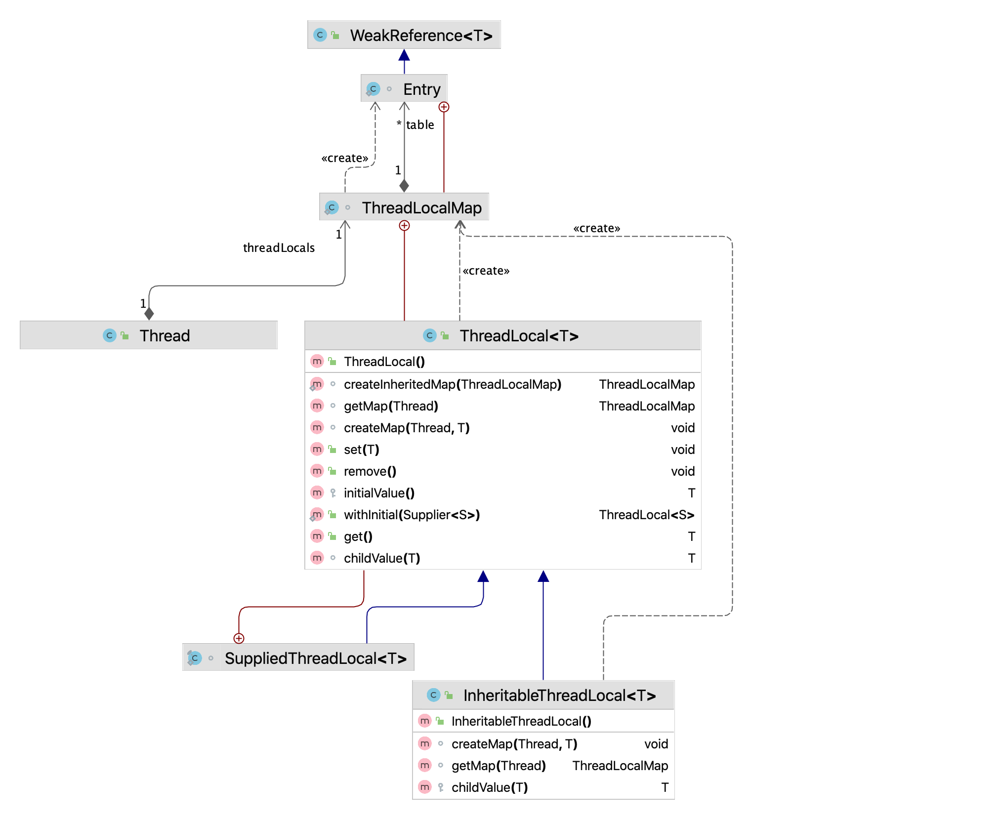

## 5.2 源码解析
### 5.2.1 ThreadLocal类的UML图

使用Intellij Idea的UML插件绘制了ThreadLocal类图，如下图5-2所示。
> 图5-2 ThreadLocal类的UML图



在图5-2中，ThreadLocalMap是ThreadLocal的静态内部类，
而Entry是ThreadLocalMap的静态内部类，并继承了弱引用类。
ThreadLocal有2个子类：SuppliedThreadLocal和InheritableThreadLocal。
线程Thread中持有一个ThreadLocalMap对象。
从上面的类图可以简单的得出一个结论：调用ThreadLocal的set()或者get()方法，都是操作当前线程持有的threadLocals。

### 5.2.2 ThreadLocal源码解析
+ 属性字段
```java
// 每个ThreadLocal实例都有一个对应的threadLocalHashCode
// 这个值将会用于在ThreadLocalMap中找到ThreadLocal对应的value值
private final int threadLocalHashCode = nextHashCode();

// ThreadLocal实例hash值计算的初始值
private static AtomicInteger nextHashCode = new AtomicInteger();

// ThreadLocal实例hash值计算的增量
private static final int HASH_INCREMENT = 0x61c88647;
```
每个ThreadLocal实例都有一个threadLocalHashCode值，这个值由nextHashCode和常量HASH_INCREMENT计算出来。

+ 内部类SuppliedThreadLocal
```java
static final class SuppliedThreadLocal<T> extends ThreadLocal<T> {

    private final Supplier<? extends T> supplier;

    SuppliedThreadLocal(Supplier<? extends T> supplier) {
        this.supplier = Objects.requireNonNull(supplier);
    }

    // 重写了initialValue()来设置初始值
    @Override
    protected T initialValue() {
        // Supplier不允许为null
        return supplier.get();
    }
}
```
SuppliedThreadLocal是JDK8新增的内部类，只是扩展了ThreadLocal的初始化值的方法而已，
允许使用JDK8新增的Lambda表达式赋值。需要注意的是，函数式接口中Supplier不允许为null，
使用方法可参考上面的使用示例。

+ 构造方法
```java
public ThreadLocal() {
}
```
可以看到其构造方法没有进行任何操作。

+ nextHashCode()
```java
private static int nextHashCode() {
    return nextHashCode.getAndAdd(HASH_INCREMENT);
}
```
创建ThreadLocal实例时生成其对应的hashcode，每次原子增加HASH_INCREMENT的大小。

+ initialValue()
```java
protected T initialValue() {
    return null;
}
```
返回当前线程的ThreadLocal初始设置值。这个方法在当前线程第一次调用ThreadLocal.get方法时进行调用，如果之前已经通过set方法设置过值，则不会调用。
这个方法需要自行实现，来完成定制操作，
也就是希望ThreadLocal在每个线程中初始化值不同时可以进行定制。

+ withInitial()
```java
public static <S> ThreadLocal<S> withInitial(Supplier<? extends S> supplier) {
    return new SuppliedThreadLocal<>(supplier);
}
```
Lambda表达式赋值，可参考上面示例。

+ get()
```java
public T get() {
    // 获取当前线程
    Thread t = Thread.currentThread();
    // 获取当前线程持有的的ThreadLocalMap
    ThreadLocalMap map = getMap(t);
    if (map != null) {
        // 获取ThreadLocalMap中对应当前ThreadLocal的Entry
        ThreadLocalMap.Entry e = map.getEntry(this);
        // 非空则获取对应的value
        if (e != null) {
            T result = (T)e.value;
            return result;
        }
    }
    // map还未初始化或当前ThreadLocal的Entry为空则调用
    return setInitialValue();
}
```
获取当前线程Thread对象的ThreadLocalMap对象，并获取当前ThreadLocal对应Entry。
如果ThreadLocalMap还未初始化或当前ThreadLocal的Entry为空，则调用setInitialValue()，
从此也能看出其使用的是懒加载，用到时才进行初始化。

+ setInitialValue()

```java
private T setInitialValue() {
    // 调用自定义初始化方法
    T value = initialValue();
    Thread t = Thread.currentThread();
    ThreadLocalMap map = getMap(t);
    if (map != null)
        // 已经初始化，则set操作
        map.set(this, value);
    else
        // 未初始化则初始化并赋值
        createMap(t, value);
    return value;
}
```
初始化操作，返回初始化的值

+ set(T value)

set操作与setInitialValue类似，只是value是外部传入的。
```java
public void set(T value) {
    Thread t = Thread.currentThread();
    ThreadLocalMap map = getMap(t);
    if (map != null)
        map.set(this, value);
    else
        createMap(t, value);
}
```
+ remove()

```java
public void remove() {
    ThreadLocalMap m = getMap(Thread.currentThread());
    if (m != null) {
        // 通过ThreadLocalMap的remove()删除
        m.remove(this);
    }
}                                                      
```
移除当前线程中的ThreadLocalMap对应的ThreadLocal的Entry，如果当前线程调用了remove之后又调用get，
则会重新调用initialValue，可参考上面的get方法。

+ getMap()

获取线程的threadLocals。
```java
ThreadLocalMap getMap(Thread t) {
    return t.threadLocals;
}
```

+ createMap()
  创建（初始化）ThreadLocalMap，并通过firstValue设置初始值
```java
void createMap(Thread t, T firstValue) {
    t.threadLocals = new ThreadLocalMap(this, firstValue);
}
```
