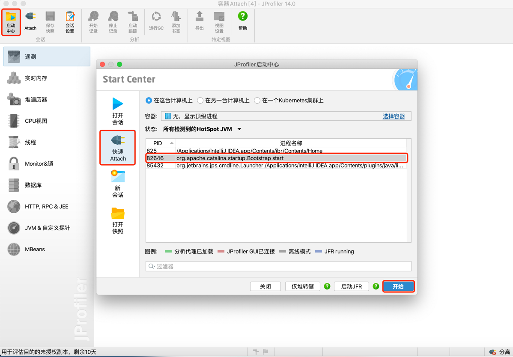
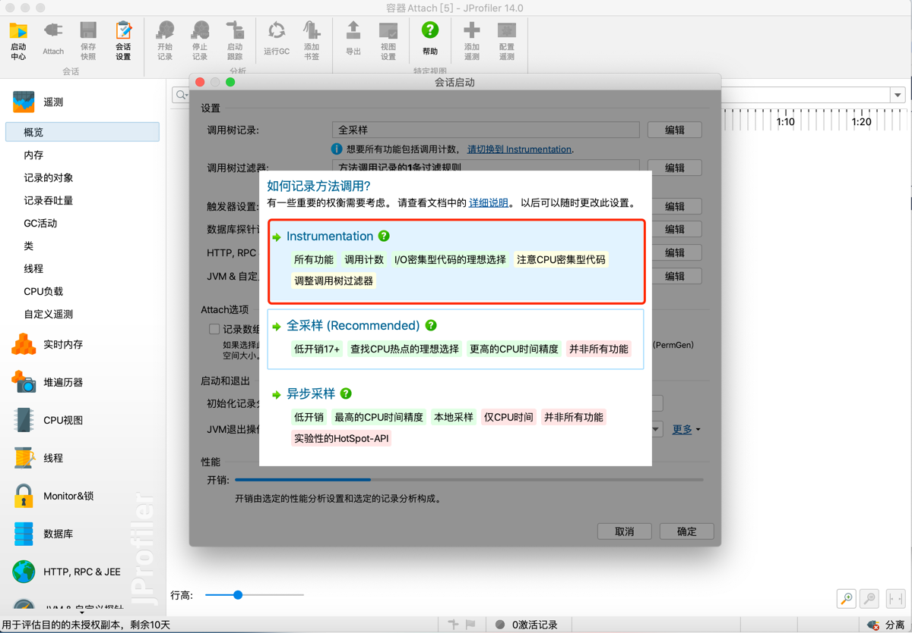
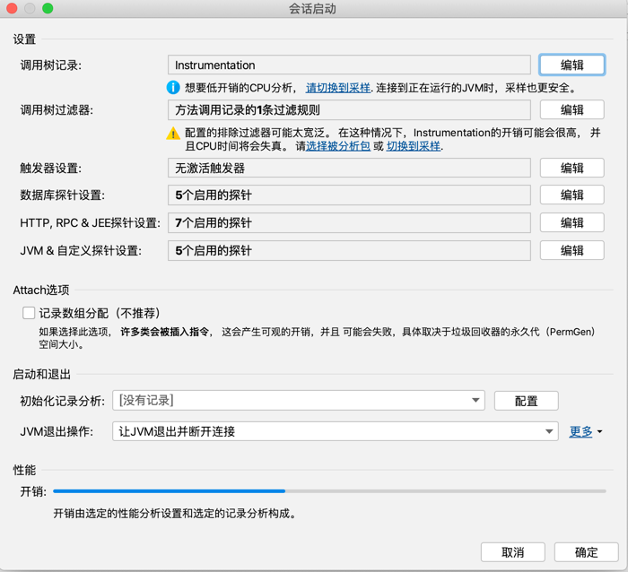
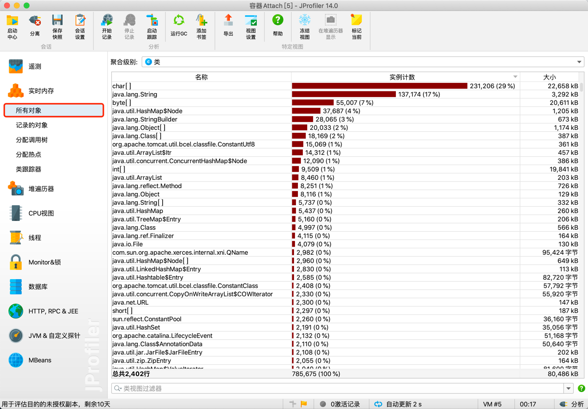
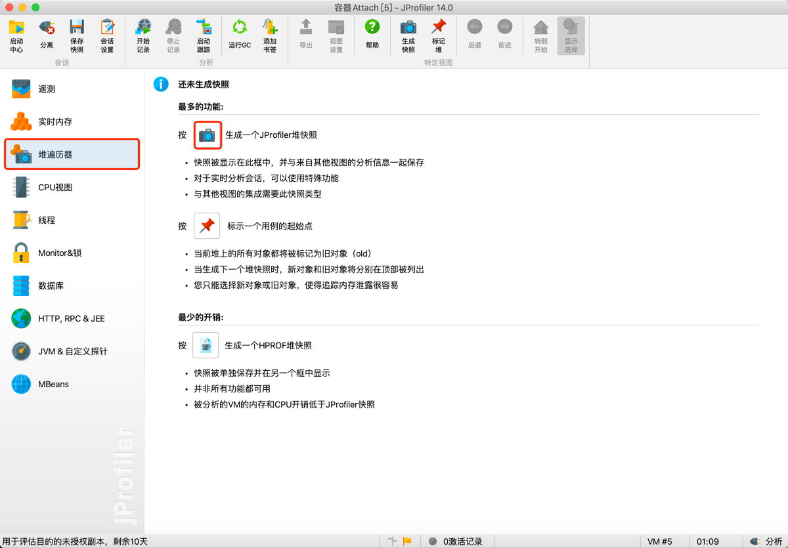
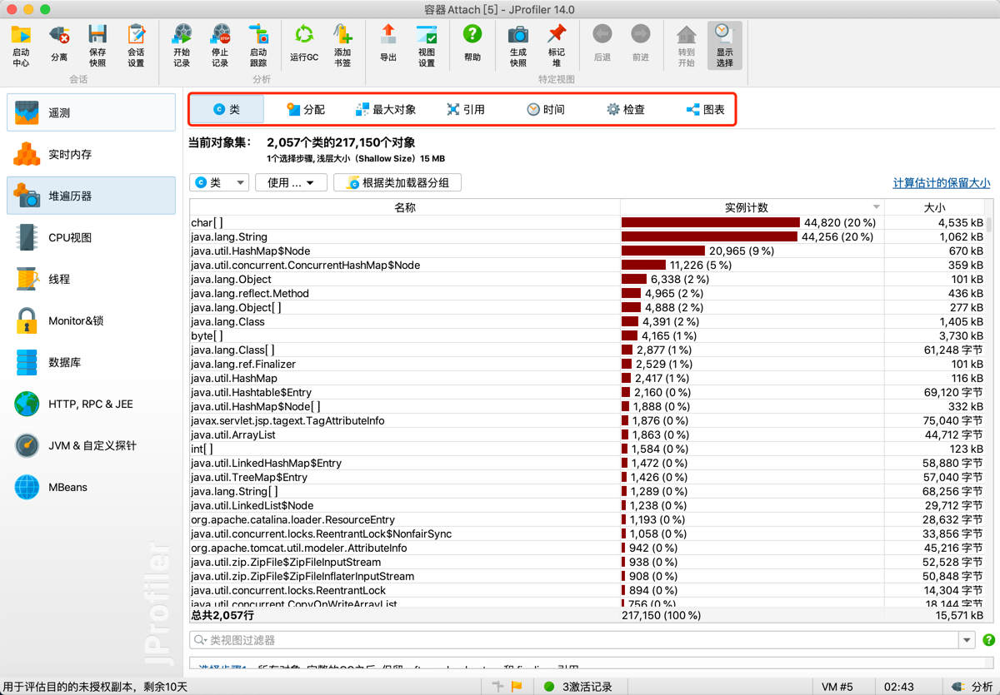

## 7.4 JProfile
对于图形化工具，本节将不再研究其技术细节，而是重点介绍功能如何使用。其中JProfile是一款非常优秀的商业化性能分析工具。
改工具几乎能够分析所有的Java性能问题。下面分几个场景介绍。

### 7.4.1 GUI形式运行

以图形化界面快速Attach到目标JVM上。

一般选择Instrumentation (修改字节码的以跟踪方法的进入和退出)

对象分析

堆遍历器

对象引用关系查看：

### 7.4.2 Agent