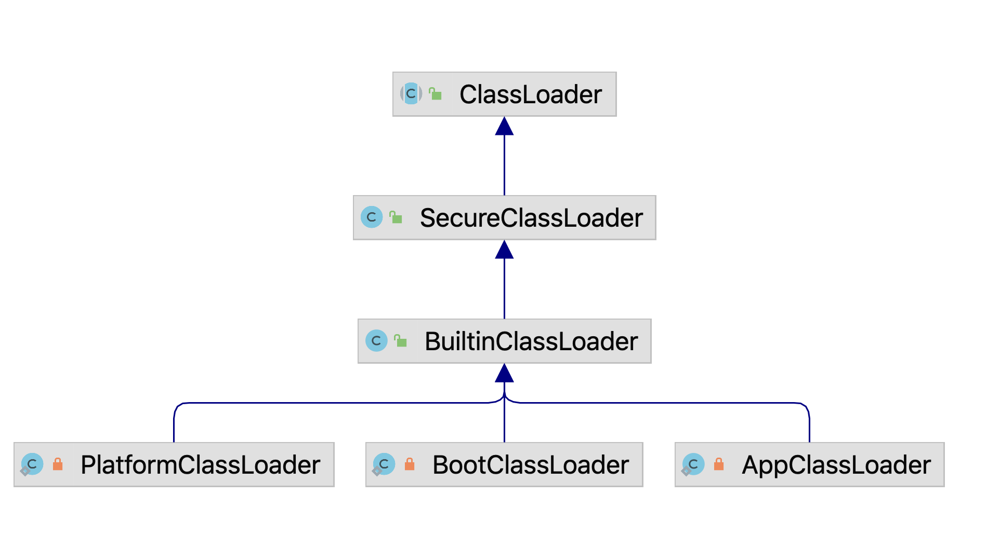

## JDK的类加载器

JDK自身的jar包如rt.jar和tools .jar中的类也需要使用类加载器来加载，下面的代码用来获取JDK内置的类加载器。
```java
public class JdkClassloader {
    public static void main(String[] args) {
        // 获取系统类加载器
        ClassLoader systemClassLoader = ClassLoader.getSystemClassLoader();
        System.out.println(systemClassLoader);
        
        // 获取系统类加载器的父类加载器 --> 扩展类加载器或者平台类加载器
        ClassLoader classloader1 = systemClassLoader.getParent();
        System.out.println(classloader1);
        
        // 获取扩展类加载器的父类加载器 --> 启动类加载器（C/C++）
        ClassLoader classloader2 = classloader1.getParent();
        System.out.println(parent2);
    }
}
```

在JDK8上运行：
```
sun.misc.Launcher$AppClassLoader@18b4aac2
sun.misc.Launcher$ExtClassLoader@4a574795
null
```

在JDK11上运行：
```
jdk.internal.loader.ClassLoaders$AppClassLoader@512ddf17
jdk.internal.loader.ClassLoaders$PlatformClassLoader@3cda1055
null
```
可以看到JDK8和JDK11类加载器的类名称存在差异，下面分别说明其实现。

### JDK8的类加载器

#### AppClassloader
AppClassloader也称为System ClassLoader，是Java虚拟机默认的类加载器之一， 
主要用来加载用户类和第三方依赖包，即加载应用程序classpath中的类，
在JVM启动命令行中设置-Djava.class.path参数来指定加载路径。
```java
// AppClassLoader继承URLClassLoader
static class AppClassLoader extends URLClassLoader {
    
    public static ClassLoader getAppClassLoader(final ClassLoader extcl)
            throws IOException {
        // 搜索路径java.class.path
        final String s = System.getProperty("java.class.path");
        final File[] path = (s == null) ? new File[0] : getClassPath(s);

        URL[] urls = (s == null) ? new URL[0] : pathToURLs(path);
        return new AppClassLoader(urls, extcl);
    }

    /*
     * Creates a new AppClassLoader
     */
    AppClassLoader(URL[] urls, ClassLoader parent) {
        super(urls, parent, factory);
    }

    /**
     * 重写了loadClass，支持类的包权限检查
     */
    public Class<?> loadClass(String name, boolean resolve)
            throws ClassNotFoundException {
        int i = name.lastIndexOf('.');
        if (i != -1) {
            SecurityManager sm = System.getSecurityManager();
            if (sm != null) {
                sm.checkPackageAccess(name.substring(0, i));
            }
        }
        // 调用父类URLClassLoader完成类加载
        return (super.loadClass(name, resolve));
    }
    
    // 其他方法省略...
}    
```

#### ExtClassLoader

ExtClassLoader称为扩展类加载器，主要负责加载Java的扩展类库，默认加载${JAVA_HOME}/jre/lib/ext/
目录下的所有jar包，也可以用参数-Djava.ext.dirs来设置它的搜索路径。
```java
static class ExtClassLoader extends URLClassLoader {

    public static ExtClassLoader getExtClassLoader() throws IOException {
        final File[] dirs = getExtDirs();

        try {
            return new ExtClassLoader(dirs);
        } catch (java.security.PrivilegedActionException e) {
            throw (IOException) e.getException();
        }
    }
    
    public ExtClassLoader(File[] dirs) throws IOException {
        super(getExtURLs(dirs), null, factory);
    }

    private static File[] getExtDirs() {
        // 通过系统变量指定加载路径
        String s = System.getProperty("java.ext.dirs");
        File[] dirs;
        if (s != null) {
            StringTokenizer st =
                    new StringTokenizer(s, File.pathSeparator);
            int count = st.countTokens();
            dirs = new File[count];
            for (int i = 0; i < count; i++) {
                dirs[i] = new File(st.nextToken());
            }
        } else {
            dirs = new File[0];
        }
        return dirs;
    }
}    
```

JDK8的类加载器的继承关系如下图所示：


### JDK8类加载器的初始化
JDK的类加载器的初始化在Launcher类中。
```java
源码位置：src/share/classes/sun/misc/Launcher.java
public class Launcher {

    public Launcher() {
        // 创建ExtClassLoader
        // 异常处理的代码省略
        ClassLoader extcl = ExtClassLoader.getExtClassLoader();
        
        // 创建AppClassLoader
        ClassLoader loader = AppClassLoader.getAppClassLoader(extcl);
        
        // 设置当前线程的ContextClassLoader
        Thread.currentThread().setContextClassLoader(loader);

        // ....
        
    }
    
    // ...
}    
```
可以看到，初始化过程较为简单，先初始化ExtClassLoader，然后在初始化AppClassLoader，并且AppClassLoader的父加载器为ExtClassLoader。

### JDK11的类加载器

Java9实现模块化之后，对classloader有所改造，其中一点就是将ExtClassLoader改为PlatformClassLoader，
模块化之后不同的classloader加载各自对应的模块。因为JDK11是一个长期支持的稳定版本，这里以JDK11的源代码来说明类加载器的变化。JDK11的类加载器的继承关系如下图所示：


BuiltinClassLoader是AppClassloader、PlatformClassLoader的父类，功能上与URLClassLoader相似，
都是基于UrlClassPath来实现类的查找，但BuiltinClassLoader支持从moudle加载class。


BuiltinClassLoader的构造器参数
```java
BuiltinClassLoader(String name, BuiltinClassLoader parent, URLClassPath ucp) {
    // ensure getParent() returns null when the parent is the boot loader
    // name 是类加载器的名称
    super(name, parent == null || parent == ClassLoaders.bootLoader() ? null : parent);

    this.parent = parent;
    this.ucp = ucp;

    this.nameToModule = new ConcurrentHashMap<>();
    this.moduleToReader = new ConcurrentHashMap<>();
}
```

先来看下loadClassOrNull方法。
先判断是否已加载，若未加载，则寻找类所在模块，若找到该模块，则优先使用模块的类加载器加载；
若未加载，再向上寻找父类的类加载器。最后若没有找到，再根据classpath寻找。

```java
protected Class<?> loadClassOrNull(String cn, boolean resolve) {
    synchronized (getClassLoadingLock(cn)) {
        // check if already loaded
        Class<?> c = findLoadedClass(cn);

        if (c == null) {

            // find the candidate module for this class
            LoadedModule loadedModule = findLoadedModule(cn);
            if (loadedModule != null) {

                // package is in a module
                BuiltinClassLoader loader = loadedModule.loader();
                if (loader == this) {
                    if (VM.isModuleSystemInited()) {
                        c = findClassInModuleOrNull(loadedModule, cn);
                    }
                } else {
                    // delegate to the other loader
                    c = loader.loadClassOrNull(cn);
                }

            } else {

                // check parent
                if (parent != null) {
                    c = parent.loadClassOrNull(cn);
                }

                // check class path
                if (c == null && hasClassPath() && VM.isModuleSystemInited()) {
                    c = findClassOnClassPathOrNull(cn);
                }
            }

        }

        if (resolve && c != null)
            resolveClass(c);

        return c;
    }
}
```
还有和通常的双亲委派不同，如果一个class属于某个moudle那么会直接调用该moudle的类加载器去加载，
而不是说直接用当前类加载器的双亲委派模型去加载。 但是找到这个class对应的类加载器后，还是会按照双亲委派去加载。

BuiltinClassLoader重写了ClassLoader的findClass方法：
```java
@Override
protected Class<?> findClass(String cn) throws ClassNotFoundException {
    
    // find the candidate module for this class
    LoadedModule loadedModule = findLoadedModule(cn);

    Class<?> c = null;
    if (loadedModule != null) {
        //  加载任务委派给模块的加载器，而不是父加载器
        if (loadedModule.loader() == this) {
            c = findClassInModuleOrNull(loadedModule, cn);
        }
    } else {
        // search class path
        if (hasClassPath()) {
            c = findClassOnClassPathOrNull(cn);
        }
    }

    // not found
    if (c == null)
        throw new ClassNotFoundException(cn);

    return c;
}
```
##### BuiltinClassLoader的初始化以及子类

ClassLoaders类中定义了三个类加载器分别为BootClassLoader、PlatformClassLoader、AppClassLoader
BOOT_LOADER用来加载`jdk.boot.class.path.append`指定的类，在初始化PLATFORM_LOADER是指定BOOT_LOADER为其父类，
在初始化AppClassLoader是指定PLATFORM_LOADER为其父类，构成了类加载器的三层结构。
```java
public class ClassLoaders {

    // the built-in class loaders
    private static final BootClassLoader BOOT_LOADER;
    private static final PlatformClassLoader PLATFORM_LOADER;
    private static final AppClassLoader APP_LOADER;

    // Creates the built-in class loaders.
    static {
        // -Xbootclasspath/a or -javaagent with Boot-Class-Path attribute
        String append = VM.getSavedProperty("jdk.boot.class.path.append");
        BOOT_LOADER =
            new BootClassLoader((append != null && append.length() > 0)
                ? new URLClassPath(append, true)
                : null);
        // 指定AppClassLoader的父加载器BOOT_LOADER        
        PLATFORM_LOADER = new PlatformClassLoader(BOOT_LOADER);

        // A class path is required when no initial module is specified.
        // In this case the class path defaults to "", meaning the current
        // working directory.  When an initial module is specified, on the
        // contrary, we drop this historic interpretation of the empty
        // string and instead treat it as unspecified.
        String cp = System.getProperty("java.class.path");
        if (cp == null || cp.length() == 0) {
            String initialModuleName = System.getProperty("jdk.module.main");
            cp = (initialModuleName == null) ? "" : null;
        }
        URLClassPath ucp = new URLClassPath(cp, false);
        // 指定AppClassLoader的父加载器PLATFORM_LOADER
        APP_LOADER = new AppClassLoader(PLATFORM_LOADER, ucp);
    }
 }   
```

再来看下JDK9以上特有的PlatformClassLoader类：
```java
private static class PlatformClassLoader extends BuiltinClassLoader {
    static {
        if (!ClassLoader.registerAsParallelCapable())
            throw new InternalError();
    }

    PlatformClassLoader(BootClassLoader parent) {
        // 类加载器名称为platform
        super("platform", parent, null);
    }

    /**
     * Called by the VM to support define package for AppCDS.
     *
     * Shared classes are returned in ClassLoader::findLoadedClass
     * that bypass the defineClass call.
     */
    private Package definePackage(String pn, Module module) {
        return JLA.definePackage(this, pn, module);
    }
}
```

不同类的分工如下：
bootstrap classloader加载lib/modules
```text
java.base                   java.security.sasl
java.datatransfer           java.xml
java.desktop                jdk.httpserver
java.instrument             jdk.internal.vm.ci
java.logging                jdk.management
java.management             jdk.management.agent
java.management.rmi         jdk.naming.rmi
java.naming                 jdk.net
java.prefs                  jdk.sctp
java.rmi                    jdk.unsupported
```
platform classloader，加载lib/modules下的
```text
java.activation*            jdk.accessibility
java.compiler*              jdk.charsets
java.corba*                 jdk.crypto.cryptoki
java.scripting              jdk.crypto.ec
java.se                     jdk.dynalink
java.se.ee                  jdk.incubator.httpclient
java.security.jgss          jdk.internal.vm.compiler*
java.smartcardio            jdk.jsobject
java.sql                    jdk.localedata
java.sql.rowset             jdk.naming.dns
java.transaction*           jdk.scripting.nashorn
java.xml.bind*              jdk.security.auth
java.xml.crypto             jdk.security.jgss
java.xml.ws*                jdk.xml.dom
java.xml.ws.annotation*     jdk.zipfs
```
application classloader加载-cp，-mp指定的类
```
jdk.aot                     jdk.jdeps
jdk.attach                  jdk.jdi
jdk.compiler                jdk.jdwp.agent
jdk.editpad                 jdk.jlink
jdk.hotspot.agent           jdk.jshell
jdk.internal.ed             jdk.jstatd
jdk.internal.jvmstat        jdk.pack
jdk.internal.le             jdk.policytool
jdk.internal.opt            jdk.rmic
jdk.jartool                 jdk.scripting.nashorn.shell
jdk.javadoc                 jdk.xml.bind*
jdk.jcmd                    jdk.xml.ws*
jdk.jconsole
```