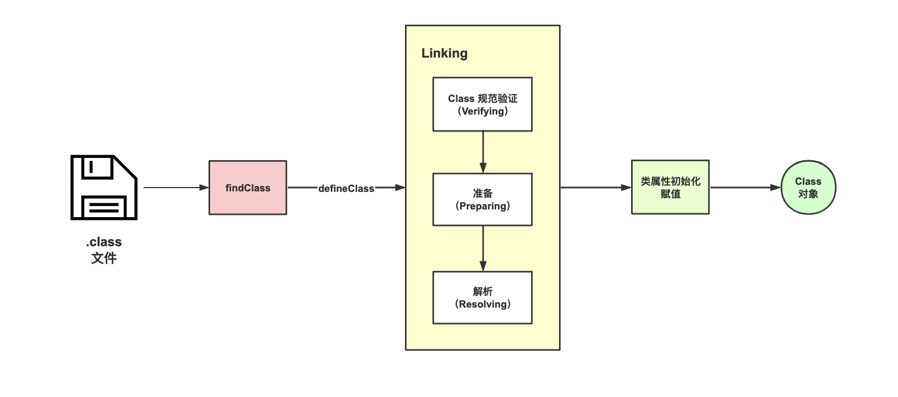

# 第4章类加载器

类加载器负责把描述类的数据从class字节码文件加载到内存，并对数据进行检验、解析和初始化，最终形成可以被虚拟机直接使用的Java类型。

一般在开发web项目时很少直接使用类加载器，因为web容器为我们屏蔽了类加载器的复杂性，而我们只需要实现具体的业务逻辑即可。而如果开发过Java中间件，你会发现类加载器使用非常频繁。

本章先介绍类加载器的API及使用，然后依次介绍ClassLoader的源码，JDK和web中间件的类加载器，最后介绍热加载技术的实现原理。

## 4.1 ClassLoader基本方法和实现类

ClassLoader是一个抽象类，不能直接使用，因此我们需要继承并重写其中的方法。它的主要方法有defineClass、loadClass、findClass和resolveClass等及其重载方法。主要方法的定义如下：
```java
 // 方法的输入是字节码的byte数组，输出是Class对象，它的作用是将别字节码数组解析JVM能够识别的Class对象
 protected final Class<?> defineClass(String name, byte[] b, int off, int len)
 
 // 通过类名称查找Class对象
 public Class<?> loadClass(String name)
 
 // 通过类全限定名称加载类
 protected Class<?> findClass(String name)

 // 调用该方法完成类的链接过程
 protected final void resolveClass(Class<?> c)
```

先来实现一个简单的类加载器NetworkClassLoader，这个类加载器具备从网络加载类文件的能力， 实现代码如下：
```java
import java.io.ByteArrayOutputStream;
import java.io.IOException;
import java.io.InputStream;
import java.net.URL;

public class NetworkClassLoader extends ClassLoader {
    
    // 下载地址
    private String downloadUrl;

    public NetworkClassLoader(String downloadUrl) {
        this.downloadUrl = downloadUrl;
    }

    // 实现类的查找方法
    @Override
    public Class findClass(String name) {
        byte[] b = loadClassData(name);
        return defineClass(name, b, 0, b.length);
    }
    
    // 从远程下载类文件，从而获得类的字节码数组
    private byte[] loadClassData(String name) {
        // load the class data from the connection
        InputStream input = null;
        ByteArrayOutputStream baos = null;
        String path = classNameToPath(name);
        try {
            URL url = new URL(path);
            byte[] buff = new byte[1024 * 4];
            int len = -1;
            input = url.openStream();
            baos = new ByteArrayOutputStream();
            while ((len = input.read(buff)) != -1) {
                baos.write(buff, 0, len);
            }
        } catch (Exception e) {
            e.printStackTrace();
        } finally {
            if (input == null) {
                try {
                    input.close();
                } catch (IOException e) {
                    e.printStackTrace();
                }
            }
        }
        return baos.toByteArray();
    }
    
    // 类名称转化为服务器下载的地址
    private String classNameToPath(String name) {
        return downloadUrl + "/" + name.replace(".", "/") + ".class";
    }

    // 测试方法
    public class Main {
        public static void main(String[] args) throws Exception {
            // 下载地址
            String baseUrl = "https://wwww.jrasp.com";
            // 初始化网络类加载器
            NetworkClassLoader loader = new NetworkClassLoader(baseUrl);
            // 加载位于 https://wwww.jrasp.com/Foo.class的类，并创建实例
            Object foo = loader.loadClass("Foo").newInstance();
        }
    }
}
```

被加载的类Foo是一个简单类，在创建实例对象时输出"create new instance"，Foo类的代码如下：
```java
public class Foo {
    public Foo() {
        System.out.println("create new instance");
    }
}
```

运行Main方法，输出结果如下：
```text
create new instance
```

ClassLoader中主要功能是类查找、加载和链接等过程，除了加载类之外，类加载器还负责加载资源如配置文件或图片等如getResource方法，可以用来加载文件。

## 4.2 ClassLoader极其实现类源码解析

有了上面的使用基础，再来分析下类加载器的源码。

### 4.2.1 loadClass

ClassLoader调用其loadClass方法来加载class的，loadClass核心代码如下：

> 代码位置

```java
protected Class<?> loadClass(String name, boolean resolve)
    throws ClassNotFoundException {
    synchronized (getClassLoadingLock(name)) {
        // 1.从缓存中查找当前类
        Class<?> c = findLoadedClass(name);
        if (c == null) {
            try {
                if (parent != null) {
                    // 2.1 当前类加载器的父加载不为空，尝试从父类加载器加载
                    c = parent.loadClass(name, false);
                } else {
                    // 2.2 父加载器为空，使用启动类加载器加载
                    c = findBootstrapClassOrNull(name);
                }
            } catch (ClassNotFoundException e) {
                // 忽略 ClassNotFoundException 异常，继续查找
            }

            if (c == null) {
                // 3. 如果查找失败，调用当前类加载器重写的findClass查找
                c = findClass(name);
            }
        }
        
        // 链接类
        if (resolve) {
            resolveClass(c);
        }
        return c;
    }
}
```
上面的类加载顺序可以总结为：优先从尝试父加载器去加载（如果父加载器为null，则调用系统类加载器BootstrapClassLoader去加载），父加载器都尝试失败后才会交由当前ClassLoader重写的findClass方法去加载。

类加载器的图：


### 4.2.2 findClass
在加载class的过程中，如果父加载器都没有找到，则调用子类加载器重写的findClass方法继续查找，
findClass方法如下。

> 代码位置

```java
protected Class<?> findClass(String name) throws ClassNotFoundException {
    // 调用时抛出异常  
    throw new ClassNotFoundException(name);
}
```
可以看到该方法里面抛出异常，因此不能直接调用，需要子类来实现。

### 4.2.3 defineClass
defineClass与findClass一起使用，findClass负责读取自于磁盘或者网络的字节码，
而defineClass将字节码解析为Class对象，
在defineClass方法中使用resolveClass方法完成对Class的链接。源代码如下。

> 代码位置：

```java
protected final Class<?> defineClass(String name, byte[] b, int off, int len,
                                     ProtectionDomain protectionDomain)
    throws ClassFormatError {
    protectionDomain = preDefineClass(name, protectionDomain);
    String source = defineClassSourceLocation(protectionDomain);
    // 调用 native 方法完成链接
    Class<?> c = defineClass1(name, b, off, len, protectionDomain, source);
    postDefineClass(c, protectionDomain);
    return c;
}
```
defineClass的实现在defineClass1方法中，defineClass1是一个native方法，具体实现hotspot中，实现较为复杂，一般不需要特别关注。ClassLoader加载一个class文件到JVM时需要经过的步骤:



一般我们只需要重写ClassLoader的findClass方法获取需要加载的类的字节码，然后调用defineClass方法生成Class对象。如果想要在类加载到JVM中时就被链接，可以调用resolveClass方法，也可以选择交给JVM在类初始化时链接。

### 4.2.4 URLClassLoader 源码解析

```java
// 类和资源的查找路径
private final URLClassPath ucp;

public URLClassLoader(URL[] urls, ClassLoader parent) {
    super(parent);
    // ... 权限检查代码省略
    this.acc = AccessController.getContext();
    // 初始化 ucp 属性
    ucp = new URLClassPath(urls, acc);
}
```

下面是findClass的实现。
```java
protected Class<?> findClass(final String name) throws ClassNotFoundException {
    // 1、将类的全限定名变成.class文件路径的方式
    String path = name.replace('.', '/').concat(".class");
    // 2、在URLClassPath中查找是否存在
    Resource res = ucp.getResource(path, false);
    // ... 异常处理忽略
    return defineClass(name, res);
}
```

findClass方法的执行逻辑主要分为三步：
+ 将类的全限定名变成.class文件路径的方式；
+ 在URL中查找文件是否存在；
+ 调用defineClass完成类的链接和初始化；

## 4.3 JDK的类加载器

JDK自身的jar包如rt.jar和tools .jar中的类也需要使用类加载器来加载，下面的代码用来获取JDK内置的类加载器。
```java
public class JdkClassloader {
    public static void main(String[] args) {
        // 获取系统类加载器
        ClassLoader systemClassLoader = ClassLoader.getSystemClassLoader();
        System.out.println(systemClassLoader);
        
        // 获取系统类加载器的父类加载器 --> 扩展类加载器或者平台类加载器
        ClassLoader classloader1 = systemClassLoader.getParent();
        System.out.println(classloader1);
        
        // 获取扩展类加载器的父类加载器 --> 启动类加载器（C/C++）
        ClassLoader classloader2 = classloader1.getParent();
        System.out.println(parent2);
    }
}
```

在JDK8上运行：
```
sun.misc.Launcher$AppClassLoader@18b4aac2
sun.misc.Launcher$ExtClassLoader@4a574795
null
```

在JDK11上运行：
```
jdk.internal.loader.ClassLoaders$AppClassLoader@512ddf17
jdk.internal.loader.ClassLoaders$PlatformClassLoader@3cda1055
null
```
可以看到JDK8和JDK11类加载器的类名称存在差异，下面分别说明其实现。

### 4.3.1 JDK8的类加载器

#### 4.3.1.1 AppClassloader
AppClassloader也称为System ClassLoader，是Java虚拟机默认的类加载器之一，
主要用来加载用户类和第三方依赖包，即加载应用程序classpath中的类，
在JVM启动命令行中设置-Djava.class.path参数来指定加载路径。
```java
// AppClassLoader继承URLClassLoader
static class AppClassLoader extends URLClassLoader {
    
    public static ClassLoader getAppClassLoader(final ClassLoader extcl)
            throws IOException {
        // 搜索路径java.class.path
        final String s = System.getProperty("java.class.path");
        final File[] path = (s == null) ? new File[0] : getClassPath(s);

        URL[] urls = (s == null) ? new URL[0] : pathToURLs(path);
        return new AppClassLoader(urls, extcl);
    }

    /*
     * Creates a new AppClassLoader
     */
    AppClassLoader(URL[] urls, ClassLoader parent) {
        super(urls, parent, factory);
    }

    /**
     * 重写了loadClass，支持类的包权限检查
     */
    public Class<?> loadClass(String name, boolean resolve)
            throws ClassNotFoundException {
        int i = name.lastIndexOf('.');
        if (i != -1) {
            SecurityManager sm = System.getSecurityManager();
            if (sm != null) {
                sm.checkPackageAccess(name.substring(0, i));
            }
        }
        // 调用父类URLClassLoader完成类加载
        return (super.loadClass(name, resolve));
    }
    
    // 其他方法省略...
}    
```

#### 4.3.1.2 ExtClassLoader

ExtClassLoader称为扩展类加载器，主要负责加载Java的扩展类库，默认加载${JAVA_HOME}/jre/lib/ext/
目录下的所有jar包，也可以用参数-Djava.ext.dirs来设置它的搜索路径。
```java
static class ExtClassLoader extends URLClassLoader {

    public static ExtClassLoader getExtClassLoader() throws IOException {
        final File[] dirs = getExtDirs();

        try {
            return new ExtClassLoader(dirs);
        } catch (java.security.PrivilegedActionException e) {
            throw (IOException) e.getException();
        }
    }
    
    public ExtClassLoader(File[] dirs) throws IOException {
        super(getExtURLs(dirs), null, factory);
    }

    private static File[] getExtDirs() {
        // 通过系统变量指定加载路径
        String s = System.getProperty("java.ext.dirs");
        File[] dirs;
        if (s != null) {
            StringTokenizer st =
                    new StringTokenizer(s, File.pathSeparator);
            int count = st.countTokens();
            dirs = new File[count];
            for (int i = 0; i < count; i++) {
                dirs[i] = new File(st.nextToken());
            }
        } else {
            dirs = new File[0];
        }
        return dirs;
    }
}    
```

JDK8的类加载器的继承关系如下图所示：


#### 4.3.1.3 JDK8的类加载器的初始化
JDK的类加载器的初始化在Launcher类中。
```java
源码位置：src/share/classes/sun/misc/Launcher.java
public class Launcher {

    public Launcher() {
        // 创建ExtClassLoader
        // 异常处理的代码省略
        ClassLoader extcl = ExtClassLoader.getExtClassLoader();
        
        // 创建AppClassLoader
        ClassLoader loader = AppClassLoader.getAppClassLoader(extcl);
        
        // 设置当前线程的ContextClassLoader
        Thread.currentThread().setContextClassLoader(loader);

        // ....
        
    }
    
    // ...
}    
```
可以看到，初始化过程较为简单，先初始化ExtClassLoader，然后在初始化AppClassLoader，并且AppClassLoader的父加载器为ExtClassLoader。

### 4.3.2 JDK11的类加载器

Java9实现模块化之后，对classloader有所改造，其中一点就是将ExtClassLoader改为PlatformClassLoader，
模块化之后不同的classloader加载各自对应的模块。因为JDK11是一个长期支持的稳定版本，这里以JDK11的源代码来说明类加载器的变化。JDK11的类加载器的继承关系如下图所示：


BuiltinClassLoader是AppClassloader、PlatformClassLoader的父类，功能上与URLClassLoader相似，
都是基于UrlClassPath来实现类的查找，但BuiltinClassLoader支持从moudle加载class。


BuiltinClassLoader的构造器参数
```java
BuiltinClassLoader(String name, BuiltinClassLoader parent, URLClassPath ucp) {
    // ensure getParent() returns null when the parent is the boot loader
    // name 是类加载器的名称
    super(name, parent == null || parent == ClassLoaders.bootLoader() ? null : parent);

    this.parent = parent;
    this.ucp = ucp;

    this.nameToModule = new ConcurrentHashMap<>();
    this.moduleToReader = new ConcurrentHashMap<>();
}
```

先来看下loadClassOrNull方法。
先判断是否已加载，若未加载，则寻找类所在模块，若找到该模块，则优先使用模块的类加载器加载；
若未加载，再向上寻找父类的类加载器。最后若没有找到，再根据classpath寻找。

```java
protected Class<?> loadClassOrNull(String cn, boolean resolve) {
    synchronized (getClassLoadingLock(cn)) {
        // check if already loaded
        Class<?> c = findLoadedClass(cn);

        if (c == null) {

            // find the candidate module for this class
            LoadedModule loadedModule = findLoadedModule(cn);
            if (loadedModule != null) {

                // package is in a module
                BuiltinClassLoader loader = loadedModule.loader();
                if (loader == this) {
                    if (VM.isModuleSystemInited()) {
                        c = findClassInModuleOrNull(loadedModule, cn);
                    }
                } else {
                    // delegate to the other loader
                    c = loader.loadClassOrNull(cn);
                }

            } else {

                // check parent
                if (parent != null) {
                    c = parent.loadClassOrNull(cn);
                }

                // check class path
                if (c == null && hasClassPath() && VM.isModuleSystemInited()) {
                    c = findClassOnClassPathOrNull(cn);
                }
            }

        }

        if (resolve && c != null)
            resolveClass(c);

        return c;
    }
}
```
还有和通常的双亲委派不同，如果一个class属于某个moudle那么会直接调用该moudle的类加载器去加载，
而不是说直接用当前类加载器的双亲委派模型去加载。 但是找到这个class对应的类加载器后，还是会按照双亲委派去加载。

BuiltinClassLoader重写了ClassLoader的findClass方法：
```java
@Override
protected Class<?> findClass(String cn) throws ClassNotFoundException {
    
    // find the candidate module for this class
    LoadedModule loadedModule = findLoadedModule(cn);

    Class<?> c = null;
    if (loadedModule != null) {
        //  加载任务委派给模块的加载器，而不是父加载器
        if (loadedModule.loader() == this) {
            c = findClassInModuleOrNull(loadedModule, cn);
        }
    } else {
        // search class path
        if (hasClassPath()) {
            c = findClassOnClassPathOrNull(cn);
        }
    }

    // not found
    if (c == null)
        throw new ClassNotFoundException(cn);

    return c;
}
```
##### 4.3.2.1 BuiltinClassLoader的初始化以及子类

ClassLoaders类中定义了三个类加载器分别为BootClassLoader、PlatformClassLoader、AppClassLoader
BOOT_LOADER用来加载`jdk.boot.class.path.append`指定的类，在初始化PLATFORM_LOADER是指定BOOT_LOADER为其父类，
在初始化AppClassLoader是指定PLATFORM_LOADER为其父类，构成了类加载器的三层结构。
```java
public class ClassLoaders {

    // the built-in class loaders
    private static final BootClassLoader BOOT_LOADER;
    private static final PlatformClassLoader PLATFORM_LOADER;
    private static final AppClassLoader APP_LOADER;

    // Creates the built-in class loaders.
    static {
        // -Xbootclasspath/a or -javaagent with Boot-Class-Path attribute
        String append = VM.getSavedProperty("jdk.boot.class.path.append");
        BOOT_LOADER =
            new BootClassLoader((append != null && append.length() > 0)
                ? new URLClassPath(append, true)
                : null);
        // 指定AppClassLoader的父加载器BOOT_LOADER        
        PLATFORM_LOADER = new PlatformClassLoader(BOOT_LOADER);

        // A class path is required when no initial module is specified.
        // In this case the class path defaults to "", meaning the current
        // working directory.  When an initial module is specified, on the
        // contrary, we drop this historic interpretation of the empty
        // string and instead treat it as unspecified.
        String cp = System.getProperty("java.class.path");
        if (cp == null || cp.length() == 0) {
            String initialModuleName = System.getProperty("jdk.module.main");
            cp = (initialModuleName == null) ? "" : null;
        }
        URLClassPath ucp = new URLClassPath(cp, false);
        // 指定AppClassLoader的父加载器PLATFORM_LOADER
        APP_LOADER = new AppClassLoader(PLATFORM_LOADER, ucp);
    }
 }   
```

再来看下JDK9以上特有的PlatformClassLoader类：
```java
private static class PlatformClassLoader extends BuiltinClassLoader {
    static {
        if (!ClassLoader.registerAsParallelCapable())
            throw new InternalError();
    }

    PlatformClassLoader(BootClassLoader parent) {
        // 类加载器名称为platform
        super("platform", parent, null);
    }

    /**
     * Called by the VM to support define package for AppCDS.
     *
     * Shared classes are returned in ClassLoader::findLoadedClass
     * that bypass the defineClass call.
     */
    private Package definePackage(String pn, Module module) {
        return JLA.definePackage(this, pn, module);
    }
}
```

不同类的分工如下：
bootstrap classloader加载lib/modules
```text
java.base                   java.security.sasl
java.datatransfer           java.xml
java.desktop                jdk.httpserver
java.instrument             jdk.internal.vm.ci
java.logging                jdk.management
java.management             jdk.management.agent
java.management.rmi         jdk.naming.rmi
java.naming                 jdk.net
java.prefs                  jdk.sctp
java.rmi                    jdk.unsupported
```
platform classloader，加载lib/modules下的
```text
java.activation*            jdk.accessibility
java.compiler*              jdk.charsets
java.corba*                 jdk.crypto.cryptoki
java.scripting              jdk.crypto.ec
java.se                     jdk.dynalink
java.se.ee                  jdk.incubator.httpclient
java.security.jgss          jdk.internal.vm.compiler*
java.smartcardio            jdk.jsobject
java.sql                    jdk.localedata
java.sql.rowset             jdk.naming.dns
java.transaction*           jdk.scripting.nashorn
java.xml.bind*              jdk.security.auth
java.xml.crypto             jdk.security.jgss
java.xml.ws*                jdk.xml.dom
java.xml.ws.annotation*     jdk.zipfs
```
application classloader加载-cp，-mp指定的类
```
jdk.aot                     jdk.jdeps
jdk.attach                  jdk.jdi
jdk.compiler                jdk.jdwp.agent
jdk.editpad                 jdk.jlink
jdk.hotspot.agent           jdk.jshell
jdk.internal.ed             jdk.jstatd
jdk.internal.jvmstat        jdk.pack
jdk.internal.le             jdk.policytool
jdk.internal.opt            jdk.rmic
jdk.jartool                 jdk.scripting.nashorn.shell
jdk.javadoc                 jdk.xml.bind*
jdk.jcmd                    jdk.xml.ws*
jdk.jconsole
```


## 4.5 热加载与卸载

在类的加载过程中，我们知道会先检查该类是否已经加载，如果已经加载了，则不会从jar包或者路径上查找类，而是使用缓存中的类。JVM表示一个类是否是相同的类有两个条件：第一个是类的全限定名称是否相同，第二个是类的加载器实例是否是同一个。 因此要实现类的热加载，可以使用不同的类加载器来加载同一个类文件。

使用不同的类加载器实例加载同一个类，随着加载次数增加，类的个数也会不断增加，如果不及时清理元空间/永久代，会有内存益处的风险。然而类卸载的条件非常苛刻，一般要同时具备下面的三个条件才可以卸载，并且需要JVM执行fullgc后才能完全清除干净。类卸载的三个条件（来源于JVM虚拟机规范）。

+ 该类所有的实例都已经被GC。

+ 加载该类的ClassLoader实例已经被GC。

+ 该类的java.lang.Class对象没有在任何地方被引用。

full GC的时机我们是不可控的，那么同样的我们对于Class的卸载也是不可控的。从上面的三个条件可以看出JVM自带的类加载器不会被回收，因此JVM的类不会被卸载。只有自定义类加载器才有卸载的可能。下面给出一个具体的需求，并使用热加载来完成。应用在运行时加载一个class脚本，class脚本可以做到热更新。有这样一个脚本接口，具有获取版本号和执行运算的功能。

```java
public interface Script {
    // 执行运算
    String run(String key);
}
```

脚本的实现类，负责具体的计算功能。
```java
public class ScriptImpl implements Script {
    private static final String version = "1.0.0";

    public ScriptImpl() {
    }

    public String getVersion() {
        return "1.0.0";
    }

    public String run(String key) {
        return key;
    }
}

```

JVM运行过程中替换脚本的实现，既可以实现脚本的更新功能。
```java
public class Main {
    public static void main(String[] args) throws Exception {
        ClassLoader appClassloader = Main.class.getClassLoader();

        ScriptClassLoader scriptClassLoader1 = new ScriptClassLoader("resources", appClassloader);
        Class<?> scriptImpl1 = scriptClassLoader1.loadClass("ScriptImpl");
        System.out.println(scriptImpl1.hashCode());

        ScriptClassLoader scriptClassLoader2 = new ScriptClassLoader("resources", appClassloader);
        Class<?> scriptImpl2 = scriptClassLoader2.loadClass("ScriptImpl");
        
        // class对象不相同
        assert scriptImpl1 != scriptImpl2;
    }
}
```
使用不同的类加载器还在同一个类，得到的class对象不一样。运行时更新 ScriptImpl 类的实现即可

ScriptClassLoader的实现如下：
```java
public class ScriptClassLoader extends ClassLoader {
    private String classDir;

    public ScriptClassLoader(String classDir,ClassLoader classLoader) {
        super(classLoader);
        this.classDir = classDir;
    }

    @Override
    protected Class<?> findClass(String name) throws ClassNotFoundException {
        try {
            byte[] classDate = getDate(name);
            if (classDate == null) {
                return null;
            }
            return defineClass(name, classDate, 0, classDate.length);
        } catch (IOException e) {
            e.printStackTrace();
        }
        return null;
    }

    private byte[] getDate(String className) throws IOException {
        InputStream in = null;
        ByteArrayOutputStream out = null;
        String path = classDir + File.separatorChar +
                className.replace('.', File.separatorChar) + ".class";
        try {
            in = new FileInputStream(path);
            out = new ByteArrayOutputStream();
            byte[] buffer = new byte[2048];
            int len = 0;
            while ((len = in.read(buffer)) != -1) {
                out.write(buffer, 0, len);
            }
            return out.toByteArray();
        } catch (FileNotFoundException e) {
            e.printStackTrace();
        } finally {
            in.close();
            out.close();
        }
        return null;
    }
}
```
