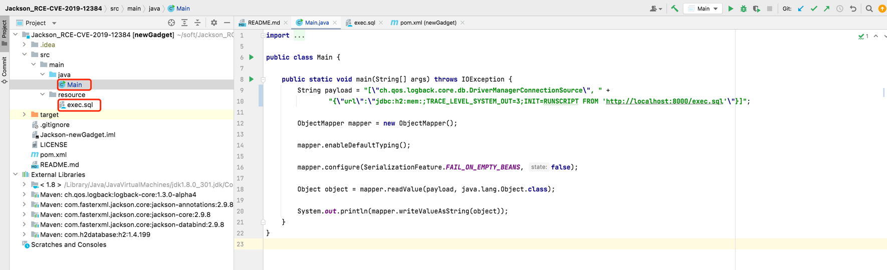
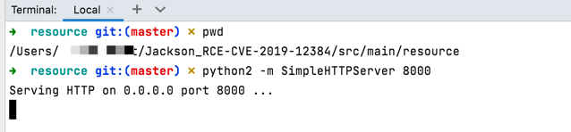
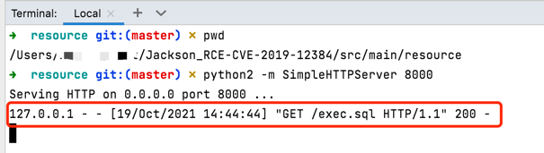
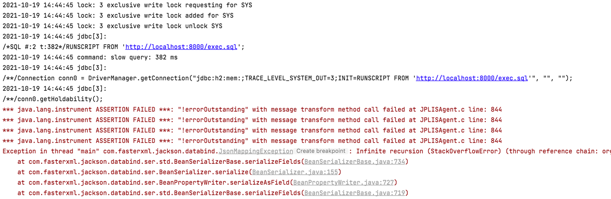

# CVE-2019-12384

## 漏洞简介

由于Jackson黑名单过滤不完整而导致，当开发人员在应用程序中通过ObjectMapper对象调用enableDefaultTyping方法时，程序就会受到此漏洞的影响，攻击者就可利用构造的包含有恶意代码的json数据包对应用进行攻击，直接获取服务器控制权限。

## 影响版本

Jackson-databind 2.X < 2.9.9.1

## 复现环境

### 代码下载

[gitee代码仓库](https://gitee.com/xl1605368195/cve-2019-12384.git)


### 工程初始化




### 启动一个http服务

在`src/main/resource`目录下启动一个http服务，端口8000




### 运行 main

静态 http 服务文件下载状态



main 方法运行状态



结果

/tmp 下`cve-2019-12384.txt`被创建


## RASP防护

开启rasp防护之后

截获到调用栈和参数

```json
{
    "isBlocked":true,
    "stackTrace":[
        "java.lang.UNIXProcess.<init>(UNIXProcess.java:245)",
        "java.lang.ProcessImpl.start(ProcessImpl.java:134)",
        "java.lang.ProcessBuilder.start(ProcessBuilder.java:1029)",
        "java.lang.Runtime.exec(Runtime.java:621)",
        "java.lang.Runtime.exec(Runtime.java:486)",
        "org.h2.dynamic.SHELLEXEC.shellexec(SHELLEXEC.java:8)",
        "sun.reflect.NativeMethodAccessorImpl.invoke0(Native Method)",
        "sun.reflect.NativeMethodAccessorImpl.invoke(NativeMethodAccessorImpl.java:62)",
        "sun.reflect.DelegatingMethodAccessorImpl.invoke(DelegatingMethodAccessorImpl.java:43)",
        "java.lang.reflect.Method.invoke(Method.java:498)",
        "org.h2.engine.FunctionAlias$JavaMethod.getValue(FunctionAlias.java:460)",
        "org.h2.expression.function.JavaFunction.getValue(JavaFunction.java:40)",
        "org.h2.command.dml.Call.query(Call.java:64)",
        "org.h2.command.dml.RunScriptCommand.execute(RunScriptCommand.java:77)",
        "org.h2.command.dml.RunScriptCommand.update(RunScriptCommand.java:58)",
        "org.h2.command.CommandContainer.update(CommandContainer.java:133)",
        "org.h2.command.Command.executeUpdate(Command.java:267)",
        "org.h2.engine.Engine.openSession(Engine.java:252)",
        "org.h2.engine.Engine.createSessionAndValidate(Engine.java:178)",
        "org.h2.engine.Engine.createSession(Engine.java:161)",
        "org.h2.engine.Engine.createSession(Engine.java:31)",
        "org.h2.engine.SessionRemote.connectEmbeddedOrServer(SessionRemote.java:336)",
        "org.h2.jdbc.JdbcConnection.<init>(JdbcConnection.java:169)",
        "org.h2.jdbc.JdbcConnection.<init>(JdbcConnection.java:148)",
        "org.h2.Driver.connect(Driver.java:69)",
        "java.sql.DriverManager.getConnection(DriverManager.java:664)",
        "java.sql.DriverManager.getConnection(DriverManager.java:270)",
        "ch.qos.logback.core.db.DriverManagerConnectionSource.getConnection(DriverManagerConnectionSource.java:52)",
        "sun.reflect.NativeMethodAccessorImpl.invoke0(Native Method)",
        "sun.reflect.NativeMethodAccessorImpl.invoke(NativeMethodAccessorImpl.java:62)",
        "sun.reflect.DelegatingMethodAccessorImpl.invoke(DelegatingMethodAccessorImpl.java:43)",
        "java.lang.reflect.Method.invoke(Method.java:498)",
        "com.fasterxml.jackson.databind.ser.BeanPropertyWriter.serializeAsField(BeanPropertyWriter.java:688)",
        "com.fasterxml.jackson.databind.ser.std.BeanSerializerBase.serializeFields(BeanSerializerBase.java:719)",
        "com.fasterxml.jackson.databind.ser.BeanSerializer.serialize(BeanSerializer.java:155)",
        "com.fasterxml.jackson.databind.ser.DefaultSerializerProvider._serialize(DefaultSerializerProvider.java:480)",
        "com.fasterxml.jackson.databind.ser.DefaultSerializerProvider.serializeValue(DefaultSerializerProvider.java:319)",
        "com.fasterxml.jackson.databind.ObjectMapper._configAndWriteValue(ObjectMapper.java:3905)",
        "com.fasterxml.jackson.databind.ObjectMapper.writeValueAsString(ObjectMapper.java:3219)",
        "Main.main(Main.java:20)"
    ],
    "command":"/bin/bash -c touch /tmp/cve-2019-12384.txt"
}
```


