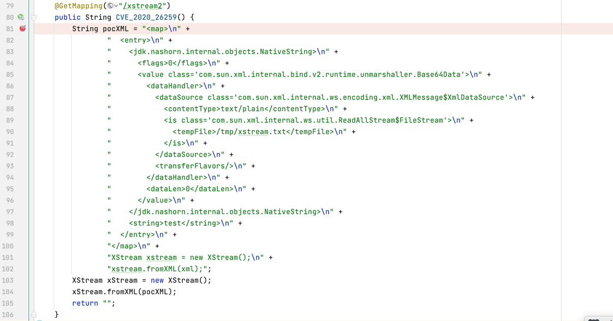

# CVE-2020-26259

## 复现代码
XStream反序列化漏洞:任意文件删除漏洞


## jrasp 截获的调用栈
```json
{
	"method": "GET",
	"remoteHost": "[0:0:0:0:0:0:0:1]",
	"headerNames": [],
	"filePath": "/tmp/xstream.txt",
	"module": "com.rasp.module.file.FileDeletModule",
	"requestURI": "/xstream2",
	"protocol": "HTTP/1.1",
	"enableBlock": true,
	"attack": false,
	"stackTrace": [
        "java.io.File.delete(File.java)", 
        "com.sun.xml.internal.ws.util.ReadAllStream$FileStream.close(ReadAllStream.java:145)", 
        "com.sun.xml.internal.bind.v2.runtime.unmarshaller.Base64Data.get(Base64Data.java:183)", 
        "com.sun.xml.internal.bind.v2.runtime.unmarshaller.Base64Data.toString(Base64Data.java:286)", 
        "jdk.nashorn.internal.objects.NativeString.getStringValue(NativeString.java:121)", 
        "jdk.nashorn.internal.objects.NativeString.hashCode(NativeString.java:117)", 
        "java.util.HashMap.hash(HashMap.java:339)", 
        "java.util.HashMap.put(HashMap.java:612)", 
        "com.thoughtworks.xstream.converters.collections.MapConverter.putCurrentEntryIntoMap(MapConverter.java:107)", 
        "com.thoughtworks.xstream.converters.collections.MapConverter.populateMap(MapConverter.java:98)", 
        "com.thoughtworks.xstream.converters.collections.MapConverter.populateMap(MapConverter.java:92)", 
        "com.thoughtworks.xstream.converters.collections.MapConverter.unmarshal(MapConverter.java:87)", 
        "com.thoughtworks.xstream.core.TreeUnmarshaller.convert(TreeUnmarshaller.java:72)", 
        "com.thoughtworks.xstream.core.AbstractReferenceUnmarshaller.convert(AbstractReferenceUnmarshaller.java:72)", 
        "com.thoughtworks.xstream.core.TreeUnmarshaller.convertAnother(TreeUnmarshaller.java:66)", 
        "com.thoughtworks.xstream.core.TreeUnmarshaller.convertAnother(TreeUnmarshaller.java:50)", 
        "com.thoughtworks.xstream.core.TreeUnmarshaller.start(TreeUnmarshaller.java:134)", 
        "com.thoughtworks.xstream.core.AbstractTreeMarshallingStrategy.unmarshal(AbstractTreeMarshallingStrategy.java:32)", 
        "com.thoughtworks.xstream.XStream.unmarshal(XStream.java:1404)", 
        "com.thoughtworks.xstream.XStream.unmarshal(XStream.java:1383)", 
        "com.thoughtworks.xstream.XStream.fromXML(XStream.java:1268)", 
        "com.thoughtworks.xstream.XStream.fromXML(XStream.java:1259)", 
        "com.rasp.test.web.controller.xstream.XStreamController.CVE_2020_26259(XStreamController.java:104)", 
    ],
	"localAddr": "[0:0:0:0:0:0:0:1]",
	"parameterMap": {},
	"remoteAddr": "[0:0:0:0:0:0:0:1]"
}
```

