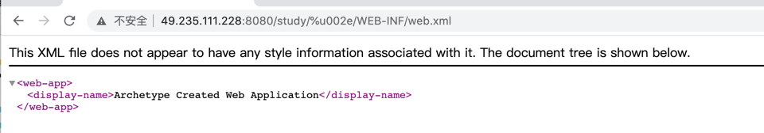
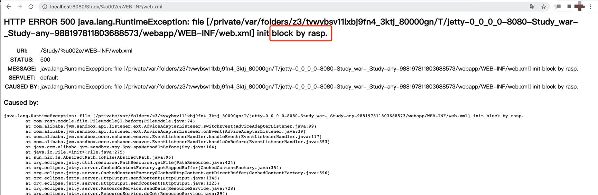

# CVE-2021-34429

## 漏洞简介


可以使用一些编码字符来制作URI，以访问WEB-INF目录的内容和/或绕过一些安全限制。默认合规模式允许带有包含 <font color='red'>%u002e</font> 段的 URI 的请求访问WEB-INF目录中的受保护资源。

例如，/%u002e/WEB-INF/web.xml可以检索 web.xml 文件的请求。这可能会泄露有关 Web 应用程序实现的敏感信息。同样，编码的空字符可能会阻止正确的规范化，因此/.%00/WEB-INF/web.xml也会检索 web.xml 文件。

此漏洞是[CVE-2021-28164](CVE-2021-28164.md)和CVE-2021-28169的新的绕过方式。


##  影响版本

9.4.37 ≤ Jetty ≤ 9.4.42

10.0.1 ≤ Jetty ≤ 10.0.5

11.0.1 ≤ Jetty ≤ 11.0.5

## 漏洞环境

与 [CVE-2021-28164](CVE-2021-28164.md#漏洞环境) 环境一样


## 漏洞复现



## RASP防护



日志：
```json
{
	"protocol": "HTTP/1.1",
	"method": "GET",
	"remoteHost": "[0:0:0:0:0:0:0:1]",
	"requestURI": "/Study/%u002e/WEB-INF/web.xml",
	"stackTrace": ["java.io.File.<init>(File.java:275)", "sun.nio.fs.AbstractPath.toFile(AbstractPath.java:96)", "org.eclipse.jetty.util.resource.PathResource.getFile(PathResource.java:424)", "org.eclipse.jetty.server.CachedContentFactory.getMappedBuffer(CachedContentFactory.java:354)", "org.eclipse.jetty.server.CachedContentFactory$CachedHttpContent.getDirectBuffer(CachedContentFactory.java:596)", "org.eclipse.jetty.server.HttpOutput.sendContent(HttpOutput.java:1346)", "org.eclipse.jetty.server.HttpOutput.sendContent(HttpOutput.java:1225)", "org.eclipse.jetty.server.ResourceService.sendData(ResourceService.java:728)", "org.eclipse.jetty.server.ResourceService.doGet(ResourceService.java:294)", "org.eclipse.jetty.servlet.DefaultServlet.doGet(DefaultServlet.java:449)"],
	"localAddr": "[0:0:0:0:0:0:0:1]",
	"parameterMap": {},
	"remoteAddr": "[0:0:0:0:0:0:0:1]"
}
```
