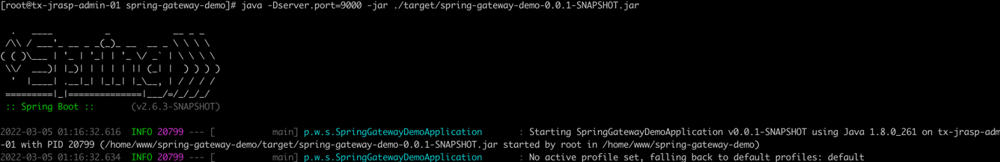
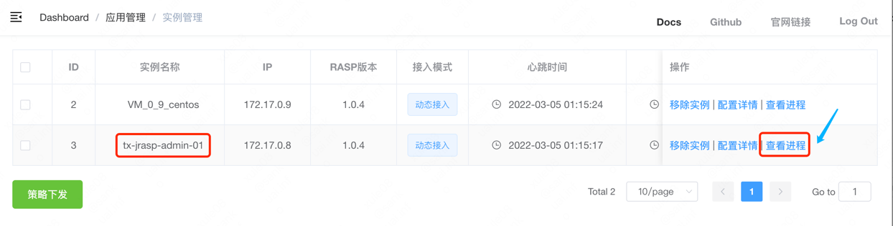
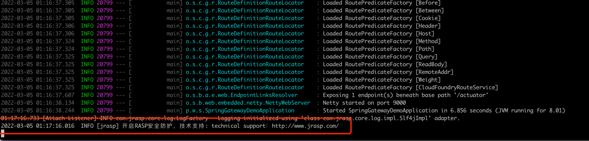
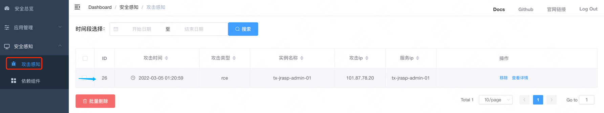
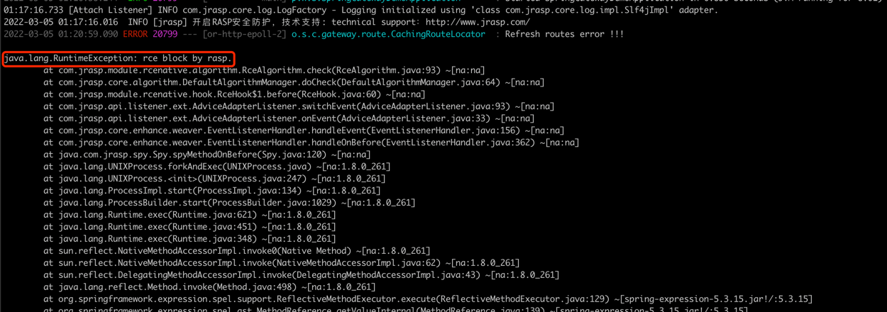
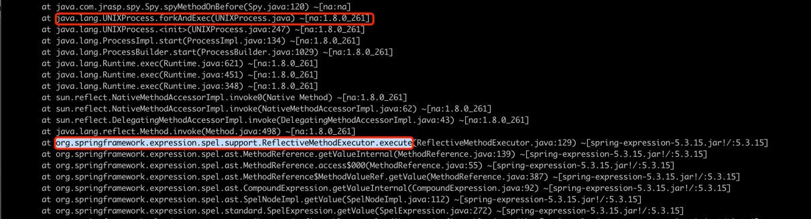

# CVE-2022-22947

## 漏洞简介

严重性：Critical

漏洞描述：使用Spring Cloud Gateway的应用程序在Actuator端点在启用、公开和不安全的情况下容易受到代码注入的攻击。攻击者可以恶意创建允许在远程主机上执行任意远程执行的请求。

## 影响版本

Spring Cloud Gateway以下版本均受影响：

3.1.0

3.0.0至3.0.6

其他老版本

## 漏洞复现

[gitee代码仓库](https://gitee.com/xl1605368195/spring-gateway-demo.git)

查看进程

进程上报到管理端

开启RASP防护

发起攻击(目前不允许纰漏漏洞细节，详细请查看 README.md )

## RASP防护

攻击详情

RASP 阻断攻击

## 防护原理

基于栈的检测算法。RASP核心特征是能够拿到当前线程的运行时栈，线程执行到命令执行时，检测当前栈中栈处在黑名单之中，如果有，极大可能是恶意攻击。
这种检测算法，目前广泛用于离线分析中，误报率极地。并且RASP对该算法进行了一定的优化，使得检测时间缩短50%。

命中高危栈：`org.springframework.expression.spel.support.ReflectiveMethodExecutor.execute`

