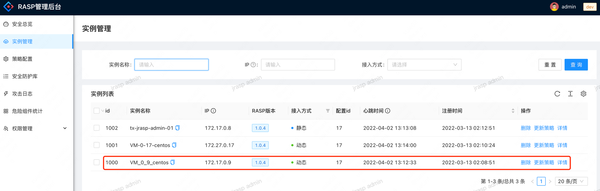
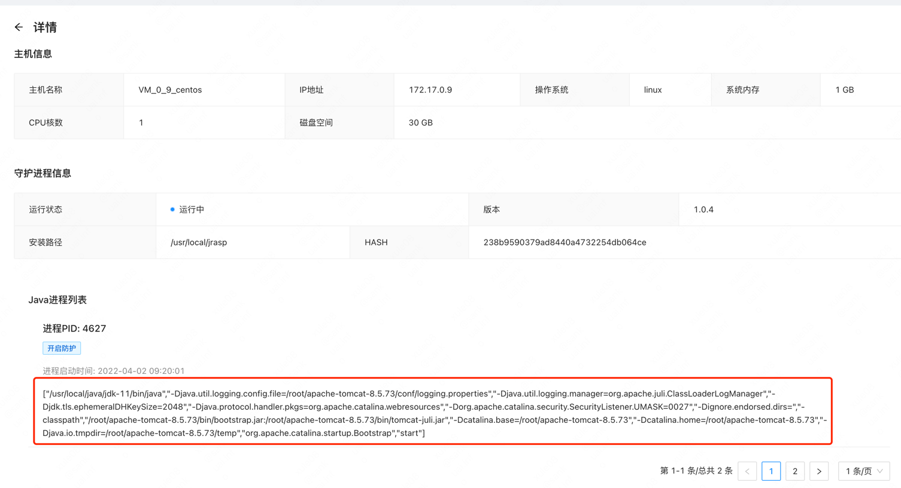
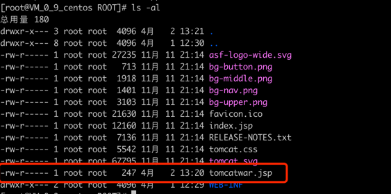
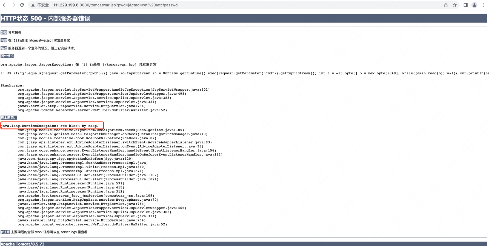
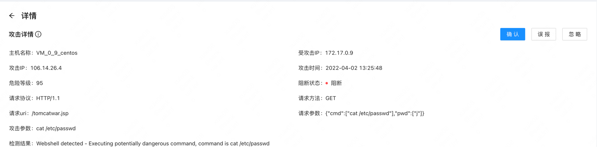
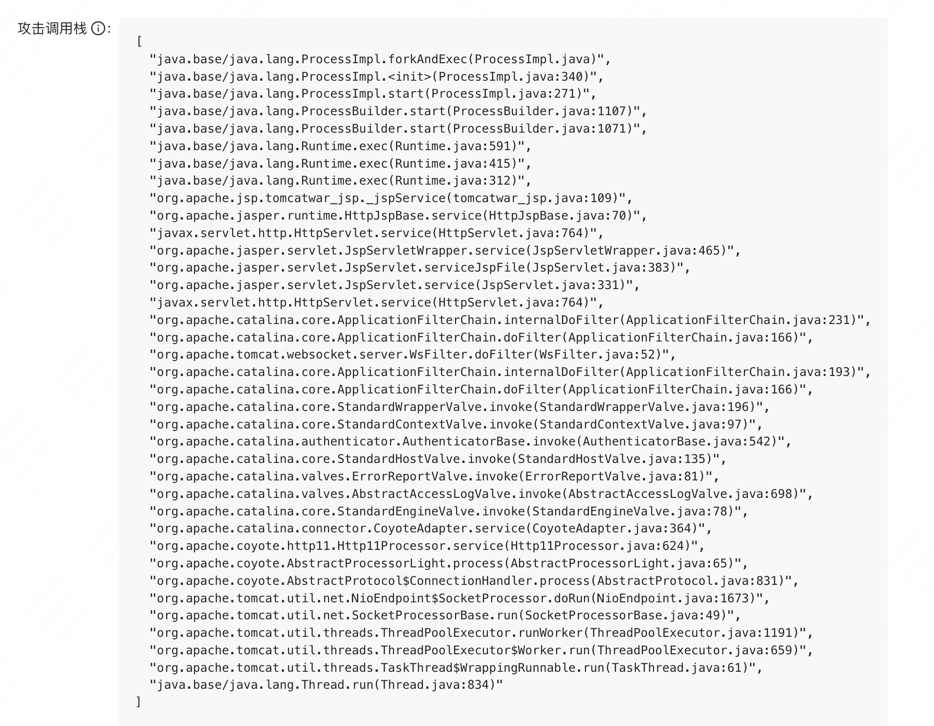
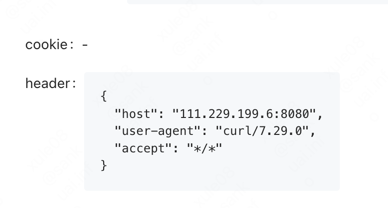
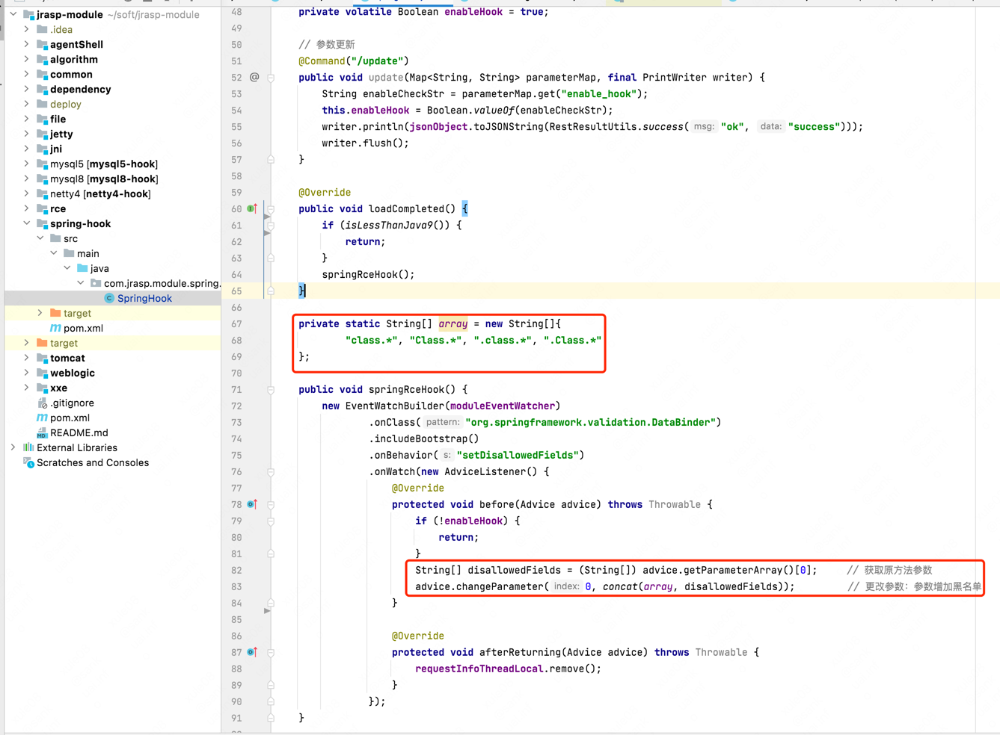

# CVE-2022-22965

## 漏洞简介
Spring是目前全球最受欢迎的Java轻量级开源框架。近日网上爆出Spring核心框架存在RCE漏洞（编号CVE-2022-22965）。在野曝光一段时间后，与近几年流行的高危漏洞命名方式类似（比如ProxyShell、log4jShell等），这个漏洞被称为Spring4Shell。3月31日官方终于发布了漏洞信息，并在新版本v5.3.18和v5.2.20中修复了漏洞。（官方不发补丁我也不敢公开发布文章呀！图片）

分析后发现漏洞结合了JDK9及以上版本一个新的属性，成功绕过历史漏洞CVE-2010-1622修复补丁，同时结合Tomcat容器的一些操作属性，可以实现GetShell。当然Weblogic、Jetty等其他Java中间件或应用程序也可能构建出完整利用链，但从目前研究进度来看，漏洞触发需要至少满足以下条件：

## 影响版本

至少满足以下条件：
+ JDK9或以上版本系列
+ Spring框架或衍生的SpringBoot等框架，版本小于v5.3.18或v5.2.20
+ Spring JavaBean表单参数绑定需要满足一定条件
+ 部署在Tomcat容器中，且日志记录功能开启（默认状态）


## 漏洞环境

jdk11+tomcat8.5+war包

启动进程后在管理端看到已经开启防护了






发起攻击向tomcat写入jsp(不允许披露)



```json
http://111.229.199.6:8080/tomcatwar.jsp?pwd=j&cmd=cat%20/etc/passwd
```
攻击被阻断了



## 攻击详情








## 修复

目前仅是命令执行，不确定是否有其他攻击如内存马等，最保险的方式是，禁用掉 class 字段的绑定；
```java
public void setAllowedFields(WebDataBinder dataBinder) {
  String[] abd = new String[]{"class.*", "Class.*", "*.class.*", "*.Class.*"};
  dataBinder.setDisallowedFields(abd);
}
```
我们新增了临时修复插件，插件运行时生效，即在不重启jvm的情况下生效，避免了用户的升级；

插件代码如下：

